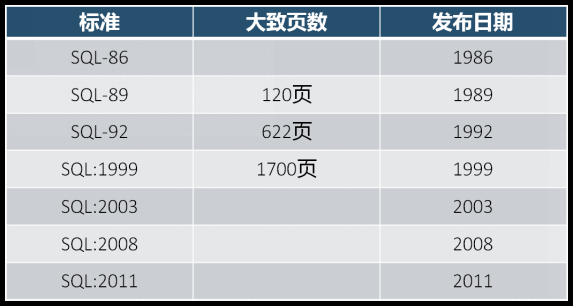

## 概述

我们都知道，**数据库管理人员（DBA）通过数据库管理系统（DBMS）可以对数据库（DB）中的数据进行操作**，但具体是如何操作的呢？这就涉及到我们本节要讲的SQL语言。

SQL（Structured Query Language）是结构化查询语言的简称，它是一种数据库查询和程序设计语言，同时也是目前使用最广泛的关系型数据库操作语言。在数据库管理系统中，使用SQL语言来实现数据的存取、查询、更新等功能。SQL是一种非过程化语言，**只需提出“做什么”，而不需要指明“怎么做”。**

SQL是由IBM公司在1974\~1979年之间根据E.J.Codd发表的关系数据库理论为基础开发的，其前身是“SEQUEL”，后更名为SQL。由于SQL语言具有集数据查询、数据操纵、数据定义和数据控制功能于一体，类似自然语言、简单易用以及非过程化等特点，得到了快速的发展，并于1986年10月，被美国国家标准协会（American National Standards Institute，ANSI）采用为关系数据库管理系统的标准语言，后为国际标准化组织（International Organization for Standardization，ISO）采纳为国际标准。

官方说明文档: ![[assets/mysql.chm]]



## SQL语言分类

### 数据查询语言（Data Query Language，DQL）

DQL主要用于数据的查询，其基本结构是使用SELECT子句，FROM子句和WHERE子句的组合来查询一条或多条数据。

### 数据操作语言（Data Manipulation Language，DML）

DML主要用于对数据库中的数据进行增加、修改和删除的操作，其主要包括：

1) `INSERT`：增加数据
2) `UPDATE`：修改数据
3) `DELETE`：删除数据

### 数据定义语言（Data Definition Language，DDL）

DDL主要用针对是数据库对象（数据库、表、索引、视图、触发器、存储过程、函数）进行创建、修改和删除操作。其主要包括：

1) `CREATE`：创建数据库对象
2) `ALTER`：修改数据库对象
3) `DROP`：删除数据库对象

### 数据控制语言（Data Control Language，DCL）

DCL用来授予或回收访问 数据库的权限，其主要包括：

1) `GRANT`：授予用户某种权限
2) `REVOKE`：回收授予的某种权限

### 事务控制语言（Transaction Control Language，TCL）

TCL用于数据库的事务管理。其主要包括：

1) `START TRANSACTION`：开启事务
2) `COMMIT`：提交事务
3) `ROLLBACK`：回滚事务
4) `SET TRANSACTION`：设置事务的属性&#x20;

## 初始化表案例

1.  建立一张用来存储学生信息的表
2.  字段包含学号、姓名、性别，年龄、入学日期、班级，email等信息
3.  学号是主键 = 不能为空 +  唯一
4.  姓名不能为空
5.  性别默认值是男
6.  Email唯一

```sql
##这是一个单行注释

/*
多行注释
多行注释
多行注释
*/

/*
建立一张用来存储学生信息的表
字段包含学号、姓名、性别，年龄、入学日期、班级，email等信息
*/
-- 创建数据库表：
create table t_student(
        sno int(6), -- 6显示长度 
        sname varchar(5), -- 5个字符
        sex char(1),
        age int(3),
        enterdate date,
        classname varchar(10),
        email varchar(15)
);

-- 查看表的结构：展示表的字段详细信息
desc t_student;

-- 查看表中数据：
select * from t_student;

-- 查看建表语句：
show create table t_student;

/*
CREATE TABLE `t_student` (
  `sno` int DEFAULT NULL,
  `sname` varchar(5) DEFAULT NULL,
  `sex` char(1) DEFAULT NULL,
  `age` int DEFAULT NULL,
  `enterdate` date DEFAULT NULL,
  `classname` varchar(10) DEFAULT NULL,
  `email` varchar(15) DEFAULT NULL
) ENGINE=InnoDB DEFAULT CHARSET=utf8mb4 COLLATE=utf8mb4_0900_ai_ci
*/

```

## 数据库表列类型

### 整数类型

| 整数类型        | 大小  | 表数范围(有符号)                                  | 表数范围(无符号)                | 作用    |
| ----------- | --- | ------------------------------------------ | ------------------------ | ----- |
| TINYINT     | 1字节 | (-128,127)                                 | (0,255)                  | 小整数值  |
| SMALLINT    | 2字节 | (-32768,32767)                             | (0,65526)                | 大整数值  |
| MEDIUMINT   | 3字节 | (-8388608,8388607)                         | (0,16777215)             | 大整数值  |
| INT/INTEGER | 4字节 | (-2147483648,2147483647)                   | (0,4294967295)           | 大整数值  |
| BIGINT      | 8字节 | (-9233372036854775808,9233372036854775807) | (0,18446744073709551615) | 极大整数值 |

MySQL支持选择在该类型关键字后面的括号内指定整数值的显示宽度(例如，INT(4))。显示宽度并不限制可以在列内保存的值的范围，也不限制超过列的指定宽度的值的显示

主键自增：不使用序列，通过`auto_increment`，要求是整数类型

### 浮点数类型

| 浮点数类型  | 大小  | 作用      |
| ------ | --- | ------- |
| FLOAT  | 4字节 | 单精度浮点数值 |
| DOUBLE | 8字节 | 双精度浮点数值 |

需要注意的是与整数类型不一样的是，浮点数类型的宽度不会自动扩充。 `score double(4,1)`

`score double(4,1)` --小数部分为1位，总宽度4位，并且不会自动扩充。

### 字符串类型

| 字符串类型        | 大小                 | 描述                        |
| ------------ | ------------------ | ------------------------- |
| CHAR(M)      | 0\~255字符           | 允许长度0\~M个字符长度的定长字符串       |
| VARCHAR(M)   | 0\~65535字符         | 允许长度0\~M个字符长度的定长字符串       |
| BINARY(M)    | 0\~255字节           | 允许长度0\~M个字符长度的定长二进制字符串    |
| VARBINARY(M) | 0\~65535字节         | 允许长度0\~M个字符长度的定长二进制字符串    |
| TINYBLOB     | 0\~255字节           | 二进制形式的短文本数据(长度为不超过255个字符) |
| TINYTEXT     | 0\~255字节           | 短文本数据                     |
| BLOB         | binary largeObject | 二进制形式的长文本数据               |
| TEXT         |                    | 长文本数据                     |
| MEDIUMBLOB   | 0\~16777215字节      | 二进制形式的中等长度文本数据            |
| MEDUYMTEXT   | 0\~16777215字节      | 中等长度文本数据                  |
| LOGNGBLOB    | 0\~4294967295字节    | 二进制形式的极大文本数据              |
| LONGTEXT     | 0\~4294967295字节    | 极大文本数据                    |

CHAR和VARCHAR类型相似，均用于存于较短的字符串，主要的不同之处在于存储方式。CHAR类型长度固定，VARCHAR类型的长度可变。

因为VARCHAR类型能够根据字符串的实际长度来动态改变所占字节的大小，所以在不能明确该字段具体需要多少字符时`推荐使用VARCHAR类型`，这样可以大大地节约磁盘空间、提高存储效率。

CHAR和VARCHAR表示的是字符的个数，而不是字节的个数

### 日期和时间类型

| 类型        | 格式                  | 取值范围                                            | 0值                  |
| --------- | ------------------- | ----------------------------------------------- | ------------------- |
| TIME      | 'HH:MM:SS'          | (-838:59:59,838:59:59)                          | 00:00:00            |
| DATE      | YYYY-MM-DD          | (1000-01-01,9999-12-31)                         | 0000-00-00          |
| YEAR      | YYYY                | (1901,2155)                                     | 0000                |
| DATETIME  | YYYY-MM-DD HH:MM:SS | 1000-01-01 00:00:00,9999-12-31 23:59:59         | 0000-00-00 00:00:00 |
| TIMESTAMP | YYYY-MM-DD HH:MM:SS | 1970-01-01 00:00:01 UTC,2038-01-19 03:14:07 UTC | 0000-00-00 00:00:00 |

TIMESTEMP类型的数据指定方式与DATETIME基本相同，两者的不同之处在于以下几点：

1.  数据的取值范围不同，TIMESTEMP类型的取值范围更小。
2.  如果我们对TIMESTAMP类型的字段没有明确赋值，或是被赋与了NULL值，MySQL会自动将该字段赋值为系统当前的日期与时间。
3.  TIMESTEMP类型还可以使用CURRENT\_TIMESTAMP来获取系统当前时间。
4.  TIMESTEMP类型有一个很大的特点，那就是时间是根据时区来显示的。
    例如，在东八区插入的TIMESTEMP数据为2017-07-11 16:43:25，在东七区显示时，时间部分就变成了15:43:25，在东九区显示时，时间部分就变成了17:43:25。
