## 三范式

好的数据库设计对数据的存储性能和后期的程序开发，都会产生重要的影响。**建立科学的，规范的数据库就需要满足一些规则来优化数据的设计和存储，这些规则就称为范式**

### 第一范式：确保每列保持原子性

第一范式是最基本的范式。**如果数据库表中的所有字段值都是不可分解的原子值，就说明该数据库表满足了第一范式。**

第一范式的合理遵循需要根据系统的实际需求来定。比如某些数据库系统中需要用到“地址”这个属性，本来直接将“地址”属性设计成一个数据库表的字段就行。但是如果系统经常会访问“地址”属性中的“城市”部分，那么就非要将“地址”这个属性重新拆分为省份、城市、详细地址等多个部分进行存储，这样在对地址中某一部分操作的时候将非常方便。这样设计才算满足了数据库的第一范式，如下表所示。

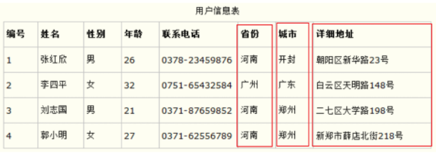

### 第二范式：确保表中的每列都和主键相关

第二范式在第一范式的基础之上更进一层。**第二范式需要确保数据库表中的每一列都和主键相关，而不能只与主键的某一部分相关（主要针对联合主键而言）**。也就是说在一个数据库表中，一个表中只能保存一种数据，不可以把多种数据保存在同一张数据库表中。

比如要设计一个订单信息表，因为订单中可能会有多种商品，所以要将订单编号和商品编号作为数据库表的联合主键，如下表所示

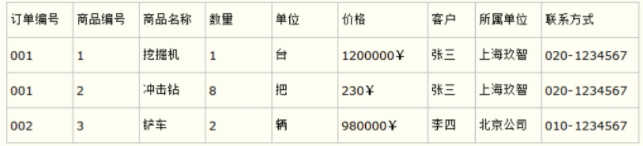

这样就产生一个问题：这个表中是以订单编号和商品编号作为联合主键。这样在该表中商品名称、单位、商品价格等信息不与该表的主键相关，而仅仅是与商品编号相关。所以在这里违反了第二范式的设计原则。

而如果把这个订单信息表进行拆分，把商品信息分离到另一个表中，把订单项目表也分离到另一个表中，就非常完美了。如下所示

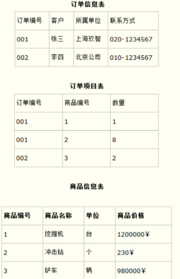

**这样设计，在很大程度上减小了数据库的冗余。如果要获取订单的商品信息，使用商品编号到商品信息表中查询即可 **

### 第三范式：确保每列都和主键列直接相关，而不是间接相关

**第三范式需要确保数据表中的每一列数据都和主键直接相关，而不能间接相关。**

比如在设计一个订单数据表的时候，可以将客户编号作为一个外键和订单表建立相应的关系。而不可以在订单表中添加关于客户其它信息（比如姓名、所属公司等）的字段。如下面这两个表所示的设计就是一个满足第三范式的数据库表。

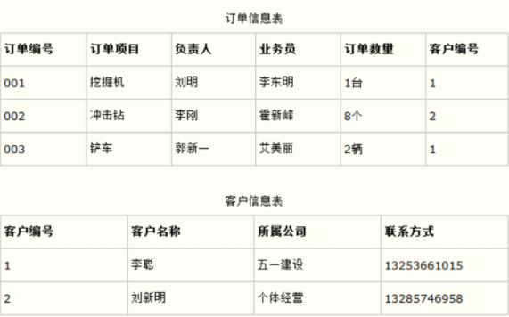

这样在查询订单信息的时候，就可以使用客户编号来引用客户信息表中的记录，也不必在订单信息表中多次输入客户信息的内容，减小了数据冗余

## 多表关系

### 一对多

将一的一方作为主表，多的一方作为从表，在从表中指定一个字段作为外键，指向主表的主键

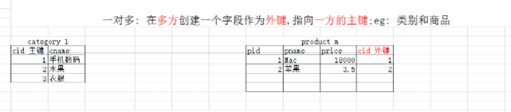

### 多对多

因为两张表都是多的一方，所以在两张表中都无法创建外键，所以需要新创建一张中间表，在中间表中定义两个字段，这俩字段分别作为外键指向两张表各自的主键

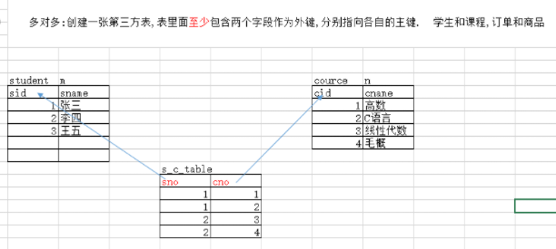

### 一对一

在从表中指定一个字段创建外键并指向主表的主键，然后给从表的外键字段添加唯一约束

## 多表关联查询

### 交叉查询

交叉查询其实就是将多张表的数据没有条件地连接在一起进行展示

```sql
select a.列,a.列,b.列,b.列 from a,b ;  

select a.*,b.* from a,b ;  
--或者 
select * from a,b;
```

**这种查询方式是不正确的会出现笛卡尔积的情况！！**

> 笛卡尔积
> 将两（或多）个表的所有行进行组合，连接后的行数为两（或多）个表的乘积数
> 出现笛卡尔积，主要是因为缺少关联条件或者关联条件不准确

### 内连接查询

交叉查询产生这样的结果并不是我们想要的，那么怎么去除错误的、不想要的记录呢，当然是**通过条件过滤**。通常要查询的多个表之间都存在关联关系，那么就通过**关联关系(主外键关系)去除笛卡尔积**。这种通过条件过滤去除笛卡尔积的查询，我们称之为连接查询

#### 隐式内连

```sql
//隐式内连接查询里面是没有inner join关键字
select [字段,字段,字段] from a,b where 连接条件 (b表里面的外键 = a表里面的主键 ) 
```

#### 显式内连

```sql
//显式内连接查询里面是有inner join关键字
select [字段,字段,字段] from a [inner] join b on 连接条件 [ where 其它条件]
```

### 外连接查询

我们发现**内连接查询出来的是满足连接条件的公共部分**， 如果要保证查询出某张表的全部数据情况下进行连接查询. 那么就要使用外连接查询了.  外连接分为左外连接和右外连接

#### 左外连接

#####  A

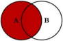

**左边表中的所有数据**，右边表中与左表关联数据（左边有右边没有的使用NULL填充）
```sql
select 字段 from 表1 left outer join 表2 on 关联条件
```

##### A-A∩B

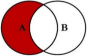

**左表特有的数据**

```sql
select 字段 from 表1 left outer join 表2 on 关联条件 where 右表.key = NULL
```

#### 右外连接

##### B

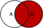

**右边表中的所有数据**，左边表中与右表关联数据（右边有左边没有的使用NULL填充）

```sql
select 字段 from 表1 right outer join 表2 on 关联条件
```

##### B-A∩B

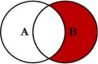

右表特有的数据

```sql
select 字段 from 表1 right outer join 表2 on 关联条件 where  左表.key = NULL
```

### union联合查询

UNION 操作符用于合并两个或多个 SELECT 语句的结果集。

##### A∪B

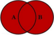

可以使用UNION关键字将左外联和右外联合并起来

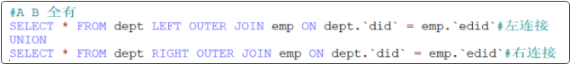

##### A∪B - A∩B

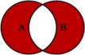

可以使用UNION关键字将左独和右独合并起来

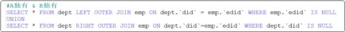

### 自连接查询

**自连接查询是一种特殊的多表连接查询，因为两个关联查询的表是同一张表，通过取别名的方式来虚拟成两张表，然后进行两张表的连接查询**

例如：查询员工的编号，姓名，薪资和他领导的编号，姓名，薪资

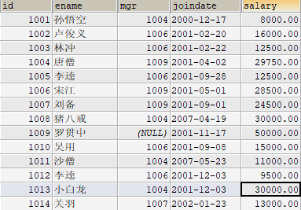

```sql
//将emp表分别以别名的方式声明employee员工 manager 领导
//将employee.mgr = manager.id关联
SELECT employee.id '员工编号',employee.ename '员工姓名',
employee.salary '员工薪资',manager.id '领导编号',
manager.ename '领导姓名',manager.salary '领导薪资' 
FROM emp employee,emp manager WHERE employee.mgr = manager.id
```

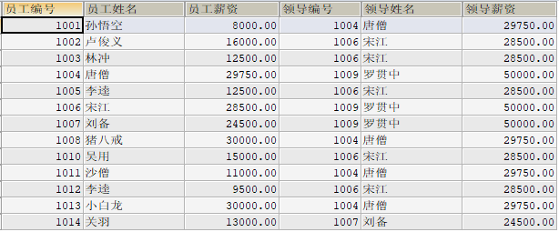

## 子查询

如果一个查询语句嵌套在另一个查询语句里面，那么这个查询语句就称之为子查询，根据位置不同，分为：where型，from型，exists型。注意：不管子查询在哪里，子查询必须使用()括起来。

### 子查询的分类

#### WHERE型

子查询是单值结果，那么可以对其使用（=，>等比较运算符）

```sql
# 查询价格最高的商品信息
select * from t_product where price = (select max(price) from t_product)
```

子查询是多值结果，那么可对其使用（【not】in(子查询结果)，或 >all(子查询结果)，或>=all(子查询结果)，\<all(子查询结果)，<=all（子查询结果)，或 >any(子查询结果)，或>=any(子查询结果)，\<any(子查询结果)，<=any（子查询结果)）

```sql
# 查询价格最高的商品信息
SELECT * FROM t_product WHERE price >=ALL(SELECT price FROM t_product)
```

#### FROM型

子查询的结果是多行多列的结果，类似于一张表格。

必须给子查询取别名，即临时表名，表的别名不要加“”和空格。
```sql
-- 思路一: 使用连接查询
-- 使用外连接，查询出分类表的所有数据
SELECT tc.cname,COUNT(tp.pid) FROM t_category tc LEFT JOIN t_product tp ON tp.cno = tc.cid GROUP BY tc.cname

-- 思路二: 使用子查询
-- 第一步:对t_product根据cno进行分组查询，统计每个分类的商品数量
SELECT cno,COUNT(pid) FROM t_product GROUP BY cno
-- 第二步: 用t_category表去连接第一步查询出来的结果，进行连接查询,此时要求查询出所有的分类
SELECT tc.cname,IFNULL(tn.total,0) '总数量' FROM t_category tc LEFT JOIN (SELECT cno,COUNT(pid) total FROM t_product GROUP BY cno) tn ON tn.cno=tc.cid
```

#### EXISTS型

用于检查子查询是否至少会返回一行数据，该子查询实际上并不返回任何数据，而是返回值True或False

```sql
# 查询那些有商品的分类
SELECT cid,cname FROM t_category tc WHERE EXISTS (SELECT * FROM t_product tp WHERE tp.cno = tc.cid);
```

### 子查询的复制操作

#### 复制表

##### 拷贝表结构

```sql
CREATE TABLE newadmin LIKE admin;
```

##### 拷贝表结构和数据（但约束与索引除外）

```sql
CREATE TABLE newadmin AS ( SELECT * FROM admin ) ;
```

##### 拷贝表结构+数据

```sql
CREATE TABLE newadmin LIKE admin;
INSERT INTO newadmin SELECT * FROM admin;
```

##### 跨数据库拷贝表

```sql
CREATE TABLE newadmin LIKE shop.admin;
CREATE TABLE newshop.newadmin LIKE shop.admin;
```

##### 拷贝一个表中其中的一些字段（指定新名），其中一些数据

```sql
CREATE TABLE newadmin AS ( SELECT id, username AS uname, password AS pass FROM admin WHERE id<10 ) ;
```

##### 在创建表的同时定义表中的字段信息。

```sql
create table tt(eid int primary key auto_increment) as (select employee_id as eid,first_name,last_name,email from employees); 
```

#### 复制数据

在 INSERT 语句中加入子查询，不必书写 VALUES 子句。

```sql
//方法一
INSERT INTO emp2 SELECT * FROM employees WHERE department_id = 90;

//方法二
INSERT INTO sales_reps(id, name, salary, commission_pct)
SELECT employee_id, last_name, salary, commission_pct
FROM   employees
WHERE  job_id LIKE '%REP%';

```
