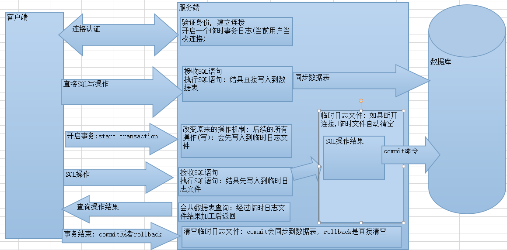

## 事务TCL

### 事务的概述

#### 概念

**保证事务中的所有操作都作为一个工作单元来执行**，即使出现了故障，都不能改变这种执行方式。当在一个事务中执行多个操作时，要么所有的事务都被**提交(commit)**，那么这些修改就永久地保存下来；要么数据库管理系统将放弃所作的所有修改，整个事务**回滚(rollback)** 到最初状态。

#### 事务的原理

事务开启之后, 所有的操作都会临时保存到事务日志, 事务日志只有在得到`commit`命令才会同步到数据表中，其他任何情况都会清空事务日志(rollback，断开连接)



#### 应用场景

如果在某个业务中需要执行多条SQL语句，那么此时一般是需要使用到事务，从而**保证这多条SQL语句执行同时成功或同时失败**。例如: 转账、批量删除、从购物车中提交订单等等操作

#### 事务的四大特性(ACID)

1.  **原子性（Atomicity）**
    原子性是指事务是一个不可分割的工作单位，事务中的操作要么都发生，要么都不发生。
2.  **一致性（Consistency）**
    事务必须使数据库从一个一致性状态变换到另外一个一致性状态。
3.  **隔离性（lsolation）**
    事务的隔离性是指一个事务的执行不能被其他事务干扰，即一个事务内部的操作及使用的数据对并发的其他事务是隔离的，并发执行的各个事务之间不能互相干扰。
4.  **持久性（Durability）**
    持久性是指一个事务一旦被提交，它对数据库中数据的改变就是永久性的，接下来的其他操作和数据库故障不应该对其有任何影响

### MySQL进行事务管理

#### 自动事务

MySQL默认是自动提交事务的，一条sql语句就是一个事务

#### 手动事务

##### 开启事务

手动开启事务

```sql
//手动开启事务之后，执行的SQL语句都不会真正改变数据库中的数据
//，需要用户手动提交事务才能够真正执行SQL语句
start transaction;
```

设置MYSQL中的自动事务参数

```sql
//第一步: 查看MYSQL中事务是否自动提交
show variables like '%commit%';
//第二步: 设置自动提交的参数为OFF
# 0:OFF  1:ON
set autocommit = 0;

```

##### 提交和回滚事务

###### 提交事务

当这个事务中的SQL语句执行完毕之后，没有出现任何问题，那么我们需要在最后提交事务，让这些SQL语句真正执行去改变数据库中的数据

```sql
commit;
```

###### 回滚事务

当执行这个事务中的SQL语句的过程中，一旦出现问题或者异常，则需要回滚事务，从而回到SQL语句执行之前的状态

```sql
rollback;
```

### 事务的隔离级别

#### 不考虑事务的隔离性会引发的问题

事务在操作时的理想状态： 所有的事务之间保持隔离，互不影响。因为并发操作，多个用户同时访问同一个数据。**可能引发并发访问的问题**


#### 事务的四个隔离级别

| **级别** | **名字** | **隔离级别**         | **脏读** | **不可重复读** | **幻读** | **数据库默认隔离级别** |
| ------ | ------ | ---------------- | ------ | --------- | ------ | ------------- |
| **1**  | 读未提交   | read uncommitted | 是      | 是         | 是      |               |
| **2**  | 读已提交   | read committed   | 否      | 是         | 是      | Oracle        |
| **3**  | 可重复读   | repeatable read  | 否      | 否         | 是      | MySQL         |
| **4**  | 串行化    | serializable     | 否      | 否         | 否      | 最高的隔离级别       |

**隔离级别越高，性能(效率)越差，安全性越高。**

##### 设置隔离级别

设置事务隔离级别

```sql
set session transaction isolation level  隔离级别;
eg: 设置事务隔离级别为read uncommitted
set session transaction isolation level read uncommitted;
```

查询当前事务隔离级别

```sql
select @@tx_isolation;
```

### DCL

我们现在默认使用的都是root用户，超级管理员，拥有全部的权限。但是，一个公司里面的数据库服务器上面可能同时运行着很多个项目的数据库。所以，我们应该可以根据不同的项目建立不同的用户，分配不同的权限来管理和维护数据库。

### 创建用户

```sql
CREATE USER '用户名'@'主机名' IDENTIFIED BY '密码';
```

>关键字说明
>>1. `用户名`：将创建的用户名
>>2. `主机名`：指定该用户在哪个主机上可以登陆，如果是本地用户可用localhost，如果想让该用户可以从任意远程主机登陆，可以使用通配符%
>>3. `密码`：该用户的登陆密码，密码可以为空，如果为空则l该用户可以不需要密码登陆服务器

 
具体操作：

```sql
-- user1用户只能在localhost这个IP登录mysql服务器
CREATE USER 'user1'@'localhost' IDENTIFIED BY '123';
-- user2用户可以在任何电脑上登录mysql服务器
CREATE USER 'user2'@'%' IDENTIFIED BY '123';
```

### 授权用户

```sql
GRANT 权限1, 权限2... ON 数据库名.表名 TO '用户名'@'主机名';
```

> 关键字说明：
>> 1.  `GRANT` 授权关键字 授予用户的权限，如`SELECT`，`INSERT`，`UPDATE`等。如果要授予所的权限则使用`ALL`
>> 2. `数据库名.表名`：该用户可以操作哪个数据库的哪些表。如果要授予该用户对所有数据库和表的相应操作权限则可用\*表示，如`*.*` `'用户名'@'主机名'`: 给哪个用户授权

具体操作：

```sql
//给user1用户分配对test这个数据库操作的权限
GRANT CREATE,ALTER,DROP,INSERT,UPDATE,DELETE,SELECT ON test.* TO 'user1'@'localhost';
//给user2用户分配对所有数据库操作的权限
GRANT ALL ON *.* TO 'user2'@'%';
```

### 撤销授权

```sql
REVOKE  权限1, 权限2... ON 数据库.表名 FROM '用户名'@'主机名';
```

### 查看权限

```sql
SHOW GRANTS FOR '用户名'@'主机名';
```

### 删除用户

```sql
DROP USER '用户名'@'主机名';
```

### 修改用户密码

#### 修改管理员密码

```sql
 //注意：需要在未登陆MySQL的情况下操作。-- 新密码不需要加上引号
mysqladmin -uroot -p password 新密码 
```

#### 修改普通用户密码

```sql
 //注意：需要在未登陆MySQL的情况下操作
set password for '用户名'@'主机名' = password('新密码');
```
