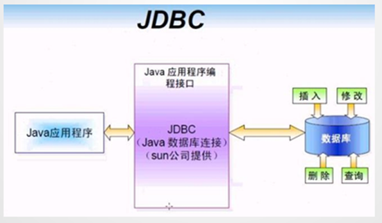
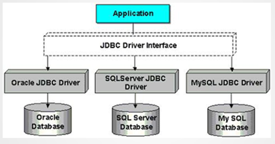

## 什么是JDBC

**JDBC(Java DataBase Connectivity,  Java数据库连接)**,是一种用于执行SQL语句的Java API，为多种关系数据库提供统一访问,它由一组用Java语言编写的类和接口组成



有了JDBC，程序员只需用JDBC API写一个程序，就可访问所有数据库。



## Sun公司、数据库厂商、程序员三方关系

1.  SUN公司是规范制定者，制定了规范JDBC（连接数据库规范）
    -   DriverManager类   作用：管理各种不同的JDBC驱动
    -   Connection接口 
    -   Statement接口和PreparedStatement接口
    -   ResultSet接口
2.  数据库厂商微软、甲骨文等分别提供实现JDBC接口的驱动jar包
3.  程序员学习JDBC规范来应用这些jar包里的类。

## JDBD历史版本及特征

### JDBC 1.0

JDBC 1.0 随JDK1.1一起发布,JDBC操作相关的接口和类位于java.sql包中。

### JDBC 2.0

JDBC 2.0 API被划分为两部分：核心API和扩展API,有两个包,分别是java.sql包和javax.sql包。

1.  **java.sql核心API包**
    在支持新功能方面：包括结果集可以向后滚动，批量的更新数据。另外，还提供了UNICODE字符集的字符流操作。
    在支持SQL的数据类型方面：新增加的BLOB, CLOB,和数组接口能够是应用程序操作大块的数据类型
2.  **javax.sql扩展API包**
    -   `DataSource数据源接口`
        JDBC1.0是原来是用DriverManager类来产生一个对数据源的连接。JDBC2.0用一种替代的方法，使用DataSource的实现，代码变的更小巧精致，也更容易控制。
    -   `Connection pooling`
        如果DataSource对象实现与一个支持连接池的中间层的服务器一起工作，DataSource对象就会自动的返回连接池中的连接，这个连接也是可以重复利用的。
    -   `Distrubute transaction`
        在一个事务中涉及到了多个数据库服务器。获得一个用来支持分布式事务的连接与获得连接池中的连接是很相似的。同样，不同之处在于DataSource的实现上的不同，而不是在应用程序中获得连接的方式上有什么不同。
    -   `Rowsets`
        RowSet接口扩展了ResultSet接口。这样RowSet对象就有了ResultSet对象所有的功能。不可以滚动的ResultSet变成了可以滚动的RowSet。

## JDBC访问数据库编码步骤

1.  加载一个Driver驱动
2.  创建数据库连接（Connection）
3.  创建SQL命令发送器Statement
4.  通过Statement发送SQL命令并得到结果
5.  处理结果（select语句）
6.  关闭数据库资源ResultSet  Statement  Connection

## 数据准备

```sql
create table DEPT(  
  DEPTNO int(2) not null,  
  DNAME  VARCHAR(14),  
  LOC    VARCHAR(13)  
);  
alter table DEPT  
  add constraint PK_DEPT primary key (DEPTNO); 
        
create table EMP  
(  
  EMPNO    int(4) primary key,  
  ENAME    VARCHAR(10),  
  JOB      VARCHAR(9),  
  MGR      int(4),  
  HIREDATE DATE,  
  SAL      double(7,2),  
  COMM     double(7,2),  
  DEPTNO   int(2)  
);  
alter table EMP  
  add constraint FK_DEPTNO foreign key (DEPTNO)  
  references DEPT (DEPTNO);  
        
create table SALGRADE  
(  
  GRADE int primary key,  
  LOSAL double(7,2),  
  HISAL double(7,2)  
);  
create table BONUS  
(  
  ENAME VARCHAR(10),  
  JOB   VARCHAR(9),  
  SAL   double(7,2),  
  COMM  double(7,2)  
);  
insert into DEPT (DEPTNO, DNAME, LOC)  
values (10, 'ACCOUNTING', 'NEW YORK');  
insert into DEPT (DEPTNO, DNAME, LOC)  
values (20, 'RESEARCH', 'DALLAS');  
insert into DEPT (DEPTNO, DNAME, LOC)  
values (30, 'SALES', 'CHICAGO');  
insert into DEPT (DEPTNO, DNAME, LOC)  
values (40, 'OPERATIONS', 'BOSTON');  
insert into EMP (EMPNO, ENAME, JOB, MGR, HIREDATE, SAL, COMM, DEPTNO)  
values (7369, 'SMITH', 'CLERK', 7902, '1980-12-17', 800, null, 20);  
insert into EMP (EMPNO, ENAME, JOB, MGR, HIREDATE, SAL, COMM, DEPTNO)  
values (7499, 'ALLEN', 'SALESMAN', 7698, '1981-02-20', 1600, 300, 30);  
insert into EMP (EMPNO, ENAME, JOB, MGR, HIREDATE, SAL, COMM, DEPTNO)  
values (7521, 'WARD', 'SALESMAN', 7698, '1981-02-22', 1250, 500, 30);  
insert into EMP (EMPNO, ENAME, JOB, MGR, HIREDATE, SAL, COMM, DEPTNO)  
values (7566, 'JONES', 'MANAGER', 7839, '1981-04-02', 2975, null, 20);  
insert into EMP (EMPNO, ENAME, JOB, MGR, HIREDATE, SAL, COMM, DEPTNO)  
values (7654, 'MARTIN', 'SALESMAN', 7698, '1981-09-28', 1250, 1400, 30);  
insert into EMP (EMPNO, ENAME, JOB, MGR, HIREDATE, SAL, COMM, DEPTNO)  
values (7698, 'BLAKE', 'MANAGER', 7839, '1981-05-01', 2850, null, 30);  
insert into EMP (EMPNO, ENAME, JOB, MGR, HIREDATE, SAL, COMM, DEPTNO)  
values (7782, 'CLARK', 'MANAGER', 7839, '1981-06-09', 2450, null, 10);  
insert into EMP (EMPNO, ENAME, JOB, MGR, HIREDATE, SAL, COMM, DEPTNO)  
values (7788, 'SCOTT', 'ANALYST', 7566, '1987-04-19', 3000, null, 20);  
insert into EMP (EMPNO, ENAME, JOB, MGR, HIREDATE, SAL, COMM, DEPTNO)  
values (7839, 'KING', 'PRESIDENT', null, '1981-11-17', 5000, null, 10);  
insert into EMP (EMPNO, ENAME, JOB, MGR, HIREDATE, SAL, COMM, DEPTNO)  
values (7844, 'TURNER', 'SALESMAN', 7698, '1981-09-08', 1500, 0, 30);  
insert into EMP (EMPNO, ENAME, JOB, MGR, HIREDATE, SAL, COMM, DEPTNO)  
values (7876, 'ADAMS', 'CLERK', 7788, '1987-05-23', 1100, null, 20);  
insert into EMP (EMPNO, ENAME, JOB, MGR, HIREDATE, SAL, COMM, DEPTNO)  
values (7900, 'JAMES', 'CLERK', 7698, '1981-12-03', 950, null, 30);  
insert into EMP (EMPNO, ENAME, JOB, MGR, HIREDATE, SAL, COMM, DEPTNO)  
values (7902, 'FORD', 'ANALYST', 7566, '1981-12-03', 3000, null, 20);  
insert into EMP (EMPNO, ENAME, JOB, MGR, HIREDATE, SAL, COMM, DEPTNO)  
values (7934, 'MILLER', 'CLERK', 7782, '1982-01-23', 1300, null, 10);  
insert into SALGRADE (GRADE, LOSAL, HISAL)  
values (1, 700, 1200);  
insert into SALGRADE (GRADE, LOSAL, HISAL)  
values (2, 1201, 1400);  
insert into SALGRADE (GRADE, LOSAL, HISAL)  
values (3, 1401, 2000);  
insert into SALGRADE (GRADE, LOSAL, HISAL)  
values (4, 2001, 3000);  
insert into SALGRADE (GRADE, LOSAL, HISAL)  
values (5, 3001, 9999);  
-- 查看表：
select * from dept; 
-- 部门表：dept:department 部分 ，loc - location 位置
select * from emp;
-- 员工表：emp:employee 员工   ,mgr :manager上级领导编号，hiredate 入职日期  firedate 解雇日期 ，common：补助
-- deptno 外键 参考  dept - deptno字段
-- mgr 外键  参考  自身表emp - empno  产生了自关联
select * from salgrade;
-- losal - lowsal
-- hisal - highsal
select * from bonus;

```
