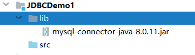
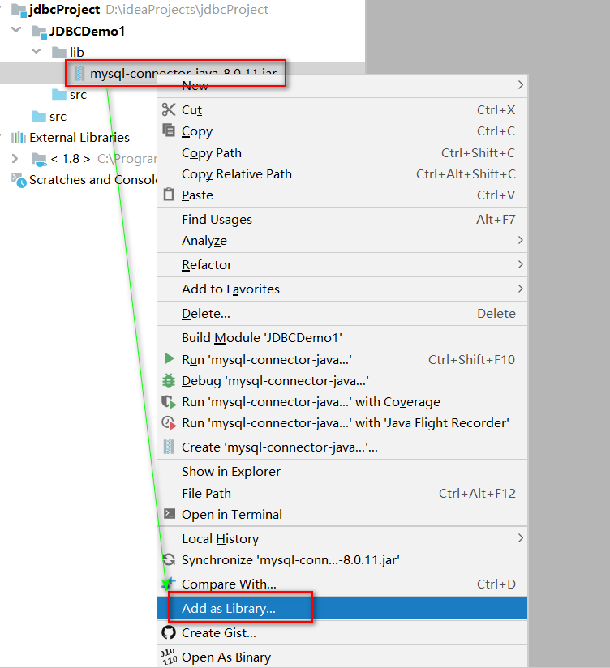
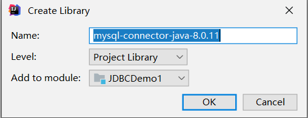
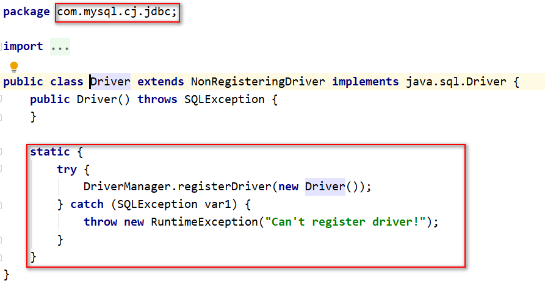

## 简单使用

### 创建项目并引入JDBC jar包

1.  创建项目和模块.将jar文件放入项目的lib目录中
    
2.  给当前项目添加依赖(告诉当前项目/模块可以依赖jar文件中的代码)
    
3.  点击OK
    

### 简单使用JDBC

1.  加载一个Driver驱动
2.  创建数据库连接（Connection）
3.  创建SQL命令发送器Statement
4.  通过Statement发送SQL命令并得到结果
5.  处理结果（select语句）
6.  关闭数据库资源ResultSet  Statement  Connection

```java
import com.mysql.cj.jdbc.Driver;

import java.sql.Connection;
import java.sql.DriverManager;
import java.sql.SQLException;
import java.sql.Statement;

public class TestDemo01 {
    public static void main(String[] args) throws SQLException {
        //加载驱动
        Driver driver = new Driver();
        //注册驱动
        DriverManager.registerDriver(driver);
        //获得链接
        String url = "jdbc:mysql://192.168.1.188:3306/test?useSSL=false&autoReconnect=true&allowPublicKeyRetrieval=true&useUnicode=true&characterEncoding=UTF-8&serverTimezone=Asia/Shanghai";
        String name ="root";
        String password = "root";
        Connection  connection = DriverManager.getConnection(url,name,password);
        //获得语句对象 Statment
        Statement statement = connection.createStatement();
        //执行SQL 获取返回值
        String sql = "insert into dept values(50,'教学部','北京');";
        int i = statement.executeUpdate(sql);
        System.out.println("受影响的行数:"+i);
        //释放资源
        statement.close();
        connection.close();
    }
}
```

### 常见问题解决

-   错误一: `Exception in thread "main" java.lang.ClassNotFoundException: com.mysql.jdbc2.Driver`
    原因：没有添加jar包或者com.mysql.jdbc2.Driver路径错误
-   错误二:` Exception in thread "main" java.sql.SQLException: No suitable driver found for jbdc:mysql://127.0.0.1:3306/stumgr`
    原因：url错误
-   错误三:` Exception in thread "main" java.sql.SQLException: Access denied for user 'root'@'localhost' (using password: YES)`
    原因：用户名或者密码错误
-   错误四: `Exception in thread "main" com.mysql.jdbc.exceptions.jdbc4.MySQLIntegrityConstraintViolationException:Duplicate entry '90' for key 'PRIMARY'`
    原因：主键冲突
-   错误五: `Public Key Retrieval is not allowed`
    原因：如果用户使用 sha256_password 认证，密码在传输过程中必须使用 TLS 协议保护，但是如果 RSA 公钥不可用，可以使用服务器提供的公钥；可以在连接中通过 ServerRSAPublicKeyFile 指定服务器的 RSA 公钥，或者AllowPublicKeyRetrieval=True参数以允许客户端从服务器获取公钥；但是需要注意的是 AllowPublicKeyRetrieval=True可能会导致恶意的代理通过中间人攻击(MITM)获取到明文密码，所以默认是关闭的，必须显式开启
    在jdbc连接添加上参数allowPublicKeyRetrieval=true即可，注意参数间用&

### 优化驱动注册

我们查看Driver的源代码时,发现: 该类内部有一个静态代码块,在代码块中就是在实例化一个驱动并在驱动中心注册.静态代码块会在类进入内存时执行,也就是说,我们只要让该类字节码进入内存,就会自动完成注册,不需要我们手动去new



所以我们在代码中直接使用反射,通过`Class.forName("com.mysql.jdbc.Driver")`,加载该类进入内存即可

```java
public class TestDemo02 {
    private static String driver = "com.mysql.cj.jdbc.Driver";
    private static String url = "jdbc:mysql://192.168.1.188:3306/test?useSSL=false&autoReconnect=true&allowPublicKeyRetrieval=true&useUnicode=true&characterEncoding=UTF-8&serverTimezone=Asia/Shanghai";
    private static String name ="root";
    private static String password = "root";
    public static void main(String[] args) {
        Connection connection = null;
        Statement statement = null;
        try {
            Class.forName(driver);
            connection = DriverManager.getConnection(url, name, password);
            statement = connection.createStatement();
            String sql="insert into dept values('123','助教部门','北京');";
            int rows = statement.executeUpdate(sql);
            System.out.println("影响数据行数为:"+rows);
        } catch (Exception e) {
            e.printStackTrace();
        } finally {
            if (statement!=null){
                try {
                    statement.close();
                } catch (SQLException e) {
                    e.printStackTrace();
                }
            }
            if (connection!=null){
                try {
                    connection.close();
                } catch (SQLException e) {
                    e.printStackTrace();
                }
            }
        }
    }
}
```

## 我的第一个CRUD

### 新增

```java
public class TestDemo02 {
    private static String driver = "com.mysql.cj.jdbc.Driver";
    private static String url = "jdbc:mysql://192.168.1.188:3306/test?useSSL=false&autoReconnect=true&allowPublicKeyRetrieval=true&useUnicode=true&characterEncoding=UTF-8&serverTimezone=Asia/Shanghai";
    private static String name ="root";
    private static String password = "root";
    public static void main(String[] args) {
        testInster("123","助教部门","北京");
    }


    /**
     * 添加
     * @param id id
     * @param department 部门
     * @param address 地址
     */
    public static void testInster(String id, String department,String address){
        Connection connection = null;
        Statement statement = null;
        try {
            Class.forName(driver);
            connection = DriverManager.getConnection(url, name, password);
            statement = connection.createStatement();
            String sql="insert into dept values('"+id+"','"+department+"','"+address+"');";
            int rows = statement.executeUpdate(sql);
            System.out.println("影响数据行数为:"+rows);
        } catch (Exception e) {
            e.printStackTrace();
        } finally {
            if (statement!=null){
                try {
                    statement.close();
                } catch (SQLException e) {
                    e.printStackTrace();
                }
            }
            if (connection!=null){
                try {
                    connection.close();
                } catch (SQLException e) {
                    e.printStackTrace();
                }
            }
        }
    }
}
```

### 删除

```java
public class TestDemo02 {
    private static String driver = "com.mysql.cj.jdbc.Driver";
    private static String url = "jdbc:mysql://192.168.1.188:3306/test?useSSL=false&autoReconnect=true&allowPublicKeyRetrieval=true&useUnicode=true&characterEncoding=UTF-8&serverTimezone=Asia/Shanghai";
    private static String name ="root";
    private static String password = "root";
    public static void main(String[] args) {
        testDelete("123");
    }
    /**
     * 删除
     * @param id
     */
    public static void testDelete(String id) {
        Connection connection = null;
        Statement statement = null;
        try {
            Class.forName(driver);
            connection = DriverManager.getConnection(url, name, password);
            statement = connection.createStatement();
            String sql = "delete from dept where deptno='"+id+"'";
            int i = statement.executeUpdate(sql);
            System.out.println("受影响的行数:"+i);
        } catch (Exception e) {
            e.printStackTrace();
        } finally {
            if (statement != null) {
                try {
                    statement.close();
                } catch (SQLException e) {
                    e.printStackTrace();
                }
            }
            if (connection != null) {
                try {
                    connection.close();
                } catch (SQLException e) {
                    e.printStackTrace();
                }
            }
        }
    }
}
```

### 修改

```java
public class TestDemo02 {
    private static String driver = "com.mysql.cj.jdbc.Driver";
    private static String url = "jdbc:mysql://192.168.1.188:3306/test?useSSL=false&autoReconnect=true&allowPublicKeyRetrieval=true&useUnicode=true&characterEncoding=UTF-8&serverTimezone=Asia/Shanghai";
    private static String name ="root";
    private static String password = "root";
    public static void main(String[] args) {
        testUpdate("123","推广部","上海");
    }

    /**
     * 更新
     * @param id id
     * @param department 部门
     * @param address 地址
     */
    public static void  testUpdate(String id, String department,String address){
        Connection connection = null;
        Statement statement = null;
        try {
            Class.forName(driver);
            connection = DriverManager.getConnection(url, name, password);
            statement = connection.createStatement();
            String sql = "update dept set dname='"+department+"',loc='"+address+"' where deptno='"+id+"';";
            int i = statement.executeUpdate(sql);
            System.out.println("受影响的行数:"+i);
        } catch (Exception e) {
            e.printStackTrace();
        }finally {
            if (statement != null) {
                try {
                    statement.close();
                } catch (SQLException e) {
                    e.printStackTrace();
                }
            }
            if (connection != null) {
                try {
                    connection.close();
                } catch (SQLException e) {
                    e.printStackTrace();
                }
            }
        }

    }
}
```

### 查询

```java
public class TestDemo02 {
    private static String driver = "com.mysql.cj.jdbc.Driver";
    private static String url = "jdbc:mysql://192.168.1.188:3306/test?useSSL=false&autoReconnect=true&allowPublicKeyRetrieval=true&useUnicode=true&characterEncoding=UTF-8&serverTimezone=Asia/Shanghai";
    private static String name ="root";
    private static String password = "root";
    public static void main(String[] args) {
        testSelectAll();
    }
    
    /**
     * 查询全部
     */
    public static void  testSelectAll(){
        Connection connection = null;
        Statement statement = null;
        try {
            Class.forName(driver);
            connection = DriverManager.getConnection(url, name, password);
            statement = connection.createStatement();
            String sql = "Select * from dept";
            ResultSet resultSet = statement.executeQuery(sql);
            while (resultSet.next()) {
                int deptno = resultSet.getInt("DEPTNO");
                String dname = resultSet.getString("DNAME");
                String loc = resultSet.getString("LOC");
                System.out.println("[deptno:"+deptno+";dname"+dname+";loc"+loc+"]");
            }
        } catch (Exception e) {
            e.printStackTrace();
        }finally {
            if (statement != null) {
                try {
                    statement.close();
                } catch (SQLException e) {
                    e.printStackTrace();
                }
            }
            if (connection != null) {
                try {
                    connection.close();
                } catch (SQLException e) {
                    e.printStackTrace();
                }
            }
        }
    }
}
```

#### 关于 ResultSet 

ResultSet里的数据一行一行排列，每行有多个字段，且有一个记录指针，指针所指的数据行叫做当前数据行，我们只能来操作当前的数据行。我们如果想要取得某一条记录，就要使用ResultSet的next()方法 ,如果我们想要得到ResultSet里的所有记录，就应该使用while循环。

ResultSet对象自动维护指向当前数据行的游标。每调用一次next()方法，游标向下移动一行。

初始状态下记录指针指向第一条记录的前面，通过next()方法指向第一条记录。循环完毕后指向最后一条记录的后面。

| 方法名                                 | 说明                      |
| ----------------------------------- | ----------------------- |
| boolean  next()                     | 将光标从当前位置向下移动一行          |
| boolean  previous()                 | 游标从当前位置向上移动一行           |
| void   close()                      | 关闭ResultSet 对象          |
| int  getInt(int colIndex)           | 以int形式获取结果集当前行指定列号值     |
| int  getInt(String colLabel)        | 以int形式获取结果集当前行指定列名值     |
| float  getFloat(int colIndex)       | 以float形式获取结果集当前行指定列号值   |
| Float  getFloat(String colLabel)    | 以float形式获取结果集当前行指定列名值   |
| String  getString(int colIndex)     | 以String 形式获取结果集当前行指定列号值 |
| String getString(String   colLabel) | 以String形式获取结果集当前行指定列名值  |

作为一种好的编程风格，应在不需要Statement对象和Connection对象时显式地关闭它们。关闭Statement对象和Connection对象的语法形式为：**用户不必关闭ResultSet。当它的 Statement 关闭、重新执行或用于从多结果序列中获取下一个结果时，该ResultSet将被自动关闭。**

## 封装成对象

### 为什么将结果封装成对象或者对象集合

1.  java是面向对象的编程语言,java中所有的数据处理都是基于面向对象的编码风格实现的,让数据以符合java风格的形式存在,便于对数据的后续处理
2.  ResultSet 集合虽然可以存放数据,但是它是JDBC中查询数据的一种手段,是一种数据的临时存储方案,使用完毕是要进行释放和关闭

### 怎么封装

准备和数据库表格相对应的一个实体类,用于封装结果集中的每一条数据,数据库表格中的每一个字段就是实体类的一个属性,实体类的一个对象就可以用于存储数据库表中的一条记录.

```java
public class dept implements Serializable {
    private Integer deptNo;
    private String dName;
    private String loc;
    public dept() {}
    public dept(Integer deptNo, String dName, String loc) {
        this.deptNo = deptNo;
        this.dName = dName;
        this.loc = loc;
    }
    public Integer getDeptNo() {
        return deptNo;
    }
    public void setDeptNo(Integer deptNo) {
        this.deptNo = deptNo;
    }
    public String getdName() {
        return dName;
    }
    public void setdName(String dName) {
        this.dName = dName;
    }
    public String getLoc() {
        return loc;
    }
    public void setLoc(String loc) {
        this.loc = loc;
    }
    @Override
    public String toString() {
        return "dept{" +
                "deptNo=" + deptNo +
                ", dName='" + dName + '\'' +
                ", loc='" + loc + '\'' +
                '}';
    }
}
```

封装实体类的特点:

1.  类名和表名保持一致 (见名知意) &#x20;
2.  属性个数和数据库的表的列数保持一致 &#x20;
3.  属性的数据类型和列的数据类型保持一致 &#x20;
4.  属性名和数据库表格的列名要保持一致 &#x20;
5.  所有的属性必须都是私有的 (出于安全考虑) &#x20;
6.  实体类的属性推荐写成包装类 &#x20;
7.  日期类型推荐写成java.util.Date &#x20;
8.  所有的属性都要有get和set方法 &#x20;
9.  必须具备空参构造方法 &#x20;
10. 实体类应当实现序列化接口 (mybatis缓存  分布式需要 ) &#x20;
11. 实体类中其他构造方法可选

### 封装后的使用

```java
public class TestDemo03 {
    private static String driver = "com.mysql.cj.jdbc.Driver";
    private static String url = "jdbc:mysql://192.168.1.188:3306/test?useSSL=false&autoReconnect=true&allowPublicKeyRetrieval=true&useUnicode=true&characterEncoding=UTF-8&serverTimezone=Asia/Shanghai";
    private static String name ="root";
    private static String password = "root";
    public static void main(String[] args) {
        List<dept> deptsList = getDeptsList();
        for (dept dept : deptsList) {
            System.out.println(dept);
        }
    }
    public static List<dept> getDeptsList() {
        Connection connection = null;
        Statement statement = null;
        List<dept> depts = null;
        try {
            Class.forName(driver);
            connection = DriverManager.getConnection(url, name, password);
            statement = connection.createStatement();
            depts = new ArrayList<>();
            String sql = "select * from dept";
            ResultSet resultSet = statement.executeQuery(sql);
            while (resultSet.next()) {
                int deptno = resultSet.getInt("DEPTNO");
                String dname = resultSet.getString("DNAME");
                String loc = resultSet.getString("LOC");
                dept dept = new dept(deptno, dname, loc);
                depts.add(dept);
            }
        } catch (Exception e) {
            e.printStackTrace();
        } finally {
            if (statement != null){
                try {
                    statement.close();
                } catch (SQLException e) {
                    e.printStackTrace();
                }
            }
            if (connection != null){
                try {
                    connection.close();
                } catch (SQLException e) {
                    e.printStackTrace();
                }
            }
        }
        return depts;
    }
}
```
