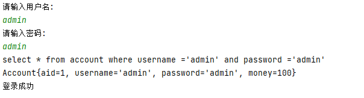
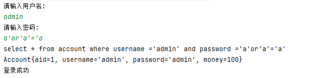
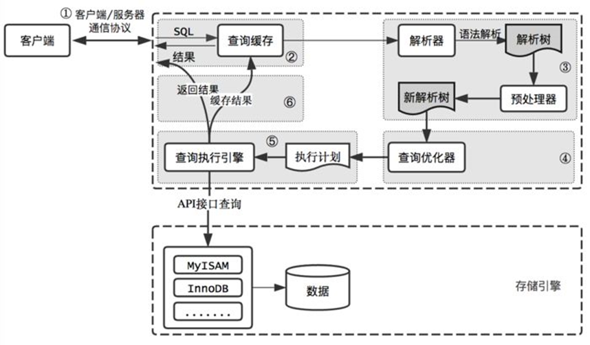
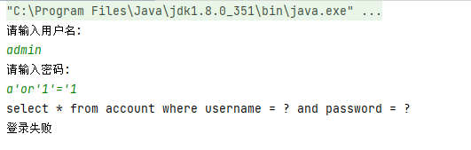

## 什么是SQL注入

SQL注入攻击指的是通过构建特殊的输入作为参数传入Web应用程序，而这些输入大都是SQL语法里的一些组合，通过执行SQL语句进而执行攻击者所要的操作，其主要原因是程序没有细致地过滤用户输入的数据，致使非法数据侵入系统。

以模拟登录为例:在前台输入用户名和密码，后台判断信息是否正确，并给出前台反馈信息，前台输出反馈信息。

## 模拟SQL注入

### 创建表

```sql
CREATE TABLE `account` (
  `aid` int NOT NULL AUTO_INCREMENT,
  `username` varchar(100) COLLATE utf8_bin DEFAULT NULL,
  `password` varchar(100) COLLATE utf8_bin DEFAULT NULL,
  `money` int DEFAULT NULL,
  PRIMARY KEY (`aid`)
) ENGINE=InnoDB DEFAULT CHARSET=utf8 COLLATE=utf8_bin;

INSERT INTO account
(username, password, money)
VALUES('admin', 'admin', 100);

```

### 编写登录程序

#### 封装实体类对象

```java
public class Account implements Serializable {
    private int aid;
    private String username;
    private String password;
    private int money;

    public Account() {
    }

    public Account(int aid, String username, String password, int money) {
        this.aid = aid;
        this.username = username;
        this.password = password;
        this.money = money;
    }

    public int getAid() {
        return aid;
    }

    public void setAid(int aid) {
        this.aid = aid;
    }

    public String getUsername() {
        return username;
    }

    public void setUsername(String username) {
        this.username = username;
    }

    public String getPassword() {
        return password;
    }

    public void setPassword(String password) {
        this.password = password;
    }

    public int getMoney() {
        return money;
    }

    public void setMoney(int money) {
        this.money = money;
    }

    @Override
    public String toString() {
        return "Account{" +
                "aid=" + aid +
                ", username='" + username + '\'' +
                ", password='" + password + '\'' +
                ", money=" + money +
                '}';
    }
}
```

#### JDBC主程序

```java
public class TestDemo01 {
    private static String driver = "com.mysql.cj.jdbc.Driver";
    private static String url = "jdbc:mysql://192.168.1.188:3306/test?useSSL=false&autoReconnect=true&allowPublicKeyRetrieval=true&useUnicode=true&characterEncoding=UTF-8&serverTimezone=Asia/Shanghai";
    private static String name ="root";
    private static String password = "root";

    public static void main(String[] args) {
        Scanner scanner = new Scanner(System.in);
        System.out.println("请输入用户名:");
        String name = scanner.next();
        System.out.println("请输入密码:");
        String password = scanner.next();
        Account account = getAccount(name, password);
        System.out.println(null!=account?"登录成功":"登录失败");
        scanner.close();
    }

    public static Account getAccount(String username,String pwd){
        Connection connection = null;
        Statement statement = null;
        Account account= null;
        try {
            Class.forName(driver);
            connection = DriverManager.getConnection(url, name, password);
            statement = connection.createStatement();
            String sql="select * from account where username ='"+username+"' and password ='"+pwd+"'";
            System.out.println(sql);
            ResultSet resultSet = statement.executeQuery(sql);
            while (resultSet.next()) {
                int aid = resultSet.getInt("aid");
                String usernamea = resultSet.getString("username");
                String pwda = resultSet.getString("password");
                int money = resultSet.getInt("money");
                account=new Account(aid,usernamea,pwda,money);
                System.out.println(account);
            }
        } catch (Exception e) {
            e.printStackTrace();
        }finally {
            if (statement == null) {
                try {
                    statement.close();
                } catch (SQLException e) {
                    e.printStackTrace();
                }
            }
            if (connection == null) {
                try {
                    connection.close();
                } catch (SQLException e) {
                    e.printStackTrace();
                }
            }
        }
        return account;
    }
}
```

### 测试程序

#### 正常登录



#### SQL注入



### 注入原理

我们在进行SQL拼接时,由于使用的是String拼接的方式. 攻击者可以通过恶意符号修改我们的SQL语句,达到注入的目的:

`select * from account where username ='admin' and password ='admin'`

注入后: `select * from account where username ='admin' and password ='a'or'1'='1' `  由于1=1恒成立,所以SQL执行成功

## prepareStatment 预编译

正对上述的现象,我们可以使用prepareStatment 对SQL进行预编译处理,防止SQL注入.

### Statement和PreparedStatment的关系和区别

关系：public interface PreparedStatement extends Statement

区别:  
1. PreparedStatment安全性高,可以避免SQL注入
2. PreparedStatment简单不繁琐,不用进行字符串拼接
3. PreparedStatment性能高，用在执行多个相同数据库DML操作时,可以减少sql语句的编译次数

### 原理

prepareStatment对象在set方法上,会对单引号进行转译处理,也就是说, ? 中的数据的单引号 `'` 会被转义成 `\' `这样就单引号就不会破坏sql语句的结构,

比如: 上述中`select * from account where username ='admin' and password ='a'or '1'='1' `使用预编译后

`select * from account where username =\'admin\' and password =\'a\'or\'1\'=\'1\' `这样就可以避免SQL注入了

说白了mysql驱动的PreparedStatement实现类的setString();方法内部做了单引号的转义，而Statement不能防止sql注入，就是因为它没有把单引号做转义，而是简单粗暴的直接拼接字符串，所以达不到防止sql注入的目的。

### 流程

当客户端发送一条sql语句给DBMS时,MySQL的执行流程如下图



1.  客户端向服务器端发送SQL命令
2.  服务器端连接模块连接并验证
3.  缓存模块解析SQL为Hash并与缓存中Hash表对应。如果有结果直接返回结果，如果没有对应继续向下执行
4.  解析器解析SQL为解析树，如果出现错误，报SQL解析错误。如果正确，向下传递
5.  预处理器对解析树继续处理，处理成新的解析树。
6.  优化器根据开销自动选择最优执行计划，生成执行计划
7.  执行器执行执行计划，访问存储引擎接口
8.  存储引擎访问物理文件并返回结果
9.  如果开启缓存，缓存管理器把结果放入到查询缓存中。
10. 返回结果给客户端

当客户发送一条SQL语句给DBMS后，DBMS总是需要校验SQL语句的语法格式是否正确，然后把SQL语句编译成可执行的函数，最后才是执行SQL语句。其中校验语法，和编译所花的时间可能比执行SQL语句花的时间还要多。

预编译语句PreparedStatement 是java.sql中的一个接口，它是Statement的子接口。通过Statement对象执行SQL语句时，需要将SQL语句发送给DBMS，由DBMS首先进行编译后再执行。预编译语句和Statement不同，在创建PreparedStatement 对象时就指定了SQL语句，该语句立即发送给DBMS进行编译。当该编译语句被执行时，DBMS直接运行编译后的SQL语句，而不需要像其他SQL语句那样首先将其编译。预编译的SQL语句处理性能稍微高于普通的传递变量的办法。

例如:我们需要执行多次insert语句，但只是每次插入的值不同，MySQL服务器也是需要每次都去校验SQL语句的语法格式，以及编译，这就浪费了太多的时间。如果使用预编译功能，那么只对SQL语句进行一次语法校验和编译，所以效率要高。

**注意:  由于使用了PreparedStatement ,与 Statement不同的是并不会自动关闭resultSet对象,所以我们需要手动关闭resultSet**

### 开启

我们可以通过设置URL中的参数来控制预编译是否开启

useServerPrepStmts 是否开启预编译

cachePrepStmts  是否启用预编译缓存

例如: "`jdbc:mysql://localhost:3306/mydb?*****&useServerPrepStmts=true&cachePrepStmts=true`"

值得注意的是,我们的Connector/J 5.0.5及之后**useServerPrepStmts**默认false,就是默认没有开启预编译,之前默认为true, cachePrepStmts 一直默认为false,需要我们手动设置才可以启用预编译,在开启预编译的同时要同时开启预编译缓存才能带来些许的性能提升

### 使用

```java
public class TestPreparedSstatement {
    private static String driver = "com.mysql.cj.jdbc.Driver";
    private static String url = "jdbc:mysql://192.168.1.188:3306/test?useSSL=false&useServerPrepStmts=true&cachePrepStmts=true&autoReconnect=true&allowPublicKeyRetrieval=true&useUnicode=true&characterEncoding=UTF-8&serverTimezone=Asia/Shanghai";
    private static String name ="root";
    private static String password = "root";

    public static void main(String[] args) {
        Scanner scanner = new Scanner(System.in);
        System.out.println("请输入用户名:");
        String name = scanner.next();
        System.out.println("请输入密码:");
        String password = scanner.next();
        Account account = getAccount(name, password);
        System.out.println(null!=account?"登录成功":"登录失败");
        scanner.close();
    }

    public static Account getAccount(String username,String pwd){
        Connection connection = null;
        PreparedStatement preparedStatement = null;
        ResultSet resultSet = null;
        Account account= null;
        try {
            Class.forName(driver);
            connection = DriverManager.getConnection(url, name, password);
            String sql="select * from account where username = ? and password = ?";
            preparedStatement = connection.prepareStatement(sql);//将SQL传入进行预编译
            preparedStatement.setString(1, username);
            preparedStatement.setString(2, pwd);
            System.out.println(sql);
            resultSet = preparedStatement.executeQuery();//查询时不用传
            while (resultSet.next()) {
                int aid = resultSet.getInt("aid");
                String usernamea = resultSet.getString("username");
                String pwda = resultSet.getString("password");
                int money = resultSet.getInt("money");
                account=new Account(aid,usernamea,pwda,money);
                System.out.println(account);
            }
        } catch (Exception e) {
            e.printStackTrace();
        }finally {
            if (resultSet == null) {
                try {
                    resultSet.close();
                } catch (SQLException e) {
                    e.printStackTrace();
                }
            }
            if (preparedStatement == null) {
                try {
                    preparedStatement.close();
                } catch (SQLException e) {
                    e.printStackTrace();
                }
            }
            if (connection == null) {
                try {
                    connection.close();
                } catch (SQLException e) {
                    e.printStackTrace();
                }
            }
        }
        return account;
    }
}
```

尝试SQL注入



## 重构CRUD

```java
public class TestPreparedSstatementCRUD {
    private static String driver = "com.mysql.cj.jdbc.Driver";
    private static String url = "jdbc:mysql://192.168.1.188:3306/test?useSSL=false&autoReconnect=true&allowPublicKeyRetrieval=true&useUnicode=true&characterEncoding=UTF-8&serverTimezone=Asia/Shanghai";
    private static String name ="root";
    private static String password = "root";
    public static void main(String[] args) {
        testInster("124","助教部门","北京");
//        testDelete("123");
//        testUpdate("123","推广部","上海");
//        testSelectAll("123");
    }


    /**
     * 添加
     * @param id id
     * @param department 部门
     * @param address 地址
     */
    public static void testInster(String id, String department,String address){
        Connection connection = null;
        PreparedStatement preparedStatement = null;
        try {
            Class.forName(driver);
            connection = DriverManager.getConnection(url, name, password);
            String sql="insert into dept values(?,?,?);";
            preparedStatement = connection.prepareStatement(sql);
            preparedStatement.setString(1, id);
            preparedStatement.setString(2, department);
            preparedStatement.setString(3, address);
            int rows = preparedStatement.executeUpdate();
            System.out.println("影响数据行数为:"+rows);
        } catch (Exception e) {
            e.printStackTrace();
        } finally {
            if (preparedStatement!=null){
                try {
                    preparedStatement.close();
                } catch (SQLException e) {
                    e.printStackTrace();
                }
            }
            if (connection!=null){
                try {
                    connection.close();
                } catch (SQLException e) {
                    e.printStackTrace();
                }
            }
        }
    }

    /**
     * 删除
     * @param id
     */
    public static void testDelete(String id) {
        Connection connection = null;
        PreparedStatement preparedStatement = null;
        try {
            Class.forName(driver);
            connection = DriverManager.getConnection(url, name, password);
            String sql = "delete from dept where deptno=?";
            preparedStatement = connection.prepareStatement(sql);
            preparedStatement.setString(1, id);
            int i = preparedStatement.executeUpdate();
            System.out.println("受影响的行数:"+i);
        } catch (Exception e) {
            e.printStackTrace();
        } finally {
            if (preparedStatement != null) {
                try {
                    preparedStatement.close();
                } catch (SQLException e) {
                    e.printStackTrace();
                }
            }
            if (connection != null) {
                try {
                    connection.close();
                } catch (SQLException e) {
                    e.printStackTrace();
                }
            }
        }
    }

    /**
     * 更新
     * @param id id
     * @param department 部门
     * @param address 地址
     */
    public static void  testUpdate(String id, String department,String address){
        Connection connection = null;
        PreparedStatement preparedStatement = null;
        try {
            Class.forName(driver);
            connection = DriverManager.getConnection(url, name, password);
            String sql = "update dept set dname=?,loc=? where deptno=? ";
            preparedStatement = connection.prepareStatement(sql);
            preparedStatement.setString(1, department);
            preparedStatement.setString(2, address);
            preparedStatement.setString(3, id);
            int i = preparedStatement.executeUpdate();
            System.out.println("受影响的行数:"+i);
        } catch (Exception e) {
            e.printStackTrace();
        }finally {
            if (preparedStatement != null) {
                try {
                    preparedStatement.close();
                } catch (SQLException e) {
                    e.printStackTrace();
                }
            }
            if (connection != null) {
                try {
                    connection.close();
                } catch (SQLException e) {
                    e.printStackTrace();
                }
            }
        }

    }

    /**
     * 查询全部
     */
    public static void  testSelectAll(int deptNo){
        Connection connection = null;  
        PreparedStatement preparedStatement =null;
        ResultSet resultSet = null;
        try {
            Class.forName(driver);
            connection = DriverManager.getConnection(url, name, password);
            String sql = "Select * from dept where  deptno=?";
            preparedStatement = connection.prepareStatement(sql);
            preparedStatement.setInt(1, deptNo);
            resultSet = preparedStatement.executeQuery(sql);
            while (resultSet.next()) {
                int deptno = resultSet.getInt("DEPTNO");
                String dname = resultSet.getString("DNAME");
                String loc = resultSet.getString("LOC");
                System.out.println("[deptno:"+deptno+";dname"+dname+";loc"+loc+"]");
            }
        } catch (Exception e) {
            e.printStackTrace();
        }finally {
            if (resultSet != null) {
                try {
                    resultSet.close();
                } catch (SQLException e) {
                    e.printStackTrace();
                }
            }
            if (preparedStatement != null) {
                try {
                    preparedStatement.close();
                } catch (SQLException e) {
                    e.printStackTrace();
                }
            }
            if (connection != null) {
                try {
                    connection.close();
                } catch (SQLException e) {
                    e.printStackTrace();
                }
            }
        }
    }
}
```
