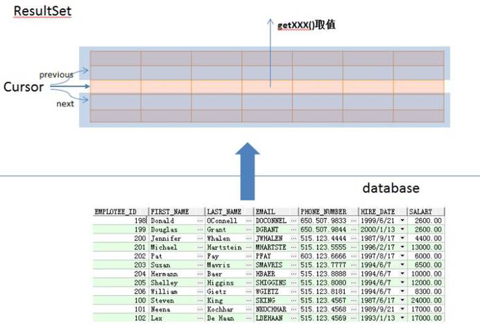

## Connection接口

代表数据库连接

| 方法                                                                      | 说明                                                      |
| ----------------------------------------------------------------------- | ------------------------------------------------------- |
| void  close ()                                                          | 立即释放此   Connection  对象的数据库和 JDBC 资源，而不是等待它们被自动释放        |
| void  commit ()                                                         | 使所有上一次提交/回滚后进行的更改成为持久更改，并释放此 Connection  对象当前持有的所有数据库锁。 |
| Statement createStatement ()                                            | 创建一个   Statement  对象来将 SQL 语句发送到数据库。                    |
| CallableStatement prepareCall (String  sql)                             | 创建一个   CallableStatement  对象来调用数据库存储过程。                 |
| PreparedStatement prepareStatement (String  sql)                        | 创建一个   PreparedStatement  对象来将参数化的 SQL 语句发送到数据库。        |
| PreparedStatement prepareStatement (String  sql, int autoGeneratedKeys) | 创建一个默认   PreparedStatement  对象，该对象能获取自动生成的键             |
| void rollback ()                                                        | 取消在当前事务中进行的所有更改，并释放此   Connection  对象当前持有的所有数据库锁。       |
| void setAutoCommit (boolean autoCommit)                                 | 将此连接的自动提交模式设置为给定状态。                                     |

## DriverManager类

管理一组 JDBC 驱动程序的基本服务

应用程序不再需要使用 Class.forName() 显式地加载 JDBC 驱动程序。在调用 getConnection 方法时，DriverManager 会试着从初始化时加载的那些驱动程序以及使用与当前 applet 或应用程序相同的类加载器显式加载的那些驱动程序中查找合适的驱动程序。

| 方法                                                                            | 说明                  |
| ----------------------------------------------------------------------------- | ------------------- |
| static Connection getConnection (String  url)                                 | 试图建立到给定数据库 URL 的连接。 |
| static Connection getConnection (String  url, Properties  info)               | 试图建立到给定数据库 URL 的连接。 |
| static Connection getConnection (String  url, String  user, String  password) | 试图建立到给定数据库 URL 的连接。 |

## Statement接口

用于将 SQL 语句发送到数据库中，或理解为执行sql语句

有三种 Statement对象：
1.  Statement：用于执行不带参数的简单SQL语句；
2.  PreparedStatement（从 Statement 继承）：用于执行带或不带参数的预编译SQL语句；
3.  CallableStatement（从PreparedStatement 继承）：用于执行数据库存储过程的调用。

| 方法                                     | 说明                              |
| -------------------------------------- | ------------------------------- |
| ResultSet   executeQuery(String   sql) | 执行SQL查询并获取到ResultSet对象          |
| int   executeUpdate(String   sql)      | 可以执行插入、删除、更新等操作，返回值是执行该操作所影响的行数 |

## PreparedStatement接口

关系：public interface PreparedStatement extends Statement

区别：
1.  PreparedStatment安全性高，可以避免SQL注入
2.  PreparedStatment简单不繁琐，不用进行字符串拼接
3.  PreparedStatment性能高，用在执行多个相同数据库DML操作时

## ResultSet接口

ResultSet对象是executeQuery()方法的返回值，它被称为结果集，它代表符合SQL语句条件的所有行，并且它通过一套getXXX方法（这些get方法可以访问当前行中的不同列）提供了对这些行中数据的访问。

ResultSet里的数据一行一行排列，每行有多个字段，且有一个记录指针，指针所指的数据行叫做当前数据行，我们只能来操作当前的数据行。我们如果想要取得某一条记录，就要使用ResultSet的next()方法 ,如果我们想要得到ResultSet里的所有记录，就应该使用while循环。

ResultSet对象自动维护指向当前数据行的游标。每调用一次next()方法，游标向下移动一行。

初始状态下记录指针指向第一条记录的前面，通过next()方法指向第一条记录。循环完毕后指向最后一条记录的后面。

| 方法                                 | 说明                      |
| ---------------------------------- | ----------------------- |
| boolean   next()                   | 将光标从当前位置向下移动一行          |
| boolean   previous()               | 游标从当前位置向上移动一行           |
| void   close()                     | 关闭ResultSet 对象          |
| int   getInt(int colIndex)         | 以int形式获取结果集当前行指定列号值     |
| int   getInt(String colLabel)      | 以int形式获取结果集当前行指定列名值     |
| float   getFloat(int colIndex)     | 以float形式获取结果集当前行指定列号值   |
| Float   getFloat(String colLabel)  | 以float形式获取结果集当前行指定列名值   |
| String   getString(int colIndex)   | 以String 形式获取结果集当前行指定列号值 |
| StringgetString(String   colLabel) | 以String形式获取结果集当前行指定列名值  |
