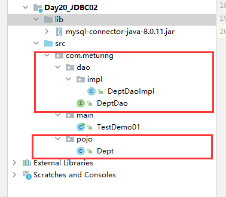
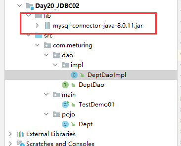

## DAO模式

### 简介

DAO(Data Access Object)是一个数据访问接口，数据访问：顾名思义就是与数据库打交道。夹在业务逻辑与数据库资源中间。

在核心J2EE模式中是这样介绍DAO模式的：

为了建立一个健壮的J2EE应用，应该将所有对数据源的访问操作抽象封装在一个公共API中。用程序设计的语言来说，就是建立一个接口，接口中定义了此应用程序中将会用到的所有事务方法。在这个应用程序中，当需要和数据源进行交互的时候则使用这个接口，并且编写一个单独的类来实现这个接口在逻辑上对应这个特定的数据存储.

简单来说,就是定义一个接口,规定一些增删改查的方法,然后交给实现类去实现, 它介于数据库和业务逻辑代码之间,这样当我们需要操作数据库是,根据接口定义的API去操作数据库就可以了,每个方法都是一个原子性的操作,例如：增加、修改、删除等

### DAO模式的结构

1.  **实体类**
    和数据库表格一一对应的类,单独放入一个包中,包名往往是 pojo/entity/bean,要操作的每个表格都应该有对应的实体类
    emp > class Emp
    dept > class Dept
    account > class Account
2.  **DAO 层**
    定义了对数据要执行那些操作的接口和实现类,包名往往是 dao/mapper,要操作的每个表格都应该有对应的接口和实现类
    emp > interface EmpDao >EmpDaoImpl
    dept > interface DeptDao> DeptDaoImpl

注意 :  Mybatis/Spring JDBCTemplate 中,对DAO层代码进行了封装,代码编写方式会有其他变化

### 创建一个DAO模式的项目

创建项目 : 导入各个层级的接口和页面之后的项目



添加jar包



创建包

创建实体类Dept

```java
/**
 * 实体类
 */
public class Dept implements Serializable {
	private Integer deptno;
	private String dname;
	private String loc;
	public Dept() {}
	public Dept(Integer deptno, String dname, String loc) {
		this.deptno = deptno;
		this.dname = dname;
		this.loc = loc;
	}
	public Integer getDeptno() {return deptno;}
	public void setDeptno(Integer deptno) {this.deptno = deptno;}
	public String getDname() {return dname;}
	public void setDname(String dname) {this.dname = dname;}
	public String getLoc() {return loc;}
	public void setLoc(String loc) {this.loc = loc;}
	@Override
	public String toString() {
		return "Dept{" +
				"deptno=" + deptno +
				", dname='" + dname + '\'' +
				", loc='" + loc + '\'' +
				'}';
	}
}
```

创建后台的接口DeptDao和实现类DeptDaoImpl

```java
/**
 * DAO 接口
 */
public interface DeptDao {
	/**
	 * 添加 Dept
	 * @param dept
	 * @return
	 */
	int addDept(Dept dept);
	/**
	 * 删除 Dept
	 * @param dept
	 * @return
	 */
	int deleteDept(Dept dept);
}
```

```java
/**
 * DAO 实现
 */
public class DeptDaoImpl implements DeptDao {
	private static String driver = "com.mysql.cj.jdbc.Driver";
	private static String url = "jdbc:mysql://192.168.1.188:3306/test?useSSL=false&autoReconnect=true&allowPublicKeyRetrieval=true&useUnicode=true&characterEncoding=UTF-8&serverTimezone=Asia/Shanghai";
	private static String name ="root";
	private static String password = "root";

	@Override
	public int addDept(Dept dept) {
		Connection connection = null;
		PreparedStatement preparedStatement = null;
		int rows = 0;
		try {
			Class.forName(driver);
			connection = DriverManager.getConnection(url, name, password);
			String sql = "insert into dept values(?,?,?)";
			preparedStatement = connection.prepareStatement(sql);
			preparedStatement.setInt(1, dept.getDeptno());
			preparedStatement.setString(2, dept.getDname());
			preparedStatement.setString(3, dept.getLoc());
			rows = preparedStatement.executeUpdate();
		} catch (Exception e) {
			e.printStackTrace();
		}finally {
			if (preparedStatement != null){
				try {
					preparedStatement.close();
				} catch (SQLException e) {
					e.printStackTrace();
				}
			}
			if (connection != null){
				try {
					connection.close();
				} catch (SQLException e) {
					e.printStackTrace();
				}
			}
		}
		return rows;
	}

	@Override
	public int deleteDept(Dept dept) {
		Connection connection = null;
		PreparedStatement preparedStatement = null;
		int rows = 0;
		try {
			Class.forName(driver);
			connection = DriverManager.getConnection(url, name, password);
			String sql = "delete from dept where deptno=? ";
			preparedStatement = connection.prepareStatement(sql);
			preparedStatement.setInt(1, dept.getDeptno());
			rows = preparedStatement.executeUpdate();
		} catch (Exception e) {
			e.printStackTrace();
		}finally {
			if (preparedStatement != null){
				try {
					preparedStatement.close();
				} catch (SQLException e) {
					e.printStackTrace();
				}
			}
			if (connection != null){
				try {
					connection.close();
				} catch (SQLException e) {
					e.printStackTrace();
				}
			}
		}
		return rows;
	}
}
```

测试代码

```java
public class TestDemo01 {
    public static void main(String[] args) {
        DeptDao deptDao = new DeptDaoImpl();
        Dept dept = new Dept(888, "张三", "aaa");
        int i = deptDao.addDept(dept);
        System.out.println("受影响的行数:"+i);
        Dept dept1 = new Dept(888, "张三", "aaa");
        int i1 = deptDao.deleteDept(dept1);
        System.out.println("受影响的行数:"+i1);
    }
}
```

我们发现,使用DAO层结构后,项目代码的层级关系更加的清楚明了. 但是在实现类中仍有大量的JDBC代码重复,我们可以进一步精简

### 提取BaseDAO

#### 抽取BaseDAO

注意:  在查询方法时,使用了前面学到的反射

```java
public abstract class BaseDao {
    private static String driver = "com.mysql.cj.jdbc.Driver";
    private static String url = "jdbc:mysql://192.168.1.188:3306/test?useSSL=false&autoReconnect=true&allowPublicKeyRetrieval=true&useUnicode=true&characterEncoding=UTF-8&serverTimezone=Asia/Shanghai";
    private static String name ="root";
    private static String password = "root";

    /**
     * 增删改
     * @param sql
     * @param args
     * @return
     */
    public int baseUpdate(String sql,Object ... args){
        Connection connection = null;
        PreparedStatement preparedStatement = null;
        int rows = 0;
        try {
            Class.forName(driver);
            connection = DriverManager.getConnection(url, name, password);
            preparedStatement = connection.prepareStatement(sql);
            for (int i = 0; i < args.length; i++) {
                preparedStatement.setObject(i+1, args[i]);
            }
            rows = preparedStatement.executeUpdate();
        } catch (Exception e) {
            e.printStackTrace();
        }finally {
            if (preparedStatement != null){
                try {
                    preparedStatement.close();
                } catch (SQLException e) {
                    e.printStackTrace();
                }
            }
            if (connection != null){
                try {
                    connection.close();
                } catch (SQLException e) {
                    e.printStackTrace();
                }
            }
        }
        return rows;
    }
    /**
     * 查
     * @param clazz 目标类的Class
     * @param sql 执行的SQL
     * @param args 参数
     * @return
     */
    public List baseQuery(Class clazz, String sql, Object ... args) {
        Connection connection = null;
        PreparedStatement preparedStatement = null;
        ResultSet resultSet = null;
        List arrayList = null;
        try {
            Class.forName(driver);
            connection = DriverManager.getConnection(url, name, password);
            preparedStatement = connection.prepareStatement(sql);
            for (int i = 0; i < args.length; i++) {
                preparedStatement.setObject(i+1, args[i]);
            }
            resultSet = preparedStatement.executeQuery();
            arrayList = new ArrayList();
            Field[] fields = clazz.getDeclaredFields();//获取全部属性
            while (resultSet.next()) {
                Object obj = clazz.newInstance();//创建对象
                for (Field field : fields) {
                    String name = field.getName();//获取字段的名字
                    field.setAccessible(true);//取消访问权限
                    Object data = resultSet.getObject(name);
                    field.set(obj,data);
                }
                arrayList.add(obj);
            }
        } catch (Exception e) {
            e.printStackTrace();
        } finally {
            if (resultSet == null) {
                try {
                    resultSet.close();
                } catch (SQLException e) {
                    e.printStackTrace();
                }
            }
            if (preparedStatement == null) {
                try {
                    preparedStatement.close();
                } catch (SQLException e) {
                    e.printStackTrace();
                }
            }
            if (connection == null) {
                try {
                    connection.close();
                } catch (SQLException e) {
                    e.printStackTrace();
                }
            }
        }
        return arrayList;
    }
}
```

#### 重写实现类

```java
public class DeptDaoImpl2 extends BaseDao implements DeptDao {
    @Override
    public int addDept(Dept dept) {
        String sql = "insert into dept values(?,?,?)";
        return baseUpdate(sql,dept.getDeptno(),dept.getDname(),dept.getLoc());
    }
    @Override
    public int deleteDept(Dept dept) {
        String sql = "delete from dept where deptno=? ";
        return baseUpdate(sql,dept.getDeptno());
    }
    @Override
    public List<Dept> selectDepts(Dept dept) {
        String sql = "select *  from dept where deptno=? ";
        return baseQuery(dept.getClass(),sql,dept.getDeptno());
    }
}
```
