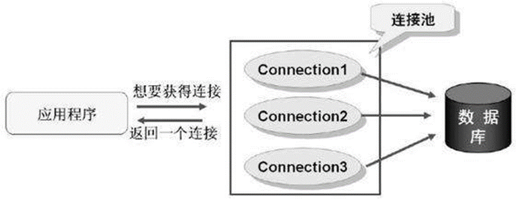

## 为什么要使用连接池

### 建立数据库连接的两种方式

#### 传统连接方式

首先调用Class.forName()方法加载数据库驱动，然后调用DriverManager.getConnection()方法建立连接.

>**存在的问题** : Connection对象在每次执行DML和DQL的过程中都要创建一次,DML和DQL执行完毕后,connection对象都会被销毁. connection对象是可以反复使用的,没有必要每次都创建新的.该对象的创建和销毁都是比较消耗系统资源的,如何实现connection对象的反复使用呢?使用连接池技术实现.

#### 连接池连接方式

连接池解决方案是在应用程序启动时就预先建立多个数据库连接对象,然后将连接对象保存到连接池中。当客户请求到来时,从池中取出一个连接对象为客户服务。当请求完成时,客户程序调用close()方法,将连接对象放回池中.对于多于连接池中连接数的请求，排队等待。应用程序还可根据连接池中连接的使用率，动态增加或减少池中的连接数。

> 优势 : 预先准备一些链接对象,放入连接池中,当多个线程并发执行时,可以避免短时间内一次性大量创建链接对象,减少计算机单位时间内的运算压力,提高程序的响应速度. 实现链接对象的反复使用,可以大大减少链接对象的创建次数,减少资源的消耗





## 具体实现


### 创建连接池文件

```java
package com.meturing.dao;

import java.sql.Connection;
import java.sql.DriverManager;
import java.sql.SQLException;
import java.util.LinkedList;

public class MyConnectionPool {
    private static String driver = "com.mysql.cj.jdbc.Driver";
    private static String url = "jdbc:mysql://192.168.1.188:3306/test?useSSL=false&autoReconnect=true&allowPublicKeyRetrieval=true&useUnicode=true&characterEncoding=UTF-8&serverTimezone=Asia/Shanghai";
    private static String name ="root";
    private static String password = "root";
    private static int initSize=5;
    private static int maxSize=10;
    private static LinkedList<Connection> pool;

    //优先加载驱动
    static {
        try {
            Class.forName(driver);
        } catch (ClassNotFoundException e) {
            e.printStackTrace();
        }
        //初始化Pool
        pool = new LinkedList<Connection>();
        // 初始化连接池
        for (int i = 0; i < initSize; i++) {
            Connection connection = initConnection();
            if (connection!=null){
                pool.add(connection);
                System.out.println("初始化连接"+connection.hashCode()+"放入连接池");
            }
        }
    }

    /**
     * 私有的初始化链接方法
     * @return
     */
    private static Connection initConnection(){
        try {
            return DriverManager.getConnection(url, name, password);
        } catch (SQLException e) {
            e.printStackTrace();
        }
        return null;
    }

    /**
     * 公共的获取链接方法
     * @return
     */
    public static Connection getConnection(){
        Connection connection =null;
        if (pool.size()>0){
            connection = pool.removeFirst();//从池中拿出第一个
            System.out.println("取出连接:"+connection.hashCode());
        }else {
            connection = initConnection();
            System.out.println("创建连接:"+connection.hashCode());
        }
        return connection;
    }

    /**
     * 公共的向连接池中归还链接
     * @param connection
     */
    public static void returnConnection(Connection connection){
        if (connection!=null){
            try {
                if (!connection.isClosed()) {//判断链接是否关闭
                    if (pool.size()<maxSize) {//判断Pool的大小是否超过上限
                        connection.setAutoCommit(true);//调整链接为自动提交
                        System.out.println("设置连接:"+connection.hashCode()+"自动提交为true");
                        pool.addLast(connection);
                        System.out.println("连接池未满,归还连接:"+connection.hashCode());
                    }else {
                        //当前连接池超过设定最大上限,直接关闭链接 无需归还
                        try {
                            connection.close();
                            System.out.println("连接池满了,关闭连接:"+connection.hashCode());
                        } catch (SQLException e) {
                            e.printStackTrace();
                        }
                    }
                }else {
                    System.out.println("链接已经关闭,无需归还!");
                }
            } catch (SQLException e) {
                e.printStackTrace();
            }
        }else {
            System.out.println("传入的连接为null,不可归还");
        }
    }
}

```

### 修改BaseDAO

```java
package com.meturing.dao;

import java.lang.reflect.Field;
import java.sql.*;
import java.util.ArrayList;
import java.util.List;

public abstract class BaseDao {
    /**
     * 增删改
     * @param sql
     * @param args
     * @return
     */
    public int baseUpdate(String sql,Object ... args){
        Connection connection = null;
        PreparedStatement preparedStatement = null;
        int rows = 0;
        try {
            connection = MyConnectionPool.getConnection();//从连接池中获取链接
            preparedStatement = connection.prepareStatement(sql);
            for (int i = 0; i < args.length; i++) {
                preparedStatement.setObject(i+1, args[i]);
            }
            rows = preparedStatement.executeUpdate();
        } catch (Exception e) {
            e.printStackTrace();
        }finally {
            if (preparedStatement != null){
                try {
                    preparedStatement.close();
                } catch (SQLException e) {
                    e.printStackTrace();
                }
            }
            MyConnectionPool.returnConnection(connection);//将链接归还给连接池
        }
        return rows;
    }

    /**
     * 查
     * @param clazz 目标类的Class
     * @param sql 执行的SQL
     * @param args 参数
     * @return
     */
    public List baseQuery(Class clazz, String sql, Object ... args) {
        Connection connection = null;
        PreparedStatement preparedStatement = null;
        ResultSet resultSet = null;
        List arrayList = null;
        try {
            connection = MyConnectionPool.getConnection();//从连接池中获取链接
            preparedStatement = connection.prepareStatement(sql);
            for (int i = 0; i < args.length; i++) {
                preparedStatement.setObject(i+1, args[i]);
            }
            resultSet = preparedStatement.executeQuery();
            arrayList = new ArrayList();
            Field[] fields = clazz.getDeclaredFields();//获取全部属性
            while (resultSet.next()) {
                Object obj = clazz.newInstance();//创建对象
                for (Field field : fields) {
                    String name = field.getName();//获取字段的名字
                    field.setAccessible(true);//取消访问权限
                    Object data = resultSet.getObject(name);
                    field.set(obj,data);
                }
                arrayList.add(obj);
            }
        } catch (Exception e) {
            e.printStackTrace();
        } finally {
            if (resultSet == null) {
                try {
                    resultSet.close();
                } catch (SQLException e) {
                    e.printStackTrace();
                }
            }
            if (preparedStatement == null) {
                try {
                    preparedStatement.close();
                } catch (SQLException e) {
                    e.printStackTrace();
                }
            }
            MyConnectionPool.returnConnection(connection);//将链接归还给连接池
        }
        return arrayList;
    }
}
```

### 效果


## 继续优化


我们发现仍有大量的配置化的参数在我们的逻辑代码中,这样是不友好的.不方便我们对于项目的管理与维护

我们尝试使用配置文件来管理参数

### 创建配置文件


```properties
driver=com.mysql.cj.jdbc.Driver
url=jdbc:mysql://192.168.1.188:3306/test?useSSL=false&autoReconnect=true&allowPublicKeyRetrieval=true&useUnicode=true&characterEncoding=UTF-8&serverTimezone=Asia/Shanghai
name=root
password=root
initSize=5
maxSize=10
```

### 创建PropertiesUtil

```java
public class PropertiesUtil {
    private Properties properties;
    //初始化
    public PropertiesUtil(String path){
        properties=new Properties();
        InputStream inputStream = this.getClass().getResourceAsStream(path);
        try {
            properties.load(inputStream);
        } catch (IOException e) {
            e.printStackTrace();
        }
    }
    //获取指定Key的值
    public String getProperties(String key){
        return properties.getProperty(key);
    }
}
```

### 修改连接池

```java
public class MyConnectionPool {
    private static String driver;
    private static String url;
    private static String name;
    private static String password;
    private static int initSize;
    private static int maxSize;
    private static LinkedList<Connection> pool;

    //优先加载驱动
    static {
        //初始化参数
        PropertiesUtil propertiesUtil=new PropertiesUtil("/jdbc.properties");
        driver=propertiesUtil.getProperties("driver");
        url=propertiesUtil.getProperties("url");
        name=propertiesUtil.getProperties("name");
        password=propertiesUtil.getProperties("password");
        initSize=Integer.parseInt(propertiesUtil.getProperties("initSize"));
        maxSize=Integer.parseInt(propertiesUtil.getProperties("maxSize"));
        try {
            Class.forName(driver);
        } catch (ClassNotFoundException e) {
            e.printStackTrace();
        }
        //初始化Pool
        pool = new LinkedList<Connection>();
        // 初始化连接池
        for (int i = 0; i < initSize; i++) {
            Connection connection = initConnection();
            if (connection!=null){
                pool.add(connection);
                System.out.println("初始化连接"+connection.hashCode()+"放入连接池");
            }
        }
    }

    /**
     * 私有的初始化链接方法
     * @return
     */
    private static Connection initConnection(){
        try {
            return DriverManager.getConnection(url, name, password);
        } catch (SQLException e) {
            e.printStackTrace();
        }
        return null;
    }

    /**
     * 公共的获取链接方法
     * @return
     */
    public static Connection getConnection(){
        Connection connection =null;
        if (pool.size()>0){
            connection = pool.removeFirst();//从池中拿出第一个
            System.out.println("取出连接:"+connection.hashCode());
        }else {
            connection = initConnection();
            System.out.println("创建连接:"+connection.hashCode());
        }
        return connection;
    }

    /**
     * 公共的向连接池中归还链接
     * @param connection
     */
    public static void returnConnection(Connection connection){
        if (connection!=null){
            try {
                if (!connection.isClosed()) {//判断链接是否关闭
                    if (pool.size()<maxSize) {//判断Pool的大小是否超过上限
                        connection.setAutoCommit(true);//调整链接为自动提交
                        System.out.println("设置连接:"+connection.hashCode()+"自动提交为true");
                        pool.addLast(connection);
                        System.out.println("连接池未满,归还连接:"+connection.hashCode());
                    }else {
                        //当前连接池超过设定最大上限,直接关闭链接 无需归还
                        try {
                            connection.close();
                            System.out.println("连接池满了,关闭连接:"+connection.hashCode());
                        } catch (SQLException e) {
                            e.printStackTrace();
                        }
                    }
                }else {
                    System.out.println("链接已经关闭,无需归还!");
                }
            } catch (SQLException e) {
                e.printStackTrace();
            }
        }else {
            System.out.println("传入的连接为null,不可归还");
        }
    }
}
```
