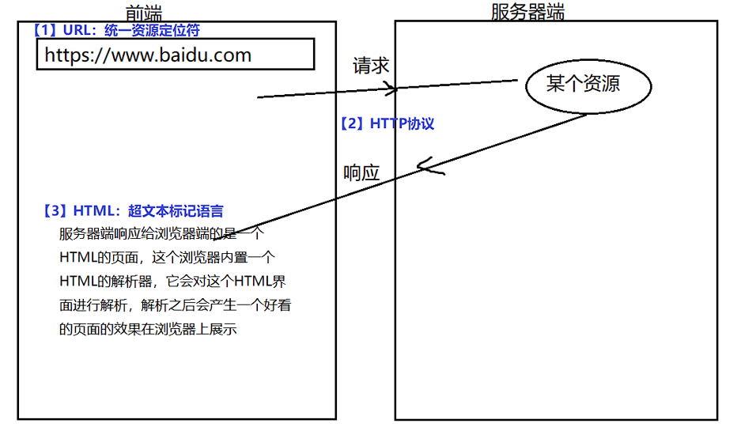

## 网络传输的三大基石

三大基石: URL ,HTML协议, HTML



1.  URL
    在WWW上，每一信息资源都有统一的且在网上唯一的地址，该地址就叫URL（Uniform Resource Locator,统一资源定位符），它是WWW的统一资源定位标志，就是指网络地址。&#x20;
2.  HTTP协议
    http是一个简单的请求-响应协议，它通常运行在TCP之上。它指定了客户端可能发送给服务器什么样的消息以及得到什么样的响应。请求和响应消息的头以ASCII码形式给出；而消息内容则具有一个类似MIME的格式。这个简单模型是早期Web成功的有功之臣，因为它使得开发和部署是那么的直截了当。
3.  HTML
    HTML称为超文本标记语言。

## 什么是HTML

HTML 指的是 **`超文本`** **`标记`** **`语言`**: HyperText Markup Language&#x20;

**超文本**: 比普通文本更加厉害
**标记**:  标签`<html> <body> <head>` 由尖括号包围起来的关键词
**语言**：HTML是一个描述网页的语言

> 作用 : 学习HTML就是学习各种各样的标签，然后组成一个页面，这个页面可以被浏览器解析，解析完以后可以在浏览器中将页面进行展示。

## HTML的标准结构

```html
<html> 
	<head></head> 
	<body> 
			this is my first html.... 
	</body> 
</html> 
```

## 安装开发工具 HBuilder

官网: [https://www.dcloud.io/hbuilderx.html](https://www.dcloud.io/hbuilderx.html "https://www.dcloud.io/hbuilderx.html")
