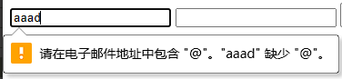
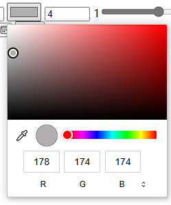
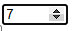
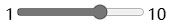
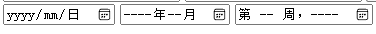

html5版本新增了很多类型，我们挑一些常用的进行展示：
详细学习地址可以参照w3c进行学习： [https://www.w3school.com.cn/html5/att\_input\_type.asp](https://www.w3school.com.cn/html5/att_input_type.asp "https://www.w3school.com.cn/html5/att_input_type.asp")

## 类型校验



```html
<!DOCTYPE html>
<html>
  <head>
    <meta charset="UTF-8">
    <title></title>
  </head>
  <body>
    <form action="" method="get">
      <!--email:
          html5的类型可以增加校验
      -->
      <input type="email" name="email" />
      <!--url-->
      <input type="url" />
    </form>
  </body>
</html>

```

## 颜色选择



```html
<!DOCTYPE html>
<html>
  <head>
    <meta charset="UTF-8">
    <title></title>
  </head>
  <body>
    <form action="" method="get">
      <!--color-->
      <input type="color" />
    </form>
  </body>
</html>

```

## 数值选择



```html
<!DOCTYPE html>
<html>
  <head>
    <meta charset="UTF-8">
    <title></title>
  </head>
  <body>
    <form action="" method="get">
      <!--number:
          min:最小值
          max:最大值
          step:步长
          value:默认值：一定在步长的范围中，否则不能提交
      -->
      <input type="number" min="1" max="10" step="3" value="4" />
    </form>
  </body>
</html>

```

## 滑动选择



```html
<!DOCTYPE html>
<html>
  <head>
    <meta charset="UTF-8">
    <title></title>
  </head>
  <body>
    <form action="" method="get">
      <!--range-->
      1<input type="range" min="1" max="10" name="range" step="3" />10
    </form>
  </body>
</html>

```

## 日期选择



```html
<!DOCTYPE html>
<html>
  <head>
    <meta charset="UTF-8">
    <title></title>
  </head>
  <body>
    <form action="" method="get">
      <!--date-->
      <input type="date" />
      <!--month-->
      <input type="month" />
      <!--week-->
      <input type="week" />
      <!--提交按钮-->
      <input type="submit" />
    </form>
  </body>
</html>

```

### 新增属性

```html
  <!--
      HTML5新增属性：
      multiple：多选
      placehoder:默认提示
      autofocus:自动获取焦点
      required:必填项
  -->
  <input type="text" autofocus="autofocus" />
  <input type="text" required="required"
```
