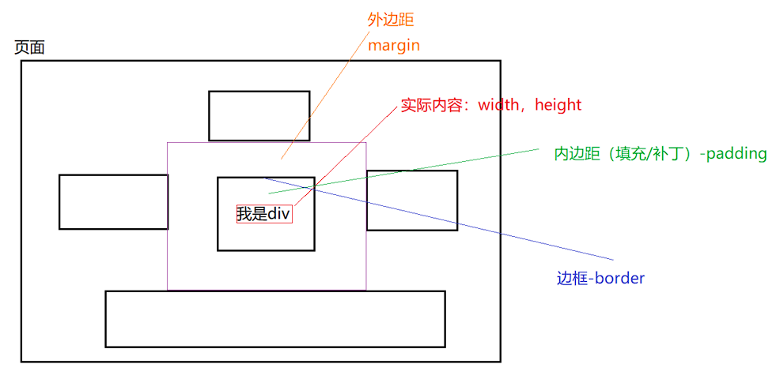
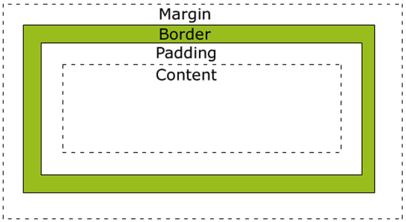
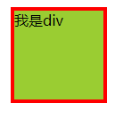
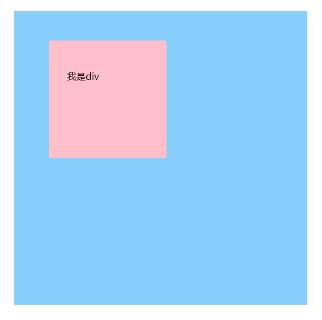

## 概述

页面上也有很多元素，元素之间的布局/设计 依靠 盒子模型：

所有HTML元素可以看作盒子，在CSS中，"box model"这一术语是用来设计和布局时使用。 CSS盒模型本质上是一个盒子，封装周围的HTML元素，它包括：边距，边框，填充，和实际内容。 盒模型允许我们在其它元素和周围元素边框之间的空间放置元素。

下面的图片说明了盒子模型(Box Model)：





不同部分的说明：

**`Margin(外边距)`**-清除边框外的区域，外边距是透明的。
**`Border(边框)`**-围绕在内边距和内容外的边框。
**`Padding(内边距)`**-清除内容周围的区域，内边距是透明的。
**`Content(内容)`**-盒子的内容，显示文本和图像。

## 简单的盒子模型



```html
<!DOCTYPE html>
<html>
  <head>
    <meta charset="UTF-8">
    <title></title>
    <style type="text/css">
      div {
        width: 100px;
        height: 100px;
        background-color: yellowgreen;
        margin-left: 100px;
        border: 4px red solid;
      }
    </style>
  </head>
  <body>
    <div>我是div</div>
  </body>
</html>

```

## Demo



```html
<!DOCTYPE html>
<html>
  <head>
    <meta charset="UTF-8">
    <title></title>
    <style type="text/css">
      /*将所有元素的样式：外边距，边框，内边距全部设置为0*/
      * {
        margin: 0px;
        border: 0px;
        padding: 0px;
      }

      #outer {
        width: 440px;
        height: 450px;
        background-color: lightskyblue;
        margin-left: 100px;
        margin-top: 100px;
        padding-top: 50px;
        padding-left: 60px;
      }

      #mydiv {
        width: 170px;
        height: 150px;
        background-color: pink;
        padding-top: 50px;
        padding-left: 30px;
      }
    </style>
  </head>
  <body>
    <div id="outer">
      <div id="mydiv">我是div</div>
    </div>
  </body>
</html>


```
