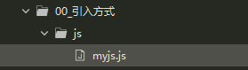

## 什么是JavaScrip

Javascript是一种由Netscape(网景)的LiveScript发展而来的. 原型化继承的面向对象的动态类型的区分大小写的客户端脚本语言，主要目的是为了解决服务器端语言.比如Perl遗留的速度问题，为客户提供更流畅的浏览效果。

当时服务端需要对数据进行验证，由于网络速度相当缓慢,只有28.8kbps，验证步骤浪费的时间太多。于是Netscape的浏览器Navigator加入了Javascript，提供了数据验证的基本功能。

JavaScript 的正式名称是 "ECMAScript"。这个标准由 ECMA 组织发展和维护。ECMA-262 是正式的 JavaScript 标准。这个标准基于 JavaScript (Netscape) 和 JScript (Microsoft)。Netscape (Navigator 2.0) 的 Brendan Eich 发明了这门语言，从 1996 年开始，已经出现在所有的 Netscape 和 Microsoft 浏览器中。ECMA-262 的开发始于 1996 年，在 1997 年 7 月，ECMA 会员大会采纳了它的首个版本。JavaScript的组成包含ECMAScript、DOM、BOM。JS是一种运行于浏览器端上的小脚本语句,可以实现网页如文本内容动,数据动态变化和动画特效等 .

-   ECMAScript
    是一种由欧洲计算机制造商协会（ECMA）通过ECMA-262标准化的脚本程序语言,简单点说，ECMAScript描述了语法、类型、语句、关键字、保留字、运算符和对象。它就是定义了脚本语言的所有属性、方法和对象。
-   DOM
    把整个页面规划成由节点层构成的文档，它不与浏览器、平台、语言相关，为web开发者提供一个标准可以访问站点中的数据、脚本和表现层对象.DOM编程可以实现网页内容校验和动态变化的效果&#x20;
-   BOM
    是浏览器的一种特性，它可以对浏览器窗口进行访问和操作，例如移动、关闭窗口，调整窗口的大小，支持cookie等。BOM编程可以实现动态控制浏览器本身行为的效果&#x20;

通俗来讲:**ECMAScript可以理解为JS的基础语法部分, DOM可以简单理解为,使用document对象操作文档内容的编程,BOM可以理解为,使用window对象操作浏览器行为的编程**

## JavaScript 的特点

### 优点

1.  **脚本语言** 
    脚本语言是一种**简单的程序，规模小,不需要编译,运行快,** 是由一些ASCII字符构成，可以使用任何一种文本编辑器编写。脚本语言是指在web浏览器内有解释器解释执行的编程语言，每次运行程序的时候，解释器会把程序代码翻译成可执行的格式。一些程序语言（如C、C++、Java等）都必须经过编译，将源代码编译成二进制的可执行文件之后才能运行，而脚本语言不需要事先编译，只要有一个与其相适应的解释器就可以执行。
2.  **基于对象的语言**
    脚本语言是一种**简单的程序，规模小,不需要编译,运行快,** 是由一些ASCII字符构成，可以使用任何一种文本编辑器编写。脚本语言是指在web浏览器内有解释器解释执行的编程语言，每次运行程序的时候，解释器会把程序代码翻译成可执行的格式。一些程序语言（如C、C++、Java等）都必须经过编译，将源代码编译成二进制的可执行文件之后才能运行，而脚本语言不需要事先编译，只要有一个与其相适应的解释器就可以执行。
3.  **事件驱动**
    在网页中执行了某种操作的动作，被称为"事件"(Event)，比如按下鼠标、移动窗口、选择菜单等都可以视为事件。当事件发生后，可能会引起相应的事件响应。
4.  **简单性**
    变量类型是采用弱类型，并未使用严格的数据类型。var a,b,c;  a=123;  b="abc"; a=b; 
5.  **安全性**
    JavaScript不能访问本地的硬盘，不能将数据存入到服务器上，不能对网络文档进行修改和删除，只能通过浏览器实现信息浏览或动态交互
6.  **跨平台性**
    JavaScript依赖于浏览器本身，与操作平台无关， 只要计算机安装了支持JavaScript的浏览器（装有JavaScript解释器），JavaScript程序就可以正确执行。

### 缺点

> 📌缺点
> 各种浏览器支持JavaScript的程度是不一样的，支持和不完全支持JavaScript的 浏览器在浏览同一个带有JavaScript脚本的网页时，效果会有一定的差距，有时甚至会显示不出来。

## JavaScript 与 Java的区别

-   **区别1：公司不同，前身不同**
    **JavaScript是Netscape公司的产品**，是为了扩展Netscape Navigator功能而开发的一种可以嵌入Web页面中的基于对象和事件驱动的解释性语言，它的前身是Live Script；**Java是SUN公司推出的新一代面向对象的程序设计语言**，特别适合于Internet应用程序开发； Java的前身是Oak语言。
-   **区别2：基于对象和面向对象**
    **JavaScript是脚本语言，是一种基于对象的语言**。本身提供了非常丰富的内部对象供设计人员使用，但不支持继承和多态。**Java是面向对象的**，是一种真正的面向对象的语言，支持封装、继承和多态。
-   **区别3: 变量类型强弱不同**
    **Java采用强类型变量检查，** 即所有变量在编译之前必须声明为某一指定类型。如: int  x=1234;**JavaScript中是弱类型变量**。统一采用var声明，可赋各种数据类型值。
-   **区别4: 变运行的位置不同**
    **Java运行与服务器端的**,大型编程语言, **JS运行于客户端(浏览器)** 一种小规模脚本语言

## JavaScript 与 CSS的关系

HTML和CSS和JS都是前端的主要技术,三者各有分工.

- HTML : 可以用于制作网页的主体结构
- CSS : 用于给网页做美化
- JS : 用于在网页上添加动态效果

## JavaScript 的引入方式

### 内嵌式

```html
<!DOCTYPE html>
<html>
  <head>
    <meta charset="utf-8" />
    <title></title>
    <!--内嵌式引入方式
        1在head标签中,用一对script标签,嵌入JS代码
        2type属性可以省略不写
    -->
    <script type="text/javascript">
      /*定义一个函数(方法)*/
      function fun1() {
        /*弹窗提示一点信息 */
        alert("你好")
      }
    </script>
  </head>
  <body>
    <input type="button" value="点我呀" onclick="fun1()" />
  </body>
</html>
```

> 📌缺点
> 1.  我们定义的JS代码只能在当前一个网页中使用,代码复用度低,可维护性低
> 2.  JS代码和HTML代码混合在一个文件中,可阅读性差

### 链接式



```javascript
function fun1(){
  alert("总能见到你")
}
function fun2(){
  alert("总能见到你")
}
```

```html
<!DOCTYPE html>
<html>
  <head>
    <meta charset="UTF-8">
    <title></title>
    <!--链接式 引入外部JS文件
      提高的代码复用度  
      降低了代码维护的难度
      1 一个页面可以同时引入多个不同的JS文件
        2 script标签一点用于引入外部JS文件,就不能在中间定义内嵌式代码
        3 一个页面上可以用多个script标签  位置也不是非得放到head标签中不可
        4src属性可以指向一个网络路径,就是第三种引入方式
    -->
    <script type="text/javascript" src="js/myjs.js"></script>
    <!--<script type="text/javascript" src="URL网络路径"></script>-->
          </head>
          <body>
                  <input type="button" value="点我呀" onclick="fun1()" />
                  <input type="button" value="点我呀2" onclick="fun2()" />
                  <input type="button" value="点我呀3" onclick="fun3()" />
                  <script >
                          function fun3(){
                                  alert("总能见到你")
                          }
                  </script>
          </body>
  </html>
```

> 📌优点 : 代码复用度高,更易于维护代码


注意事项:
1.  在一个页面上可以同时引入多个JS文件
2.  每个JS文件的引入都要使用一个独立的script标签
3.  内嵌式和链接式的引入不能使用同一标签
