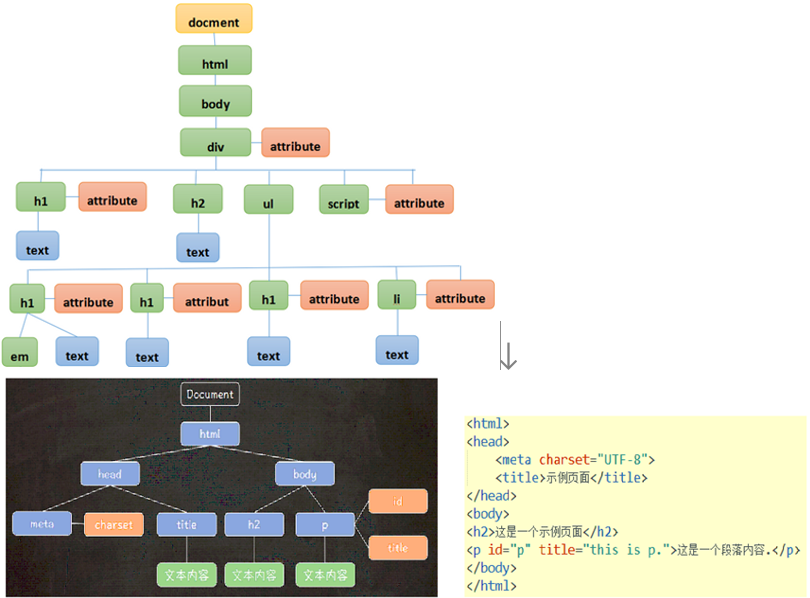
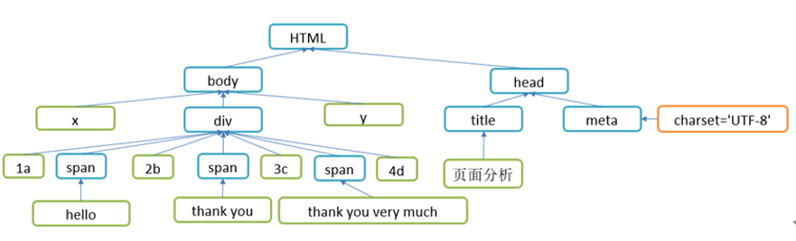
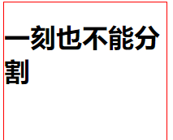
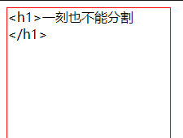
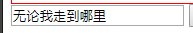

## 概述

### 什么是DOM编程

简单来说:  DOM编程就是**使用document对象的API完成对网页HTML文档进行动态修改**,以实现网页数据和样式动态变化效果的编程.

### 什么是Document

document对象代表整个html文档，可用来访问页面中的所有元素，是最复杂的一个dom对象，可以说是学习好dom编程的关键所在。

### Document对象如何获取

document对象是window对象的一个成员属性，通过`window.document`来访问，当然也可以直接使用`document`,根据HTML代码结构特点,document对象本身是一种树形结构的文档对象。



### DOM节点分类node

结点对象: Node, document对象中的每一个分支点都是一个node对象,它有三个子类

-   元素节点`Element`  -> 如:`<a href="链接地址">我的链接</a>`
-   属性节点`Attribute ` -> 如: `href="链接地址"`
-   文本节点`Text` -> 如 : `我的链接`

### DOM操作的内容

1.  查询元素（获取元素,进而操作元素,或者元素的属性,文本）
2.  操作文本
3.  操作属性
4.  操作元素
5.  操作CSS样式（一个特殊的属性style）

### 页面元素分析

#### 页面代码

```html
<!DOCTYPE html>
<html>
  <head>
    <meta charset="UTF-8">
    <title>页面分析</title>
  </head>
  <body>
    x
    <div id="d1" style="width: 100px;height: 100px; border: 1px solid red;">
      1a
      <span>hello</span>
      2b
      <span>thank you</span>
      3c
      <span>thank you very much</span>
      4d
    </div>
    y
  </body>
</html>

```

#### 树状图分析



## Node节点常用属性和方法

### 属性

| 属性名称            | 类型   | 说明       |
| ------------------- | -------- | ------------ |
| nodeName        | String   | 节点名称         |
| nodeValue       | String   | 节点值          |
| nodeType        | Number   | 节点类型         |
| parentNode      | Node     | 父节点          |
| firstChild      | Node     | 第一个子节点       |
| lastChild       | Node     | 最后一个子节点      |
| childNodes      | NodeList | 所有子节点        |
| previousSibling | Node     | 前一个节点        |
| nextSibling     | Node     | 后一个节点        |
| ownerDocument   | Document | 获得该节点所属的文档对象 |
| attributes      | Map      | 代表一个节点的属性对象  |

### 方法

| 方法名称                           | 返回值 | 说明        |
| ---------------------------------- | ------- | ------------- |
| hasChildNodes()               | Boolean | 当前节点是否有子节点    |
| appendChild(node)             | Node    | 往当前节点上添加子节点   |
| removeChild(node)              | Node    | 删除子节点         |
| replaceChild(oldNode, newNode) | Node    | 替换子节点         |
| insertBefore(newNode, refNode) | Node    | 在指定节点的前面插入新节点 |

## 直接获取节点

### 根据ID获取:getElementById

```html
<!DOCTYPE html>
<html>
  <head>
    <meta charset="UTF-8">
    <title></title>
    <script>
      function fun1() {
        // 获得document对象
        var element1 = document.getElementById("d1");
        console.log(element1);
        element1.innerText = "这是我的div";
      }
    </script>
  </head>
  <body>
    <div id='d1' class="a">这是第一个div</div>
    <div id='d2' class="a">这是第二个div</div>
    <div id='d3' class="a">这是第三个div</div>
    <hr />
    <input type="button" value="id值获取" onclick='fun1()' />
  </body>
</html>
```

### 根据Class获取:getElementsByClassName

```html
<!DOCTYPE html>
<html>
  <head>
    <meta charset="UTF-8">
    <title></title>
    <script>
      function fun2(className) {
        var elements = document.getElementsByClassName(className);
        console.log(elements)
        for (var i = 0; i < elements.length; i++) {
          console.log(elements[i])
        }
      }
    </script>
  </head>
  <body>
    <div id='d1' class="a">这是第一个div</div>
    <div id='d2' class="a">这是第二个div</div>
    <div id='d3' class="a">这是第三个div</div>
    <input id='i1' class="a" name='name1' />
    <div id='d4' class="b" name='name1'>这是第四个div</div>
    <div id='d5' class="b">这是第五个div</div>
    <hr />
    <input type="button" value="class属性值获取" onclick='fun2("b")' />
  </body>
</html>
```

### 根据标签获取:getElementsByTagName

```html
<!DOCTYPE html>
<html>
  <head>
    <meta charset="UTF-8">
    <title></title>
    <script>
      function fun3() {
        var elements = document.getElementsByTagName("input");
        console.log(elements);
        for (var i = 0; i < elements.length; i++) {
          console.log(elements[i])
        }
      }
    </script>
  </head>
  <body>
    爱好:
    <input type="checkbox" name="hobby" value="1" />篮球
    <input type="checkbox" name="hobby" value="2" />足球
    <input type="checkbox" name="hobby" value="3" />羽毛球
    <hr />
    <input type="button" value="标签名获取" onclick='fun3()' />
  </body>
</html>
```

### 根据name获取:getElementsByName

```html
<!DOCTYPE html>
<html>
  <head>
    <meta charset="UTF-8">
    <title></title>
    <script>
      function fun4() {
        var elements = document.getElementsByName("hobby");
        console.log(elements);
        for (var i = 0; i < elements.length; i++) {
          console.log(elements[i])
        }
      }
    </script>
  </head>
  <body>
    爱好:
    <input type="checkbox" name="hobby" value="1" />篮球
    <input type="checkbox" name="hobby" value="2" />足球
    <input type="checkbox" name="hobby" value="3" />羽毛球
    <hr />
    <input type="button" value="name属性值获取" onclick='fun4()' />
  </body>
</html>
```

## 操作节点的属性

#### 方式一: 直接操作

```html
<!DOCTYPE html>
<html>
  <head>
    <meta charset="UTF-8">
    <title></title>
    <script>
      function fun1() {
        //获得属性值
        var node = document.getElementById("in1");

        // 语法1     获得  节点.属性名    修改  节点.属性名 =属性值
        console.log(node.type);
        console.log(node.value);
        //改变属性值
        node.type = "button";
        node.value = "你好我也好";
      }
    </script>
  </head>
  <body>
    <input type="text" value="你好呀" id="in1" />
    <hr />
    <input type="button" value="变" onclick="fun1()" />
  </body>
</html>
```

#### 方式二: getAttribute/setAttribute

```html
<!DOCTYPE html>
<html>
  <head>
    <meta charset="UTF-8">
    <title></title>
    <script>
      function fun1() {
        //获得属性值
        var node = document.getElementById("in1");
        
        // 语法2  getAttribute   setAttribute
        console.log(node.getAttribute("type"));
        console.log(node.getAttribute("value"));

        node.setAttribute("type", "button");
        node.setAttribute("value", "大家好");
      }
    </script>
  </head>
  <body>
    <input type="text" value="你好呀" id="in1" />
    <hr />
    <input type="button" value="变" onclick="fun1()" />
  </body>
</html>
```

## 操作节点的样式

#### 方式一: 节点.style.样式名=样式值

```html
<!DOCTYPE html>
<html>
  <head>
    <meta charset="UTF-8">
    <title></title>
    <style>
      #div1 {
        width: 100px;
        height: 100px;
        border: 1px solid red;

      }
      .a {
        background-color: lightblue;
        color: blue;
        font-size: 40px;
      }
    </style>
    <script>
      function fun1() {
        // 节点.style.样式名=样式值
        var element = document.getElementById("div1");
        element.style.width = "200px";
        element.style.height = "200px";
        element.style.border = "10px solid green";
      }
    </script>
  </head>
  <body>
    <div id="div1">
      你好呀
    </div>
    <hr />
    <input type="button" value="测试" onclick="fun1()" />
  </body>
</html>
```

#### 方式二: 修改class属性,影响div的样式

```html
<!DOCTYPE html>
<html>
  <head>
    <meta charset="UTF-8">
    <title></title>
    <style>
      #div1 {
        width: 100px;
        height: 100px;
        border: 1px solid red;

      }
      .a {
        background-color: lightblue;
        color: blue;
        font-size: 40px;
      }
    </style>
    <script>
      function fun1() {
        // 节点.style.样式名=样式值
        var element = document.getElementById("div1");
        // css样式在更多的时候是以class选择器的形式作用到元素上
        // 可以通过修改class属性,影响div的样式
        element.setAttribute("class", "a")
      }
    </script>
  </head>
  <body>
    <div id="div1">
      你好呀
    </div>
    <hr />
    <input type="button" value="测试" onclick="fun1()" />
  </body>
</html>
```

## 操作标签文本

#### innerHTML : 操作标签中的所有代码



```html
<!DOCTYPE html>
<html>
  <head>
    <meta charset="UTF-8">
    <title></title>
    <style>
      div {
        border: 1px solid red;
        width: 200px;
        height: 200px;
      }
    </style>
    <script>
      function fun1() {
        var element1 = document.getElementById("d1");
        element1.innerHTML = "<h1>一刻也不能分割</h1>"
        var element2 = document.getElementById("i1");
        element2.value = "无论我走到哪里";
      }
    </script>
  </head>
  <body>
    <div id='d1'>
      a
      <span>文字</span>
      b
    </div>
    <input type="text" value="我和我的祖国" id='i1' />
    <input type="button" value="修改内容" onclick="fun1()" />
  </body>
</html>

```

#### innerText: 操作标签中的Text



```html
<!DOCTYPE html>
<html>
  <head>
    <meta charset="UTF-8">
    <title></title>
    <style>
      div {
        border: 1px solid red;
        width: 200px;
        height: 200px;
      }
    </style>
    <script>
      function fun1() {
        var element1 = document.getElementById("d1");
        element1.innerText="<h1>一刻也不能分割</h1>"
        var element2 = document.getElementById("i1");
        element2.value = "无论我走到哪里";
      }
    </script>
  </head>
  <body>
    <div id='d1'>
      a
      <span>文字</span>
      b
    </div>
    <input type="text" value="我和我的祖国" id='i1' />
    <input type="button" value="修改内容" onclick="fun1()" />
  </body>
</html>

```

#### value : 操作表单的值



```html
<!DOCTYPE html>
<html>
  <head>
    <meta charset="UTF-8">
    <title></title>
    <style>
      div {
        border: 1px solid red;
        width: 200px;
        height: 200px;
      }
    </style>
    <script>
      function fun1() {
        var element2 = document.getElementById("i1");
        element2.value = "无论我走到哪里";
      }
    </script>
  </head>
  <body>
    <input type="text" value="我和我的祖国" id='i1' />
    <input type="button" value="修改内容" onclick="fun1()" />
  </body>
</html>

```

## 增加删除节点

#### 创建元素: createElement()

#### 增加元素: appendChild()

#### 删除元素: removeChild()

```html
<!DOCTYPE html>
<html>
  <head>
    <meta charset="utf-8">
    <title></title>
    <style>
      #d1 {
        border: 1px solid red;
        width: 80%;
        height: 200px;
      }
    </style>
    <script>
      function fun1() {
        var div1 = document.getElementById("d1");
        // 通过JS创建标签
        var in1 = document.createElement("input");
        in1.setAttribute("type", "text");
        in1.setAttribute("value", "请输入内容");

        var in2 = document.createElement("input");
        in2.setAttribute("type", "password");
        in2.setAttribute("value", "123456789");

        var in3 = document.createElement("input");
        in3.setAttribute("type", "button");
        in3.setAttribute("value", "删除");

        var br = document.createElement("br");

        in3.onclick = function() {
          div1.removeChild(in1)
          div1.removeChild(in2)
          div1.removeChild(in3)
          div1.removeChild(br)
        }
        div1.appendChild(in1);
        div1.appendChild(in2);
        div1.appendChild(in3);
        div1.appendChild(br);
      }
    </script>
  </head>
  <body>
    <div id="d1">

    </div>
    <input type="button" value="增加" onclick="fun1()" />
  </body>
</html>
```
