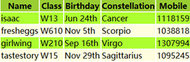

## 为什么要使用JQuery

###  使用原生JavaScript编码存在问题 

1.  选择器功能弱&#x20;
2.  DOM操作繁琐之极
3.  浏览器兼容性不好
4.  动画功能弱

### JQuery的优点

1.  强大的选择器
2.  出色的DOM封装
3.  出色的浏览器兼容性
4.  强大的动画功能
5.  体积小，压缩后只有100KB左右
6.  可靠的事件处理机制
7.  使用隐式迭代简化编程
8.  丰富的插件支持

## 什么是JQuery

**目前最流行的JavaScript函数库之一，对JavaScript进行了封装**。并不是一门新语言。将常用的、复杂的操作进行函数化封装，直接调用，大大降低了使用JavaScript的难度，改变了使用JavaScript的习惯。jQuery能做的JavaScript也能做，但使用jQuery能大幅提高开发效率,由美国人JohnResig在2006年推出，目前最新版本是v3.5.1。宗旨：**Write less，do more（写更少代码，做更多事情）**。官方网址[http://jquery.com/](http://jquery.com/ "http://jquery.com/")

## JQuery的版本

-   1.x
    兼容ie678,使用最为广泛的，官方只做BUG维护，功能不再新增。因此一般项目来说，使用1.x版本就可以了，最终版本：1.12.4
-   2.x
    不兼容ie678，很少有人使用，官方只做BUG维护，功能不再新增。如果不考虑兼容低版本的浏览器可以使用2.x
-   3.x
    不兼容ie678，只支持最新的浏览器。除非特殊要求，一般不会使用3.x版本的，很多老的jQuery插件不支持这个版本。目前该版本是官方主要更新维护的版本。

## JQuery的尝试

实现隔行变色的效果，在使用jQuery实现效果之前，先使用在HTML中使用class属性直接标记、使用JavaScript来实现动态隔行变色，然后再采用jQuery来实现，可以明显体现到jQuery的方便和简单。

[jquery-3.5.1.min.js](file/jquery-3.5.1.min_NStiFUii2z.js)



### 原生JavaScript方式实现

```html
<!DOCTYPE html>
<html>
  <head>
    <meta charset="utf-8">
    <title></title>
    <style type="text/css">
      .a {
        background-color: greenyellow;
      }

      .b {
        background-color: yellowgreen;
      }

      .c {
        background-color: yellow;
      }
    </style>
    <script type="text/javascript">
      //页面加载后调用一个匿名函数 
      window.onload = function() {
        //获取所有的行 
        var arr = document.getElementsByTagName("tr");
        //对所有的行动态实现隔行变色   
        for (var i = 0; i < arr.length; i++) {
          if (i == 0) {
            arr[i].className = "a";

          } else if (i % 2 == 1) {
            arr[i].className = "b";
          } else {
            arr[i].className = "c";
          }
        }
      }
    </script>
  </head>
  <body>
    <table class="datalist">
      <tr>
        <th scope="col">Name</th>
        <th scope="col">Class</th>
        <th scope="col">Birthday</th>
        <th scope="col">Constellation</th>
        <th scope="col">Mobile</th>
      </tr>
      <tr>
        <td>isaac</td>
        <td>W13</td>
        <td>Jun 24th</td>
        <td>Can</td>
        <td>1118159</td>
      </tr>
      <tr>
        <td>fresheggs</td>
        <td>W610</td>
        <td>Nov 5th</td>
        <td>Scorpio</td>
        <td>1038818</td>
      </tr>
      <tr>
        <td>girlwing</td>
        <td>W210</td>
        <td>Sep 16th</td>
        <td>Virgo</td>
        <td>1307994</td>
      </tr>
      <tr>
        <td>tastestory</td>
        <td>W15</td>
        <td>Nov 29th</td>
        <td>Sagittarius</td>
        <td>1095245</td>
      </tr>
    </table>
  </body>
</html>
```

### 使用JQuery方式实现

```html
<!DOCTYPE html>
<html>
  <head>
    <meta charset="utf-8">
    <title></title>
    <!--引入jQuery文件-->
    <script src="js/jquery-3.5.1.min.js"></script>
    <script>
      $(function() {
        $("tr:odd").css("backgroundColor", "yellowgreen")
        $("tr:even").css("backgroundColor", "lightyellow")
        $("tr:first").css("backgroundColor", "greenyellow")
      })
    </script>
  </head>
  <body>
    <table class="datalist" summary="list   of members in EE Studay" id="oTable">
      <tr>
        <th scope="col">Name</th>
        <th scope="col">Class</th>
        <th scope="col">Birthday</th>
        <th scope="col">Constellation</th>
        <th scope="col">Mobile</th>
      </tr>
      <tr>
        <td>isaac</td>
        <td>W13</td>
        <td>Jun 24th</td>
        <td>Cancer</td>
        <td>1118159</td>
      </tr>
      <tr>
        <td>fresheggs</td>
        <td>W610</td>
        <td>Nov 5th</td>
        <td>Scorpio</td>
        <td>1038818</td>
      </tr>
      <tr>
        <td>girlwing</td>
        <td>W210</td>
        <td>Sep 16th</td>
        <td>Virgo</td>
        <td>1307994</td>
      </tr>
      <tr>
        <td>tastestory</td>
        <td>W15</td>
        <td>Nov 29th</td>
        <td>Sagittarius</td>
        <td>1095245</td>
      </tr>
    </table>
  </body>
</html>
```

### 总结

1.  关于jQuery的使用需要先导入jQuery的js文件,jQuery本身就是一个JS文件。
2.  jquery-3.5.1.min.js是jQuery文件的压缩版,生产环境下**推荐压缩版**
3.  \$是jQuery是使用最多的符号，它有多个作用。这个示例中就使用了的两个作用:
    -   作用1：页面加载函数
        `jQuery(document).ready(function(){});`和`$(document).ready(function({}));`简写为`$(function(){})` , 相当于​`window.onload=function(){}`但是功能比`window.onload`更强大`window.onload`一个页面只能写一个,但是可以写多个`$()` 而不冲突, ​`window.onload`要等整个页面加载完后再执行(包括图片、超链接、音视频等)，但是`$()`的执行时间要早
    -   作用2：选择器标志 `$(selector)`
        选择器。jQuery具有强大的选择器功能
