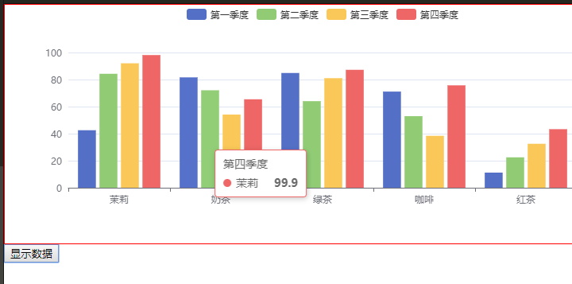

## 概述

### 什么是Echarts动态图表

Apache ECharts 是一个正在由 Apache 孵化器赞助的 Apache 开源基金会孵化的项目。官方网址：[https://echarts.apache.org/zh/index.html](https://echarts.apache.org/zh/index.html "https://echarts.apache.org/zh/index.html")

2018年3月份，全球著名开源社区 Apache 基金会宣布“百度开源的 ECharts 项目全票通过进入 Apache 孵化器”。这是百度第一个进入国际顶级开源社区的项目，也标志着百度开源正式进入开源发展的快车道。

ECharts 成为Apache 孵化器项目之前，已经是国内可视化生态领域的领军者，近年内连续被开源中国评选为“年度最受欢迎的中国开源软件”，并广泛被各行业企业以及事业单位、科研院所应用。涉及行业包含金融、教育、医疗、物流、气候监测等众多领域，其中甚至包括阿里巴巴、腾讯、华为、联想、小米、国家电网、中国石化等。

ECharts 负责人祖明介绍到：“ ECharts 作为拥有丰富的可视化图表类型和深度交互能力的开源可视化库，配置便捷容易上手，同时上千的配置项和不同层面的扩展机制带来了灵活的定制能力。ECharts 底层依托了开源渲染引擎 ZRender ，支持 Canvas 和 SVG 等多种方式的渲染，支持 PC 、移动端、数据大屏、服务端渲染等多种设备场景。

ECharts（Enterprise Charts），一个使用 JavaScript 实现的开源可视化库，可以流畅的运行在 PC 和移动设备上，兼容当前绝大部分浏览器（IE8/9/10/11，Chrome，Firefox，Safari等），底层依赖矢量图形库 ZRender，提供直观，交互丰富，可高度个性化定制的数据可视化图表。

### Echcarts的组件

Eecharts中各种内容，被抽象为“组件”。
例如，echarts 中至少有这些组件：
-   series（系列，一组数值以及他们映射成的图）
-   xAxis（直角坐标系 X 轴）
-   yAxis（直角坐标系 Y 轴）
-   tooltip（提示框组件）
-   toolbox（工具栏组件）
-   title（标题）
-   legend（图例）

### 快速上手



#### 引入JS

#### 案例

```html
<!DOCTYPE html>
<html style="height: 100%">
  <head>
    <meta charset="utf-8">
    <script type="text/javascript" src="js/echarts.js"></script>
    <script type="text/javascript">
      function showData() {
        var dom = document.getElementById("container");
        var myChart = echarts.init(dom);
        var app = {};
        option = null;
        option = {
          legend: {},
          tooltip: {},
          dataset: {
            source: [
              ['product', '第一季度', '第二季度', '第三季度', '第四季度'],
              ['茉莉', 43.3, 85.8, 93.7, 99.9],
              ['奶茶', 83.1, 73.4, 55.1, 66.6],
              ['绿茶', 86.4, 65.2, 82.5, 88.8],
              ['咖啡', 72.4, 53.9, 39.1, 77.1],
              ['红茶', 11.4, 22.9, 33.1, 44.1]
            ]
          },
          xAxis: {
            type: 'category'
          },
          yAxis: {},
          // Declare several bar series, each will be mapped
          // to a column of dataset.source by default.
          series: [{
              type: 'bar'
            },
            {
              type: 'bar'
            },
            {
              type: 'bar'
            },
            {
              type: 'bar'
            }
          ]
        };;
        if (option && typeof option === "object") {
          myChart.setOption(option, true);
        }
      }
    </script>
  </head>
  <body style="height: 100%; margin: 0">
    <div id="container" style="height: 300px;width: 800px;border: 1px solid red; margin: 0px auto;"></div>
    <input type="button" value="显示数据" onclick="showData()" />
  </body>
</html>

```

更多教程看官网: [https://echarts.apache.org/handbook/zh/get-started/](https://echarts.apache.org/handbook/zh/get-started/ "https://echarts.apache.org/handbook/zh/get-started/")
