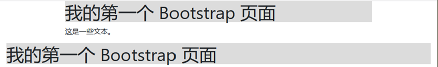
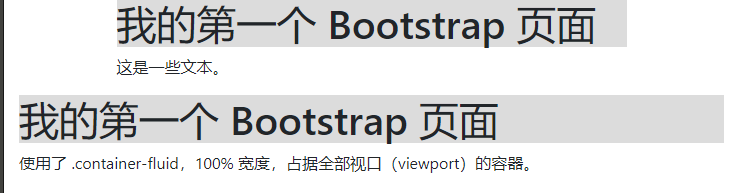
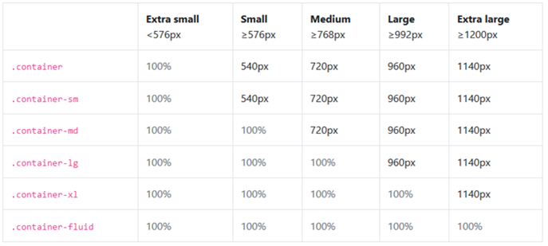
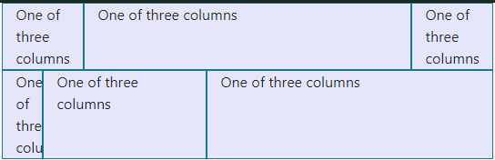

## 容器

### 什么是容器

Bootstrap 4 需要一个容器元素来包裹网站的内容,说白了就是要用一些标签来装其他的标签,这样便于我们对网页做整体的布局设计,一般我们选择用div来做容器,对应的容器类有两个,一个是固定容器 `.container  `一个是流容器 `.container-fluid`。

### 容器类



`.container` 类用于固定宽度并支持响应式布局的容器。
`.container-fluid` 类用于 100% 宽度，占据全部视口（viewport）的容器。

### 案例



```html
<!DOCTYPE html>
<html>
  <head>
    <meta charset="utf-8">
    <!-- 引入CSS文件 -->
    <link rel="stylesheet" href="css/bootstrap.min.css" />
    <!-- 导入顺序:JQuery文件\bootstrap.bundle.min.js\bootstrap.min.js -->
    <script src="js/jquery-3.5.1.min.js"></script>
    <script src="js/bootstrap.bundle.min.js"></script>
    <script src="js/bootstrap.min.js"></script>
    <title></title>
  </head>
  <body>
    <div class="container">
      <h1 style="background-color: gainsboro;">我的第一个 Bootstrap 页面</h1>
      <p>这是一些文本。</p>
    </div>
    <div class="container-fluid">
      <h1 style="background-color: gainsboro;">我的第一个 Bootstrap 页面</h1>
      <p>使用了 .container-fluid，100% 宽度，占据全部视口（viewport）的容器。</p>
    </div>
  </body>
</html>

```

### 二者区别

固定容器的响应式布局规则是当窗口大小变化时,在指定的宽度范围内使用固定的宽度,
流容器的响应式布局规则是随着窗口大小的变化一同变化,横向全部占满

### 固定容器的阈值



## 栅格系统

Bootstrap 提供了一套响应式、移动设备优先的流式网格系统，随着屏幕或视口（viewport）尺寸的增加，系统会自动分为最多 12 列。我们也可以根据自己的需要定义列数.&#x20;

### 网格分类

1.  `.col` -> 针对所有设备
2.  `.col-sm` - > 平板 : 屏幕宽度等于或大于 576px
3.  `.col-md` ->  桌面显示器 :  屏幕宽度等于或大于 768px
4.  `.col-lg` -> 大桌面显示器 : 屏幕宽度等于或大于 992px
5.  `.col-xl` -> 超大桌面显示器 - 屏幕宽度等于或大于 1200px

### 网格系统规则


1.  网格每一行需要放在设置了`.container` (固定宽度) 或`.container-fluid` (全屏宽度) 类的容器中，这样就可以自动设置一些外边距与内边距。
2.  使用行来创建水平的列组`class=row`
3.  内容需要放置在列中，并且只有列可以是行的直接子节点。
4.  预定义的类如 `.row` 和` .col-sm-4` 可用于快速制作网格布局。
5.  列通过填充创建列内容之间的间隙。这个间隙是通过 .rows 类上的负边距设置第一行和最后一列的偏移。
6.  网格列是通过跨越指定的 12 个列来创建。 例如，设置三个相等的列，需要使用三个.col-sm-4 来设置。
7.  Bootstrap 3 和 Bootstrap 4 最大的区别在于 Bootstrap4 现在使用 flexbox（弹性盒子） 而不是浮动。Flexbox 的一大优势是，没有指定宽度的网格列将自动设置为**等宽与等高列** 。 如果您想了解有关Flexbox的更多信息，可以阅读我们的CSS Flexbox教程。

### 案例



```html
<!DOCTYPE html>
<html>
  <head>
    <meta charset="utf-8">
    <!-- 引入CSS文件 -->
    <link rel="stylesheet" href="css/bootstrap.min.css" />
    <!-- 导入顺序:JQuery文件\bootstrap.bundle.min.js\bootstrap.min.js -->
    <script src="js/jquery-3.5.1.min.js"></script>
    <script src="js/bootstrap.bundle.min.js"></script>
    <script src="js/bootstrap.min.js"></script>
    <title></title>
  </head>
  <body>
    <div class="container">
      <div class="row">
        <div class="col-sm-2" style="background-color: lavender;border:1px solid #117A8B;">
          One of three columns
        </div>
        <div class="col-sm-8" style="background-color: lavender;border:1px solid #117A8B;">
          One of three columns
        </div>
        <div class="col-sm-2" style="background-color: lavender;border:1px solid #117A8B;">
          One of three columns
        </div>
      </div>

      <div class="row">
        <div class="col-sm-1" style="background-color: lavender;border:1px solid #117A8B;">
          One of three columns
        </div>
        <div class="col-sm-4" style="background-color: lavender;border:1px solid #117A8B;">
          One of three columns
        </div>
        <div class="col-sm-7" style="background-color: lavender;border:1px solid #117A8B;">
          One of three columns
        </div>
      </div>
    </div>
  </body>
</html>

```
