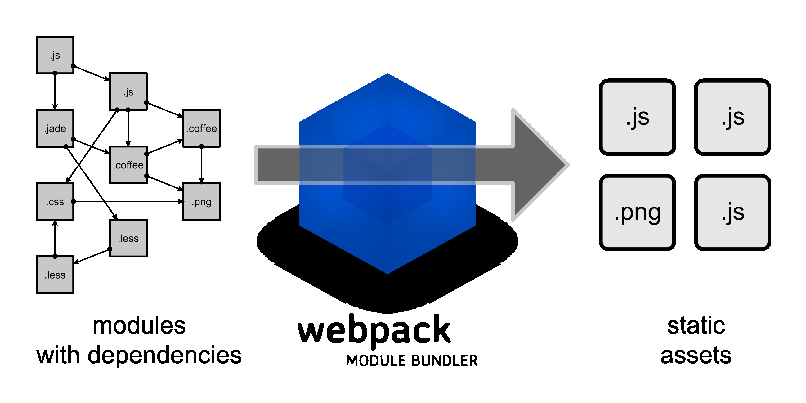

## ES6 入门

自学参考：[http://es6.ruanyifeng.com/](http://es6.ruanyifeng.com/ "http://es6.ruanyifeng.com/")

**ECMAScript 6.0（以下简称 ES6）是 JavaScript 语言的下一代标准**，已经在 2015 年 6 月正式发布了。它的目标，是使得 JavaScript 语言可以用来编写复杂的大型应用程序，成为企业级开发语言。

### ES6简介

####  ES6与JavaScript的关系

要讲清楚这个问题，需要回顾历史。1996 年 11 月，JavaScript 的创造者 Netscape 公司，决定将 JavaScript 提交给标准化组织 ECMA，希望这种语言能够成为国际标准。次年，ECMA 发布 262 号标准文件（ECMA-262）的第一版，规定了浏览器脚本语言的标准，并将这种语言称为 ECMAScript，这个版本就是 1.0 版。

因此，**ECMAScript 和 JavaScript 的关系是，前者是后者的规格，后者是前者的一种实现**（另外的 ECMAScript 方言还有 Jscript 和 ActionScript）

#### ES6与ES5的关系

2011 年，ECMAScript 5.1 版发布后，就开始制定 6.0 版了。因此，ES6 这个词的原意，就是指 JavaScript 语言的下一个版本。

ES6 的第一个版本，在 2015 年 6 月发布，正式名称是《ECMAScript 2015 标准》（简称 ES2015）。

2016 年 6 月，小幅修订的《ECMAScript 2016 标准》（简称 ES2016）如期发布，这个版本可以看作是 ES6.1 版，因为两者的差异非常小，基本上是同一个标准。根据计划，2017 年 6 月发布 ES2017 标准。 &#x20;

因此，**ES6 既是一个历史名词，也是一个泛指，含义是 5.1 版以后的 JavaScript 的下一代标准，涵盖了 ES2015、ES2016、ES2017 等等**，而**ES2015 则是正式名称**，**特指该年发布的正式版本的语言标准**。 本书中提到 ES6 的地方，一般是指 ES2015 标准，但有时也是泛指“下一代 JavaScript 语言”。

### 基本语法

ES标准中不包含 DOM 和 BOM的定义，只涵盖基本数据类型、关键字、语句、运算符、内建对象、内建函数等通用语法。

####  let声明变量

```javascript
// var 声明的变量没有局部作用域
// let 声明的变量  有局部作用域
{
var a = 0
let b = 1
}
console.log(a)  // 0
console.log(b)  // ReferenceError: b is not defined
```

```javascript
// var 可以声明多次
// let 只能声明一次
var m = 1
var m = 2
let n = 3
let n = 4
console.log(m)  // 2
console.log(n)  // Identifier 'n' has already been declared
```

> 📌 let 与 var的区别
> 1.  var声明的变量时全局成员变量，let声明的变量时局部变量
> 2.  var可以多次声明一个变量，let只能声明一次
> 3.  var在编译的过程中，会将声明语句提到最前面执行，let则不会提前，只是在使用位置声明

####  const声明常量

```javascript
<script>
	const PI = 3.14;
	// 常量在初始化完成赋值后不可以再次更改
	//PI = 3;
	console.log(PI);
</script>
```

> 📌cons常量
> 1.  声明后不允许改变
> 2.  一旦声明必须初始化，否则报错

#### 解构赋值

解构赋值是**对赋值运算符的扩展。**
他是一种针对数组或者对象进行模式匹配，然后对其中的变量进行赋值。
在代码书**写上简洁且易读，语义更加清晰明了**；也方便了复杂对象中数据字段获取。

```javascript
//传统的赋值
var a=1,b=2,c=3
console.log(a,b,c)

//解构数组赋值
let [x,y,z] = [1,2,3]
console.log(x,y,z)
```

```javascript
var user = {name:'zhang3',age:33}

//传统
var userName = user.name
var userAge = user.age
console.log(userName,userAge)

//解构 注意let中的属性命名要和对象中的一致
let{name,age} =user
console.log(name,age)
```

> 📌解构赋值
> 1.  赋值与被赋值的类型一致
> 2.  使用对象赋值时，赋值的对象的属性和被赋值的属性一致

#### 模板字符串

模板字符串相当于加强版的字符串，**用反引号 \`,除了作为普通字符串**，还可以用来定义多行字符串，还可以在字符串中加入变量和表达式。

```javascript
let str = 'hello'
let name = 'java201021'

 //拼接字符串 这种写法不好
console.log(str+' '+name+'!')
//模板字符串的拼接方法
console.log(`${str} ${name} !`)
```

```javascript
//定义长字符串
let head = `<head>
<meta charset="UTF-8">
<meta http-equiv="X-UA-Compatible" content="IE=edge">
<meta name="viewport" content="width=device-width, initial-scale=1.0">
<title>Document</title>
</head>`
console.log(head)
```

```javascript
//调用函数
function getName(){
    return 'aaaaaa'
}
console.log(`${name} ${getName()}`)
```

#### 声明对象简写

```javascript
let name = 'zahngsan3'
let age = 33

//原本的对象声明方式
let user = {name:name,age:age}
console.log(user)

//对象简写  （对象中的属性和属性名一致就可以简写）
let user2 = {name,age}
console.log(user2)
```

#### 定义方法简写

```javascript
<script>
  //这些是定义函数 不是定义方法
  function f1(){
      return 'f1'
  }
  let f2 = function(){
      return 'f2'
  }

  //定义方法 没有简写
  let user1 = {
      name:'zhang3',
      age:33,
      gethello1:function(){
          console.log(`hello ${this.name}`)
      }
  }
  user1.gethello1()

  //定义方法 简写
  let user2 = {
      name:'zhang3',
      age:33,
      gethello2(){
          console.log(`hello ${this.name}`)
      }
  }
  user2.gethello2()
</script>
```

#### 对象拓展运算符

拓展运算符（...）用于取出参数对象所有可遍历属性然后拷贝到当前对象。

```javascript
//拷贝对象
let user = {
    name:'zhang3',
    age:33
}

//这个和Java是一样的，只是将user1指向User的空间地址
let user1 = user
console.log(user1)

//使用对象拓展运算符
//这个是将原有的user空间复制一份，然后再让user2指向这个新空间
let user2 = {test:'aaaaa',...user}
console.log(user2)
```

```javascript
//2  合并对象
let name = {name:'li4'}
let age = {age:44}
let user3 = {...name,...age}
console.log(user3)

//注意：合并对象时属性名不能一样，否则会出现后面的覆盖前面的内容
let user4 = {...user1,...user3}
console.log(user4)
```

#### 箭头函数

箭头函数提供了一种更加简洁的函数书写方式。基本语法是：

**参数 => 函数体**

```javascript
let f1 = function(a){
    return a
}
console.log(f1(100))

//完整写法
let f2 = (a)=>{
    return a
}
console.log(f2(200))

//如果只有一个参数 可以省略小括号，多个参数不可以省略
let f3 = a=>{
    return a
}
console.log(f3(300))

//如果内部直接时返回值，且只有一行 可以省略大括号和return，多行不可以省略
let f4 = a => a
console.log(f4(400))
```

箭头函数多用于匿名函数的定义

## Node 入门

###  简介

#### 什么是Node.js

简单的说 Node.js 就是运行在服务端的 JavaScript。

Node.js是一个事件驱动I/O服务端JavaScript环境，基于Google的V8引擎，V8引擎执行Javascript的速度非常快，性能非常好。

####  Node.js的作用

如果你是一个前端程序员，你不懂得像PHP、Python或Ruby等动态编程语言，然后你想创建自己的服务，那么Node.js是一个非常好的选择。

Node.js 是运行在服务端的 JavaScript，如果你熟悉Javascript，那么你将会很容易的学会Node.js。

当然，如果你是后端程序员，想部署一些高性能的服务，那么学习Node.js也是一个非常好的选择。

###  部署Node.js

-   下载
    官网：[https://nodejs.org/en/](https://nodejs.org/en/ "https://nodejs.org/en/")
    中文网：[http://nodejs.cn/](http://nodejs.cn/ "http://nodejs.cn/")
    LTS：长期支持版本
    Current：最新版
-   安装 : 不要安装到中文目录其他默认即可
-   查看版本 : `node -v`

### Node.js快速入门

快速发开一个简单的Node.js小程序

#### 控制台程序

-   创建 01-控制台程序.js : `console.log('Hello Node.js')`
-   打开命令行终端：`Ctrl + Shift + y`
-   进入到程序所在的目录，输入 : `node 01-控制台程序.js`

浏览器的内核包括两部分核心：
-   DOM渲染引擎；
-   js解析器（js引擎）
-   js运行在浏览器中的内核中的js引擎内部 

Node.js是脱离浏览器环境运行的JavaScript程序，基于V8 引擎（Chrome 的 JavaScript的引擎）

#### 服务端程序

创建 02-server-app.js

```javascript
const http = require('http');
http.createServer(function (request, response) {
	// 发送 HTTP 头部 
	// HTTP 状态值: 200 : OK
	// 内容类型: text/plain
	response.writeHead(200, {'Content-Type': 'text/plain'});
	// 发送响应数据 "Hello World"
	response.end('Hello Server');
}).listen(8888);
// 终端打印如下信息
console.log('Server running at http://127.0.0.1:8888/');
```

运行服务器程序

```javascript
node 02-server-app.js
```

服务器启动成功后，在浏览器中输入：[http://localhost:8888/](http://localhost:8888/ "http://localhost:8888/") 查看webserver成功运行，并输出html页面

停止服务：`ctrl + c`

### NPM

#### 什么是NPM

NPM全称Node Package Manager，是Node.js包管理工具，是全球最大的模块生态系统，里面所有的模块都是开源免费的；也是Node.js的包管理工具，相当于前端的Maven 。

我们通过npm 可以很方便地下载js库，管理前端工程。

Node.js默认安装的npm包和工具的位置：`Node.js目录\node_modules`

在这个目录下你可以看见 npm目录，npm本身就是被NPM包管理器管理的一个工具，说明 Node.js已经集成了npm工具

```bash
#在命令提示符输入 npm -v 可查看当前npm版本
npm -v
```

#### 使用NPM管理项目

##### 项目初始化

```bash
#建立一个空文件夹，在命令提示符进入该文件夹  执行命令初始化
npm init
#按照提示输入相关信息，如果是用默认值则直接回车即可。
#name: 项目名称
#version: 项目版本号
#description: 项目描述
#keywords: {Array}关键词，便于用户搜索到我们的项目
#最后会生成package.json文件，这个是包的配置文件，相当于maven的pom.xml
#我们之后也可以根据需要进行修改。
```

```bash
#如果想直接生成 package.json 文件，那么可以使用命令
npm init -y
```

##### 修改npm镜像

NPM官方的管理的包都是从 [http://npmjs.com](http://npmjs.com "http://npmjs.com")下载的，但是这个网站在国内速度很慢。

这里推荐使用淘宝 NPM 镜像 [http://npm.taobao.org/](http://npm.taobao.org/ "http://npm.taobao.org/") ，淘宝 NPM 镜像是一个完整 [npmjs.com](http://npmjs.com "npmjs.com") 镜像，同步频率目前为 10分钟一次，以保证尽量与官方服务同步。

```bash
#经过下面的配置，以后所有的 npm install 都会经过淘宝的镜像地址下载
npm config set registry https://registry.npm.taobao.org 

#查看npm配置信息
npm config list
```

##### npm install命令的使用

```bash
#使用 npm install 安装依赖包的最新版，
#模块安装的位置：项目目录\node_modules
#安装会自动在项目目录下添加 package-lock.json文件，这个文件帮助锁定安装包的版本
#同时package.json 文件中，依赖包会被添加到dependencies节点下，类似maven中的 <dependencies>
npm install jquery


#npm管理的项目在备份和传输的时候一般不携带node_modules文件夹
npm install #根据package.json中的配置下载依赖，初始化项目


#如果安装时想指定特定的版本
npm install jquery@2.1.x


#devDependencies节点：开发时的依赖包，项目打包到生产环境的时候不包含的依赖
#使用 -D参数将依赖添加到devDependencies节点
npm install --save-dev eslint
#或
npm install -D eslint


#全局安装
#Node.js全局安装的npm包和工具的位置：用户目录\AppData\Roaming\npm\node_modules
#一些命令行工具常使用全局安装的方式
npm install -g webpack
```

##### 其他命令

```bash
#更新包（更新到最新版本）
npm update 包名
#全局更新
npm update -g 包名

#卸载包
npm uninstall 包名
#全局卸载
npm uninstall -g 包名
```

### Babel

Babel是一个广泛使用的转码器，可以将ES6代码转为ES5代码，从而在现有环境执行执行。

这意味着，你可以现在就用 ES6 编写程序，而不用担心现有环境是否支持。

#### 安装

```bash
npm install --global babel-cli

#查看是否安装成功
babel --version
```

#### 使用

初始化项目

```bash
npm init -y
```

创建配置文件`.babelrc`

```bash
{
    "presets": [],
    "plugins": []
}
```

安装转码器

```bash
npm install --save-dev babel-preset-es2015
```

转码

```bash
# 转码结果写入一个文件
mkdir dist1

# --out-file 或 -o 参数指定输出文件
babel src/example.js --out-file dist1/compiled.js
# 或者
babel src/example.js -o dist1/compiled.js

# 整个目录转码
mkdir dist2
# --out-dir 或 -d 参数指定输出目录
babel src --out-dir dist2
# 或者
babel src -d dist2
```

### 模块化

#### 简介

随着网站逐渐变成"互联网应用程序"，嵌入网页的Javascript代码越来越庞大，越来越复杂。


Javascript模块化编程，已经成为一个迫切的需求。理想情况下，开发者只需要实现核心的业务逻辑，其他都可以加载别人已经写好的模块。

但是，Javascript不是一种模块化编程语言，它不支持"类"（class），包（package）等概念，更遑论"模块"（module）了。

#### CommonJS模块规范

每个文件就是一个模块，有自己的作用域。在一个文件里面定义的变量、函数、类，都是私有的，对其他文件不可见。

**CommonJS使用 exports 和require 来导出、导入模块。**

##### 导出模块

定义文件 1.js

```javascript
// 定义成员：
const sum = function(a,b){
    return parseInt(a) + parseInt(b)
}
const subtract = function(a,b){
    return parseInt(a) - parseInt(b)
}
const multiply = function(a,b){
    return parseInt(a) * parseInt(b)
}
const divide = function(a,b){
    return parseInt(a) / parseInt(b)
}

// 导出成员
module.exports = {
    sum,
    subtract,
    multiply,
    divide
}
```

##### 导入模块

定义文件2.js

```javascript
//引入模块  注意当前路径必须写./
const m = require('./1.js')
console.log(m);

const result1 = m.sum(1,2)
const result2 = m.subtract(1,2)
console.log(result1,result2);
```

##### 运行程序

```javascript
node common-js模块化/引入模块.js
```

#### ES6模块规范

**ES6使用 export 和 import 来导出、导入模块。**

>  注意：这时的程序无法运行的，因为ES6的模块化无法在Node.js中执行，需要用Babel编辑成ES5后再执行。

##### 导出模块

定义文件 1.js

```javascript
export function getList() {
    console.log('获取数据列表')
}

export function save() {
    console.log('保存数据')
}
```

##### 导入模块

定义文件2.js

```javascript
//只取需要的方法即可，多个方法用逗号分隔
import { getList, save } from "./1.js"
getList()
save()
```

#### ES6模块规范另一种写法

**ES6使用 export 和 import 来导出、导入模块。**

> 注意：这时的程序无法运行的，因为ES6的模块化无法在Node.js中执行，需要用Babel编辑成ES5后再执行

##### 导出模块

定义文件 1.js

```javascript
export default {
    getList() {
        console.log('获取数据列表2')
    },
    save() {
        console.log('保存数据2')
    }
}
```

##### 导入模块

定义文件2.js

```javascript
//只取需要的方法即可，多个方法用逗号分隔
import user from "./1.js"
user.getList()
user.save()
```

### webpack

Webpack 是一个前端资源加载/打包工具。它将根据模块的依赖关系进行静态分析，然后将这些模块按照指定的规则生成对应的静态资源。

从图中我们可以看出，Webpack 可以将多种静态资源 js、css、less 转换成一个静态文件，减少了页面的请求。



#### 安装

全局安装  ： ` npm install -g webpack webpack-cli`
安装后查看版本号  ：  `webpack -v`

#### Demo演示

##### 打包JS

-   创建一个文件夹webpack，并进入文件夹
-   初始化项目  ： `npm init -y`
-   在文件夹中创建src目录，并在src中创建以下文件
	创建common.js
	```javascript
	exports.info = function (str) {
		document.write(str);
	}
	```
	创建utils.js
	```javascript
	exports.add = function (a, b) {
		return a + b;
	}
	```
	
	创建main.js
	```javascript
	const common = require('./common');
	const utils = require('./utils');
	common.info('Hello world!' + utils.add(100, 200));
	```
	
	在webpack目录下创建配置文件 `webpack.config.js`
	
	以下配置的意思是：读取当前项目目录下src文件夹中的main.js（入口文件）内容，分析资源依赖，把相关的js文件打包，打包后的文件放入当前目录的dist文件夹下，打包后的js文件名为bundle.js
	```javascript
	const path = require("path"); //Node.js内置模块
	module.exports = {
		entry: './src/main.js', //配置入口文件
		output: {
			path: path.resolve(__dirname, './dist'), //输出路径，__dirname：当前文件所在路径
			filename: 'bundle.js' //输出文件
		}
	}
	```
-   执行编译命令
    以下配置的意思是：读取当前项目目录下src文件夹中的main.js（入口文件）内容，分析资源依赖，把相关的js文件打包，打包后的文件放入当前目录的dist文件夹下，打包后的js文件名为bundle.js
	```bash
	webpack #有黄色警告
	webpack --mode=development #没有警告
	#执行后查看bundle.js 里面包含了上面两个js文件的内容并惊醒了代码压缩
	```
    也可以配置项目的npm运行命令，修改package.json文件
    ```javascript
    "scripts": {
        //...,
        "dev": "webpack --mode=development"
     }
    ```
    使用npm打包：`npm run dev`

##### 打包CSS

-   安装`style-loader`和 `css-loader`
    Webpack 本身只能处理 JavaScript 模块，如果要处理其他类型的文件，就需要使用 loader 进行转换。
    Loader 可以理解为是模块和资源的转换器。
    首先我们需要安装相关Loader插件，css-loader 是将 css 装载到 javascript；style-loader 是让 javascript 认识css
    ```bash
    npm install --save-dev style-loader css-loader 
    ```
-   修改`webpack.config.js`
    注意，这个demo是在上面的基础上继续完成的，需要在 `output:{},`下增加 `module:` 标签并配置其中的属性
    ```javascript
    const path = require("path"); //Node.js内置模块
    module.exports = {
        //...,
        output:{},
        module: {
            rules: [  
                {  
                    test: /\.css$/,    //打包规则应用到以css结尾的文件上
                    use: ['style-loader', 'css-loader']
                }  
            ]  
        }
    }
    ```
-   在src中配置style.css文件
    注意，这个demo是在上面的基础上继续完成的，需要在 `output:{},`下增加 `module:` 标签并配置其中的属性
    ```javascript
    body{
        background:pink;
    }
    ```
-   修改main.js
    在第一行引入style.css
    ```javascript
    require('./style.css');
    ```
-   重新执行打包程序