## v-if

`v-if` 的作用是通过一个布尔表达式进行对dom的上树和下树的渲染

### 基本使用

```html
<p v-if="false">我是第一行dom元素</p>
<p v-if="true">我是第二行dom元素</p>

```

我们工作中不是使用布尔值直接进行渲染，而是通过data带有布尔值的进行渲染

```html
<body>
    <div id="app">
      <h1>{{number}}</h1>
      <!-- 基本使用 -->
      <p v-if="number">我是第一行dom元素</p>
      <p v-if="number">我是第二行dom元素</p>
    </div>
</body>
<script>
    new Vue({
      el: '#app',
      data: {
        number:true
      },
      methods:{
      }
    })
  </script>

```

### 使用表达式

`v-if`的显示根本原理一个是通过对值的隐式转换，一个就是通过对表达式的判断得出的布尔值得来的

```html
<body>
    <div id="app">
      <h1>{{number}}</h1>
      <!-- 逻辑判断 -->
      <p v-if="number<5">当前数值小于5</p>
      <p v-if="number>5 && number<10">当前数值大于5,小于10</p>
      <p v-if="number>10 && number<15">当前数值大于10,小于15</p>
      <p v-if="number>15">当前数值大于15</p>
      <button @click="add()">加1</button>
      <button @click="reduce()">减1</button>
    </div>
</body>
<script>
    new Vue({
      el: '#app',
      data: {
        number:0
      },
      methods:{
        add(){
          this.number++;
        },
        reduce(){
          this.number--;
        }
      }
    })
  </script>

```

### 使用v-else-if 和 v-else

```html
<body>
    <div id="app">
      <h1>{{number}}</h1>
      <!-- v-if -  v-else-if - v-else -->
      <p v-if="number<5">当前数值小于5</p>
      <p v-else-if="number>5 && number<10">当前数值大于5,小于10</p>
      <p v-else-if="number>10 && number<15">当前数值大于10,小于15</p>
      <p v-else>当前数值大于15</p>
      <button @click="add()">加1</button>
      <button @click="reduce()">减1</button>
    </div>
</body>
<script>
    new Vue({
      el: '#app',
      data: {
        number:0
      },
      methods:{
        add(){
          this.number++;
        },
        reduce(){
          this.number--;
        }
      }
    })
  </script>

```

需要注意的是v-else的使用前提是**必须先有v-if并且中间不允许有任何的元素间隔**

```html
<p v-if='boo >= 0 && boo <= 5'>我是5</p>
<div></div>
<p v-else="boo > 20">我是大于20</p>
```

上述是错误的写法

## v-show

### 基本使用

v-show和v-if的显示情况类似，但是原理不一样，v-show是通过控制元素的display属性，对元素的显示和隐藏进行逻辑判断，并没有实现元素的删除

```html
  <body>
    <div id="app">
      <p v-show="flag">测试</p>
    </div>
  </body>
  <script>
    new Vue({
      el:'#app',
      data:{
        flag:false
      }
    })
  </script>
```

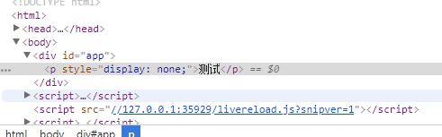

### v-show和v-if的使用场景区分

如果**页面切换的特别频繁使用v-show**

如果**页面的涉及范围特别大并且不是特别频繁的切换使用v-if**，因为主要区分是涉及到页面的加载性能

## v-for

v-for是vue 的循环指令，作用是遍历数组（对象）的每一个值

### 基本使用

```html
<body>
  <div id="app">
    <li v-for="item in arr">{{item}}</li>
  </div>
</body>
<script type="text/javascript">
  new Vue({
    el:'#app',
    data:{
      arr:[
          '苹果',
          '橘子',
          '香蕉',
          '草莓'
        ]
    }
  })
</script>
```

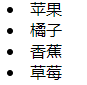

### index和key属性

-   `item`指的是被遍历的数组（对象）的每一个值，item的命名不是规定的，可以自定义命名
-   `index`指的是每一项被遍历的值的下标索引值
-   `key`是用来给每一项值加元素标识，作用是为了区分元素，为了实现最小量的更新

```html
<body>
  <div id="app">
    <li v-for="(item,index) in arr" :key="index">{{item}}-{{index}}</li>
  </div>
</body>
<script type="text/javascript">
  new Vue({
    el:'#app',
    data:{
      arr:[
          '苹果',
          '橘子',
          '香蕉',
          '草莓'
        ]
    }
  })
</script>
```

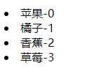

### 遍历对象

-   `item`表示对象的内容，
-   `key`表示的是对象key键值名称
-   `index`表示的是当前obj的下标索引值

```html
<body>
    <div id="app">
      <li v-for="(item,key,index) in obj" :key="index">{{index}}-{{key}}:{{item}}</li>
    </div>
  </body>
  <script type="text/javascript">
    new Vue({
      el:'#app',
      data:{
        obj:{
          name: '小明',
          age: '17岁',
          height: '175cm',
          sex: '男',
          hobby: '打篮球'
        }
      }
    })
  </script>
```

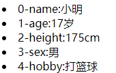

### 遍历Json

实际工作中我们使用v-for遍历JSON更多一点
-   `item`指的是被遍历的Json（对象）的每一个对象
-   `index`指的是每一项被遍历的值的下标索引值

```html
<body>
    <div id="app">
      <table border="1px">
        <th>序号</th>
        <th>姓名</th>
        <th>年龄</th>
        <th>性别</th>
        <th>身高</th>
        <tr v-for="(item,index) in student">
          <td>{{index}}</td>
          <td>{{item.name}}</td>
          <td>{{item.age}}</td>
          <td>{{item.sex}}</td>
          <td>{{item.height}}</td>
        </tr>
      </table>
    </div>
  </body>
  <script type="text/javascript">
    new Vue({
      el:'#app',
      data:{
        student: [
            {name:'小明',age: '17',sex:'男',height: '168'},
            {name:'小红',age: '18',sex:'女',height: '165'},
            {name:'小周',age: '19',sex:'男',height: '178'},
            {name:'小刚',age: '20',sex:'男',height: '167'}
          ]
      }
    })
  </script>
```

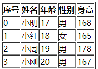

### 多层嵌套

实际工作中我们使用v-for遍历JSON更多一点
-   `item`指的是被遍历的Json（对象）的每一个对象
-   `index`指的是每一项被遍历的值的下标索引值

```html
<body>
    <div id="app">
      <table border="1px">
        <tr v-for="i in number" :key="i">
          <td v-for="j in i" :key="j">{{i}}*{{j}}={{i*j}}</td>
        </tr>
      </table>
    </div>
  </body>
  <script type="text/javascript">
    new Vue({
      el:'#app',
      data:{
        number:[1,2,3,4,5,6,7,8,9]
      }
    })
  </script>
```

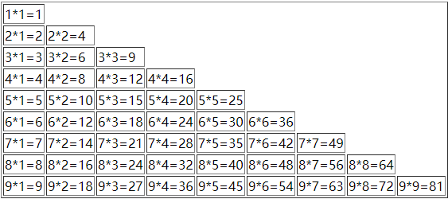

### 注意事项

-   v-for遍历的出来的不是数据，而是元素
-   如果使用item和index的时候一定要使用括号包裹起来 `(item,index) in arr`

## v-html和v-text

v-html和v-text都是渲染文本的指令，使用场景会有不同

### v-text

`双大括号{{}}`和`v-text`渲染结果类似，都是会以文本类型进行渲染

```html
<div id="app">
  <p>----{{name}}----</p>
  <p v-text="name">-------</p>
</div>
<body>
</body>
<script type="text/javascript">
  new Vue({
    el:'#app',
    data:{
      name:'张三'
    }
  })
</script>
```

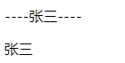

-   双大括号在渲染结果之前，会有编译之前的文本显示，v-text是没有这种现象的
-   双大括号更灵活，中间是可以添加内容的，v-text是只能渲染data中的数据，中间不允许插入内容

### v-html

双大括号和v-text它俩的渲染方式和v-html有本质不同，v-html会识别模板

```html
<div id="app">
  <p v-text="code"></p>
  <p v-html="code"></p>
  <p v-html="code">---</p>
</div>
<body>
</body>
<script type="text/javascript">
  new Vue({
    el:'#app',
    data:{
      code:'<h1>aaa</h1>'
    }
  })
</script>
```

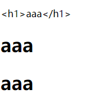

和v-text类似的是v-html也不允许在元素中间随意插值

## v-cloak

v-cloak指令的作用是vue示例渲染后关联结束

### 为什么使用v-cloak

双大括号插值语法在遇到网络延迟的时候会显示编译之前的文本

```html
<body>
  <div id="app">
    <p>{{a}}</p>
  </div>
</body>
<script type="text/javascript">
  new Vue({
    el:'#app',
    data:{
      a:'我是渲染的指令-v-cloak'
    }
  })
</script>
```

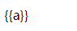

我们可以使用v-cloak结合CSS解决双大括号渲染的难题

### 基本使用

我们可以使用v-cloak结合CSS解决双大括号渲染的难题

```html
<style>
  [v-cloak]{
    display: none;
  }
</style>
<body>
  <div id="app" v-cloak>
    <p>{{a}}</p>
  </div>
</body>
<script type="text/javascript">
  new Vue({
    el:'#app',
    data:{a
      a:'我是渲染的指令-v-cloak'
    }
  })
</script>
```

`[v-cloak] css选择器选择的是html结构中有v-cloak的属性`，有这个属性的元素设置display为none，又由于v-cloak这个属性在vue的实例加载完之后关联结束，所以就需要了这个元素的隐藏状态，元素就会显示，这样造成的结果就是要么空白，要么显示编译后的文本

## v-once

v-once的作用是只会渲染对应元素一次，数据更新不会引起视图的更新，目的是为了优化页面的性能

### 基本使用

```html
  <body>
    <div id="app">
      <p v-once>{{number}}</p>
      <button @click="add()">+1</button>
      <button @click="reduce()">-1</button>
    </div>
  </body>
  <script type="text/javascript">
    new Vue({
      el:'#app',
      data:{
        number:0
      },
      methods:{
        add(){
          this.number++;
          console.log(this.number);
        },
        reduce(){
          this.number--;
          console.log(this.number);
        }
      }
    })
  </script>
```

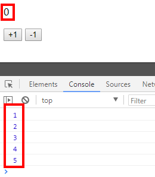

### 使用场景

通常是没有动态的元素内容，比如一些文章，一些固定标题

## v-pre

v-pre属性的作用是跳过该元素编译过程，直接显示元素内部的文本，特点就是跳过大量的没有指令的节点

### 基本使用

```html
  <body>
    <div id="app">
      <p v-pre>{{title}}</p>
    </div>
  </body>
  <script type="text/javascript">
    new Vue({
      el:'#app',
      data:{
        title:'文章'
      }
    })
  </script>
```

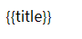

### 使用场景

优化页面的加载性能

## v-on

v-on的作用是给元素添加事件监听，可以简写为@

我们学习的JavaScript的元素的事件监听都可以在vue中使用: [事件](https://www.wolai.com/apYRECmGCdb2fck6ujikWr.md "事件")

对于原生的JavaScript的事件,我们在Vue中使用都是**一律去除on，然后 添加v-on：或者@**

例如:&#x20;

```html
<button onclick="add()">点击加1</button>
<button @click="add">点击加1</button>
<button v-on:click="minus">点击减1</button>
```

### 基本使用

```html
  <body>
    <div id="app">
      <button @click="say">点我Say Hello</button>
    </div>
  </body>
  <script type="text/javascript">
    new Vue({
      el:'#app',
      data:{
        
      },
      methods:{
        say(){
          alert("你好")
        }
      }
    })
  </script>
```

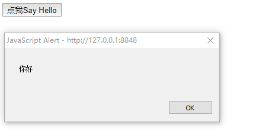

### 注意事项

需要注意的是所有的方法都 必须写在vue的methods中，不允许在外部罗列方法名称

原生的JavaScript的事件方法是不能和vue混用的

同名方法会有覆盖情况，后写方法会覆盖先写的方法

方法中是可以传入参数的,如果方法中没有传入值，默认输入会有该方法的事件参数

## v-bind

v-bind属性的作用是将普通的w3c属性变为动态属性，让属性具有动态能力

### 基本使用

```sql
<body>
  <div id="app">
    <!-- 使用动态属性之前 -->
    
    <br />
    <!-- 使用动态属性 -->
    
    <br />
    
  </div>
</body>
<script type="text/javascript">
  new Vue({
    el:'#app',
    data:{
      name:'java'
    },
    methods:{
      
    }
  })
</script>

```

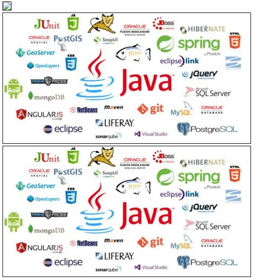

> 我们发现:上面的图片是加载不出来的，因为如果没有使用动态属性，会将编译之前的属性参数直接抛出.使用动态属性后,此时vue会编译带有v-bind的属性，然后返回编译后结果


### 动态Class

```sql

  <style type="text/css">
  p {
    height: 50px;
    width: 50px;
    background-color: #1E7E34;
  }
  .red {
    background-color: red;
  }
  .pink {
    background-color: pink;
  }
</style>
<body>
  <div id="app">
    <p :class="{red: number>=5&& number<10,pink: number>=10}">{{number}}</p>
    <button @click="add()">+1</button>
    <button @click='reduce()'>-1</button>
    <P :style="{width:100+number+'px'}"></p>
  </div>
</body>
<script type="text/javascript">
  new Vue({
    el:'#app',
    data:{
      number:0
    },
    methods:{
      add(){
        this.number++;
      },
      reduce(){
        this.number--;
      }
    }
  })
</script>

```

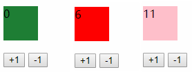

### 动态Style

```sql
<body>
  <div id="app">
    <!-- 使用动态属性之前 -->
    
    <br />
    <!-- 使用动态属性 -->
    
    <br />
    
  </div>
</body>
<script type="text/javascript">
  new Vue({
    el:'#app',
    data:{
      name:'java'
    },
    methods:{
      
    }
  })
</script>

```

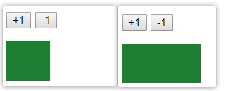

## v-model

v-model属性是使用在表单元素中的，作用是实现表单和数据的双向绑定.  我们说过vue是mvvm框架，**vue的核心之一就是双向数据绑定**

### 基本使用

```sql
<body>
  <div id="app">
    <input type="text" v-model="name" />
    <p>我的名字是:{{name}}</p>
  </div>
</body>
<script type="text/javascript">
  new Vue({
    el:'#app',
    data:{
      name:'张三'
    }
  })
</script>
```

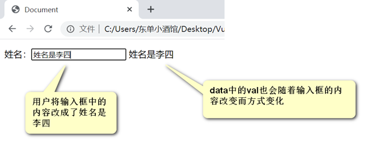
