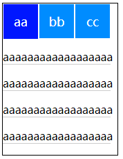
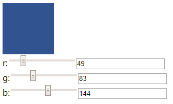
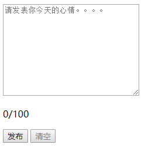

## 选项卡

### 效果



### 代码

```html
<!DOCTYPE html>
<html>
  <head>
    <meta charset="utf-8">
    <title></title>
    <script src="js/vue.js"></script>
  </head>
  <style type="text/css">
    #app{
      display: block;
      width: 166px;
      border: 1px solid black;
    }
    .head{
      width: 156px;
      height: 50px;
      font-size: 18px;
      line-height: 50px;
      background-color: #008cff;
    }
    .head span{
      display: block;
      float: left;
      color: white;
      text-align: center;
      width: 50px;
      border: 1px solid white;
    }
    .cur {
      color: black;
      background-color: #0017ff;
    }
    .content p{
      display: block;
      width: 156px;
      border-bottom: 1px solid #ccc;
    }
  </style>
  <body>
    <div id="app">
      <div class="head">
        <span :class="{cur:curState == index}" v-for="(item,index) in title" @mouseenter="displayState(index)">{{item}}</span>
      </div>
      <div class="content" v-show="curState == 0">
              <p>aaaaaaaaaaaaaaaaaa</p>
              <p>aaaaaaaaaaaaaaaaaa</p>
              <p>aaaaaaaaaaaaaaaaaa</p>
              <p>aaaaaaaaaaaaaaaaaa</p>
      </div>
      <div class="content" v-show="curState == 1">
              <p>bbbbbbbbbbbbbbbb</p>
              <p>bbbbbbbbbbbbbbbb</p>
              <p>bbbbbbbbbbbbbbbb</p>
              <p>bbbbbbbbbbbbbbbb</p>
      </div>
      <div class="content" v-show="curState == 2">
              <p>ccccccccccccccccccc</p>
              <p>ccccccccccccccccccc</p>
              <p>ccccccccccccccccccc</p>
              <p>ccccccccccccccccccc</p>
      </div>
    </div>
  </body>
  <script type="text/javascript">
    new Vue({
      el:'#app',
      data:{
        title:['aa','bb','cc'],
        curState:0
      },
      methods:{
        displayState(index){
          this.curState = index
        }
      }
    })
  </script>
</html>

```

## 调色板

### 效果



### 代码

```html
<!DOCTYPE html>
<html>
  <head>
    <meta charset="utf-8">
    <title></title>
    <script src="js/vue.js"></script>
  </head>
  <style type="text/css">
    .pickers{
      display: block;
      width: 100px;
      height: 100px;
      border: 1px black;
    }
  </style>
  <body>
    <div id="app">
      <div class="pickers" :style="{background:'rgb('+r+','+g+','+b+')'}"></div>
      r:<input max="255" min="0" type="range" v-model="r"/><input max="255" min="0" type="text" v-model="r"/>
      <br />
      g:<input max="255" min="0" type="range" v-model="g"/><input max="255" min="0" type="text" v-model="g"/>
      <br />
      b:<input max="255" min="0" type="range" v-model="b"/><input max="255" min="0" type="text" v-model="b"/>
    </div>
  </body>
  <script type="text/javascript">
    new Vue({
      el:'#app',
      data:{
        r:0,
        g:0,
        b:0
      }
    })
  </script>
</html>
```

## 消息框

### 效果



### 代码

```html
<!DOCTYPE html>
<html>
  <head>
    <meta charset="utf-8">
    <title></title>
    <script src="js/vue.js"></script>
    <style type="text/css">
      .warn{
        color: red;
      }
    </style>
  </head>
  <body>
    <div id="app">
      <textarea v-model='content' cols="30" rows="10" placeholder="请发表你今天的心情。。。。"></textarea>
      <!-- warn生效机制：当内容的数量大于100的时候，渲染文字为红色 -->
          <p :class="{warn: content.length > 100}">{{content.length}}/100</p>
          <p>
              <!-- disabled生效机制：当内容的数量大于100的时候，不能点击 -->
              <button :disabled="content.length > 100">发布</button>
              <!-- disabled生效机制：当内容的小于等于0的时候，不能点击 -->
              <button @click="clear" :disabled="content.length <= 0">清空</button>
          </p>

    </div>
  </body>
  <script type="text/javascript">
    new Vue({
      el:'#app',
      data:{
        content:""
      },
      methods:{
        clear(){
          this.content=""
        }
      }
    })
  </script>
</html>
```
