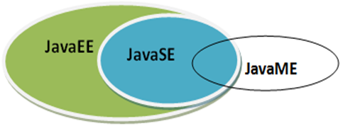
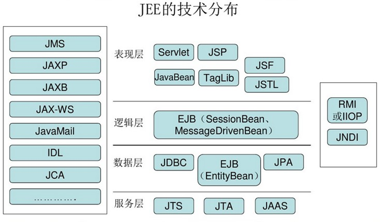
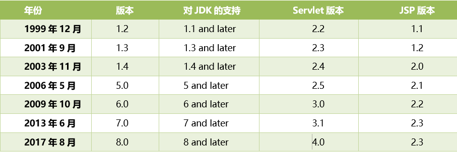

## 什么是JavaEE

`JavaEE（Java Enterprise Edition）`，Java企业版，是一个用于企业级web开发平台。最早由Sun公司定制并发布，后由Oracle负责维护。JavaEE平台规范了在开发企业级web应用中的技术标准.

在JavaEE平台共包含了13个技术规范（随着JavaEE版本的变化所包含的技术点的数量会有增多）。它们分别是：JDBC、JNDI、EJB、RMI、Servlet、JSP、XML、JMS、Java IDL、JPA、JTA、JavaMail和JAF。&#x20;

## JavaEE的技术分布

## JavaEE的版本变化

## JavaEE应用服务器（JavaEE Application Server）

应用服务器是Java EE规范的具体实现, 可以执行/驱动基于JavaEE平台开发的web项目。绝大部分的应用服务器都是付费产品。

常见的应用服务：
- Weblogic（BEA Oracle 收费）
- Webshpere（IBM 收费）
- JBoss（RedHad 收费）
- Resin（Caucho 收费）
- JRun（Macromedia 收费）

## Web容器（Web Server）

- Geronimo（Apache 免费）
- 只实现了JavaEE平台下部分技术标准，如Servlet，Jsp，JNDI，JavaMail。Web容器是开源免费的。
- Tomcat（Apache 开源免费）
- Jetty（Jetty 开源免费）
