## 初识JavaWeb目录结构

### 基本结构

-   project项目的根目录
-   静态资源文件/jsp
    -   lib jar包目录
    -   classes java字节码目录
    -   web.xml项目的配置文件
    -   其他资源

### 层级关系

层级关系一

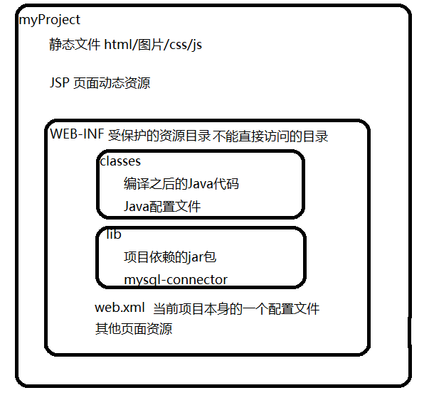

层级关系二

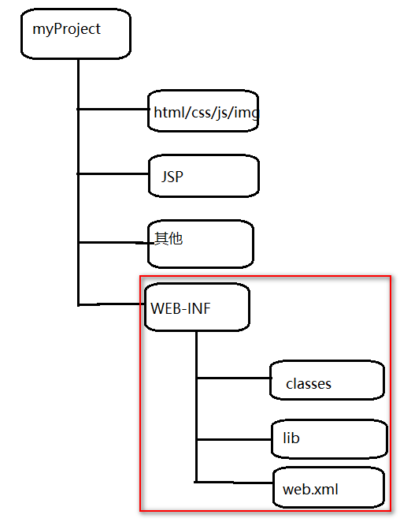

## 使用IDEA开发JavaWeb

### 创建工程

1.  选择Java Enterprise&#x20;
    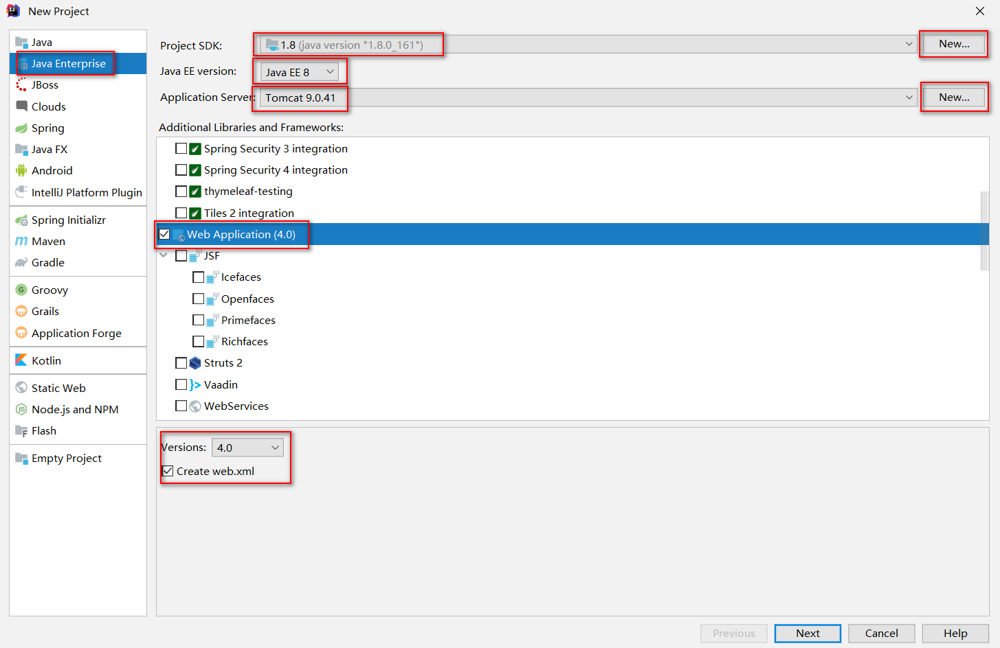
    1.  Project SDK选项  推荐 1.8  如果没有SDK 可以通过后面的  NEW按钮选择自己的JDK安装路径即可 (注意选择的是bin的上一层)
    2.  Java EE version   推荐JAVA EE 8
    3.  Application Server 关联Tomcat容器,如果没有, NEW按钮选择自己的Tomcat安装路径即可  (注意选择的是bin的上一层)
    4.  Additional Libraries and Freameworks 中 必须勾选 Web Applicaiton(4.0)选项 同时注意 create web.xml勾选上
2.  自定义项目名,项目存放路径中注意不要出现 双 \ 和特殊符号中文空格等
    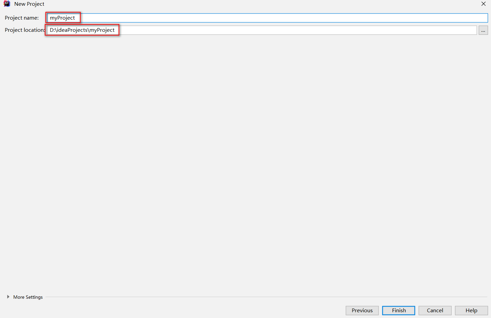

### 目录结构

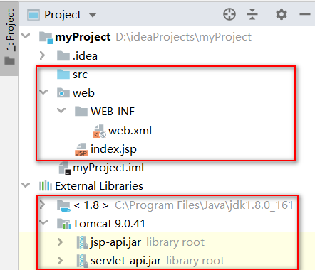

`src目录`  : 用于定义Java源代码
`web目录`  :  中用于存放一些页面资源( 如果上一步没有勾选Web Applicaiton(4.0)选项),则不会出现web目录
`External Libraries `  :  中要出现 JDK1.8 和Tomcat jsp-api和servlet-api 才可以正常编写JAVAWEB项目

## 使用IDEA运行项目

启动项目之前,先对项目进行配置

-   点击Edit Configurations 对项目进行启动之前的配置
    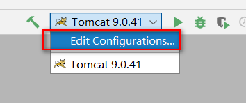
-   检查项目配置
    Deployment选项
    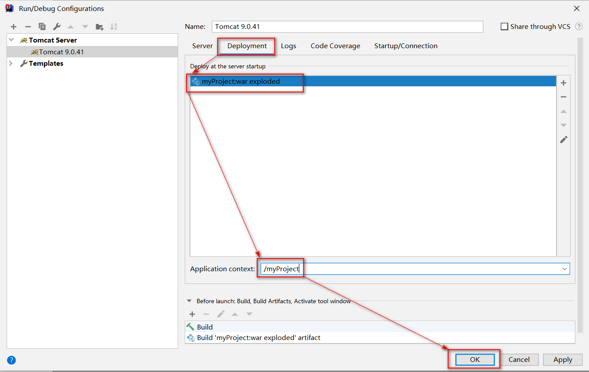

    在Deployment中,  Deployed at the server startup里确认要部署的项目是不是我们要运行的项目
    在Application context中指定我们项目访问的路径名
    idea默认是 项目名+"`_war_exploded`",在这里我们可以对项目的访问名进行修改,如果不修改,也OK,可以一样使用
    Server选项
    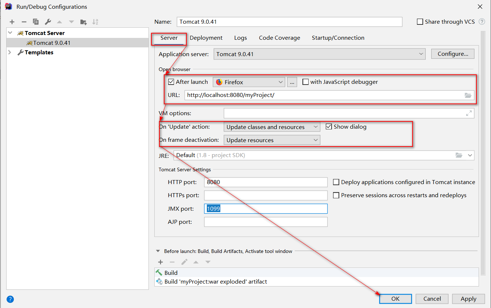

    **勾选Open browser中的After launch选项**. 这样idea在启动项目之后可以自动帮助我们打开浏览器并访问URL中的资源
    **On Update action : 当代码改变的时候，需要IDEA为你做什么**；选项选为 Update classes and resources ,意义为:更新字节码和其他资源
    **On Frame deactivation : 当失去焦点（比如你最小化了IDEA窗口），需要IDEA为你做什么**。选项. 选为 Update resources ,意义为:更新其他资源
    HTTP port 默认为8080 不用修改
    JMX  port 默认为 1099 不用修改
-   然后点击运行启动即可
    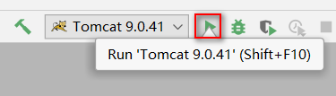

## 使用IDEA部署项目

### 第一种\[默认]

在Idea中默认的并不会把web项目真正的部署到Tomcat的webapps目录中，而是通过为每个web项目创建一个独立的Tomcat副本并在Tomcat副本中通过的Tomcat的Context组件完成项目的目录指定，在Context组件的docBase属性中会指定Idea对web项目编译后的目录out/artifacts/.....。

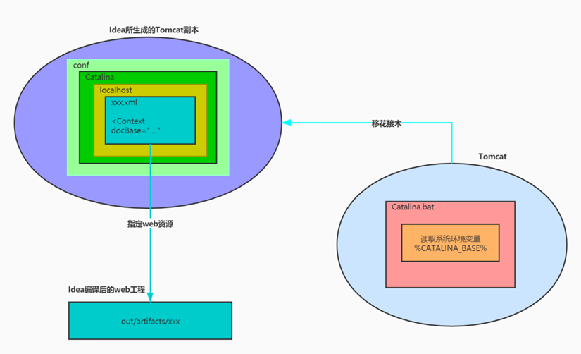

默认部署方式:
Idea会在C:\Users\Administrator\\.IntelliJIdea2019.2\system\tomcat中为每个Web项目创建一个独立的Tomcat副本。

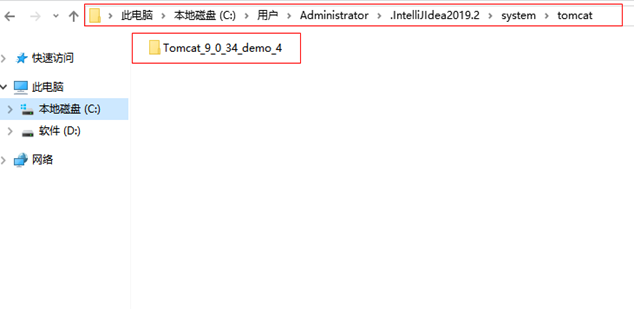

`C:\Users\Administrator\.IntelliJIdea2019.2\system\tomcat\Tomcat_9_0_34_demo_4\conf\Catalina\localhost`目录中生成一个该项目的xml文件名称为：”项目名.xml”

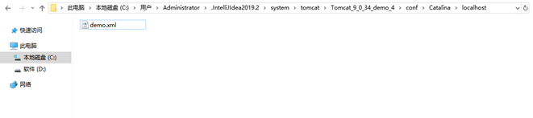

Idea通过执行Tomcat的`catalina.bat`启动脚本启动Tomcat，通过启动参数来指定启动Tomcat副本运行指定目录中的web项目

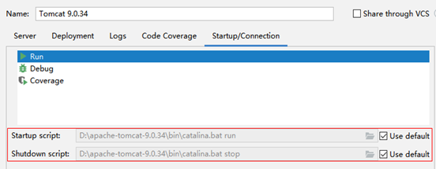

Idea在启动Tomcat之前会先在操作系统中设置一些临时环境变量，这些变量会被Tomcat的启动脚本所读取

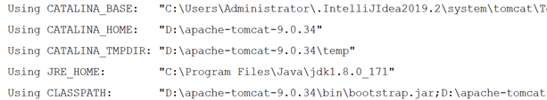

`CATALINA_BASE`：是Tomcat副本的工作目录
`CATALINA_HOME`：是Tomcat的安装目录

在Catalina.bat启动脚本运行时，会先去判断脚本中的`CATALINA_HOME`以及`CATALINA_BASE`是否有默认值，如果没有则直接读取系统环境变量中的值作为他们的默认值。由于Idea在启动Tomcat之前已经设置了临时环境变量，所以tomcat在启动后就会运行部署在Tomcat副本中的web项目

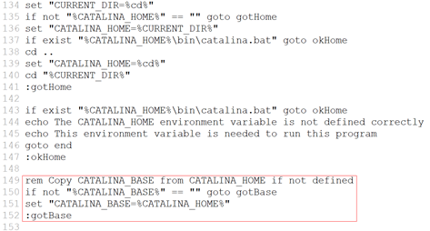

### 第二种

将web项目部署到Tomcat的webapps中

1.  点击项目结构选项
    指定输出artifacts的目录为Tomcat的webapps中的demo目录
    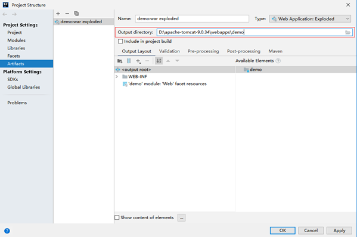
2.  在tomcat的webapps中创建一个目录
    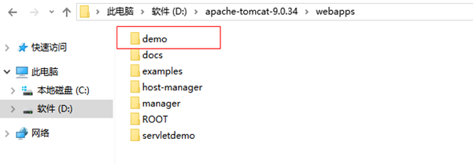
3.  启动Tomcat，查看demo目录中的内容
    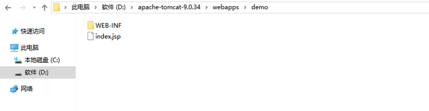
