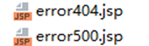
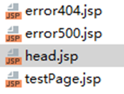

## Page指令标签

### 什么是指令标签

指令标签是JSP页面上的一种特殊标签,JSP指令可以用来设置整个JSP页面相关的属性，如网页的编码方式,脚本语言,导包等等。

### 指令标签的语法

```JSP
<%@ directive   attribute="value" %>
```

### JSP中的三种指令标签

| 指令                        | 描述                                                                     |
|:--------------------------|:-----------------------------------------------------------------------|
| &lt;%@ page&nbsp; %&gt;   | <div><br></div><div>定义网页依赖属性，如脚本语言、error页面、缓存需求等等</div><div><br></div> |
| &lt;%@ include %&gt;      | 包含其他文件                                                                 |
| &lt;%@ taglib&nbsp; %&gt; | 引入标签库的定义                                                               |  


### Page指令标签

| 属性                 | 描述                         |
|:-------------------|:---------------------------|
| buffer             | 指定out对象使用缓冲区的大小            |
| autoFlush          | 控制out对象的缓冲区                |
| contentType        | 指定当前JSP页面的MIME类型和字符编码      |
| errorPage          | 指定当JSP页面发生异常时需要转向的错误处理页面   |
| isErrorPage        | 指定当前页面是否可以作为另一个JSP页面的错误处理页 |
| extends            | 指定servlet从哪一个类继承           |
| import             | 导入要使用的Java类                |
| info               | 定义JSP页面的描述信息               |
| isThreadSafe       | isThreadSafe               |
| language           | 定义JSP页面所用的脚本语言，默认是Java     |
| session            | 指定JSP页面是否使用session         |
| isELIgnored        | 指定是否执行EL表达式                |
| isScriptingEnabled | 确定脚本元素能否被使用                |  

### Page指令的使用

``` JSP
<%--告知浏览器以什么格式和编码解析 响应的数据--%>
<%@ page contentType="text/html;charset=UTF-8"  %>

<%--设置JSP页面转换的语言--%>
<%@ page language="java"%>

<%--导包--%>
<%@ page import="com.meturing.entity.User" %>

<%--在转换成java代码时使用的编码 一般不用设置--%>
<%@ page pageEncoding="UTF-8" %>

<%--指定错误页 当页面发生错误时 指定跳转的页面--%>
<%@ page errorPage="error500.JSP" %>

<%--指定当前页为异常提示页 当前页面可以接收异常对象 --%>
<%@page isErrorPage="true" %>
```

`errorPage `是一种处理错误提示页的功能除了JSP有的错误提示页功能  javaEE中自带其他错误提示页处理功能,具体配置如下

在web.xml 配置各种错误的提示页
```XML
<error-page>
<error-code>500</error-code>
<location>/error500.JSP</location>
</error-page>

<error-page>
<error-code>404</error-code>
<location>/error404.JSP</location>
</error-page>
```

当JSP中发生了异常时,如果JSP中配置的错误页和web.xml 中配置的错误页冲突了,JSP page指令的 **errorPage优先级更高**



## Include指令标签

JSP可以通过include指令来包含其他文件. 
被包含的文件可以是JSP文件、HTML文件或文本文件.
包含的文件就好像是该JSP文件的一部分，会被**同时编译执行**。

除了include指令标签可以实现引入以外,使用 `jsp:include` 也可以实现引入

### 静态引入和动态引入

```JSP
<%--静态引入使用的是 include 指令标签
被引入的JSP页面不会生成java代码 被引入的网页和当前页生成代码后形成了一个java文件--%>
<%@include file="head.JSP"%>

<%--动态引入 JSP标签中的 include选项
被引入的JSP页面会生成独立的java代码 
在生成的java代码中 使用JSPRuntimeLibrary.include(request, response, "head.JSP", out, false);引入其他页面
--%>
<jsp:include page="head.JSP"/>
```

查看转译之后的java源代码文件中的区别



- 静态引入: `@include`   被引入的网页和当前页生成代码后形成了一个java文件
- 动态引入:` jsp:include` 被引入的JSP页面会生成<font color="#ff0000">独立的java代码</font>

## Taglib指令标签

JSP API允许用户自定义标签，一个自定义标签库就是自定义标签的集合。

Taglib指令引入一个自定义标签集合的定义，包括库路径、自定义标签。

### Taglib指令的语法

```JSP
<%@ taglib  uri="uri" prefix="prefixOfTag" %>
```

