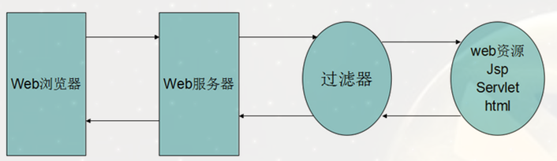

## 引入过滤器

### 什么是过滤器

Filter也称之为过滤器，它是Servlet技术中最实用的技术.

Web开发人员通过Filter技术，对web服务器管理的所有web资源：例如Jsp, Servlet, 静态图片文件或静态 html 文件等进行拦截，从而实现一些特殊的功能。

例如实现URL级别的权限访问控制、过滤敏感词汇、压缩响应信息等一些高级功能 处理编码。



**它主要用于对用户请求进行预处理，也可以对HttpServletResponse进行后处理。** 

- 使用Filter的完整流程：
	- Filter对用户请求进行预处理
	- 接着将请求交给Servlet进行处理并生成响应
	- 最后Filter再对服务器响应进行后处理。

### 过滤器如何实现功能

1. 在`HttpServletRequest`到达 `Servlet` 之前，拦截客户的`HttpServletRequest` 。
   根据需要检查`HttpServletRequest`，也可以修改`HttpServletRequest` 头和数据。
2. 在`HttpServletResponse`到达客户端之前，拦截`HttpServletResponse` 。
   根据需要检查`HttpServletResponse`，也可以修改`HttpServletResponse`头和数据。
3. Filter接口中有一个`doFilter`方法，当开发人员编写好Filter，并配置对哪个web资源进行拦截后，Web服务器每次在调用web资源的service方法之前，都会先调用一下filter的`doFilter`方法.
   `doFilter`方法中有一个`filterChain`对象,用于继续传递给下一个filter,在传递之前我们可以定义过滤请求的功能,在传递之后,我们可以定义过滤响应的功能 

## 过滤器的定义与配置

采用三步走策略使用filter

1. 开发后台资源 静态资源`(html,css … …)`或者动态资源(`Servlet`,`Jsp`)
2. 开发Filter
3. 在`web.xml`中配置Filter拦截哪些资源

### 开发Servlet

```Java
public class MyServlet1 extends HttpServlet {
    @Override
    protected void service(HttpServletRequest req, HttpServletResponse resp) throws ServletException, IOException {
        System.out.println("myServlet1 执行了sevice方法");
        resp.setContentType("text/html;charset=UTF-8");
        resp.setCharacterEncoding("UTF-8");
        resp.getWriter().print("myServlet1响应的数据");
    }
}

```

```Java
public class MyServlet2 extends HttpServlet {
    @Override
    protected void service(HttpServletRequest req, HttpServletResponse resp) throws ServletException, IOException {
        System.out.println("myServlet2 执行了sevice方法");
        resp.setContentType("text/html;charset=UTF-8");
        resp.setCharacterEncoding("UTF-8");
        resp.getWriter().print("myServlet2响应的数据");
    }
}
```

### 开发Filter

```Java
public class MyFilter implements Filter {
    // 初始化方法
    @Override
    public void init(FilterConfig filterConfig) throws ServletException {
    }
    // 作出过滤的方法
    @Override
    public void doFilter(ServletRequest servletRequest, ServletResponse servletResponse, FilterChain filterChain) throws IOException, ServletException {
        System.out.println("Filter doFilter 对请求作出过滤");
        // 通过一行代码 放行请求
        // 放行请求,交给过滤器链继续进行过滤 最后到达资源
        filterChain.doFilter(servletRequest, servletResponse);
        
        System.out.println("Filter doFilter 对响应作出过滤");
        
        servletResponse.getWriter().print("filter 追加一些数据");
    }
    // 销毁方法
    @Override
    public void destroy() {
    }
}
```

### 配置Filter

```XML
<?xml version="1.0" encoding="UTF-8"?>
<web-app xmlns="http://xmlns.jcp.org/xml/ns/javaee"
         xmlns:xsi="http://www.w3.org/2001/XMLSchema-instance"
         xsi:schemaLocation="http://xmlns.jcp.org/xml/ns/javaee http://xmlns.jcp.org/xml/ns/javaee/web-app_4_0.xsd"
         version="4.0">
    <servlet>
        <servlet-name>myServlet1</servlet-name>
        <servlet-class>com.meturing.servlet.MyServlet1</servlet-class>
    </servlet>
    <servlet-mapping>
        <servlet-name>myServlet1</servlet-name>
        <url-pattern>/myServlet1.do</url-pattern>
    </servlet-mapping>
    <servlet>
        <servlet-name>myServlet2</servlet-name>
        <servlet-class>com.meturing.servlet.MyServlet2</servlet-class>
    </servlet>
    <servlet-mapping>
        <servlet-name>myServlet2</servlet-name>
        <url-pattern>/myServlet2.do</url-pattern>
    </servlet-mapping>
    
    <filter>
        <filter-name>filter1</filter-name>
        <filter-class>com.meturing.filter.MyFilter</filter-class>
    </filter>
    
    <filter-mapping>
        <filter-name>filter1</filter-name>
        <!--对那个/些资源的请求和响应进行过滤-->
        <!--<url-pattern>/myServlet1.do</url-pattern>-->
        <servlet-name>myServlet1</servlet-name>
        <servlet-name>myServlet2</servlet-name>
        <!--<url-pattern>/</url-pattern>
        <url-pattern>/*</url-pattern>-->
    </filter-mapping>
    
</web-app>
```


## 过滤器的生命周期

同`servlet`对象一样,Filter对象的创建也是交给web服务器完成的,在web服务器创建和使用及最后销毁filter时,会调用filter对应的方法

### 过滤器的结构

``` Java
public class MyFilter implements Filter {
	//构造方法
    public MyFilter(){
        System.out.println("MyFilter constructor invoked");
    }
    // 初始化方法
    @Override
    public void init(FilterConfig filterConfig) throws ServletException {
        System.out.println("MyFilter init invoked");
    }
    // 作出过滤的方法
    @Override
    public void doFilter(ServletRequest servletRequest, ServletResponse servletResponse, FilterChain filterChain) throws IOException, ServletException {
        System.out.println("Filter doFilter 对请求作出过滤");
        // 通过一行代码 放行请求
        // 放行请求,交给过滤器链继续进行过滤 最后到达资源
        filterChain.doFilter(servletRequest, servletResponse);
        System.out.println("Filter doFilter 对响应作出过滤");
        servletResponse.getWriter().print("filter 追加一些数据");
    }
    // 销毁方法
    @Override
    public void destroy() {
        System.out.println("MyFilter destory invoked");
    }
}

```

#### 构造方法

实例化一个Filter对象的方法

#### 初始化方法

`public void init(FilterConfig filterConfig);`

和我们编写的Servlet程序一样，Filter的创建和销毁由WEB服务器负责。 **web 应用程序启动时，web 服务器将创建Filter 的实例对象，并调用其init方法，读取web.xml配置，完成对象的初始化功能，从而为后续的用户请求作好拦截的准备工作（filter对象只会创建一次，init方法也只会执行一次）**。

开发人员通过init方法的参数，可获得代表当前filter配置信息的FilterConfig对象。

#### 拦截请求方法

`public void doFilter`

这个方法完成实际的过滤操作。当客户请求访问与过滤器关联的URL的时候，**Servlet过滤器将先执行doFilter方法**。FilterChain参数用于访问后续过滤器。

#### 销毁方法

`public void destroy();`

Filter对象创建后会驻留在内存，**当web应用移除或服务器停止时才销毁**。在Web容器卸载 Filter 对象之前被调用。该方法在Filter的生命周期中仅执行一次。在这个方法中，可以释放过滤器使用的资源。

### 生命周期

WEB 容器启动时,会对Filter进行构造并初始化 一次

每次请求目标资源时,都会执行doFilter的方法

WEB容器关闭是,会销毁Filter对象