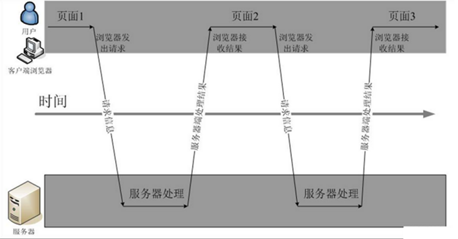
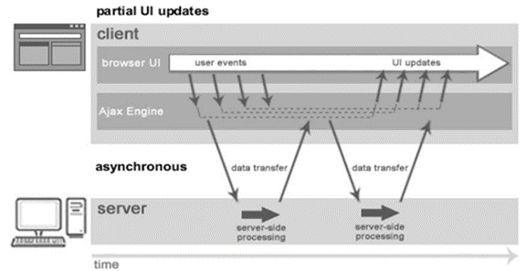
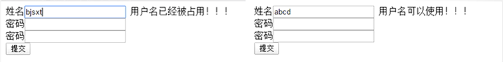

## 同步交互与异步交互

### 什么是同步交互

1. 首先用户向HTTP服务器提交一个处理请求。
2. 接着服务器端接收到请求后，按照预先编写好的程序中的业务逻辑进行处理，比如和数据库服务器进行数据信息交换。
3. 最后，服务器对请求进行响应，将结果返回给客户端，返回一个HTML在浏览器中显示，通常会有CSS样式丰富页面的显示效果。



#### 优点

可以保留浏览器后退按钮的正常功能。在动态更新页面的情况下，用户可以回到前一个页面状态，浏览器能记下历史记录中的静态页面,用户通常都希望单击后退按钮时，就能够取消他们的前一次操作，同步交互可以实现这个需求.

#### 缺点

1. 同步交互的不足之处，会给用户一种不连贯的体验，当服务器处理请求时，用户只能等待状态，页面中的显示内容只能是空白。
2. 因为已经跳转到新的页面,原本在页面上的信息无法保存,好多信息需要重新填写

### 什么是异步交互

指发送一个请求,不需要等待返回,随时可以再发送下一个请求，即不需要等待。

在部分情况下，我们的项目开发中都会优先选择不需要等待的异步交互方式。将用户请求放入消息队列，并反馈给用户，系统迁移程序已经启动，你可以关闭浏览器了。然后程序再慢慢地去写入数据库去。这就是异步。异步不用等所有操作等做完，就响应用户请求。即先响应用户请求，然后慢慢去写数据库，用户体验较好



#### 优点

1. 前端用户操作和后台服务器运算可以同时进行,可以充分利用用户操作的间隔时间完成运算
2. 页面没有跳转,响应回来的数据直接就在原页面上,页面原有信息得以保留

#### 缺点

可能破坏浏览器后退按钮的正常行为。在动态更新页面的情况下，用户无法回到前一个页面状态，这是因为浏览器仅能记录的始终是当前一个的静态页面。

**用户通常都希望单击后退按钮，就能够取消他们的前一次操作，但是在AJAX这样异步的程序，却无法这样做。**

## AJAX

### 什么是AJAX

AJAX 即 `Asynchronous Javascript And XML` （异步 JavaScript和 XML），是指一种创建交互式、快速动态网页应用的网页开发技术，无需重新加载整个网页的情况下，能够更新部分网页的技术。通过在后台与服务器进行少量数据交换，AJAX 可以使网页实现异步更新。这意味着可以在不重新加载整个网页的情况下，对网页的某部分进行更新。

### AJAX关键技术

1. 使用CSS构建用户界面样式,负责页面排版和美工
2. 使用DOM进行动态显示和交互,对页面进行局部修改
3. 使用XMLHttpRequest异步获取数据
4. 使用JavaScript将所有的元素绑定在一起

### AJAX的特点

 **异步访问,局部刷新**

## 体验原生异步

JS表单验证只能校验格式是否正确,但是无法验证用户名是否已经存在,这个就需要后台程序接受到数据后通过查询才能够完成的,那么这里就非常适用于使用异步方式校验,保证用于数据提交后,业务完成的成功率.提升用于体验感


### 实现步骤

获取XMLHTTPRequest对象   `xhr=new XMLHttpRequest();`
打开链接   `xhr.open("GET","loginServlet?uname="+uname,true);`
设置回调函数  `xhr.onreadystatechange=showRnturnInfo;`
提交数据  `xhr.send(data)`

### 相关代码

#### 页面代码

```JSP
<%@ page contentType="text/html;charset=UTF-8" language="java" %>
<html>
  <head>
    <title>$Title%sSourceCode%lt;/title>
    <script>
      var xhr ;
      function checkUname(){
        // 获取输入框中的内容
        var unameDOM=document.getElementById("unameI");
        var unameText =unameDOM.value;
        var unameInfoDom =document.getElementById("unameInfo");
        if(null == unameText || unameText == ''){
          unameInfoDom.innerText="用户名不能为空";
          return;
        }
        unameInfoDom.innerText="";
        // 发送异步请求
        // 获取一个 XMLHttpRequest对象 ,对象可以帮助我们发送异步请求
        xhr =new XMLHttpRequest();
        // 使用xhr对象设置打开链接,设置请求方式和参数xhr.open("请求方式","请求的URL",是否使用异步方式);
        xhr.open("GET","unameCheckServlet.do?uname="+unameText,true);
        // 设置回调函数
        xhr.onreadystatechange=showReturnInfo;
        // 正式发送请求
        xhr.send(null);
      }
      function showReturnInfo(){
        if(xhr.readyState==4 && xhr.status==200){
          var returnInfo =xhr.responseText;
          var unameInfoDom =document.getElementById("unameInfo");
          unameInfoDom.innerText=returnInfo;
        }
      }
    </script>
  </head>
  <body>
  <form action="myServlet1.do" >
    用户名:<input id="unameI" type="text" name="uname" onblur="checkUname()"><span id="unameInfo" style="color: red"></span><br/>
    密码:<input type="password" name="pwd"><br/>
    <input type="submit">
  </form>
  </body>
</html>
```

#### Servlet代码

``` Java
@WebServlet("/unameCheckServlet.do")
public class UnameCheckServlet extends HttpServlet {
    @Override
    protected void service(HttpServletRequest req, HttpServletResponse resp) throws ServletException, IOException {
        String uname = req.getParameter("uname");
        String info="";
        if("meturing".equals(uname)){
            info="用户名已经占用";
        }else{
            info="用户名可用";
        }
        // 向浏览器响应数据
        resp.setCharacterEncoding("UTF-8");
        resp.setContentType("text/html;charset=UTF-8");
        resp.getWriter().print(info);
    }
}
```

### 存在问题

原生js提交AJAX异步请求代码**比较繁琐**,处理复杂数据**比较麻烦,** 后续可以使用jQuery解决