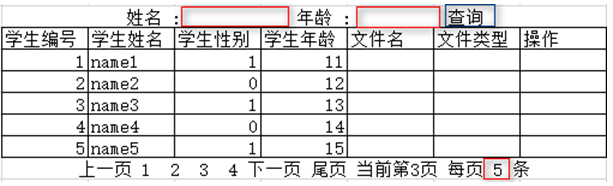
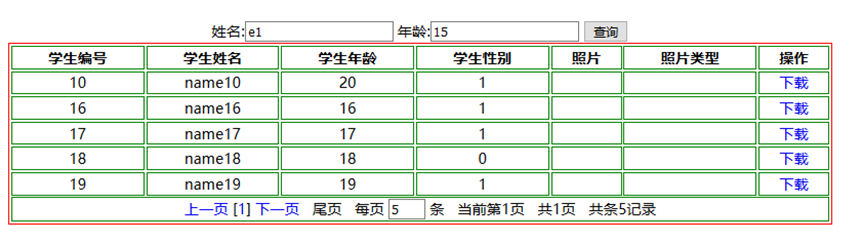

## 分页概念

### 什么是分页

简单来说:大量数据无法一次性全部显示在网页上?怎么办?

只能选取其中的一部分,将大量数据分成好几段,每一段我们用一个网页显示,也就是一页,在页面上我们可以手动控制我们要选择的页面.分页就是将大量数据分成很多页显示的一种处理手段.


### 分页有什么好处

 1. 通过分页,我们**不用一次性将所有的数据查出来**,只需先查出来一部分,可以减少数据库的IO数据量的传输,降低数据库读写压力,从而提高数据库响应速度
2. 页面也不用一次性显示所有的数据,可以**减少浏览器和服务器之间大量数据的IO传输**,从而提高服务器的响应速度
3. 我们可能值需要很多信息中少数的几条,那么传输其他多余的数据就是无形之中对于资源的浪费,分页可以**减少资源的浪费**

## 分页思路

核心思路是通过前端传送的当前页与每页数量大小,通过sql中的limit控制展示数据,并返回给前端

### 数据库上的分页

`select * from student limit 0,5`

sql语句通过**limit关键字**实现数据的分页查询, limit后面可以放两个整数作为参数,前一个参数的意义为从那条数据开始查询,后一个参数的意义是连续取出多少条

如果查询 第n页,每页x条 数据那么sql语句应该写成`Select * from student limit (n-1)*x,x`
分页查询的sql语句代码公式为:`SELECT * FROM emp LIMIT (页码数-1)*页大小,页大小`

分页所需的参数 : 
1. `index `  当前页码
2. `size` 每页数量
3. `start =(index-1)*size` 从第几条开始
5. `maxpage = if(total%size==0){maxpage=total/size}else {maxpage=total/size+1}`  最大页码数

### 业务思路

例如我们实现一个这样的分页效果:


前端需要发送给后端的数据 :
1. 当前第几页 - `page`
2. 每页展示数量 - `size`
3. 查询条件  - `filterParameters`

后端需要发给前端的数据:
1. 当前页面的所有数据信息 - `List<Object>`
2. 当前第几页 - `page`
3. 共计多少条数据 - `totalSize`
4. 共计多少页 - `totalPage`
5. 每页大小 - `size`

## 分页实现

我们实现一个简单的分页小程序


### 准备数据

```SQL
CREATE TABLE `student` (
    `stuid` int(11) NOT NULL AUTO_INCREMENT,
    `stuname` varchar(20) DEFAULT NULL,
    `stuage` int(2) DEFAULT NULL,
    `stugender` char(2) DEFAULT NULL,
    `filename` varchar(100) DEFAULT NULL,
    `filetype` varchar(20) DEFAULT NULL,
    PRIMARY KEY (`stuid`)
) ENGINE=InnoDB AUTO_INCREMENT=22 DEFAULT   CHARSET=utf8;

insert into `student`(`stuid`,`stuname`,`stuage`,`stugender`,`filename`,`filetype`)   values   (1,'name1',11,'1',NULL,NULL),(2,'name2',12,'0',NULL,NULL),(3,'name3',13,'1',NULL,NULL),(4,'name4',14,'1',NULL,NULL),(5,'name5',15,'1',NULL,NULL),(6,'name6',16,'0',NULL,NULL),(7,'name7',17,'0',NULL,NULL),(8,'name8',18,'0',NULL,NULL),(9,'name9',19,'0',NULL,NULL),(10,'name10',20,'1',NULL,NULL),(11,'name11',11,'0',NULL,NULL),(12,'name12',12,'1',NULL,NULL),(13,'name13',13,'0',NULL,NULL),(14,'name14',14,'1',NULL,NULL),(15,'name15',15,'0',NULL,NULL),(16,'name16',16,'1',NULL,NULL),(17,'name17',17,'1',NULL,NULL),(18,'name18',18,'0',NULL,NULL),(19,'name19',19,'1',NULL,NULL),(20,'name20',20,'0',NULL,NULL);
```

### 代码实现

```JSP
<%@ page contentType="text/html;charset=UTF-8" language="java" %>
<%@taglib prefix="c" uri="http://java.sun.com/jsp/jstl/core" %>
<html>
  <head>
    <title>$Title%sSourceCode%lt;/title>
    <style>
      table{
        border: 1px red solid;
        margin:0px auto;
        width: 80%;
      }
      td,th{
        border:1px solid green;
      }
    </style>
  </head>
  <body>
  <div style="text-align: center">
    名字关键字:<input type="text" id="stuname" value="${stuname}">
    年龄下限<input type="text"  id="stuage" value="${stuage}">
    <input type="button" value="查询" onclick="changePage(1)" >
  </div>
  <table>
    <tr>
      <th>学生编号</th>
      <th>学生姓名</th>
      <th>学生年龄</th>
      <th>学生性别</th>
      <th>照片</th>
      <th>照片类型</th>
      <th>操作</th>
    </tr>
    <%--
    pageBean
    public class PageBean<T> implements Serializable {
    // 当前页数据
    private List<T> data;
    // 查询出的总记录数
    private int totalSize;
    // 页大小
    private int pageSize;
    // 总页数
    private int totalPage;
    // 当前页数
    private int currentPage;
    --%>
    <c:forEach items="${pageBean.data}" var="student">
      <tr>
        <td>${student.stuid}</td>
        <td>${student.stuname}</td>
        <td>${student.stuage}</td>
        <td>${student.stugender}</td>
        <td>${student.filename}</td>
        <td>${student.filetype}</td>
        <td>
          <a href="#">删除</a>
        </td>
      </tr>
    </c:forEach>
    <tr align="center">
      <td colspan="7">
        <a href="javascript:void(0)"  onclick="changePage(${pageBean.currentPage-1})">上一页</a>
        <c:forEach begin="1" end="${pageBean.totalPage}" var="num">
          <c:choose>
            <c:when test="${num eq pageBean.currentPage}">
              [${num}]
            </c:when>
            <c:otherwise>
              ${num}
            </c:otherwise>
          </c:choose>
        </c:forEach>
        <a href="javascript:void(0)"  onclick="changePage(${pageBean.currentPage+1})">下一页</a>
        &nbsp;&nbsp;&nbsp;
        尾页
        &nbsp;&nbsp;&nbsp;
        每页
          <input id="pageSize" style="width: 40px" type="text" value="${pageBean.pageSize}">
        条
        &nbsp;&nbsp;&nbsp;
        当前第
          ${pageBean.currentPage}
        页
        &nbsp;&nbsp;&nbsp;
        共${pageBean.totalPage}页
        &nbsp;&nbsp;&nbsp;
        共
           ${pageBean.totalSize}
        条记录
        &nbsp;&nbsp;&nbsp;
      </td>
    </tr>
    <script src="js/jquery.min.js"></script>
    <script>
      function changePage(currentPage){
        if(currentPage<1){
          alert("已经是第一页了")
          return;
        }
        if(currentPage>${pageBean.totalPage}){
          alert("已经是最后一页了")
          return;
        }
        window.location.href="showStudentController.do?stuname="+$("#stuname").val()+"&stuage="+$("#stuage").val()+"&currentPage="+currentPage+"&pageSize="+$("#pageSize").val();
      }
    </script>
  </table>
  </body>
</html>
```

Controller层
```Java
@WebServlet(urlPatterns = "/showStudentController")
public class ShowStudentController extends HttpServlet {
    private StudentService studentService=new StudentServiceImpl();
    @Override
    protected void service(HttpServletRequest req, HttpServletResponse resp) throws ServletException, IOException {
        // 接收数据
        // 页码数
        int currentPage =1;
        try {
            currentPage=Integer.parseInt(req.getParameter("currentPage"));
        } catch (NumberFormatException e) {
        }
        // 页大小
        int pageSize =5;
        try {
            pageSize =Integer.parseInt(req.getParameter("pageSize"));
        } catch (NumberFormatException e) {
        }
        // 查询条件
        String stuname = req.getParameter("stuname");
        String stuage = req.getParameter("stuage");
        // 调用service层服务处理业务逻辑
        PageBean<Student> pageBean =studentService.findByPage(stuname,stuage,currentPage,pageSize);
        // 将数据放入请求域
        req.setAttribute("pageBean",pageBean);
        req.setAttribute("stuname", stuname);
        req.setAttribute("stuage", stuage);
        // 响应数据,页面跳转
        req.getRequestDispatcher("showStudent.jsp").forward(req,resp);
    }
}
```

Service层
```Java
public class StudentServiceImpl implements StudentService {
    private StudentDao studentDao =new StudentDaoImpl();
    // 做分页数据封装的业务处理
    @Override
    public PageBean<Student> findByPage(String stuname,String stuage,int currentPage, int pageSize) {
        // 查询出该页所有数据
        List<Student> students = studentDao.findByPage( stuname, stuage,currentPage, pageSize);
        // 查询出有多少条数据
        int totalSize =studentDao.findTotalSize( stuname, stuage);
        // 总页数
        int totalPage =totalSize%pageSize==0?totalSize/pageSize:totalSize/pageSize+1;
        // 当前页
        // 页大小
        PageBean<Student> pageBean =new PageBean<>(students,  totalSize,  pageSize,  totalPage,  currentPage);
        return pageBean;
    }
}
```

DAO层
```Java
public class StudentDaoImpl extends BaseDao implements StudentDao {
    @Override
    public List<Student> findByPage(String stuname,String stuage,int currentPage, int pageSize) {
        StringBuilder sql=new StringBuilder("select  * from student where 1=1 ");
        if(null != stuname && !"".equals(stuname)) {
            sql.append("and stuname like ? ");
        }
        if(null != stuage && !"".equals(stuage)) {
            sql.append("and stuage > ? ");
        }
        sql.append("limit ?,?");
        System.out.println(sql.toString());
        List list =null;
        if(null != stuname && !"".equals(stuname) && null != stuage && !"".equals(stuage)){
             list = baseQuery(Student.class, sql.toString(), "%"+stuname+"%",stuage,(currentPage - 1) * pageSize, pageSize);
        }else if ((null != stuname && !"".equals(stuname)) && (null == stuage || "".equals(stuage))){
             list = baseQuery(Student.class, sql.toString(), "%"+stuname+"%",(currentPage - 1) * pageSize, pageSize);
        }else if ((null == stuname || "".equals(stuname))&& (null != stuage && !"".equals(stuage))){
             list = baseQuery(Student.class, sql.toString(), stuage,(currentPage - 1) * pageSize, pageSize);
        }else{
             list = baseQuery(Student.class, sql.toString(), (currentPage - 1) * pageSize, pageSize);
        }
        return list;
    }
    @Override
    public int findTotalSize(String stuname,String stuage) {
        StringBuilder sql=new StringBuilder("select  count(1) from student where 1=1 ");
        if(null != stuname && !"".equals(stuname)) {
            sql.append("and stuname like ? ");
        }
        if(null != stuage && !"".equals(stuage)) {
            sql.append("and stuage > ? ");
        }
        int count =0;
        if(null != stuname && !"".equals(stuname) && null != stuage && !"".equals(stuage)){
            count = baseQueryInt( sql.toString(), "%"+stuname+"%",stuage);
        }else if ((null != stuname && !"".equals(stuname)) && (null == stuage || "".equals(stuage))){
            count = baseQueryInt( sql.toString(), "%"+stuname+"%");
        }else if ((null == stuname || "".equals(stuname))&& (null != stuage && !"".equals(stuage))){
            count = baseQueryInt( sql.toString(),stuage);
        }else{
            count = baseQueryInt(sql.toString());
        }
        return count;
    }
}
```

> 关于BaseDao请参考 : [DAO](../../02_数据库和JDBC/02_JDBC/06_DAO/DAO.md)