## 创建Maven项目

### 创建项目

创建Maven项目 -> Next
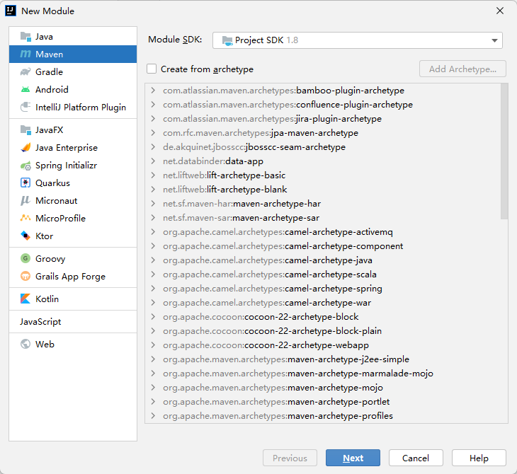

配置Maven信息 -> Finish
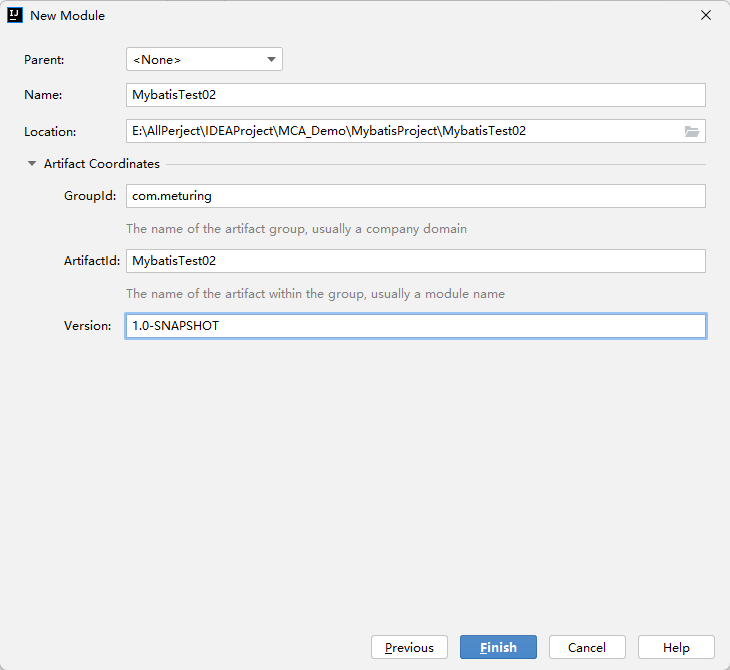

### 配置项目环境

#### 配置Maven包

##### 修改使用的Maven

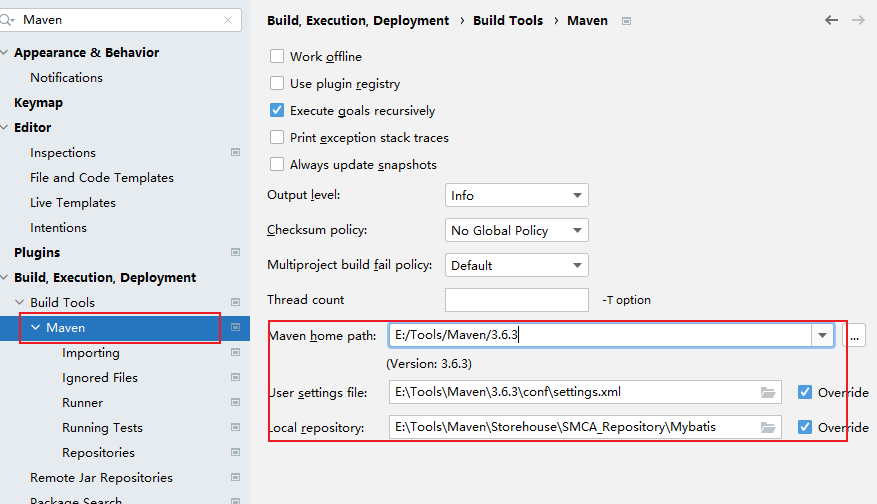

##### 修改Maven的Pom.xml

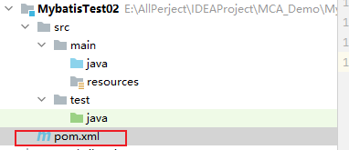
```XML
<?xml version="1.0" encoding="UTF-8"?>  
<project xmlns="http://maven.apache.org/POM/4.0.0"  
         xmlns:xsi="http://www.w3.org/2001/XMLSchema-instance"  
         xsi:schemaLocation="http://maven.apache.org/POM/4.0.0 http://maven.apache.org/xsd/maven-4.0.0.xsd">  
    <modelVersion>4.0.0</modelVersion>  
  
    <groupId>com.meturing</groupId>  
    <artifactId>MybatisTest02</artifactId>  
    <version>1.0-SNAPSHOT</version>  
    <!--指定编译类型--> 
    <packaging>jar</packaging>  
    
    <!--指定编译JDK版本-->  
	<properties>  
	    <maven.compiler.source>8</maven.compiler.source>  
	    <maven.compiler.target>8</maven.compiler.target>  
	</properties>
	
    <dependencies>  
        <!--mysqlConnector-->  
        <dependency>  
            <groupId>mysql</groupId>  
            <artifactId>mysql-connector-java</artifactId>  
            <version>8.0.16</version>  
        </dependency>  
        <!--mybatis 核心jar包-->  
        <dependency>  
            <groupId>org.mybatis</groupId>  
            <artifactId>mybatis</artifactId>  
            <version>3.5.3</version>  
        </dependency>  
        <!--junit-->  
        <dependency>  
            <groupId>junit</groupId>  
            <artifactId>junit</artifactId>  
            <version>4.13.1</version>  
            <scope>test</scope>  
        </dependency>  
        <!--lombok -->  
        <dependency>  
            <groupId>org.projectlombok</groupId>  
            <artifactId>lombok</artifactId>  
            <version>1.18.12</version>  
            <scope>provided</scope>  
        </dependency>  
    </dependencies>  
</project>
```

点击图标 或 Compile导包
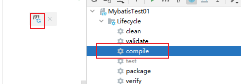

#### 配置编译环境

##### 修改项目编译版本

统一使用JDK1.8编译开发

File -> Settings
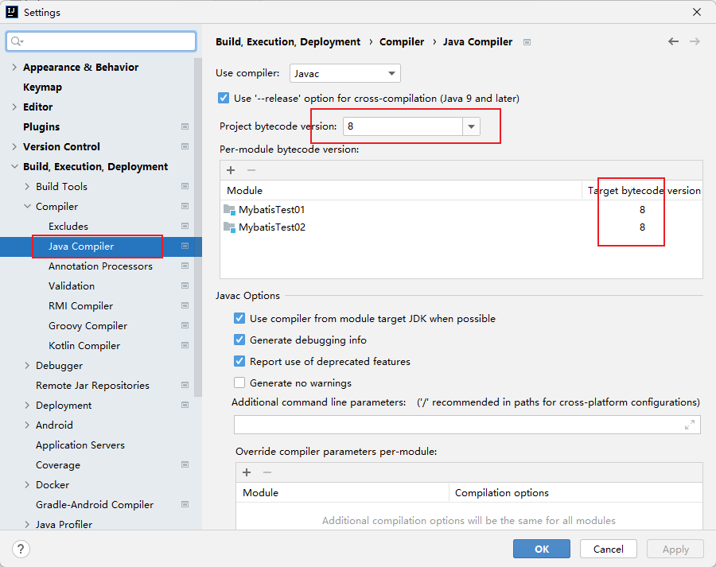

File -> Project Structure
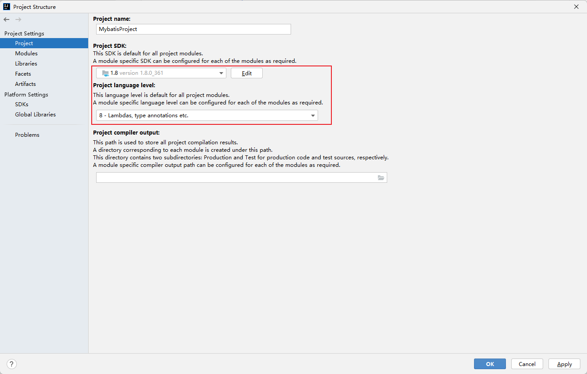

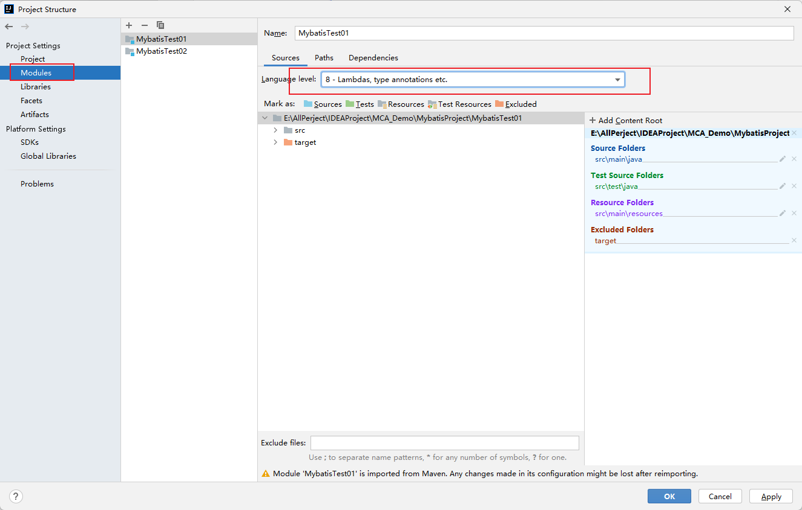

#### 安装插件

##### 安装Lombok

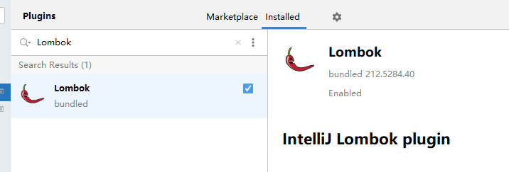

使用Lombok需要在项目中开启注解编译
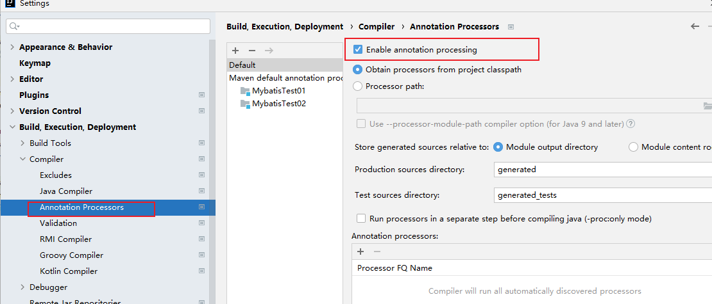

##### 安装MybatisX

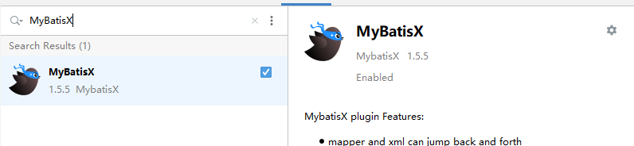


## 准备项目结构与数据

#### 导入数据库

![[dump-test-202304141121.sql]]

#### 创建项目结构

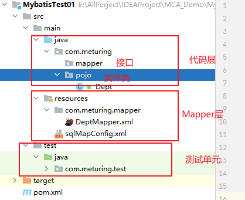

在创建结构时需要注意:
1. sqlMapConfig.xml需要放到resources根目录下
2. DeptMapper.xml文件需要与代码层中com.meturing.mapper的层级结构一致

#### 创建实体类

创建实体类Dept.java
```Java
/**  
 * @author sqTan * @description 部门  
 * @date 2023/04/09  
 */
@Data //所有参数构造Get/Set方法  
@AllArgsConstructor //导入全参构造函数  
@NoArgsConstructor //导入无参构造函数  
public class Dept implements Serializable {  
    private Integer deptno;  
    private String dname;  
    private String loc;  
}
```


## 准备Mybatis的配置

#### sqlMapConfig.xml 配置文件

注意: 注意在使用配置文件时分号在XML中需要写成`&amp;` 否则报错

```XML
<?xml version="1.0" encoding="UTF-8" ?>  
<!DOCTYPE configuration  
        PUBLIC "-//mybatis.org//DTD Config 3.0//EN"  
        "http://mybatis.org/dtd/mybatis-3-config.dtd">  
<configuration>  
    <environments default="development">  
        <environment id="development">  
            <transactionManager type="JDBC"/>  
            <dataSource type="POOLED">  
                <property name="driver" value="com.mysql.cj.jdbc.Driver"/>  
                <property name="url" value="jdbc:mysql://192.168.1.188:3306/test?useSSL=false&amp;useUnicode=true&amp;characterEncoding=UTF-8&amp;serverTimezone=Asia/Shanghai"/>  
                <property name="username" value="root"/>  
                <property name="password" value="root"/>  
            </dataSource>  
        </environment>  
    </environments> 
    
    <!-- 需要指向需要Mapping的XMl文件(注册) -->  
    <mappers>  
        <mapper resource="com/meturing/mapper/DeptMapper.xml"/>  
    </mappers>  
</configuration>
```

#### DeptMapper.xml映射文件

```XML
<?xml version="1.0" encoding="UTF-8" ?>  
<!DOCTYPE mapper  
        PUBLIC "-//mybatis.org//DTDMapper3.0//EN"  
        "http://mybatis.org/dtd/mybatis-3-mapper.dtd">  
<mapper namespace="deptMapper">  
    <!-- public List<Dept> findAll(){ } -->  
    <select id="findAll" resultType="com.meturing.pojo.Dept" >  
        select * from dept    
	</select>  
</mapper>
```
`namespace` 表示当前Mapper的名字.可以随意
`id` 表示当前SQL语句的名字
`resultType` 表示当前SQL执行后需要存储的对象位置,需要填写全类路径

## 测试代码

#### 基础写法思路

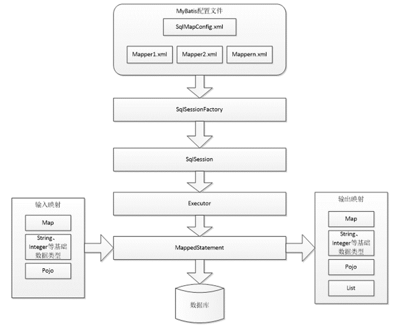
1. 创建一个SqlSessionFactoryBuilder对象 
2. 通过Resources类获取指定配置文件的InputStream流
3. 通过SqlSessionFactoryBuilder对象使用配置文件的InputStream流构建一个SqlSessionFactory对象
4. 使用SqlSessionFactory对象打开数据库链接
5. 执行SQL
6. 关闭SqlSessionFactory对象


#### 相关测试代码

```Java
package com.meturing.test;  
  
import com.meturing.pojo.Dept;  
import org.apache.ibatis.io.Resources;  
import org.apache.ibatis.session.SqlSession;  
import org.apache.ibatis.session.SqlSessionFactory;  
import org.apache.ibatis.session.SqlSessionFactoryBuilder;  
import org.junit.After;  
import org.junit.Before;  
import org.junit.Test;  
  
import java.io.IOException;  
import java.io.InputStream;  
import java.util.List;

public class Test1 {  
    private static SqlSession sqlSession = null;  
    
    /**  
     * 初始化  
     *  Before注解会使方法在执行测试单元前执行  
     * @author sqTan  
     * @date 2023/04/09     */    @Before  
    public void init() {  
        //创建一个SqlSessionFactoryBuilder对象  
        SqlSessionFactoryBuilder sqlSessionFactoryBuilder = new SqlSessionFactoryBuilder();  
        InputStream resourceAsStream = null;  
        try {  
            //通过Resources类获取指定配置文件的InputStream流  
            resourceAsStream = Resources.getResourceAsStream("sqlMapConfig.xml");  
        } catch (IOException e) {  
            e.printStackTrace();  
        }  
        //通过SqlSessionFactoryBuilder对象使用配置文件的InputStream流构建一个SqlSessionFactory对象  
        SqlSessionFactory build = sqlSessionFactoryBuilder.build(resourceAsStream);  
        //使用SqlSessionFactory对象打开数据库链接  
         sqlSession = build.openSession();  
    }  
    
    @Test  
    public void test1(){  
        //执行查询方法  
        List<Dept> deptList = sqlSession.selectList("findAll");  
        //deptList.stream().forEach(System.out::println);  
        for (Dept dept : deptList) {  
            System.out.println(dept);  
        }  
    }  
    
    /**  
     * 释放  
     * After注解会使方法在执行测试单元后执行  
     * @author sqTan  
     * @date 2023/04/09     */    @After  
    public void release(){  
        //关闭链接  
        sqlSession.close();  
    }  
}
```