## 导入Log4j日志框架

### 回顾之前在JDBC中的使用

[什么是日志log](Log4j日志框架#什么是日志log)

[log4j日志的级别](Log4j日志框架#log4j日志的级别)

[使用log4j记录日志](Log4j日志框架#使用log4j记录日志)

[代码中记录日志](Log4j日志框架#代码中记录日志)

[理解日志格式化字符的含义](Log4j日志框架#理解日志格式化字符的含义)

### 在Maven中使用Log4j

目前位置`Log4j`分为`Log4j1`和`Log4j2` 两个版本,在配置上有所不同

#### 导入Log4j1

将`log4j.properties`文件复制到`resources`下。另外在其中可以将全局的日志级别调高，避免大量debug信息的干扰。同时将对映射文件的操作调低，可以用来显示SQL语句的调试信息。开发阶段，建议启动控制的日志。
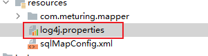

##### 配置Pom文件

```XMl
<dependency>  
    <groupId>log4j</groupId>  
    <artifactId>log4j</artifactId>  
    <version>1.2.17</version>  
</dependency>
```

##### 配置loj4g.properties文件

```properties
#定义全局日志级别调试阶段推荐debug
#log4j.rootLogger=debug,stdout,logfile   #及打印到控制台又输出到文件  
log4j.rootLogger=debug,stdout  
  
#stdout 输出到控制台  
log4j.appender.stdout=org.apache.log4j.ConsoleAppender  
log4j.appender.stdout.Target=System.err  
log4j.appender.stdout.layout=org.apache.log4j.SimpleLayout  
  
#logfile 输出到文件  
log4j.appender.logfile=org.apache.log4j.FileAppender  
log4j.appender.logfile.File=d:/meturing.log  
log4j.appender.logfile.layout=org.apache.log4j.PatternLayout  
log4j.appender.logfile.layout.ConversionPattern=%d{yyyy-MM-dd HH:mm:ss} %l %F %p %m%n
```

##### 效果

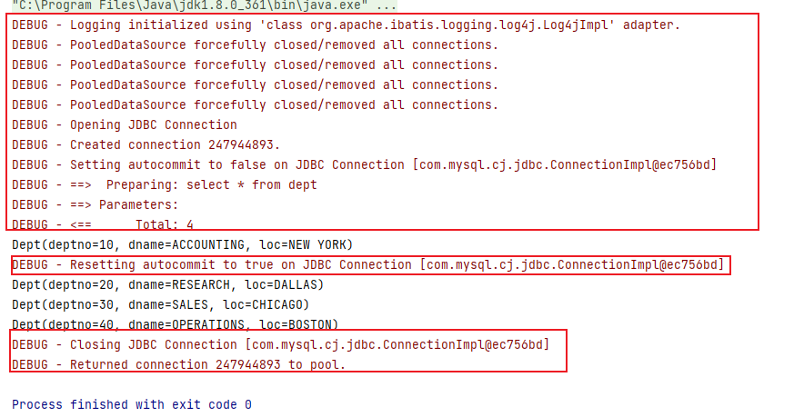

#### 导入Log4j2

将`log4j2.xml`文件负责到`resources`下
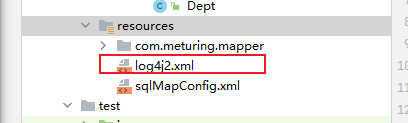


##### 配置Pom文件
```XMl
<dependency>  
    <groupId>org.apache.logging.log4j</groupId>  
    <artifactId>log4j-core</artifactId>  
    <version>2.12.1</version>  
</dependency>
```

##### 配置log4j2.xml文件

```XMl
<?xml version="1.0" encoding="UTF-8"?>  
<Configuration status="DEBUG">  
    <Appenders>  
        <Console name="Console" target="SYSTEM_ERR">  
            <PatternLayout pattern="%d{YYYY-MM-dd HH:mm:ss} [%t] %-5p %c{1}:%L - %msg%n" />  
        </Console>  
  
        <RollingFile name="RollingFile" filename="log/test.log"  
                     filepattern="${logPath}/%d{YYYYMMddHHmmss}-fargo.log">  
            <PatternLayout pattern="%d{YYYY-MM-dd HH:mm:ss} [%t] %-5p %c{1}:%L - %msg%n" />  
            <Policies>  
                <SizeBasedTriggeringPolicy size="10 MB" />  
            </Policies>  
            <DefaultRolloverStrategy max="20" />  
        </RollingFile>  
  
    </Appenders>  
    <Loggers>  
        <Root level="DEBUG">  
            <AppenderRef ref="Console" />  
<!--            <AppenderRef ref="RollingFile" />-->  
        </Root>  
    </Loggers>  
</Configuration>
```

使用多个配置在Root中使用多行
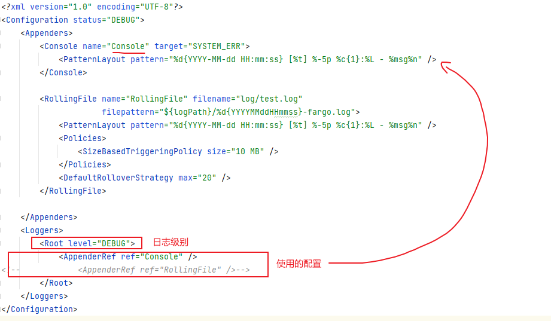

##### 效果

我们发现Log4j2的日志打印的更加详细
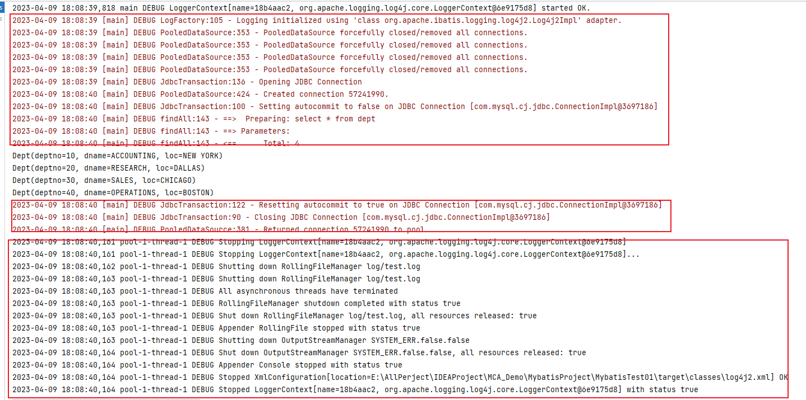

### 配置Mybatis使用的日志

我们在Mybatis官网可以看到: https://mybatis.net.cn/configuration.html#settings
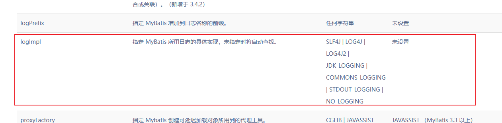
**logImpl参数可以指定使用的日志实现,默认是没有配置的,会按照顺序依次查找**

#### 修改sqlMapConfig.xml文件

注意Mybatis.xml配置文件编辑时需要注意标签的先后顺序,否则会报错,标签的先后顺序需要遵守左侧的层级
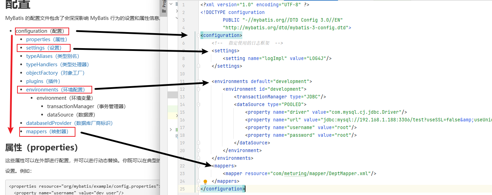

我们看到官方说明文档中,在settings配置中可以指定log框架,所以我们新增logImpl属性配置
如果没有配置,默认情况下Mybatis会自动按照顺序寻找使用的log框架
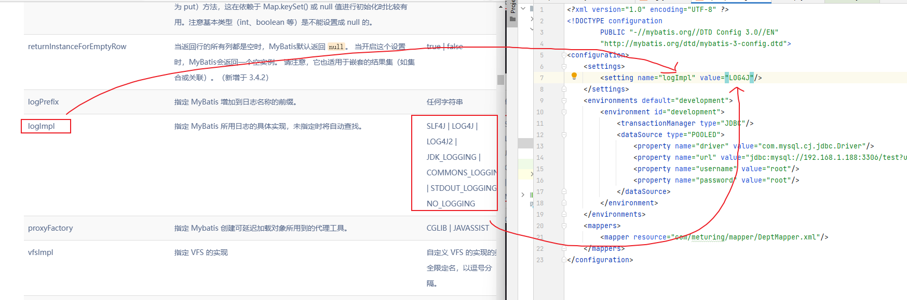
```XML
<settings>  
    <setting name="logImpl" value="LOG4J"/>  
</settings>
```

## 事务配置

在 MyBatis 中有两种类型的事务管理器（也就是 `type="[JDBC|MANAGED]"`）：

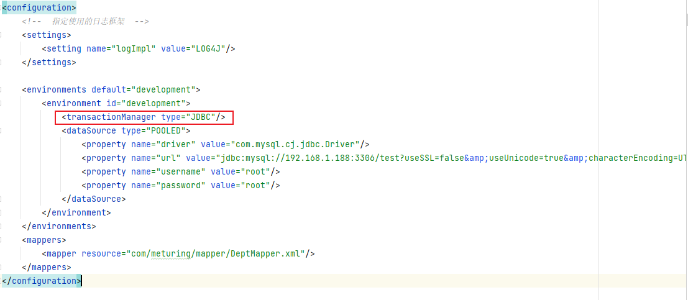

### JDBC

`JDBC` – 这个配置直接使用了 JDBC 的提交和回滚功能，它依赖从数据源获得的连接来管理事务作用域。默认情况下，为了与某些驱动程序兼容，它在关闭连接时启用自动提交。然而，对于某些驱动程序来说，启用自动提交不仅是不必要的，而且是一个代价高昂的操作。因此，从 3.5.10 版本开始，你可以通过将 "skipSetAutoCommitOnClose" 属性设置为 "true" 来跳过这个步骤。例如：

```XML
<transactionManager type="JDBC">
  <property name="skipSetAutoCommitOnClose" value="true"/>
</transactionManager>
```

### MANAGED

`MANAGED` – 这个配置几乎没做什么。它从不提交或回滚一个连接，而是让容器来管理事务的整个生命周期（(比如 Spring 或 JEE 应用服务器的上下文）。 默认情况下它会关闭连接。然而一些容器并不希望连接被关闭，因此需要将 **closeConnection 属性设置为 false 来阻止默认的关闭行为**。
**mybatis本身并不做事务的处理,交给其他框架去处理事务,如spring** , 例如:

```XML
<transactionManager type="MANAGED">
  <property name="closeConnection" value="false"/>
</transactionManager>
```

## 映射文件的加载方式

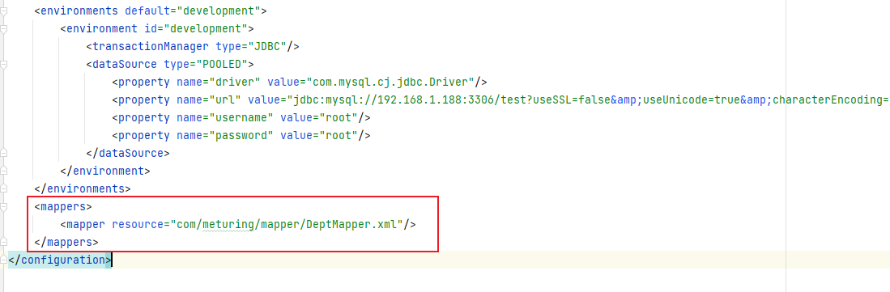

既然 MyBatis 的行为已经由上述元素配置完了，我们现在就要来定义 SQL 映射语句了。 但首先，我们需要告诉 MyBatis 到哪里去找到这些语句。 在自动查找资源方面，Java 并没有提供一个很好的解决方案，所以最好的办法是直接告诉 MyBatis 到哪里去找映射文件。 你可以使用相对于类路径的资源引用，或完全限定资源定位符（包括 `file:///` 形式的 URL），或类名和包名等。例如：

### 使用类路径的资源引用

mapper映射文件的文件路径导入 使用的mapper标签的resource属性

```XMl
<!-- 使用相对于类路径的资源引用 -->
<mappers>
  <mapper resource="org/mybatis/builder/AuthorMapper.xml"/>
  <mapper resource="org/mybatis/builder/BlogMapper.xml"/>
  <mapper resource="org/mybatis/builder/PostMapper.xml"/>
</mappers>
```

### 使用接口的全限定名导入

接口的全限定名导入 使用的是mapper标签的class属性 (基于接口的代理模式开发)

```XMl
<!-- 使用相对于类路径的资源引用 -->
<mappers>
  <mapper class="org.mybatis.builder.AuthorMapper"/>
  <mapper class="org.mybatis.builder.BlogMapper"/>
  <mapper class="org.mybatis.builder.PostMapper"/>
</mappers>
```

### 使用完全限定资源定位符（URL）

网络资源路径 使用的mapper标签的url属性

```XMl
<!-- 使用完全限定资源定位符（URL） -->
<mappers>
  <mapper url="file:///var/mappers/AuthorMapper.xml"/>
  <mapper url="file:///var/mappers/BlogMapper.xml"/>
  <mapper url="file:///var/mappers/PostMapper.xml"/>
</mappers>
```

### 将包内的映射器接口全部注册为映射器

包扫描形式加载所有的mapper映射文件 使用的是 package标签

```XMl
<!-- 将包内的映射器接口全部注册为映射器 -->
<mappers>
  <package name="org.mybatis.builder"/>
</mappers>
```

## 实体类别名处理

类型别名可为 Java 类型设置一个缩写名字。 它仅用于 XML 配置，意在降低冗余的全限定类名书写。例如：
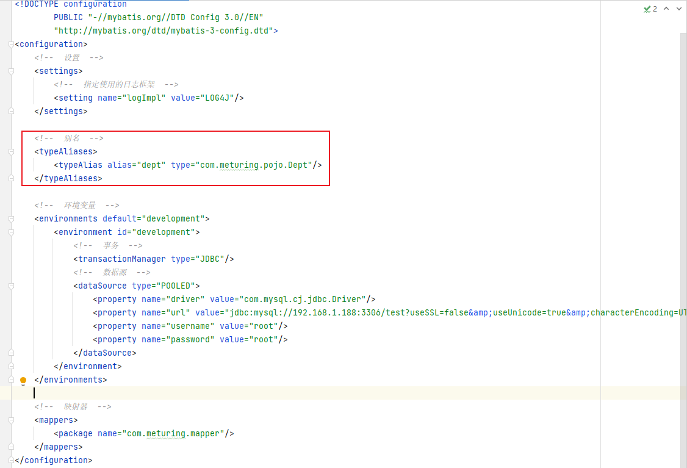

### 手动指定 typeAlias

#### 配置文件代码

```XML
<typeAliases>  
    <typeAlias alias="dept" type="com.meturing.pojo.Dept"/>  
</typeAliases>
```

#### 使用

我们可以直接使用指定的别名,就不用再写包的全类路径了

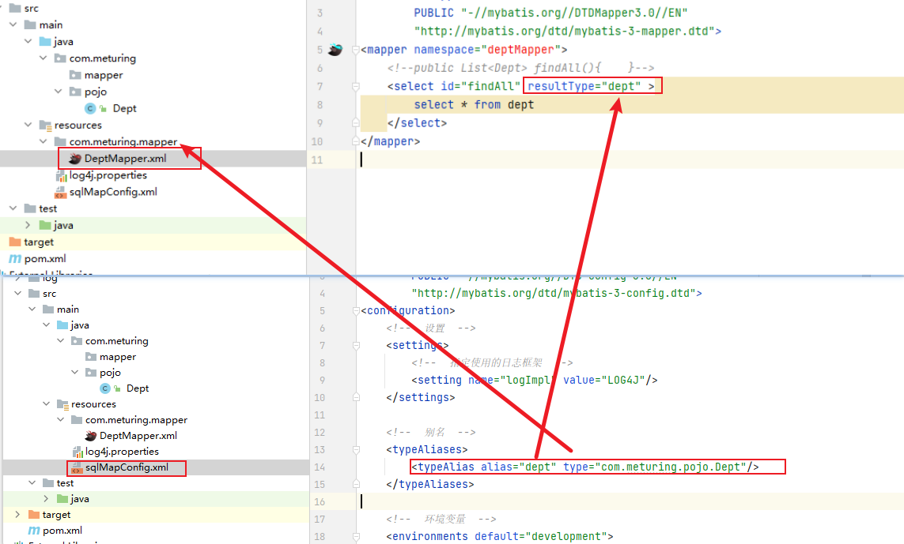


### 包扫描 package

#### 配置文件代码

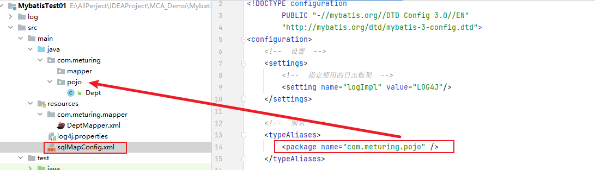

```XMl
<!--  别名  -->  
<typeAliases>  
    <package name="com.meturing.pojo" />  
</typeAliases>
```

#### 使用

**在没有注解的情况下，会使用 Bean 的首字母小写的非限定类名来作为它的别名。** 
比如 `domain.blog.Author` 的别名为 `author`；

若有注解`@Alias` ，则别名为其注解值。见下面的例子：
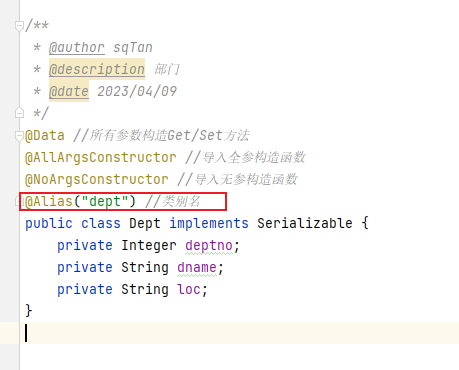

## 外部属性配置文件存储数据库链接信息

### 创建外部properties文件

```properties
jdbc_driver=com.mysql.cj.jdbc.Driver  
jdbc_url=jdbc:mysql://192.168.1.188:3306/test?useSSL=false&useUnicode=true&characterEncoding=UTF-8&serverTimezone=Asia/Shanghai  
jdbc_username=root  
jdbc_password=root
```

注意:
1. properties文件是Key=value的形式
2. 注意末尾空格也会被当作Value的字符
3. key最好不要使用常用类型,比如:`name `/ `userName`  / `type`  , 推荐使用下划线区分用途,如:`jdbc_username`


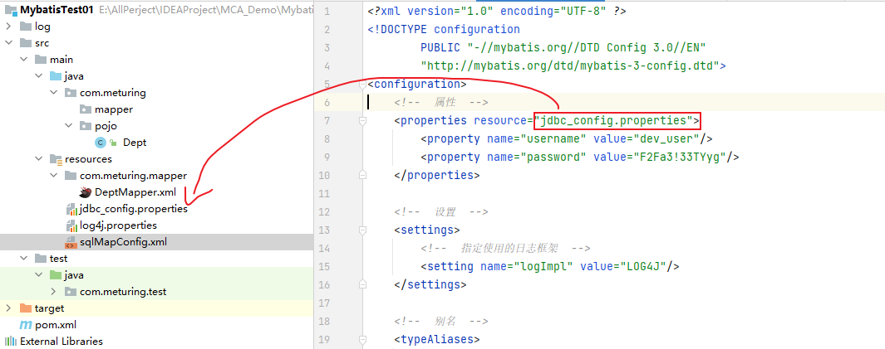

`properties`属性可以在外部进行配置，并可以进行动态替换。你既可以在典型的 Java 属性文件中配置这些属性，也可以在 properties 元素的子元素中设置。例如：

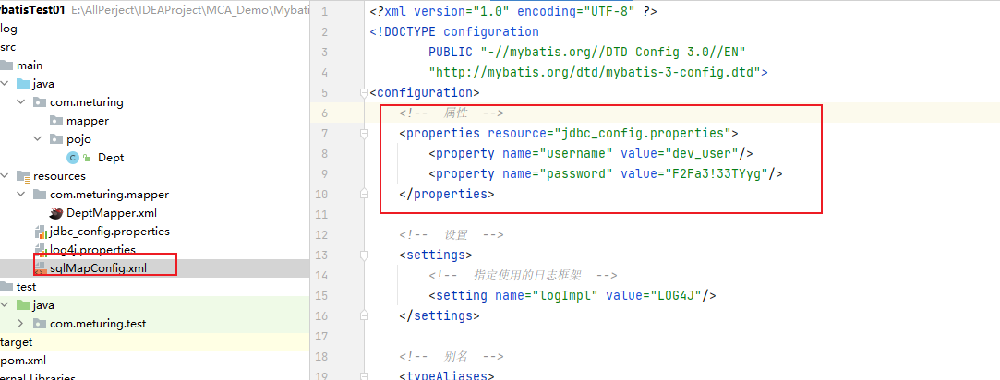

```XML
<!--  属性  -->  
<properties resource="jdbc_config.properties">  
    <property name="username" value="dev_user"/>  
    <property name="password" value="F2Fa3!33TYyg"/>  
</properties>
```

设置好的属性可以在整个配置文件中用来替换需要动态配置的属性值。比如:

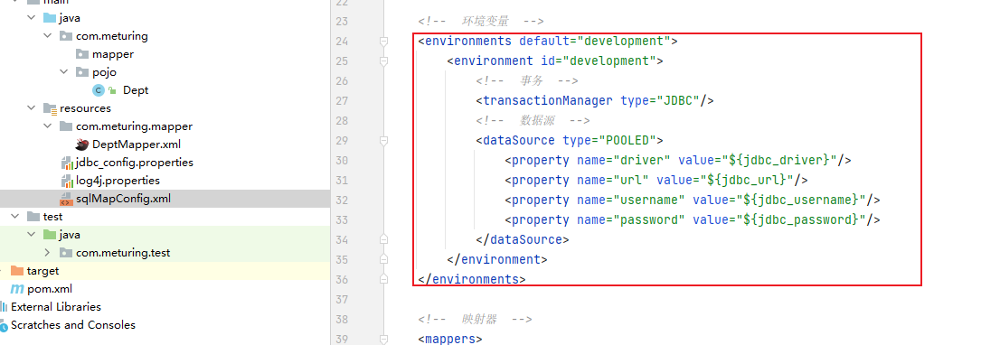

```XML
<dataSource type="POOLED">
  <property name="driver" value="${driver}"/>
  <property name="url" value="${url}"/>
  <property name="username" value="${username}"/>
  <property name="password" value="${password}"/>
</dataSource>
```

### 优先级

如果一个属性在不只一个地方进行了配置，那么，MyBatis 将按照下面的顺序来加载:
-   首先读取在 properties 元素体内指定的属性。
-   然后根据 properties 元素中的 resource 属性读取类路径下属性文件，或根据 url 属性指定的路径读取属性文件，并覆盖之前读取过的同名属性。
-   最后读取作为方法参数传递的属性，并覆盖之前读取过的同名属性。

**因此，通过方法参数传递的属性具有最高优先级，resource/url 属性中指定的配置文件次之，最低优先级的则是 properties 元素中指定的属性**


### 设置默认值

从 MyBatis 3.4.2 开始，你可以为占位符指定一个默认值。例如：

```XML
<dataSource type="POOLED">
  <!-- ... -->
  <property name="username" value="${username:ut_user}"/> <!-- 如果属性 'username' 没有被配置，'username' 属性的值将为 'ut_user' -->
</dataSource>
```

这个特性默认是关闭的。要启用这个特性，需要添加一个特定的属性来开启这个特性。例如：

```Xml
<properties resource="org/mybatis/example/config.properties">
  <!-- ... -->
  <property name="org.apache.ibatis.parsing.PropertyParser.enable-default-value" value="true"/> <!-- 启用默认值特性 -->
</properties>
```

 如果你在属性名中使用了 `":"` 字符（如：`db:username`），或者在 SQL 映射中使用了 OGNL 表达式的三元运算符（如： `${tableName != null ? tableName : 'global_constants'}`），**就需要设置特定的属性来修改分隔属性名和默认值的字符**。
 例如：

```XML
<properties resource="org/mybatis/example/config.properties">
  <!-- ... -->
  <property name="org.apache.ibatis.parsing.PropertyParser.default-value-separator" value="?:"/> <!-- 修改默认值的分隔符 -->
</properties>
```

```XMl
<dataSource type="POOLED">
  <!-- ... -->
  <property name="username" value="${db:username?:ut_user}"/>
</dataSource>
```

## 补充

在使用Mapper设置返回值类型时,我们对于基础类型无需写他的全类路径,Mybatis底层已经帮我们实现了别名

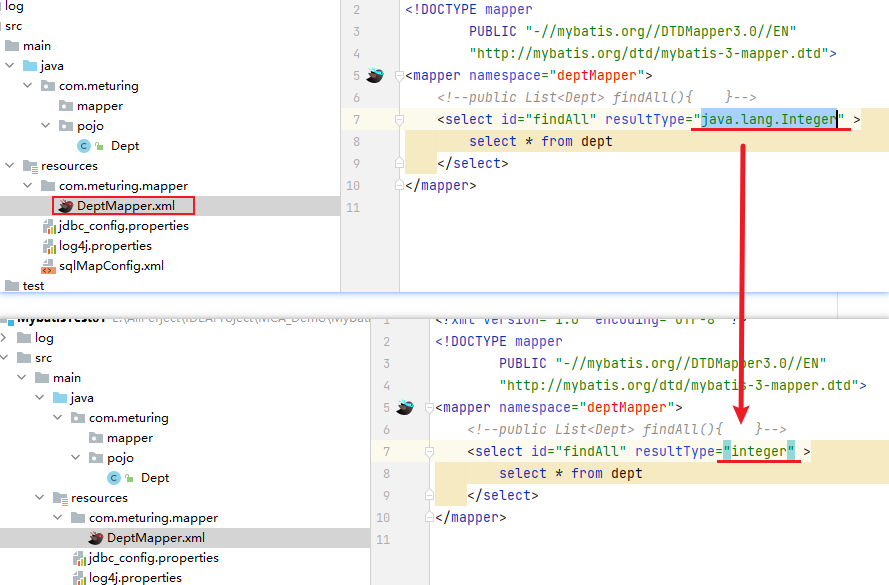

下面是一些为常见的 Java 类型内建的类型别名。它们都是不区分大小写的，注意，为了应对原始类型的命名重复，采取了特殊的命名风格。


总结来说:

原当初是大驼峰的,首字母全部转小写,如: `ArrayList` -> `arraylist`
原单词首字母是小写的个体单词,首字母前面加下划线,如:`int `->` _int`