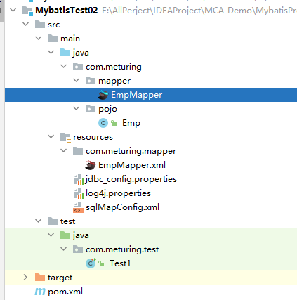
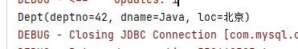

## 为什么要基于代理模式开发

前面已经使用MyBatis完成了对Emp表的CRUD操作，都是由SqlSession调用自身方法发送SQL命令并得到结果的，实现了MyBatis的入门.

但是这种开发形式存在以下缺点:
1.  不管是`selectList()`、`selectOne()`、`selectMap()`，都是通过`SQLSession对象`的API完成增删改查,都只能提供一个查询参数。如果要多个参数，**需要封装到JavaBean或者Map中**，并不一定永远是一个好办法。
2. 返回值类型较固定
3. 只提供了映射文件，没有提供数据库操作的接口，不利于后期的维护扩展。

**在MyBatis中提供了另外一种成为Mapper代理（或称为接口绑定）的操作方式** , 在实际开发中也使用该方式.
相较于SQLSession的基本开发模式,基于代理的开发存在以下优点:
1. 有接口 模块之间有规范了
2. 参数的处理多样了,接口中的方法参数列表由我们自己决定
3. 通过代理模式由mybatis提供接口的实现类对象 我们不用写实现类了

## 构建项目结构

### 项目环境

#### 构建步骤

- 创建一个Maven工程项目
- 修改pom.xml文件
```XMl 
    <groupId>com.meturing</groupId>  
    <artifactId>MybatisTest02</artifactId>  
    <version>1.0-SNAPSHOT</version>  
    <packaging>jar</packaging>  
    <properties>  
        <maven.compiler.source>8</maven.compiler.source>  
        <maven.compiler.target>8</maven.compiler.target>  
    </properties>  
    <dependencies>  
        <!--mysqlConnector-->  
        <dependency>  
            <groupId>mysql</groupId>  
            <artifactId>mysql-connector-java</artifactId>  
            <version>8.0.16</version>  
        </dependency>  
        <!--mybatis 核心jar包-->  
        <dependency>  
            <groupId>org.mybatis</groupId>  
            <artifactId>mybatis</artifactId>  
            <version>3.5.3</version>  
        </dependency>  
        <!--junit-->  
        <dependency>  
            <groupId>junit</groupId>  
            <artifactId>junit</artifactId>  
            <version>4.13.1</version>  
            <scope>test</scope>  
        </dependency>  
        <!--lombok -->  
        <dependency>  
            <groupId>org.projectlombok</groupId>  
            <artifactId>lombok</artifactId>  
            <version>1.18.12</version>  
            <scope>provided</scope>  
        </dependency>  
        <!-- log4j1 -->  
        <dependency>  
            <groupId>log4j</groupId>  
            <artifactId>log4j</artifactId>  
            <version>1.2.17</version>  
        </dependency>  
    </dependencies>  
```

- 创建sqlMapConfig.xml文件
```XML
<?xml version="1.0" encoding="UTF-8" ?>  
<!DOCTYPE configuration  
        PUBLIC "-//mybatis.org//DTD Config 3.0//EN"  
        "http://mybatis.org/dtd/mybatis-3-config.dtd">  
<configuration>  
    <!--  属性  -->  
    <properties resource="jdbc_config.properties">  
        <property name="username" value="dev_user"/>  
        <property name="password" value="F2Fa3!33TYyg"/>  
    </properties>  
    <!--  设置  -->  
    <settings>  
        <!--  指定使用的日志框架  -->  
        <setting name="logImpl" value="LOG4J"/>  
    </settings>  
    <!--  别名  -->  
    <typeAliases>  
        <package name="com.meturing.pojo" />  
    </typeAliases>  
    <!--  环境变量  -->  
    <environments default="development">  
        <environment id="development">  
            <!--  事务  -->  
            <transactionManager type="JDBC"/>  
            <!--  数据源  -->  
            <dataSource type="POOLED">  
                <property name="driver" value="${jdbc_driver}"/>  
                <property name="url" value="${jdbc_url}"/>  
                <property name="username" value="${jdbc_username}"/>  
                <property name="password" value="${jdbc_password}"/>  
            </dataSource>  
        </environment>  
    </environments>  
    <!--  映射器  -->  
    <mappers>  
        <!-- 扫描指定目录下的Mapper接口 -->  
        <package name="com.meturing.mapper"/>  
        <!--        <mapper class="com.meturing.mapper.EmpMapper" />-->  
    </mappers>  
</configuration>
```
注意:由于我们本次使用了代理模式的开发,所以对于Mapper映射器的配置需要我们指向接口所在的位置. 所以我们可以使用`<mapper class="com.meturing.mapper.EmpMapper" />` 指向具体的接口  或者 `<package name="com.meturing.mapper"/>` 扫描指定包下所有的接口

- 创建数据源和Log4j配置文件
```Properties
#定义全局日志级别调试阶段推荐debug  
#log4j.rootLogger=debug,stdout,logfile   #及打印到控制台又输出到文件  
log4j.rootLogger=debug,stdout    
#stdout 输出到控制台  
log4j.appender.stdout=org.apache.log4j.ConsoleAppender  log4j.appender.stdout.Target=System.err  log4j.appender.stdout.layout=org.apache.log4j.SimpleLayout    
#logfile 输出到文件  
log4j.appender.logfile=org.apache.log4j.FileAppender  log4j.appender.logfile.File=d:/meturing.log  log4j.appender.logfile.layout=org.apache.log4j.PatternLayout  log4j.appender.logfile.layout.ConversionPattern=%d{yyyy-MM-dd HH:mm:ss} %l %F %p %m%n
```

```Properties
jdbc_driver=com.mysql.cj.jdbc.Driver  
jdbc_url=jdbc:mysql://192.168.1.188:3306/test?useSSL=false&useUnicode=true&characterEncoding=UTF-8&serverTimezone=Asia/Shanghai  
jdbc_username=root  
jdbc_password=root
```

- 创建实体类Emp.java
```Java
@Data  
@AllArgsConstructor  
@NoArgsConstructor  
public class Emp {  
    private Integer empno;  
    private String ename;  
    private String job;  
    private Integer mgr;  
    private Date hiredate;  
    private Double sal;  
    private Double comm;  
    private Integer deptno;  
}
```

- 创建EmpMapper接口
```Java
/**  
 * @author meturing 
 * @description emp映射器  
 * @date 2023/04/13  
 */
 public interface EmpMapper {  

}
```

- 创建EmpMapper.xml文件
```XMl
<?xml version="1.0" encoding="UTF-8" ?>  
<!DOCTYPE mapper  
        PUBLIC "-//mybatis.org//DTDMapper3.0//EN"  
        "http://mybatis.org/dtd/mybatis-3-mapper.dtd">  
<mapper namespace="com.meturing.mapper.EmpMapper">  

</mapper>
```
**注意:此时的namespace中需要填写EmpMapper接口的全类路径**

- 创建测试单元类Test1.java
```Java
public class Test1 {  
    private static SqlSession sqlSession = null;  
    /**  
     * 初始化  
     *  Before注解会使方法在执行测试单元前执行  
     * @author sqTan  
     * @date 2023/04/09     
     * */    
    @Before  
    public void init() {  
        //创建一个SqlSessionFactoryBuilder对象  
        SqlSessionFactoryBuilder sqlSessionFactoryBuilder = new SqlSessionFactoryBuilder();  
        InputStream resourceAsStream = null;  
        try {  
            //通过Resources类获取指定配置文件的InputStream流  
            resourceAsStream = Resources.getResourceAsStream("sqlMapConfig.xml");  
        } catch (IOException e) {  
            e.printStackTrace();  
        }  
        //通过SqlSessionFactoryBuilder对象使用配置文件的InputStream流构建一个SqlSessionFactory对象  
        SqlSessionFactory build = sqlSessionFactoryBuilder.build(resourceAsStream);  
        //使用SqlSessionFactory对象打开数据库链接  
        sqlSession = build.openSession();  
    }  
    
    /**  
     * 释放  
     * After注解会使方法在执行测试单元后执行  
     * @author sqTan  
     * @date 2023/04/09     
     * */    
    @After  
    public void release(){  
        //关闭链接  
        sqlSession.close();  
    }  
}
```

基本结构见下图:



#### 注意事项

特别注意: 在代理模式开发下,<font color="#ff0000">我们必需要保证以下几点要素</font>:
1. <font color="#ffc000">接口的名字和Mapper映射为文件名字必须保持一致(不包含拓展名)</font>
2. <font color="#ffc000">Mapper映射文件的namespace必须是接口的全路径名</font>
3. <font color="#ffc000">DeptMapper映射文件应该和接口编译之后放在同一个目录下</font>

	XML文件放到resources目录下,与接口的层级保持一致

### 简单的Demo

接下来我们创建一个查询所有数据的方法,此时还需要注意:
**接口中的抽象方法的名字需要与Mapper.xml中的id属性保持一致!!**

#### 创建接口中的抽象方法

```Java
/**  
 * 找到所有  
 *  
 * @return {@link List }<{@link Emp }>  
 * @author sqTan * @date 2023/04/13 
 * */
 List<Emp> findAll();
```

#### 创建Mapper.xml中的查询语句

```XMl
<select id="findAll" resultType="emp">  
    select * from emp
</select>
```

#### 使用测试类测试

我们通过`sqlSession.getMapper(Class<T> var1)`方法获取接口的代理对象,然后直接执行代理对象的方法
构建接口的实现类以及处理查询的操作全部交给Mybatis来处理

```Java
@Test  
public void testFindAll() {  
	EmpMapper mapper = sqlSession.getMapper(EmpMapper.class);  
	List<Emp> empList = mapper.findAll();  
	empList.stream().forEach(System.out::println);  
}  
```

## 代理模式浅析

为什么我们通过接口,无需实现类就可以实现对数据库的操作?
简单来讲,在我们使用`sqlSession.getMapper(Class<T> var1)`方法时,Maybatis底层为我们做了以下事情:

1. 通过该方法在映射器中找到这个接口的字节码文件
2. 在底层动态为我们生成了这个接口的实现类(返回null/无任何意义)
3. 对这个生成的实现类采用动态代理的形式,通过Mapper.xml中的`namespace`路径匹配,用方法名与标签中的`ID`配对生成增强的代理对象
4. 将这个增强的类的对象返回给我们使用

## 代理模式基本开发

### 参数传递问题

#### 单一参数

##### EmpMapper接口

```Java
Emp findByEmpno(int empno);
```

#####  EmpMapper.xml

#{}中可以随便写,遵循见名知意
```XMl
<select id="findByEmpno" parameterType="int" resultType="emp">  
    select * from emp where empno=#{empno}
</select>
```

#####  测试类

```Java
@Test  
public void testFindByEmpno() {  
    EmpMapper mapper = sqlSession.getMapper(EmpMapper.class);  
    Emp byEmpno = mapper.findByEmpno(7499);  
    System.out.println(byEmpno);  
}
```

#### 多参数

##### 方式一 : arg*

arg相当于通过数组获取参数结果,所以下标从0开始

 - EmpMapper接口
```Java
List<Emp> findByDeptnoAndSal(int deptno,double sal);
```

- EmpMapper.xml
```XMl
<select id="findByEmpno" resultType="emp">  
    select * from emp where deptno =#{arg0} and sal &gt;= #{arg1}
</select>
```

##### 方式二 : param*

arg相当于通过参数位置获取参数结果,所以下标从1开始

 - EmpMapper接口
```Java
List<Emp> findByDeptnoAndSal(int deptno,double sal);
```

- EmpMapper.xml
```XMl
<select id="findByEmpno" resultType="emp">  
    select * from emp where deptno =#{param1} and sal &gt;= #{param2}
</select>
```

##### 方式三 : @Param别名

 - 通过@Param注解使用别名之后,就不能再使用arg* 但是可以继续使用param*

 - EmpMapper接口
```Java
List<Emp> findByDeptnoAndSal(@Param("deptno") int deptno, @Param("sal") double sal);
```

- EmpMapper.xml
```XMl
<select id="findByEmpno" resultType="emp">  
    select * from emp where deptno =#{deptno} and sal &gt;= #{sal}
</select>
```

#####  测试类

```Java
@Test  
public void testFindByDeptnoAndSal() {  
    EmpMapper mapper = sqlSession.getMapper(EmpMapper.class);  
    List<Emp> byDeptnoAndSal = mapper.findByDeptnoAndSal(20, 1500.0);  
    byDeptnoAndSal.stream().forEach(System.out::println);  
}
```

#### 集合

参数是map,{}写键的名字

##### EmpMapper接口

```Java
List<Emp> findMapByDeptnoAndSal(Map<String, Object> map);
```

#####  EmpMapper.xml

#{}中可以随便写,遵循见名知意
```XMl
<select id="findMapByDeptnoAndSal" parameterType="map" resultType="emp">  
    select * from emp where deptno =#{deptno} and sal &gt;= #{sal}  
</select>
```

#####  测试类

```Java
@Test  
public void findMapByDeptnoAndSal() {  
    EmpMapper mapper = sqlSession.getMapper(EmpMapper.class);  
    HashMap<String, Object> map = new HashMap<>();  
    map.put("deptno",20);  
    map.put("sal",1500.0);  
    List<Emp> byDeptnoAndSal = mapper.findMapByDeptnoAndSal(map);  
    byDeptnoAndSal.stream().forEach(System.out::println);  
}
```

#### 单个引用对象

单个引用类型,{}中写的使用对象的属性名

##### EmpMapper接口

```Java
List<Emp> findObjectByDeptnoAndSal1 (Emp emp);
```

#####  EmpMapper.xml

#{}中可以随便写,遵循见名知意
```XMl
<select id="findObjectByDeptnoAndSal1" parameterType="emp" resultType="emp">  
    select * from emp where deptno =#{deptno} and sal &gt;= #{sal}  
</select>
```

#####  测试类

```Java
@Test  
public void findObjectByDeptnoAndSal1() {  
    EmpMapper mapper = sqlSession.getMapper(EmpMapper.class);  
    Emp emp = new Emp();  
    emp.setDeptno(20);  
    emp.setSal(1500.0);  
    List<Emp> byDeptnoAndSal = mapper.findObjectByDeptnoAndSal1(emp);  
    byDeptnoAndSal.stream().forEach(System.out::println);  
}
```

#### 多个引用对象
##### 方式一 : arg*

arg相当于通过数组获取参数结果,所以下标从0开始

 - EmpMapper接口
```Java
List<Emp> findObjectByDeptnoAndSal2 (Emp emp1,Emp emp2);
```

- EmpMapper.xml
```XMl
<select id="findObjectByDeptnoAndSal2"  resultType="emp">  
    select * from emp where deptno =#{arg0.deptno} and sal &gt;= #{arg1.sal}
</select>
```

##### 方式二 : param*

arg相当于通过参数位置获取参数结果,所以下标从1开始

 - EmpMapper接口
```Java
List<Emp> findObjectByDeptnoAndSal2 (Emp emp1,Emp emp2);
```

- EmpMapper.xml
```XMl
<select id="findObjectByDeptnoAndSal2"  resultType="emp">  
    select * from emp where deptno =#{param1.deptno} and sal &gt;= #{param2.sal}
</select>
```

##### 方式三 : @Param别名

 - 通过@Param注解使用别名之后,就不能再使用arg* 但是可以继续使用param*

 - EmpMapper接口
```Java
List<Emp> findObjectByDeptnoAndSal2 (@Param("emp1") Emp emp1,@Param("emp2") Emp emp2);
```

- EmpMapper.xml
```XMl
<select id="findByEmpno" resultType="emp">  
    select * from emp where deptno =#{emp1.deptno} and sal &gt;= #{emp2.sal}
</select>
```

#####  测试类

```Java
@Test  
public void findObjectByDeptnoAndSal2() {  
    EmpMapper mapper = sqlSession.getMapper(EmpMapper.class);  
    Emp emp1 = new Emp();  
    emp1.setDeptno(20);  
    Emp emp2 = new Emp();  
    emp2.setSal(1500.0);  
    List<Emp> byDeptnoAndSal = mapper.findObjectByDeptnoAndSal2(emp1,emp2);  
    byDeptnoAndSal.stream().forEach(System.out::println);  
}
```

### 模糊查询

#### 方式一:直接在参数中处理

EmpMapper.java 接口
```Java
List<Emp> findObjectByName(String ename);
```

EmpMapper.xml
```XMl
<select id="findObjectByName" parameterType="string" resultType="emp">  
    select * from emp where ename like #{ename}
</select>
```

测试单元
```Java
public void findObjectByName(){  
    EmpMapper mapper = sqlSession.getMapper(EmpMapper.class);  
    List<Emp> empList = mapper.findObjectByName("%a%");  
    empList.stream().forEach(System.out::println);  
}
```


#### 方式二: 使用concat()函数拼接 - 推荐

在进行模糊查询时，在映射文件中可以使用`concat()函数`来连接参数和通配符。
**另外注意对于特殊字符，比如<，不能直接书写，应该使用字符实体替换。**

EmpMapper.java 接口
```Java
List<Emp> findObjectByName(String ename);
```

EmpMapper.xml
```XMl
<select id="findObjectByName" parameterType="string" resultType="emp">  
    select * from emp where ename like concat('%',#{ename},'%')
</select>
```

测试单元
```Java
@Test  
public void findObjectByName(){  
    EmpMapper mapper = sqlSession.getMapper(EmpMapper.class);  
    List<Emp> empList = mapper.findObjectByName("a");  
    empList.stream().forEach(System.out::println);  
}
```


### 自增主键回填

MySQL支持主键自增。有时候完成添加后需要立刻获取刚刚自增的主键，由下一个操作来使用。比如结算构造车后，主订单的主键确定后，需要作为后续订单明细项的外键存在。如何拿到主键呢，MyBatis提供了支持，可以非常简单的获取。

> 在很多应用场景中需要新增数据后获取到新增数据的主键值，针对这样的需求一般由三种解决方式：
> 	1. 主键自定义，用户通过UUID或时间戳等方式生成唯一主键，把这个值当做主键值。在分布式场景中应用较多
> 	2.  查询后通过select max(主键) from 表获取主键最大值。这种方式在多线程访问情况下可能出现问题
> 	3. 查询后通过select @@identity获取最新生成主键。要求这条SQL必须在insert操作之后，且数据库连接没有关闭

#### 方式一 : useGeneratedKeys - 推荐

DeptMapper.java接口
```Java
int insterDept(Dept dept);
```

DeptMapper.xml
  - `useGeneratedKeys="true" `返回数据库帮我们生成的主键_
  - `keyProperty="deptno" `生成的主键值用我们dept对象那个属性存储_
```XMl
<insert id="insterDept" parameterType="dept" useGeneratedKeys="true" keyProperty="deptno">  
    INSERT INTO dept  VALUES(#{deptno},#{dname},#{loc})
</insert>
```

测试单元
```Java
@Test  
public void insterDept() {  
    DeptMapper deptMapper = sqlSession.getMapper(DeptMapper.class);  
    Dept dept = new Dept(null, "Java", "北京");  
    deptMapper.insterDept(dept);  
    System.out.println(dept);  
}
```

我们看到,当我们执行成功后,插入生成的主键将会重新回填到原有的对象中



#### 方式二 : selectKey标签

参数详解
order：取值AFTER|BEFORE，表示在新增之后|之前执行`<selectKey>`中的SQL命令
keyProperty：执行select @@identity后结果填充到哪个属性中


DeptMapper.java接口
```Java
int insterDept(Dept dept);
```

DeptMapper.xml
使用`selectKey`标签检索,`order="AFTER"`表示插入之后,`keyProperty="deptno"`设置主键字段, `resultType="int"`表示主键类型, `select  @@identity` 得到上一次插入记录时自动产生的ID
```XMl
<insert id="insterDept2" parameterType="dept">  
    <selectKey order="AFTER" keyProperty="deptno"  resultType="int">  
        select @@identity    
	</selectKey>  
    insert into dept values(null,#{dname},#{loc})
</insert>
```

测试单元
```Java
@Test  
public void insterDept() {  
    DeptMapper deptMapper = sqlSession.getMapper(DeptMapper.class);  
    Dept dept = new Dept(null, "Java", "北京");  
    deptMapper.insterDept(dept);  
    System.out.println(dept);  
}
```

我们看到,当我们执行成功后,插入生成的主键将会重新回填到原有的对象中


### 实现DML操作

#### 新增

见 [[Mybatis代理模式的开发#自增主键回填]]]

#### 查询

DeptMapper.java接口
```Java
Dept findDeptById(int deptId);
```

DeptMapper.xml
```XMl
<select id="findDeptById" parameterType="int" resultType="dept">  
    select * from dept where deptno =#{deptno}
</select>
```

测试单元
```Java
@Test  
public void updateDept(){  
    DeptMapper deptMapper = sqlSession.getMapper(DeptMapper.class);  
    Dept deptById = deptMapper.findDeptById(43);  
}
```

#### 修改

DeptMapper.java接口
```Java
int updateDept(Dept dept);
```

DeptMapper.xml
```XMl
<update id="updateDept" parameterType="dept">  
    UPDATE dept SET DNAME=#{dname}, LOC=#{loc} WHERE DEPTNO=#{deptno}
</update>
```

测试单元
```Java
@Test  
public void updateDept(){  
    DeptMapper deptMapper = sqlSession.getMapper(DeptMapper.class);  
    Dept deptById = deptMapper.findDeptById(43);  
    deptById.setLoc("上海");  
    deptMapper.updateDept(deptById);  
}
```

#### 删除

DeptMapper.java接口
```Java
int deleteDept(int deptNo);
```

DeptMapper.xml
```XMl
<delete id="deleteDept" parameterType="int">  
    DELETE FROM dept WHERE DEPTNO=#{deptno}
</delete>
```

测试单元
```Java
@Test  
public void deleteDept(){  
    DeptMapper deptMapper = sqlSession.getMapper(DeptMapper.class);  
    deptMapper.deleteDept(43);  
}
```

