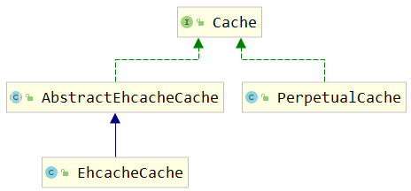

## 了解缓存

### 什么时缓存

**缓存** : 是一种临时存储少量数据至内存或者是磁盘的一种技术.减少数据的加载次数,可以降低工作量,提高程序响应速度

缓存的重要性是不言而喻的。mybatis的缓存将相同查询条件的SQL语句执行一遍后所得到的结果存在内存或者某种缓存介质当中，当下次遇到一模一样的查询SQL时候不在执行SQL与数据库交互，而是直接从缓存中获取结果，减少服务器的压力；尤其是在查询越多、缓存命中率越高的情况下，使用缓存对性能的提高更明显。

MyBatis允许使用缓存，缓存一般放置在高速读/写的存储器上，比如服务器的内存，能够有效的提供系统性能。**MyBatis分为一级缓存和二级缓存**，同时也可配置关于缓存设置。

### 缓存的使用顺序


查询的顺序是：
-   先查询二级缓存，因为二级缓存中可能会有其他程序已经查出来的数据，可以拿来直接使用。
-   如果二级缓存没有命中，再查询一级缓存
-   如果一级缓存也没有命中，则查询数据库
-   SqlSession关闭之前，一级缓存中的数据会写入二级缓存

### 缓存的效力范围


**一级存储是SqlSession上的缓存**，**二级缓存是在SqlSessionFactory(namespace)上的缓存**。默认情况下，MyBatis开启一级缓存，没有开启二级缓存。当数据量大的时候可以借助一些**第三方缓存框架或Redis缓存来协助保存Mybatis的二级缓存数据**。


## 一级缓存

**一级存储是SqlSession上的缓存，默认开启，是一种内存型缓存,不要求实体类对象实现Serializable接口。**


当我们获得一次请求后,缓存中的数据使用键值对形式存储数据. 通常是通过`namespace+sqlid+args+offset` 计算哈希值作为Key,将返回的对象作为value

### 开启缓存

默认开启!

### 案例

```Java
@Test  
public void Testcache1(){  
    DeptMapper mapper1 = sqlSession.getMapper(DeptMapper.class);  
    Dept dept1 = mapper1.findeDept(20);  
  
    DeptMapper mapper2 = sqlSession.getMapper(DeptMapper.class);  
    Dept dept2 = mapper2.findeDept(20);  
  
    System.out.println(mapper1==mapper2);  //false
    System.out.println(dept1==dept2);  //true
}
```

我们查看控制台发现,两次查询调用实际上只请求了一次数据库,第二次使用的是缓存,且返回的实体对象是同一个对象


### 注意事项

以下操作会导致一级缓存失效:

-   不是同一个SqlSession
-   同一个SqlSession但是查询条件发生了变化
-   同一个SqlSession两次查询期间执行了任何一次增删改操作
-   同一个SqlSession两次查询期间手动清空了缓存
-   同一个SqlSession两次查询期间提交了事务

## 二级缓存

**二级缓存是以namespace为标记的缓存，可以是由一个SqlSessionFactory创建的SqlSession之间共享缓存数据。默认并不开启。**


### 开启缓存

1) 配置Mybatis配置文件 : 在sqlMapConfig.xml文件中的`<settings>`标签配置开启二级缓存

cacheEnabled的默认值就是true，所以这步的设置可以省略

2) 配置Mapper文件 : 在要开启二级缓存的mapper文件中开启缓存


3) 设置实体类 : 实体类必须序列化!


经过设置后，查询结果如图所示。发现第一个SqlSession会首先去二级缓存中查找，如果不存在，就查询数据库，**在commit()或者close()的时候将数据放入到二级缓存**。第二个SqlSession执行相同SQL语句查询时就直接从二级缓存中获取了。

### 案例

下面的代码中创建了两个SqlSession，执行相同的SQL语句，尝试让第二个SqlSession使用第一个SqlSession查询后缓存的数据。要求实体类必须实现序列化接口

```Java
@Test  
public void Testcache2(){  
    EmpMapper mapper1 = sqlSession.getMapper(EmpMapper.class);  
    List<Emp> emp1 = mapper1.findEmp(20);  
    sqlSession.commit();  
    EmpMapper mapper2 = sqlSession.getMapper(EmpMapper.class);  
    List<Emp> emp2 = mapper2.findEmp(20);  
    System.out.println(mapper1==mapper2);  
    System.out.println(emp1==emp2);  
}
```

我们看到,此时仍是只查询了一次数据库,且返回的对象不是同一个,但出现了缓存命中的提示:`Cache Hit Ratio [com.meturing.mapper.EmpMapper]: 0.5`


缓存命中率的计算 :  缓存命中率 = 命中缓存的次数 / 查询的总次数

### 注意事项

1. MyBatis的二级缓存的缓存介质有多种多样，而并不一定是在内存中，所以需要对JavaBean对象实现序列化接口。
2. 二级缓存是以 namespace 为单位的，不同 namespace 下的操作互不影响
3. 加入Cache元素后，会对相应命名空间所有的select元素查询结果进行缓存，而其中的insert、update、delete在操作是会清空整个namespace的缓存
4. **如果在加入Cache元素的前提下让个别select 元素不使用缓存，可以使用useCache属性，设置为false。**(`useCache`控制当前sql语句是否启用缓存  `flushCache`控制当前sql执行一次后是否刷新缓存)
   `<select id="findByEmpno" resultType="emp" useCache="true" flushCache="false">`

### 缓存中的其他参数

```XML
<cache type="" readOnly="" eviction="" flushInterval="" size="" blocking=""/>
```

| 属性            | 含义                                                                                                                                                                                                      | 默认值   |
|:--------------|:--------------------------------------------------------------------------------------------------------------------------------------------------------------------------------------------------------|:------|
| type          | 自定义缓存类，要求实现org.apache.ibatis.cache.Cache接口                                                                                                                                                              | null  |
| readOnly      | <div>是否只读</div><div>true:给所有调用者返回缓存对象的相同实例。因此这些对象不能被修改。这提供了很重要的性能优势。</div><div>false:会返回缓存对象的拷贝(通过序列化) 。这会慢一些,但是安全</div>                                                                                | false |
| eviction      | <div>缓存策略</div><div>LRU（默认） – 最近最少使用：移除最长时间不被使用的对象。</div><div>FIFO – 先进先出：按对象进入缓存的顺序来移除它们。</div><div>SOFT – 软引用：基于垃圾回收器状态和软引用规则移除对象。</div><div>WEAK – 弱引用：更积极地基于垃圾收集器状态和弱引用规则移除对象。</div><div><br></div> | LRU   |
| flushInterval | 刷新间隔，毫秒为单位。默认为null，也就是没有刷新间隔，只有执行update、insert、delete语句才会刷新                                                                                                                                             | null  |
| size          | 缓存对象个数                                                                                                                                                                                                  |  1024 |
| blocking      | <div>是否使用阻塞性缓存BlockingCache</div><div>true：在查询缓存时锁住对应的Key，如果缓存命中了则会释放对应的锁，否则会在查询数据库以后再释放锁，保证只有一个线程到数据库中查找指定key对应的数据</div><div>false：不使用阻塞性缓存，性能更好</div><div><br></div>                                  | false |  

## 三方缓存 - Ehcache

分布式缓存框架：我们系统为了提高系统并发 和性能，一般对系统进行分布式部署（集群部署方式）不适用分布缓存， 缓存的数据在各个服务单独存储，不方便系统开发。所以要使用分布式缓存对缓存数据进行集中管理.ehcache,redis ,memcache缓存框架。

`Ehcache`：是一种广泛使用的开源java分布式缓存。主要面向通用缓存，javaEE 和 轻量级容器。它具有内存和磁盘存储功能。被用于大型复杂分布式web application的

### 配置Ehcache的环境

#### 导入Pom.xml依赖

```XML
<!-- Mybatis EHCache整合包 -->  
<dependency>  
    <groupId>org.mybatis.caches</groupId>  
    <artifactId>mybatis-ehcache</artifactId>  
    <version>1.2.1</version>  
</dependency>  
<!-- slf4j日志门面的一个具体实现 -->  
<dependency>  
    <groupId>ch.qos.logback</groupId>  
    <artifactId>logback-classic</artifactId>  
    <version>1.2.3</version>  
</dependency>
```

#### 创建EHCache配置文件


```XMl
<?xml version="1.0" encoding="utf-8" ?>
<ehcache xmlns:xsi="http://www.w3.org/2001/XMLSchema-instance"
         xsi:noNamespaceSchemaLocation="../config/ehcache.xsd">
    <!-- 磁盘保存路径 -->
    <diskStore path="D:\atguigu\ehcache"/>
    
    <defaultCache
            maxElementsInMemory="1000"
            maxElementsOnDisk="10000000"
            eternal="false"
            overflowToDisk="true"
            timeToIdleSeconds="120"
            timeToLiveSeconds="120"
            diskExpiryThreadIntervalSeconds="120"
            memoryStoreEvictionPolicy="LRU">
    </defaultCache>
</ehcache>
```
defaultCache标签各属性说明
当借助CacheManager.add("缓存名称")创建Cache时，EhCache便会采用<defalutCache/>指定的的管理策略。

**文件名必须叫做:ehcache.xml**

#### 指定缓存管理器的具体类型


```XML
<cache type="org.mybatis.caches.ehcache.EhcacheCache"/>
```

#### 加入logback日志

存在SLF4J时，作为简易日志的log4j将失效，此时我们需要借助SLF4J的具体实现logback来打印日志。

将原有的log4j文件及依赖清除后,再导入SLF4J的具体实现logback日志


logback.xml

```XML
<?xml version="1.0" encoding="UTF-8"?>  
<configuration debug="true">  
    <!-- 指定日志输出的位置 -->  
    <appender name="STDOUT"  
              class="ch.qos.logback.core.ConsoleAppender">  
        <encoder>  
            <!-- 日志输出的格式 -->  
            <!-- 按照顺序分别是：时间、日志级别、线程名称、打印日志的类、日志主体内容、换行 -->  
            <pattern>[%d{HH:mm:ss.SSS}] [%-5level] [%thread] [%logger] [%msg]%n</pattern>  
        </encoder>  
    </appender>  
    <!-- 设置全局日志级别。日志级别按顺序分别是：DEBUG、INFO、WARN、ERROR -->  
    <!-- 指定任何一个日志级别都只打印当前级别和后面级别的日志。 -->  
    <root level="DEBUG">  
        <!-- 指定打印日志的appender，这里通过“STDOUT”引用了前面配置的appender -->  
        <appender-ref ref="STDOUT" />  
    </root>  
    <!-- 根据特殊需求指定局部日志级别 -->  
    <logger name="com.atguigu.crowd.mapper" level="DEBUG"/>  
</configuration>
```

如果再Mybatis中配置了具体的日志指向,则需要修改


此处可以删除,让Mybatis自己选择,详情见 [[Mybatis配置#导入Log4j日志框架]]

### 测试

```Java
@Test  
public void Testcache2(){  
    EmpMapper mapper1 = sqlSession.getMapper(EmpMapper.class);  
    List<Emp> emp1 = mapper1.findEmp(20);  
    sqlSession.commit();  
    EmpMapper mapper2 = sqlSession.getMapper(EmpMapper.class);  
    List<Emp> emp2 = mapper2.findEmp(20);  
    System.out.println(mapper1==mapper2);  
    System.out.println(emp1==emp2);  
}
```


我们发现,此时以及成功使用了Ehcache缓存,且成功命中


## 缓存的基本原理

根据Cache接口中方法的声明我们能够看到，缓存的本质是一个Map。

### Cache接口

`org.apache.ibatis.cache.Cache`接口：所有缓存都必须实现的顶级接口



#### Cache接口的方法


#### PerpetualCache 实现类


org.apache.ibatis.cache.impl.PerpetualCache**是Mybatis的默认缓存**，**也是Cache接口的默认实现**。**Mybatis一级缓存和自带的二级缓存都是通过PerpetualCache来操作缓存数据的**。但是这就奇怪了，同样是PerpetualCache这个类，怎么能区分出来两种不同级别的缓存呢？

一级缓存与二级缓存的调用者不同
-   一级缓存：由**BaseExecutor调用PerpetualCache**
-   二级缓存：由**CachingExecutor调用PerpetualCache**，而CachingExecutor可以看做是对BaseExecutor的装饰

### 一级缓存机制


org.apache.ibatis.executor.BaseExecutor类中的关键方法：

query( )方法
```Java
public <E> List<E> query(MappedStatement ms, Object parameter, RowBounds rowBounds, ResultHandler resultHandler, CacheKey key, BoundSql boundSql) throws SQLException {
    ErrorContext.instance().resource(ms.getResource()).activity("executing a query").object(ms.getId());
    if (closed) {
        throw new ExecutorException("Executor was closed.");
    }
    if (queryStack == 0 && ms.isFlushCacheRequired()) {
        clearLocalCache();
    }
    List<E> list;
    try {
        queryStack++;
        
        // 尝试从本地缓存中获取数据
        list = resultHandler == null ? (List<E>) localCache.getObject(key) : null;
        
        if (list != null) {
            handleLocallyCachedOutputParameters(ms, key, parameter, boundSql);
        } else {
            
            // 如果本地缓存中没有查询到数据，则查询数据库
            list = queryFromDatabase(ms, parameter, rowBounds, resultHandler, key, boundSql);
        }
    } finally {
        queryStack--;
    }
    if (queryStack == 0) {
        for (org.apache.ibatis.executor.BaseExecutor.DeferredLoad deferredLoad : deferredLoads) {
            deferredLoad.load();
        }
        // issue #601
        deferredLoads.clear();
        if (configuration.getLocalCacheScope() == LocalCacheScope.STATEMENT) {
            // issue #482
            clearLocalCache();
        }
    }
    return list;
}
```

queryFromDatabase()方法
```Java
private <E> List<E> queryFromDatabase(MappedStatement ms, Object parameter, RowBounds rowBounds, ResultHandler resultHandler, CacheKey key, BoundSql boundSql) throws SQLException {
    List<E> list;
    localCache.putObject(key, EXECUTION_PLACEHOLDER);
    try {
        
        // 从数据库中查询数据
        list = doQuery(ms, parameter, rowBounds, resultHandler, boundSql);
    } finally {
        localCache.removeObject(key);
    }
    
    // 将数据存入本地缓存
    localCache.putObject(key, list);
    if (ms.getStatementType() == StatementType.CALLABLE) {
        localOutputParameterCache.putObject(key, parameter);
    }
    return list;
}
```

### 二级缓存机制


下面我们来看看CachingExecutor类中的query()方法在不同情况下使用的具体缓存对象
①未开启二级缓存

②使用自带二级缓存

③使用EHCache


