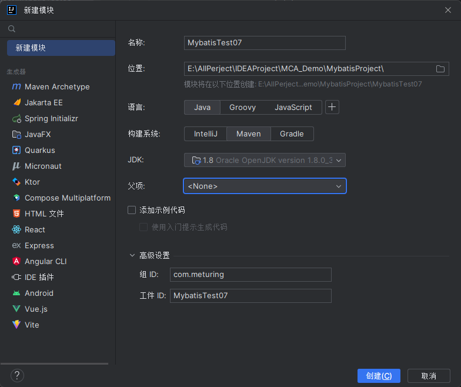
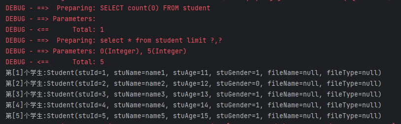
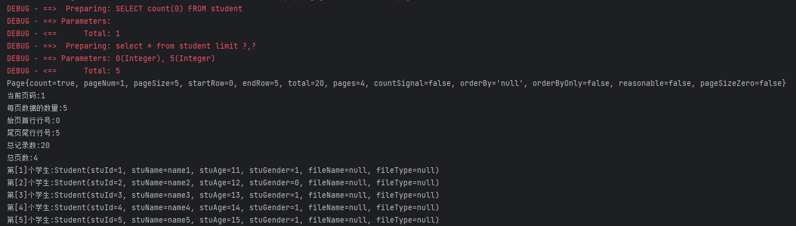
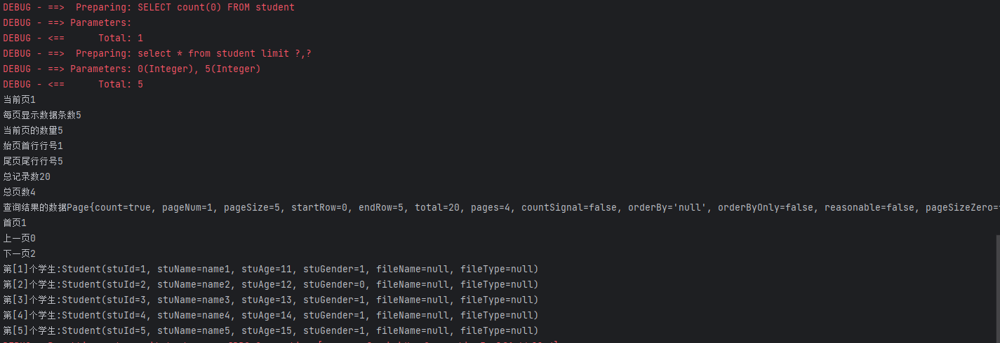
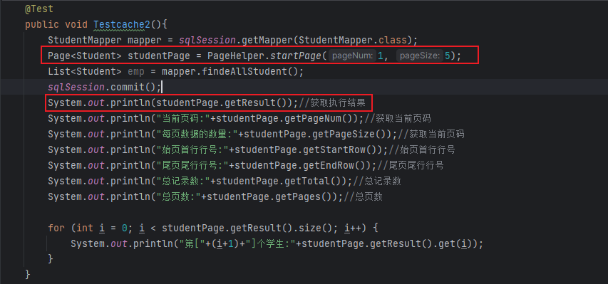
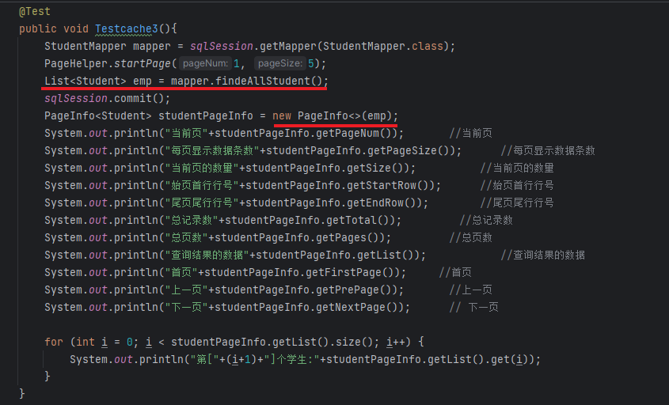

## 为什么要使用PageHelper

在前面的学习中,我们使用JDBC+JSP+Servlet技术简单实现了一个带分页的用户学习展示功能,详见[分页](../../../04_JavaEE技术/07_分页/分页.md)

但是我们发现这样的**操作过于臃肿**,我们需要不断的计算DB中的数量以及当前页面的位置去拼接SQL查询

在Mybatis中帮我们提供了一个PageHelper的插件,可以让我们用极少的代码实现分页功能

## 了解PageHelper

### 内部原理

PageHelper方法使用了静态的ThreadLocal参数，分页参数和线程是绑定的。

内部流程是ThreadLocal中设置了分页参数（pageIndex，pageSize），之后在查询执行的时候，获取当线程中的分页参数，执行查询的时候通过拦截器在sql语句中添加分页参数，之后实现分页查询，查询结束后在 finally 语句中清除ThreadLocal中的查询参数

### 使用方法

1. 调用PageHelper方法：PageHelper.startPage(pageNum, pageSize)
2. MyBatis 查询方法 : 注意：只要你可以保证在PageHelper方法调用后紧跟 MyBatis 查询方法，这就是安全的。因为PageHelper在finally代码段中自动清除了ThreadLocal存储的对象。
3. 使用结果对PageInfo对象进行初始化
4. 返回PageInfo对象中的结果

## 使用PageHelper



### 数据准备

```SQL
CREATE TABLE `student` (
    `stuid` int(11) NOT NULL AUTO_INCREMENT,
    `stuname` varchar(20) DEFAULT NULL,
    `stuage` int(2) DEFAULT NULL,
    `stugender` char(2) DEFAULT NULL,
    `filename` varchar(100) DEFAULT NULL,
    `filetype` varchar(20) DEFAULT NULL,
    PRIMARY KEY (`stuid`)
) ENGINE=InnoDB AUTO_INCREMENT=22 DEFAULT   CHARSET=utf8;

insert into `student`(`stuid`,`stuname`,`stuage`,`stugender`,`filename`,`filetype`)   values   (1,'name1',11,'1',NULL,NULL),(2,'name2',12,'0',NULL,NULL),(3,'name3',13,'1',NULL,NULL),(4,'name4',14,'1',NULL,NULL),(5,'name5',15,'1',NULL,NULL),(6,'name6',16,'0',NULL,NULL),(7,'name7',17,'0',NULL,NULL),(8,'name8',18,'0',NULL,NULL),(9,'name9',19,'0',NULL,NULL),(10,'name10',20,'1',NULL,NULL),(11,'name11',11,'0',NULL,NULL),(12,'name12',12,'1',NULL,NULL),(13,'name13',13,'0',NULL,NULL),(14,'name14',14,'1',NULL,NULL),(15,'name15',15,'0',NULL,NULL),(16,'name16',16,'1',NULL,NULL),(17,'name17',17,'1',NULL,NULL),(18,'name18',18,'0',NULL,NULL),(19,'name19',19,'1',NULL,NULL),(20,'name20',20,'0',NULL,NULL);
```

### 实现查询

关于Maven项目快速部署化Mybatis环境,请参考之前的教程.在此只展示核心业务代码:

com.meturing.mapper.StudentMapper.java
```Java
public interface StudentMapper {
    List<Student> findeAllStudent();
}
```

com.meturing.pojo.Student.java
```java
@Data //所有参数构造Get/Set方法
@AllArgsConstructor //导入全参构造函数
@NoArgsConstructor //导入无参构造函数
public class Student implements Serializable {
    private Integer stuId;
    private String stuName;
    private Integer stuAge;
    private String stuGender;
    private String fileName;
    private String fileType;
}
```

resources/com/meturing/mapper/StudentMapper.xml
```XMl
<?xml version="1.0" encoding="UTF-8" ?>
<!DOCTYPE mapper
        PUBLIC "-//mybatis.org//DTDMapper3.0//EN"
        "http://mybatis.org/dtd/mybatis-3-mapper.dtd">
<mapper namespace="com.meturing.mapper.StudentMapper">
    <select id="findeAllStudent" resultType="student">
        select * from student
    </select>
</mapper>
```

Test01.java
```Java
public class Test01 {
    private static SqlSession sqlSession = null;
    /**
     * 初始化
     *  Before注解会使方法在执行测试单元前执行
     * @author sqTan
     * @date 2023/04/09
     */
    @Before
    public void init() {
        //创建一个SqlSessionFactoryBuilder对象
        SqlSessionFactoryBuilder sqlSessionFactoryBuilder = new SqlSessionFactoryBuilder();
        InputStream resourceAsStream = null;
        try {
            //通过Resources类获取指定配置文件的InputStream流
            resourceAsStream = Resources.getResourceAsStream("sqlMapConfig.xml");
        } catch (IOException e) {
            e.printStackTrace();
        }
        //通过SqlSessionFactoryBuilder对象使用配置文件的InputStream流构建一个SqlSessionFactory对象
        SqlSessionFactory build = sqlSessionFactoryBuilder.build(resourceAsStream);
        //使用SqlSessionFactory对象打开数据库链接
        sqlSession = build.openSession();
    }

    @Test
    public void Testcache1(){
        StudentMapper mapper = sqlSession.getMapper(StudentMapper.class);
        List<Student> emp = mapper.findeAllStudent();
        sqlSession.commit();
        for (int i = 0; i < emp.size(); i++) {
            System.out.println("第["+(i+1)+"]个学生:"+emp.get(i));
        }
    }
    /**
     * 释放
     * After注解会使方法在执行测试单元后执行
     * @author sqTan
     * @date 2023/04/09
     */
    @After
    public void release(){
        //关闭链接
        sqlSession.close();
    }
}
```

### 实现分页

#### 导入插件

##### 导入依赖

新增依赖
```xml
<!--pagehelper-->
<dependency>
	<groupId>com.github.pagehelper</groupId>
	<artifactId>pagehelper</artifactId>
	<version>4.1.4</version>
</dependency>
```

##### 配置插件

在Mybatis配置文件中引入分页插件
```XMl
<!--分页插件-->
<plugins>
	<!-- com.github.pagehelper为PageHelper类所在包名 -->
	<plugin interceptor="com.github.pagehelper.PageHelper">
		<!-- 设置数据库类型 Oracle,Mysql,MariaDB,SQLite,Hsqldb,PostgreSQL六种数据库 -->
		<property name="dialect" value="mysql" />
		<property name="rowBoundsWithCount" value="true" />
	</plugin>
</plugins>
```

#### 实现代码

##### 方式一 : 直接使用

`PageHelper.startPage(1, 5);` 设置当前为第一页,每页展示五个数据

```Java
@Test
public void Testcache2(){
	StudentMapper mapper = sqlSession.getMapper(StudentMapper.class);
	//直接设置分页插件的当前页数和每页大小
	PageHelper.startPage(1, 5);
	List<Student> emp = mapper.findeAllStudent();
	sqlSession.commit();
	for (int i = 0; i < emp.size(); i++) {
		System.out.println("第["+(i+1)+"]个学生:"+emp.get(i));
	}
}
```

我们直接看到当前emp的结果展示就是分页后的结果



##### 方式二 : 返回Page对象

但是这样的话只是对结果进行分页,我们在使用过程中还需要知道分页信息,所以可以尝试返回Page对象

```Java
    @Test
    public void Testcache2(){
        StudentMapper mapper = sqlSession.getMapper(StudentMapper.class);
        Page<Student> studentPage = PageHelper.startPage(1, 5);
        List<Student> emp = mapper.findeAllStudent();
        sqlSession.commit();
        System.out.println(studentPage.getResult());//获取执行结果
        System.out.println("当前页码:"+studentPage.getPageNum());//获取当前页码
        System.out.println("每页数据的数量:"+studentPage.getPageSize());//获取当前页码
        System.out.println("始页首行行号:"+studentPage.getStartRow());//始页首行行号
        System.out.println("尾页尾行行号:"+studentPage.getEndRow());//尾页尾行行号
        System.out.println("总记录数:"+studentPage.getTotal());//总记录数
        System.out.println("总页数:"+studentPage.getPages());//总页数
        for (int i = 0; i < studentPage.getResult().size(); i++) {
            System.out.println("第["+(i+1)+"]个学生:"+studentPage.getResult().get(i));
        }
    }
```

执行结果如下


> 直接返回Page我们是不推荐的


##### 方式三 : 返回PageInfo对象 - 推荐

使用PageInfo对象返回更多的数据
```Java
@Test
public void Testcache3(){
	StudentMapper mapper = sqlSession.getMapper(StudentMapper.class);
	PageHelper.startPage(1, 5);
	List<Student> emp = mapper.findeAllStudent();
	sqlSession.commit();
	PageInfo<Student> studentPageInfo = new PageInfo<>(emp);
	System.out.println("当前页"+studentPageInfo.getPageNum());       //当前页
	System.out.println("每页显示数据条数"+studentPageInfo.getPageSize());      //每页显示数据条数
	System.out.println("当前页的数量"+studentPageInfo.getSize());          //当前页的数量
	System.out.println("始页首行行号"+studentPageInfo.getStartRow());      //始页首行行号
	System.out.println("尾页尾行行号"+studentPageInfo.getEndRow());        //尾页尾行行号
	System.out.println("总记录数"+studentPageInfo.getTotal());         //总记录数
	System.out.println("总页数"+studentPageInfo.getPages());         //总页数
	System.out.println("查询结果的数据"+studentPageInfo.getList());			//查询结果的数据
	System.out.println("首页"+studentPageInfo.getFirstPage());     //首页
	System.out.println("上一页"+studentPageInfo.getPrePage());       //上一页
	System.out.println("下一页"+studentPageInfo.getNextPage());      // 下一页
	for (int i = 0; i < studentPageInfo.getList().size(); i++) {
		System.out.println("第["+(i+1)+"]个学生:"+studentPageInfo.getList().get(i));
	}
}
```

执行结果如下


## PageInfo对象和Page对象的区别

### 类别

Page是一个ArrayList  ->  `public class Page<E>extends Array List<E>{}`

PageInfo是一个对象，能获取到的数据比Page多  -> `public class Page Info<T> implements Serializable{}`

### 使用

在使用PageInfo时,我们直接执行SQL后结果就在里面,使用`Page对象.getResult()`获取执行结果



使用PageInfo对象时,我们需要先使设定分页参数,然后执行SQL,最后初始化PageInfo时将SQL的执行结果进行传入.  使用`pageInfo对象.getList()`获取结果


### 内置属性

page对象参数
```Java
private int pageNum;	//当前页码
private int pageSize; 	//每页数据的数量
private int startRow;	//始页首行行号
private int endRow;		//尾页尾行行号
private long total;		//总记录数
private int pages;		//总页数
private Boolean reasonable; //分页合理化
private Boolean pageSizeZero; //当设置为true的时候，如果pagesize设置为0（或RowBounds的limit=0），就不执行分页，返回全部结果
```

PageInfo对象参数
```Java
private int pageNum;   			//当前页
private int pageSize;			//每页显示数据条数
private int size;				//当前页的数量
private int startRow; 			//始页首行行号
private int endRow;				//尾页尾行行号
private long total;				//总记录数
private int pages;				//总页数
private List<T> list;			//查询结果的数据
private int firstPage;			//首页
private int prePage;			//上一页
private int nextPage;			// 下一页
private int lastPage;			//最后一页
private boolean isFirstPage;	//是不是第一页
private boolean isLastPage;		//是不是最后一页
private boolean hasPreviousPage;//有没有上一页
private boolean hasNextPage;	//有没有下一页
private int navigatePages;		//所有导航页号
private int[] navigatepageNums;	//导航页码数
```