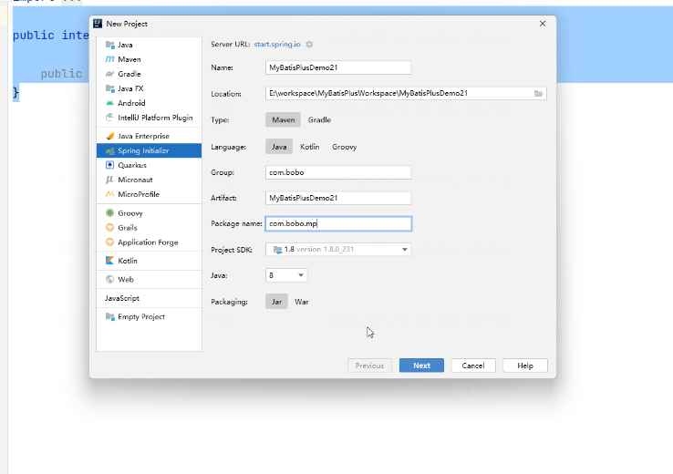
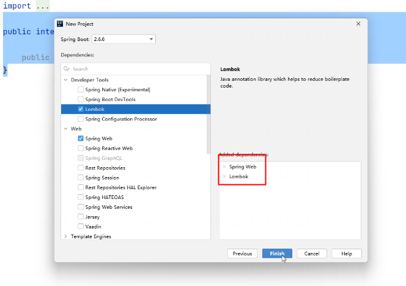
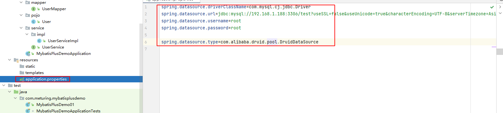
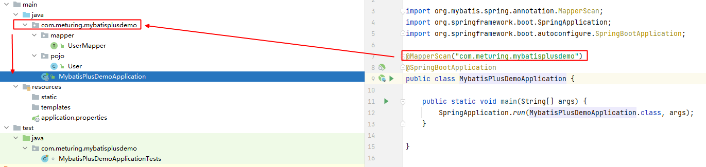
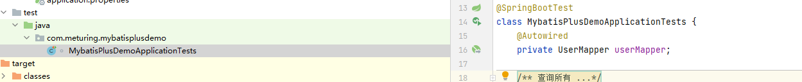
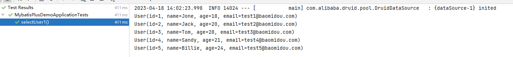
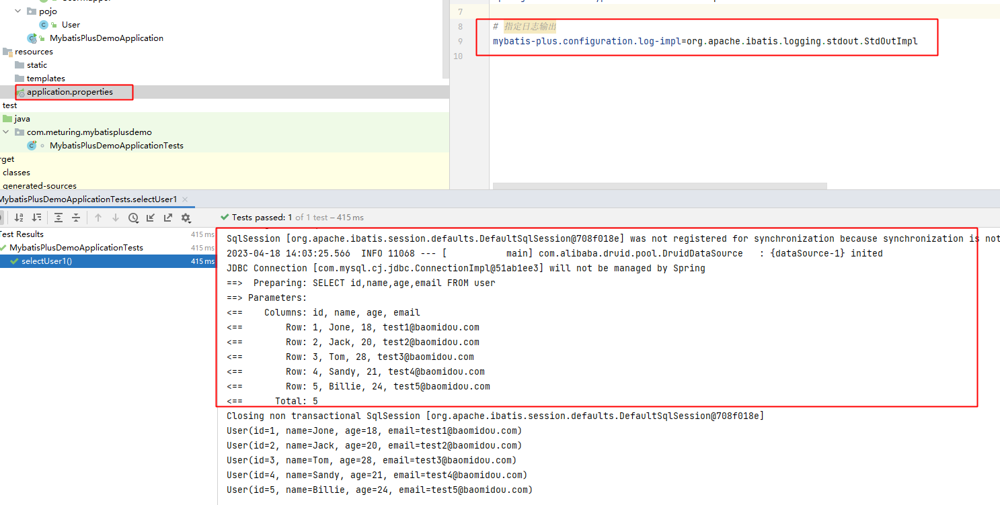

## 了解MybatisPlus


> MyBatis-Plus (opens new window)（简称 MP）是一个 MyBatis (opens new window) 的增强工具，在 MyBatis 的基础上只做增强不做改变，为简化开发、提高效率而生。

### 特点

-   **`无侵入`**：只做增强不做改变，引入它不会对现有工程产生影响，如丝般顺滑
-   **`损耗小`**：启动即会自动**注入基本 CURD**，性能基本无损耗，直接面向对象操作
-   **`强大的 CRUD 操作`**：内置通用 Mapper、通用 Service，仅仅通过少量配置即可实现单表大部分 CRUD 操作，更有强大的条件构造器，满足各类使用需求
-   **`支持 Lambda 形式调用`**：通过 Lambda 表达式，方便的编写各类查询条件，无需再担心字段写错
-   **`支持多种数据库`**：支持 MySQL、MariaDB、Oracle、DB2、H2、HSQL、SQLite、Postgre、SQLServer2005、SQLServer 等多种数据库
-   **`支持主键自动生成`**：支持多达 4 种主键策略（内含分布式唯一 ID 生成器 - Sequence），可自由配置，完美解决主键问题
-   **`支持 XML 热加载`**：Mapper 对应的 XML 支持热加载，对于简单的 CRUD 操作，甚至可以无 XML 启动
-   **`支持 ActiveRecord 模式`**：支持 ActiveRecord 形式调用，实体类只需继承 Model 类即可进行强大的 CRUD 操作
-   **`支持自定义全局通用操作`**：支持全局通用方法注入（ Write once, use anywhere ）
-   **`支持关键词自动转义`**：支持数据库关键词（order、key......）自动转义，还可自定义关键词
-   **`内置代码生成器`**：采用代码或者 Maven 插件可快速生成 Mapper 、 Model 、 Service 、 Controller 层代码，支持模板引擎，更有超多自定义配置等您来使用
-   **`内置分页插件`**：基于 MyBatis 物理分页，开发者无需关心具体操作，配置好插件之后，写分页等同于普通 List 查询
-   **`内置性能分析插件`**：可输出 Sql 语句以及其执行时间，建议开发测试时启用该功能，能快速揪出慢查询
-   **`内置全局拦截插件`**：提供全表 delete 、 update 操作智能分析阻断，也可自定义拦截规则，预防误操作
-   **`内置 Sql 注入剥离器`**：支持 Sql 注入剥离，有效预防 Sql 注入攻击

## 入门案例

### 准备数据

#### 表结构

```SQL
DROP TABLE IF EXISTS user;

CREATE TABLE user
(
    id BIGINT(20) NOT NULL COMMENT '主键ID',
    name VARCHAR(30) NULL DEFAULT NULL COMMENT '姓名',
    age INT(11) NULL DEFAULT NULL COMMENT '年龄',
    email VARCHAR(50) NULL DEFAULT NULL COMMENT '邮箱',
    PRIMARY KEY (id)
);
```

#### 初始化数据

```SQL
DELETE FROM user;

INSERT INTO user (id, name, age, email) VALUES
(1, 'Jone', 18, 'test1@baomidou.com'),
(2, 'Jack', 20, 'test2@baomidou.com'),
(3, 'Tom', 28, 'test3@baomidou.com'),
(4, 'Sandy', 21, 'test4@baomidou.com'),
(5, 'Billie', 24, 'test5@baomidou.com');
```

### 创建项目环境

#### 创建SpringBoot项目

使用Spring Initializr快速创建项目 (关于SpringBoot后面会详细讲解)



初始化Lombok依赖 与 Spring Web 依赖



#### 调整Pom.xml依赖

分别引入: 
`MyBatisPlus的依赖`  `MySQL数据库` `数据库连接池 Druid`
```XML
<parent>  
    <groupId>org.springframework.boot</groupId>  
    <artifactId>spring-boot-starter-parent</artifactId>  
    <version>2.6.6</version>  
    <relativePath/> <!-- lookup parent from repository -->  
</parent>  
  
<groupId>com.meturing</groupId>  
<artifactId>MybatisPlusDemo</artifactId>  
<version>0.0.1-SNAPSHOT</version>  
<name>MybatisPlusDemo</name>  
<description>MybatisPlusDemo</description>  
<packaging>jar</packaging>  
<properties>  
    <java.version>8</java.version>  
</properties>  
<dependencies>  
    <dependency>  
        <groupId>org.springframework.boot</groupId>  
        <artifactId>spring-boot-starter-web</artifactId>  
    </dependency>  
  
    <dependency>  
        <groupId>org.projectlombok</groupId>  
        <artifactId>lombok</artifactId>  
        <optional>true</optional>  
    </dependency>  
    <dependency>  
        <groupId>org.springframework.boot</groupId>  
        <artifactId>spring-boot-starter-test</artifactId>  
        <scope>test</scope>  
    </dependency>  
    <!-- 引入MyBatisPlus的依赖 -->  
    <dependency>  
        <groupId>com.baomidou</groupId>  
        <artifactId>mybatis-plus-boot-starter</artifactId>  
        <version>3.5.1</version>  
    </dependency>  
    <!-- 数据库使用MySQL数据库 -->  
    <dependency>  
        <groupId>mysql</groupId>  
        <artifactId>mysql-connector-java</artifactId>  
    </dependency>  
    <!-- 数据库连接池 Druid -->    <dependency>  
        <groupId>com.alibaba</groupId>  
        <artifactId>druid</artifactId>  
        <version>1.1.14</version>  
    </dependency>  
    <!-- lombok依赖 -->  
    <dependency>  
        <groupId>org.projectlombok</groupId>  
        <artifactId>lombok</artifactId>  
    </dependency>  
</dependencies>  
  
<build>  
    <plugins>  
        <plugin>  
            <groupId>org.springframework.boot</groupId>  
            <artifactId>spring-boot-maven-plugin</artifactId>  
            <configuration>  
                <excludes>  
                    <exclude>  
                        <groupId>org.projectlombok</groupId>  
                        <artifactId>lombok</artifactId>  
                    </exclude>  
                </excludes>  
            </configuration>  
        </plugin>  
    </plugins>  
</build>
```


#### 修改链接文件

然后我们需要在application.properties中配置数据源的相关信息



```Properties
spring.datasource.driverClassName=com.mysql.cj.jdbc.Driver  
spring.datasource.url=jdbc:mysql://192.168.1.188:3306/test?useSSL=false&useUnicode=true&characterEncoding=UTF-8&serverTimezone=Asia/Shanghai  
spring.datasource.username=root  
spring.datasource.password=root  
  
spring.datasource.type=com.alibaba.druid.pool.DruidDataSource
```

#### 修改包扫面路径

们需要在SpringBoot项目的启动类上配置Mapper接口的扫描路径




### 创建案例所需文件

#### 添加User实体类

```Java
@ToString  
@Data  
@AllArgsConstructor  
@NoArgsConstructor  
public class User {  
    private Long id;  
    private String name;  
    private Integer age;  
    private String email;  
}
```

#### 创建Mapper接口

在MyBatisPlus中的Mapper接口需要继承BaseMapper.

```Java
/**  
 * MyBatisPlus中的Mapper接口继承自BaseMapper，同时指定对应的实体类  
 */  
@Mapper  
public interface UserMapper extends BaseMapper<User> {  
  
}
```

#### 创建测试类



```Java
@SpringBootTest  
class MybatisPlusDemoApplicationTests {  
    @Autowired  
    private UserMapper userMapper;  
    /**  
     * 查询所有  
     *  
     * @author sqTan     
     * @date 2023/04/18     
     * */    
    @Test  
    public void selectUser1() {  
        List<User> users = userMapper.selectList(null);  
        users.forEach(System.out::println);  
    }  
}
```




### 指定日志输出

为了便于学习我们可以指定日志的实现StdOutImpl来处理

```Properties
# 指定日志输出
mybatis-plus.configuration.log-impl=org.apache.ibatis.logging.stdout.StdOutImpl
```



