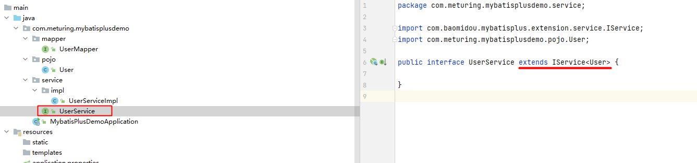
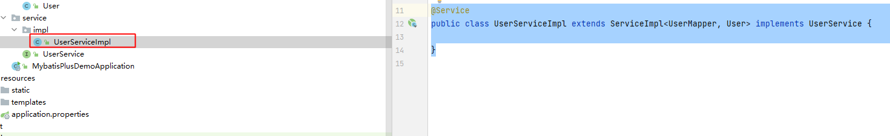

## BaseMapper简单的CRUD

### 查询用户

#### 查询所有:selectList

```Java
@Test  
public void selectUser1() {  
    List<User> users = userMapper.selectList(null);  
    users.forEach(System.out::println);  
}
```

#### 根据ID查询:selectById

```Java
@Test  
public void selectUser2() {  
    User user = userMapper.selectById(5L);  
    System.out.println(user);  
}
```

#### 根据Map查询:selectByMap

```Java
@Test  
public void selectUser3() {  
    HashMap<String, Object> userMap = new HashMap<>();  
    userMap.put("age",24);  
    userMap.put("name","Billie");  
    List<User> users = userMapper.selectByMap(userMap);  
    users.forEach(System.out::println);  
}
```

### 新增用户 : insert

```Java
@Test  
public void addUser(){  
    User user = new User(6L,"张三",28,"xxxx@xx.com");  
    int insertRows = userMapper.insert(user);  
    System.out.println(insertRows);  
}
```

### 删除用户

#### 根据ID单一删除 : deleteById

```Java
@Test  
public void deleteUser1(){  
    User user = new User(6L,"李四",15,"xxxx@xx.com");  
    int deleteRows = userMapper.deleteById(user);  
    System.out.println(deleteRows);  
}
```

#### 根据ID批量删除 : deleteBatchIds

```Java
@Test  
public void deleteUser2(){  
    int deleteRows = userMapper.deleteBatchIds(Arrays.asList(6L,1648197837407772673L,1648197837445521409L));  
    System.out.println(deleteRows);  
}
```

#### 根据Map删除 : deleteByMap

```Java
@Test  
public void deleteUser3(){  
    HashMap<String, Object> userMap = new HashMap<>();  
    userMap.put("age",15);  
    userMap.put("name","张三");  
    int deleteRows = userMapper.deleteByMap(userMap);  
    System.out.println(deleteRows);  
}
```

### 修改用户 : updateById

```Java
@Test  
public void updateUser1(){  
    User user = new User(6L,"李四",15,"xxxx@xx.com");  
    int updateRows = userMapper.updateById(user);  
    System.out.println(updateRows);  
}
```

## IService接口

### 了解IService接口

官网地址：[https://baomidou.com/pages/49cc81/#service-crud-%E6%8E%A5%E5%8F%A3](https://baomidou.com/pages/49cc81/#service-crud-%E6%8E%A5%E5%8F%A3)

### 为什么要使用IService接口

官网说明：
- 通用 Service CRUD 封装IService(opens new window)接口，进一步封装 CRUD 采用 get 查询单行 remove 删除 list 查询集合 page 分页 前缀命名方式区分 Mapper 层避免混淆，
- 泛型 T 为任意实体对象
-   建议如果存在自定义通用 Service 方法的可能，请创建自己的 IBaseService 继承 Mybatis-Plus 提供的基类
-   对象 Wrapper 为 条件构造器

在MyBatis-Plus中有一个接口 IService和其实现类 ServiceImpl，封装了常见的业务层逻辑,在使用上更加的灵活

### 构建IService接口环境

#### 创建UserService接口 继承 IService



要使用MyBatisPlus的Service完成CRUD操作，得继承IService

```Java
public interface UserService extends IService<User> {  
  
}
```

#### 创建接口实现类 继承 ServiceImpl 实现UserService接口



必须继承ServiceImpl 并且在泛型中指定 对应的Mapper和实体对象

```Java
@Service  
public class UserServiceImpl extends ServiceImpl<UserMapper, User> implements UserService {  
  
}
```

### IService接口实现的CRUD

通过Service中提供的count方法可以查询总的记录数。get方法，List方法等

#### 查询操作

```Java
@Autowired  
@Qualifier("userServiceImpl")  
public UserService iUserService;

@Test  
public void testCount(){  
    long count = iUserService.count();  
    System.out.println(count);  
}
```

#### 批量插入

```Java
@Autowired  
@Qualifier("userServiceImpl")  
public UserService iUserService;

@Test  
public void batchInserts(){  
    List<User> users = Arrays.asList(new User(null, "王五", 22, "111@111.com"),  
            new User(null, "赵六", 33, "222@222.com"));  
    boolean b = iUserService.saveBatch(users);  
    System.out.println(b);  
}
```