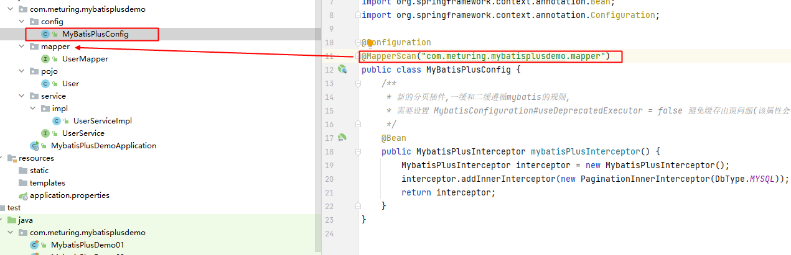
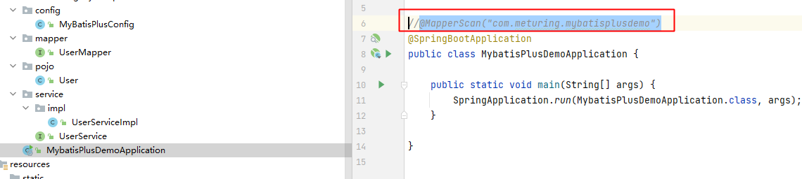
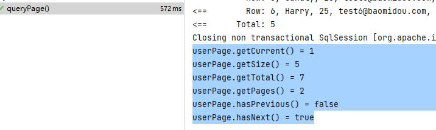
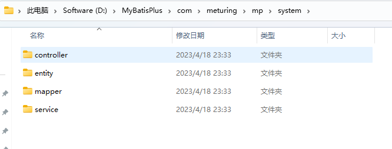

## 分页插件

### 创建插件配置类

在MyBatisPlus中集成了分页插件，我们不需要像MybatisPlus一样单独的引入，只需要添加对应的配置类



```Java
@Configuration  
@MapperScan("com.meturing.mybatisplusdemo.mapper")  
public class MyBatisPlusConfig {  
    /**  
     * 新的分页插件,一缓和二缓遵循mybatis的规则,  
     * 需要设置 MybatisConfiguration#useDeprecatedExecutor = false 避免缓存出现问题(该属性会在旧插件移除后一同移除)  
     */    
	@Bean  
    public MybatisPlusInterceptor mybatisPlusInterceptor() {  
        MybatisPlusInterceptor interceptor = new MybatisPlusInterceptor();
        //设置分页内部拦截器，数据库类型为MySQL  
        PaginationInnerInterceptor paginationInnerInterceptor = new PaginationInnerInterceptor(DbType.MYSQL)
        //设置请求的页面大于最大页后操作，true调回到首页，false继续请求 默认false
	    paginationInnerInterceptor.setOverflow(false);
		//设置最大单页限制数量，默认500条，-1 不受限制
		paginationInnerInterceptor.setMaxLimit(500);
        interceptor.addInnerInterceptor(paginationInnerInterceptor);  
        return interceptor;  
    }  
}
```

注意:MapperScan需要指向Mapper层的包,此时由于`@Configuration`的导入,所以可以给启动类上的包扫描删除掉



然后就可以测试操作了

### 使用插件

```Java
@Test  
void queryPage() {  
    Page<User> page = new Page<>(1,5);  
    Page<User> userPage = userService.page(page,null);  
    System.out.println("userPage.getCurrent() = " + userPage.getCurrent());  
    System.out.println("userPage.getSize() = " + userPage.getSize());  
    System.out.println("userPage.getTotal() = " + userPage.getTotal());  
    System.out.println("userPage.getPages() = " + userPage.getPages());  
    System.out.println("userPage.hasPrevious() = " + userPage.hasPrevious());  
    System.out.println("userPage.hasNext() = " + userPage.hasNext());  
}
```

运行效果



## 乐观锁

当要更新一条记录的时候，希望这条记录没有被别人更新

乐观锁实现方式：
-   取出记录时，获取当前 version
-   更新时，带上这个 version
-   执行更新时， set version = newVersion where version = oldVersion
-   如果 version 不对，就更新失败

### 配置插件

在MyBatisPlusConfig类中导入

```Java
@Bean
public MybatisPlusInterceptor mybatisPlusInterceptor() {
    MybatisPlusInterceptor interceptor = new MybatisPlusInterceptor();
    interceptor.addInnerInterceptor(new OptimisticLockerInnerInterceptor());
    return interceptor;
}
```

### 在实体类的字段上加上`@Version`注解

```java
@Version
private Integer version;
```

说明:
-   **支持的数据类型只有:int,Integer,long,Long,Date,Timestamp,LocalDateTime**
-   整数类型下 `newVersion = oldVersion + 1`
-   `newVersion` 会回写到 `entity` 中
-   仅支持 `updateById(id)` 与 `update(entity, wrapper)` 方法
-   **在 `update(entity, wrapper)` 方法下, `wrapper` 不能复用!!!**

### 案例

```Java
// Spring Boot 方式
@Configuration
@MapperScan("按需修改")
public class MybatisPlusConfig {
    /**
     * 旧版
     */
    @Bean
    public OptimisticLockerInterceptor optimisticLockerInterceptor() {
        return new OptimisticLockerInterceptor();
    }

    /**
     * 新版
     */
    @Bean
    public MybatisPlusInterceptor mybatisPlusInterceptor() {
        MybatisPlusInterceptor mybatisPlusInterceptor = new MybatisPlusInterceptor();
        mybatisPlusInterceptor.addInnerInterceptor(new OptimisticLockerInnerInterceptor());
        return mybatisPlusInterceptor;
    }
}
```

## 代码生成器

### 添加依赖

```Xml
<!--    代码生成器    -->  
<dependency>  
    <groupId>com.baomidou</groupId>  
    <artifactId>mybatis-plus-generator</artifactId>  
    <version>3.5.2</version>  
</dependency>  
<dependency>  
    <groupId>org.freemarker</groupId>  
    <artifactId>freemarker</artifactId>  
</dependency>
```

### 运行代码

```Java
public class MyFastAutoGenerator {  
    public static void main(String[] args) {  
        FastAutoGenerator.create("jdbc:mysql://192.168.1.188:3306/test?useSSL=false&useUnicode=true&characterEncoding=UTF-8&serverTimezone=Asia/Shanghai"  
                        , "root", "root")//数据源  
                .globalConfig(builder -> {  
                    builder.author("meturing") // 设置作者  
                            //.enableSwagger() // 开启 swagger 模式  
                            .fileOverride() // 覆盖已生成文件  
                            .outputDir("D://MyBatisPlus"); // 指定输出目录  
                })  
                .packageConfig(builder -> {  
                    builder.parent("com.meturing.mp") // 设置父包名  
                            .moduleName("system") // 设置父包模块名  
                            .pathInfo(Collections.singletonMap(OutputFile.xml, "D://")); // 设置mapperXml生成路径  
                })  
                .strategyConfig(builder -> {  
                    builder.addInclude("t_user") // 设置需要生成的表名  
                            .addTablePrefix("t_", "c_"); // 设置过滤表前缀  
                })  
                .templateEngine(new FreemarkerTemplateEngine()) // 使用Freemarker引擎模板，默认的是Velocity引擎模板  
                .execute();  
    }
```



## 性能分析

性能分析拦截器，用于输出每条 SQL 语句及其执行时间

SQL 性能执行分析,开发环境使用，超过指定时间，停止运行。有助于发现问题

### 配置插件

#### 引入依赖

```XML
<dependency>
    <groupId>p6spy</groupId>
    <artifactId>p6spy</artifactId>
    <version>3.9.1</version>
</dependency>
```

#### 配置文件修改

1. 替换你的JDBC Driver为com.p6spy.engine.spy.P6SpyDriver
2. 在原来urljdbc：后面添加p6spy：。如：jdbc:p6spy:mysql://127.0.0.1:3306或jdbc:p6spy:oracle:thin:@localhost:1521:ORCL
3. 添加p6spy的配置文件spy.properties

#### spy.properties

```properties
module.log=com.p6spy.engine.logging.P6LogFactory,com.p6spy.engine.outage.P6OutageFactory
# 自定义日志打印
logMessageFormat=com.p6spy.engine.spy.appender.SingleLineFormat
#logMessageFormat=com.p6spy.engine.spy.appender.CustomLineFormat
#customLogMessageFormat=%(currentTime) | SQL耗时： %(executionTime) ms | 连接信息： %(category)-%(connectionId) | 执行语句： %(sql)
# 使用控制台记录sql
appender=com.p6spy.engine.spy.appender.StdoutLogger
## 配置记录Log例外
excludecategories=info,debug,result,batc,resultset
# 设置使用p6spy driver来做代理
deregisterdrivers=true
# 日期格式
dateformat=yyyy-MM-dd HH:mm:ss
# 实际驱动
driverlist=com.mysql.jdbc.Driver
# 是否开启慢SQL记录
outagedetection=true
# 慢SQL记录标准 秒
outagedetectioninterval=2
```


### 自定义格式化
上面的的`logMessageFormat`是打印的格式`SingleLineFormat`最基础的配置是不会打印sql的。如果修改有两种方式：

1. 使用内置自定义格式化器（`CustomLineFormat`）手动配置打印格式

修改配置文件的格式化为自定义格式化 logMessageFormat=com.p6spy.engine.spy.appender.CustomLineFormat

配置文件中添加手动配置打印的格式，推荐示例：`customLogMessageFormat=%(currentTime) | SQL耗时： %(executionTime) ms | 连接信息： %(category)-%(connectionId) | 执行语句： %(sql)`

2. 自己创建类实现`MessageFormattingStrategy`接口重写`formatMessage`方法即可

创建类P6SpyLogger
```Java
public class P6SpyLogger implements MessageFormattingStrategy {
    /**
     * @Desc: 重写日志格式方法
     * now:当前时间
     * elapsed:执行耗时
     * category：执行分组
     * prepared：预编译sql语句
     * sql:执行的真实SQL语句，已替换占位
     */
    @Override
    public String formatMessage(int connectionId, String now, long elapsed, String category, String prepared, String sql) {
        return !"".equals(sql.trim()) ? "[ " + LocalDateTime.now() + " ] --- | took "
                + elapsed + "ms | " + category + " | connection " + connectionId + "\n "
                + sql + ";" : "";
    }
}
```

将配置文件中的格式化器属性改为自己的类`logMessageFormat=com.xxx.xxx.P6SpyLogger`


### p6spy有3中日志输出方式

```properties
#（推荐）使用Slf4j输出 配合SpringBoot使用日志门面
#appender=com.p6spy.engine.spy.appender.Slf4JLogger
# 仅控制台输出
#appender=com.p6spy.engine.spy.appender.StdoutLogger
# 文件输出，使用内置日志输出到文件
#appender=com.p6spy.engine.spy.appender.FileLogger
```

### spy.properties详细说明

```properties
# 指定应用的日志拦截模块,默认为com.p6spy.engine.spy.P6SpyFactory
#modulelist=com.p6spy.engine.spy.P6SpyFactory,com.p6spy.engine.logging.P6LogFactory,com.p6spy.engine.outage.P6OutageFactory

# 真实JDBC driver , 多个以 逗号 分割 默认为空
#driverlist=

# 是否自动刷新 默认 flase
#autoflush=false

# 配置SimpleDateFormat日期格式 默认为空
#dateformat=

# 打印堆栈跟踪信息 默认flase
#stacktrace=false

# 如果 stacktrace=true，则可以指定具体的类名来进行过滤。
#stacktraceclass=

# 监测属性配置文件是否进行重新加载
#reloadproperties=false

# 属性配置文件重新加载的时间间隔，单位:秒 默认60s
#reloadpropertiesinterval=60

# 指定 Log 的 appender，取值：
#appender=com.p6spy.engine.spy.appender.Slf4JLogger
#appender=com.p6spy.engine.spy.appender.StdoutLogger
#appender=com.p6spy.engine.spy.appender.FileLogger

# 指定 Log 的文件名 默认 spy.log
#logfile=spy.log

# 指定是否每次是增加 Log，设置为 false 则每次都会先进行清空 默认true
#append=true

# 指定日志输出样式  默认为com.p6spy.engine.spy.appender.SingleLineFormat , 单行输出 不格式化语句
#logMessageFormat=com.p6spy.engine.spy.appender.SingleLineFormat
# 也可以采用  com.p6spy.engine.spy.appender.CustomLineFormat 来自定义输出样式, 默认值是%(currentTime)|%(executionTime)|%(category)|connection%(connectionId)|%(sqlSingleLine)
# 可用的变量为:
#   %(connectionId)            connection id
#   %(currentTime)             当前时间
#   %(executionTime)           执行耗时
#   %(category)                执行分组
#   %(effectiveSql)            提交的SQL 换行
#   %(effectiveSqlSingleLine)  提交的SQL 不换行显示
#   %(sql)                     执行的真实SQL语句，已替换占位
#   %(sqlSingleLine)           执行的真实SQL语句，已替换占位 不换行显示
#customLogMessageFormat=%(currentTime)|%(executionTime)|%(category)|connection%(connectionId)|%(sqlSingleLine)

# date类型字段记录日志时使用的日期格式 默认dd-MMM-yy
#databaseDialectDateFormat=dd-MMM-yy

# boolean类型字段记录日志时使用的日期格式 默认boolean 可选值numeric
#databaseDialectBooleanFormat=boolean

# 是否通过jmx暴露属性 默认true
#jmx=true

# 如果jmx设置为true 指定通过jmx暴露属性时的前缀 默认为空
# com.p6spy(.<jmxPrefix>)?:name=<optionsClassName>
#jmxPrefix=

# 是否显示纳秒 默认false
#useNanoTime=false

# 实际数据源 JNDI
#realdatasource=/RealMySqlDS
# 实际数据源 datasource class
#realdatasourceclass=com.mysql.jdbc.jdbc2.optional.MysqlDataSource

# 实际数据源所携带的配置参数 以 k=v 方式指定 以 分号 分割
#realdatasourceproperties=port;3306,serverName;myhost,databaseName;jbossdb,foo;bar

# jndi数据源配置
# 设置 JNDI 数据源的 NamingContextFactory。
#jndicontextfactory=org.jnp.interfaces.NamingContextFactory
# 设置 JNDI 数据源的提供者的 URL。
#jndicontextproviderurl=localhost:1099
# 设置 JNDI 数据源的一些定制信息，以分号分隔。
#jndicontextcustom=java.naming.factory.url.pkgs;org.jboss.naming:org.jnp.interfaces

# 是否开启日志过滤 默认false， 这项配置是否生效前提是配置了 include/exclude/sqlexpression
#filter=false

# 过滤 Log 时所包含的表名列表，以逗号分隔 默认为空
#include=
# 过滤 Log 时所排除的表名列表，以逗号分隔 默认为空
#exclude=

# 过滤 Log 时的 SQL 正则表达式名称  默认为空
#sqlexpression=

#显示指定过滤 Log 时排队的分类列表，取值: error, info, batch, debug, statement,
#commit, rollback, result and resultset are valid values
# (默认 info,debug,result,resultset,batch)
#excludecategories=info,debug,result,resultset,batch

# 是否过滤二进制字段
# (default is false)
#excludebinary=false

# P6Log 模块执行时间设置，整数值 (以毫秒为单位)，只有当超过这个时间才进行记录 Log。 默认为0
#executionThreshold=

# P6Outage 模块是否记录较长时间运行的语句 默认false
# outagedetection=true|false
# P6Outage 模块执行时间设置，整数值 （以秒为单位)），只有当超过这个时间才进行记录 Log。 默认30s
# outagedetectioninterval=integer time (seconds)

```

