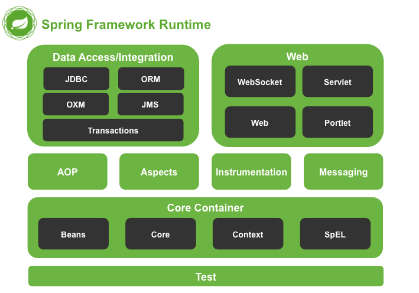
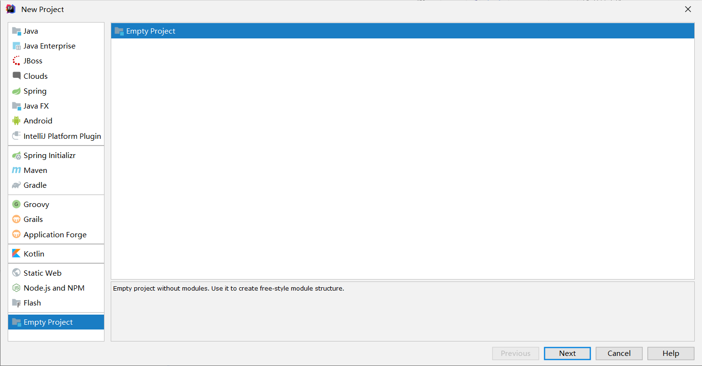
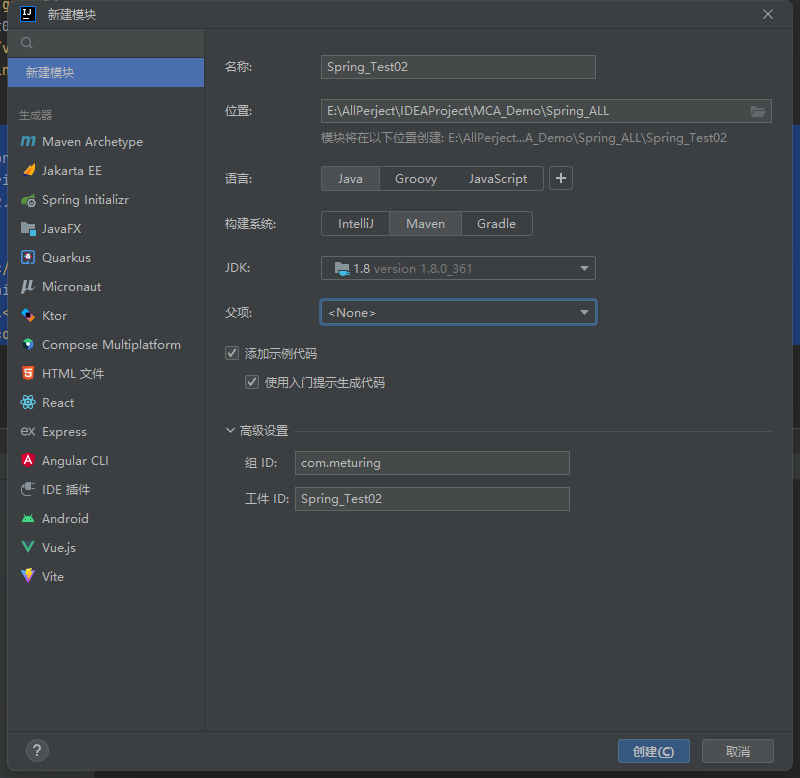
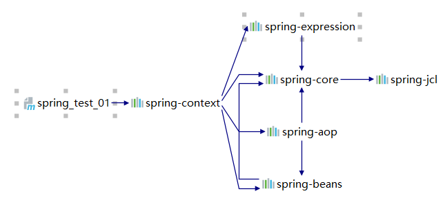
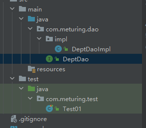
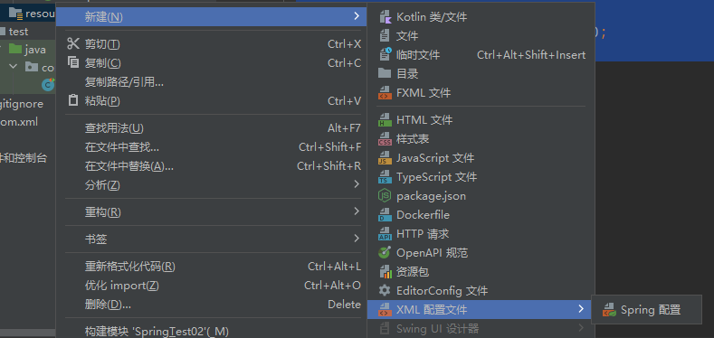

## Spring的概念介绍

### 简介

Spring 框架是由于软件开发的复杂性而创建的. Spring 使用的是基本的 JavaBean 来完成以前只可能由 EJB 完成的事情 。 然而 ， Spring 的用途不仅仅限于服务器端的开发 。 从简单性 、 可测试性和松耦合性角度而言 ， 绝大部分 Java 应用都可以从 Spring 中.

Spring 是一个轻量级控制反转(IOC)和面向切面(AOP)的容器框架,是分层的全栈式的轻量级开发框架.基本上任何其他 Spring 项目都是以 Spring Framework 为基础的。

官网是 https://spring.io

### 优势

#### 方便解耦,简化开发

Spring通过容器,将对象的创建从代码中剥离出来,交给Spring控制,避免直接编码造成模块之间的耦合度高,用户也不必自己编码处理对象的单例和多例控制,主要关注接口功能即可,不用关注具体使用哪个实现类和实现细节问题

#### AOP切面编程

AOP切面编程是程序设计的一种概念,Spring对该概念实现的比较好,通过切面编程我们可以在不修改原有代码的情况下实现功能的增加,通常用于 事务控制,日志记录,性能检测,权限控制等等

#### 声明式事务

事务的控制可以托管给Spring,我们通过注解或者配置文件声明事务的处理方式即可,不用我们自己去编码处理

#### 整合JUNIT,方便测试

spring整合JUNIT单元测试,对于项目的功能都可以进行轻松快速的测试,便于我们调试程序

#### 方便整合各种优秀的框架

 SSM> Spring+SpringMVC +MyBatis    
 SSH> Spring+Hibernate +Strust
 等...

#### 丰富的功能封装

spring对JAVAEE(JDBC ,JAVAMail,)都进行了一系列的封装,简化我们对于API的使用,提高程序的开发效率

#### 规范的源码学习样本

spring的源码设计巧妙,结构清晰,大量使用了设计模式,是java代码规范编写的典范,也是高级程序员面试中经常会问到的源码.

### 体系结构



#### Data Access/Integration（数据访问／集成）

数据访问/集成层包括 JDBC、ORM、OXM、JMS 和 Transactions 模块，具体介绍如下:

- **JDBC 模块**：提供了一个 JDBC 的抽象层，大幅度减少了在开发过程中对数据库操作的编码。
- **ORM 模块**：对流行的对象关系映射 API，包括 JPA、JDO、Hibernate 和 iBatis 提供了的集成层。
- **OXM 模块**：提供了一个支持对象/XML 映射的抽象层实现，如 JAXB、Castor、XMLBeans、JiBX 和 XStream。
- **JMS 模块**：指 Java 消息服务，包含的功能为生产和消费的信息。
- **Transactions 事务模块**：支持编程和声明式事务管理实现特殊接口类，并为所有的 POJO。

#### Web 模块

Spring 的 Web 层包括 Web、Servlet、Struts 和 Portlet 组件，具体介绍如下:

- **Web 模块**：提供了基本的 Web 开发集成特性，例如多文件上传功能、使用的 Servlet 监听器的 IoC 容器初始化以及 Web 应用上下文。
- **Servlet模块**：包括 Spring 模型—视图—控制器（MVC）实现 Web 应用程序。
- **Struts 模块**：包含支持类内的 Spring 应用程序，集成了经典的 Struts Web 层。
- **Portlet 模块**：提供了在 Portlet 环境中使用 MV C实现，类似 Web-Servlet 模块的功能。

#### Core Container（核心容器）

Spring 的核心容器是其他模块建立的基础，由 Beans 模块、Core 核心模块、Context 上下文模块和 Expression Language 表达式语言模块组成，具体介绍如下:

- **Beans 模块**：提供了 BeanFactory，是工厂模式的经典实现，Spring 将管理对象称为 Bean。
- **Core 核心模块**：提供了 Spring 框架的基本组成部分，包括 IoC 和 DI 功能。
- **Context 上下文模块**：建立在核心和 Beans 模块的基础之上，它是访问定义和配置任何对象的媒介。ApplicationContext 接口是上下文模块的焦点。
- **Expression Language 模块**：是运行时查询和操作对象图的强大的表达式语言。

#### 其他模块

Spring的其他模块还有 AOP、Aspects、Instrumentation 以及 Test 模块，具体介绍如下:

- **AOP 模块**：提供了面向切面编程实现，允许定义方法拦截器和切入点，将代码按照功能进行分离，以降低耦合性。
- **Aspects 模块**：提供与 AspectJ 的集成，是一个功能强大且成熟的面向切面编程（AOP）框架。
- **Instrumentation 模块**：提供了类工具的支持和类加载器的实现，可以在特定的应用服务器中使用。
- **Test 模块**：支持 Spring 组件，使用 JUnit 或 TestNG 框架的测试。

##  快速体验Spring的IOC

### 环境准备

#### 创建空白项目


####  创建Maven测试模块



####  导入Pom.xml依赖

```XML
<dependencies>  
	<dependency>  
		<groupId>org.springframework</groupId>  
		<artifactId>spring-context</artifactId>  
		<version>5.2.12.RELEASE</version>  
	</dependency>  
	<dependency>  
		<groupId>junit</groupId>  
		<artifactId>junit</artifactId>  
		<version>4.13.1</version>  
		<scope>test</scope>  
	</dependency>  
</dependencies>
```

关于依赖:
Spring原本需要引入四个依赖:
1. spring-context      上下文,容器
2. spring-beans         创建对象
3. spring-core            核心jar
4. spring-expression 表达式jar

但是事实上,我们导入**spring-context的时候,会自动导入其他依赖的jar**,自动进行了依赖传递


依赖关系图如下:




#### 创建所需资源类

 

创建接口
```Java
public interface DeptDao {  
	void sayHello();  
}
```

创建接口实现类
```Java
public class DeptDaoImpl implements DeptDao {  
	public void sayHello() {  
		System.out.println("Hello Spring");  
	}  
}
```

### 传统方式调用方法

我们在之前的Java使用过程中,都是直接New一个实现类的对象,然后传递给他的接口引用声明.
通过接口的引用对象来实现方法

```Java
@Test
public void test01(){
	DeptDao deptDao = new DeptDaoImpl();
	deptDao.sayHello();
}
```

### 使用Spring中IOC的方式

#### 创建Spring.xml配置文件

创建Spring.xml,用来配置Bean的注册



```XML
<?xml version="1.0" encoding="UTF-8"?>
<beans xmlns="http://www.springframework.org/schema/beans"
       xmlns:xsi="http://www.w3.org/2001/XMLSchema-instance"
       xsi:schemaLocation="http://www.springframework.org/schema/beans http://www.springframework.org/schema/beans/spring-beans.xsd">
    <!-- 将DeptDaoImpl注册到Spring容器中 -->
    <bean id="deptDao" class="com.meturing.dao.impl.DeptDaoImpl"></bean>
 </beans>
```

#### 测试代码

```Java
    @Test
    public void test02(){
        //通过ClassPathXmlApplicationContext获取Spring.xml注册文件中的内容(底层Spring会自动根据我们的标签,为我们创建指定的对象)
        ApplicationContext applicationContext = new ClassPathXmlApplicationContext("spring.xml");
        //通过ApplicationContext对象获取容器中已经注册的Bean对象,并指定他的类型
        DeptDao deptDao = applicationContext.getBean("deptDao", DeptDao.class);
        //调用获取到的对象中的方法
        deptDao.sayHello();
    }
```


