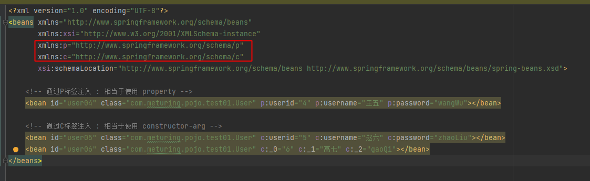
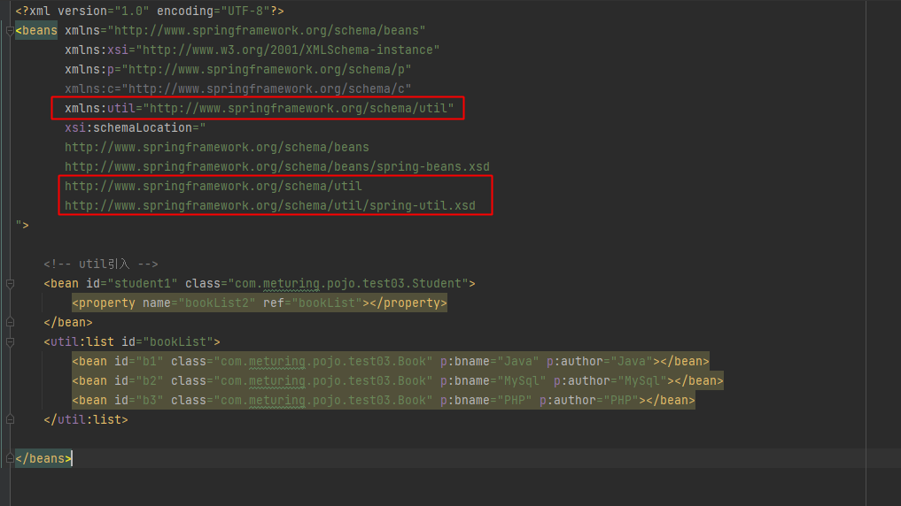

## IOC:控制反转

### 代码

```XML
<?xml version="1.0" encoding="UTF-8"?>
<beans xmlns="http://www.springframework.org/schema/beans"
       xmlns:xsi="http://www.w3.org/2001/XMLSchema-instance"
       xsi:schemaLocation="http://www.springframework.org/schema/beans http://www.springframework.org/schema/beans/spring-beans.xsd">
    <!-- 将DeptDaoImpl注册到Spring容器中 -->
    <bean id="deptDao" class="com.meturing.dao.impl.DeptDaoImpl"></bean>
 </beans>
```

```Java
    @Test
    public void test02(){
        //通过ClassPathXmlApplicationContext获取Spring.xml注册文件中的内容(底层Spring会自动根据我们的标签,为我们创建指定的对象)
        ApplicationContext applicationContext = new ClassPathXmlApplicationContext("spring.xml");
        //通过ApplicationContext对象获取容器中已经注册的Bean对象,并指定他的类型
        DeptDao deptDao = applicationContext.getBean("deptDao", DeptDao.class);
        //调用获取到的对象中的方法
        deptDao.sayHello();
    }
```

### IOC底层原理浅析

简单来讲分为三步走策略

#### 1. 解析XML配置文件

底层运用到了Dom4J的技术对于XML进行解析

```XML
<bean id="deptDao" class="com.meturing.dao.impl.DeptDaoImpl"></bean>
```

`ID` 为 解析后对应的名字 
`Class` 为需要注册成为Bean的类所在的全类路径

#### 2. 反射技术实例化对象,放到容器中

通过反射获取指定路径的字节码文件
`Class clazz =Class.forName("com.meturing.dao.impl.DeptDaoImpl")`

初始化这个对象
`Object obj  = clazz.newInstance();`

底层有个Map,将ID作为Key,对象作为Value存储起来
`map.put("deptDao",obj)`

#### 3.工厂模式返回Bean对象:  getBean方法

注意: IOC中存在两个Bean工厂接口(`BeanFactory` /  `ApplicationContext`)
`BeanFactory接口` :  IOC容器基本功能接口,是spring内部使用的接口,我们在处理业务时一般不直接使用该接口
`ApplicationContext 接口` :  BeanFactory的子接口,提供更多更强大的功能,研发人员一般使用的接口

我们可以通过以下实现类来构建Bean工厂对象
`FileSystemXmlApplicationContext` : 需要通过文件的结对路径或者相对于项目的路径来初始化XML
`ClassPathXmlApplicationContext` : 相对于Resource的路径

1. 获得Bean工厂对象
`ApplicationContext applicationContext = new ClassPathXmlApplicationContext("spring.xml");`

2. 调用ApplicationContext接口下的getBean方法来从Map中获取对象
`DeptDao deptDao = applicationContext.getBean("deptDao", DeptDao.class);`

其实底层相当于执行了:

```Java
public Object getBean(String name){
	Object obj =map.get(name);
	return obj;
}  
```

## DI : 依赖注入

`DI ( Dependency Injection )`，即“依赖注入” 就是创建属性时给对象属性赋值, 对象功能的实现往往要依赖属性的值,那么**给对象属性赋值就可以说成是依赖注入**

由于对象属性不仅仅是基本数据类型,还可能是其他类,或者引用类型, 那么依赖注入将会把更多的对象之间的关系整理到一起,可以形成一个庞大的依赖关系. **DI处理的是对象的属性赋值和互相依赖的关系**

## 获取Bean对象

Bean标签常用的属性:  
`id` -> 对象的id  
`class` -> 类的全路径名  
`name `-> 和id类似,一般不用  
`scope` -> 控制对象单例多例和使用范围  
	-  singleton作用域(scope 默认值) -> Spring IOC容器中只会存在一个共享的bean实例  
	-  prototype作用域 -> 部署的bean，每一次获取都会产生一个新的bean实例，相当与一个new的操作  
	-  request作用域 -> 表示该针对每一次HTTP请求都会产生一个新的bean，同时该bean仅在当前HTTP request内有效  
	-  session作用域 -> 表示该针对每一次HTTP请求都会产生一个新的bean，同时该bean仅在当前HTTP session内有效  
	-  global session作用域 -> 类似于标准的HTTP Session作用域，不过它仅仅在基于portlet的web应用中才有意义  
`lazy-init` -> 懒加载 调用getBean的时候再去实例化对象,默认是关闭的容器加载时初始化对象到容器中

准备实体类:

```Java
@Data
@ToString
public class User {
    private Integer userid;
    private String username;
    private String password;
    public User(Integer userid, String username, String password) {
        System.out.println("全参构造");
        this.userid = userid;
        this.username = username;
        this.password = password;
    }
    public User() {
        System.out.println("无参构造");
    }
}
```

### 常规使用

applictaionContext.xml

```XMl
<?xml version="1.0" encoding="UTF-8"?>
<beans xmlns="http://www.springframework.org/schema/beans"
       xmlns:xsi="http://www.w3.org/2001/XMLSchema-instance"
       xsi:schemaLocation="http://www.springframework.org/schema/beans http://www.springframework.org/schema/beans/spring-beans.xsd">
    <!-- 常规注册实体类 -->
    <bean id="user" class="com.meturing.pojo.test01.User"></bean>
    <bean id="user01" class="com.meturing.pojo.test01.User" name="userName1"></bean>
</beans>
```

Test.java

```Java
//常规使用
@Test
public void test01(){
	ApplicationContext applicationContext = new ClassPathXmlApplicationContext("applicationContext1.xml");
	User user = applicationContext.getBean("user", User.class);
	System.out.println(user);
}

//测试name
@Test
public void test02(){
	ApplicationContext applicationContext = new ClassPathXmlApplicationContext("applicationContext1.xml");
	User user = applicationContext.getBean("user01", User.class);
	System.out.println(user);
}
```

### 单例与多例模式

applictaionContext.xml

```XMl
<?xml version="1.0" encoding="UTF-8"?>
<beans xmlns="http://www.springframework.org/schema/beans"
       xmlns:xsi="http://www.w3.org/2001/XMLSchema-instance"
       xsi:schemaLocation="http://www.springframework.org/schema/beans http://www.springframework.org/schema/beans/spring-beans.xsd">
    <bean id="user02" class="com.meturing.pojo.test01.User" scope="prototype"></bean>  
	<bean id="user03" class="com.meturing.pojo.test01.User" scope="singleton"></bean>
</beans>
```

Test.java

```Java
//测试scope
@Test
public void test03(){
	ApplicationContext applicationContext = new ClassPathXmlApplicationContext("applicationContext1.xml");
	User user01 = applicationContext.getBean("user02", User.class);
	User user02 = applicationContext.getBean("user02", User.class);
	System.out.println(user01==user02);//false
	User user03 = applicationContext.getBean("user03", User.class);
	User user04 = applicationContext.getBean("user03", User.class);
	System.out.println(user03==user04);//true
}
```

### 懒加载

**不推荐开启懒加载,因为我们可以启动的时候多花点时间部署,简化用户第一次使用的体验时间**

applictaionContext.xml

```XMl
<?xml version="1.0" encoding="UTF-8"?>
<beans xmlns="http://www.springframework.org/schema/beans"
       xmlns:xsi="http://www.w3.org/2001/XMLSchema-instance"
       xsi:schemaLocation="http://www.springframework.org/schema/beans http://www.springframework.org/schema/beans/spring-beans.xsd">
    <bean id="user04" class="com.meturing.pojo.test01.User" lazy-init="true"></bean>
    <bean id="user05" class="com.meturing.pojo.test01.User" lazy-init="false"></bean>
    <bean id="user06" class="com.meturing.pojo.test01.User" lazy-init="default"></bean>
</beans>
```

Test.java

```Java
//测试lazy-init
@Test
public void test04(){
	ApplicationContext applicationContext = new ClassPathXmlApplicationContext("applicationContext1.xml");
	//User user01 = applicationContext.getBean("user04", User.class);
	//User user02 = applicationContext.getBean("user05", User.class);
	//User user03 = applicationContext.getBean("user06", User.class);
}
```

## 给Bean对象赋值

- `property` -> 通过Set赋值
- `constructor-arg`  -> 通过全参构造赋值. **个数必须和某个构造方法的参数个数向对应.** name 指的是参数名 / index指的是参数的索引 / value指的是参数值
- P标签相当于property  
- C标签相当于constructor-arg
- 特殊符号的处理需要遵循HTML特殊符号转义

### property : 通过Set赋值

applictaionContext.xml

```XML
<!-- 通过无参构造方法初始化,Set方法注入 -->
<bean id="user01" class="com.meturing.pojo.test01.User">
	<property name="userid" value="1"></property>
	<property name="username" value="admin"></property>
	<property name="password" value="admin"></property>
</bean>
```

Test.java

```Java
@Test
public void test01(){
	ApplicationContext applicationContext = new ClassPathXmlApplicationContext("applicationContext2_1.xml");
	User user = applicationContext.getBean("user01", User.class);
	System.out.println(user);//User(userid=1, username=admin, password=admin)
}
```

### constructor-arg : 通过全参构造赋值

applictaionContext.xml

```XML
<!-- 通过全参构造方法注入-->
<!-- 方式一:直接用通过参数名注入 -->
<bean id="user02" class="com.meturing.pojo.test01.User" >
	<constructor-arg name="userid" value="2"></constructor-arg>
	<constructor-arg name="username" value="张三"></constructor-arg>
	<constructor-arg name="password" value="zhangSan"></constructor-arg>
</bean>
<!-- 方式二:直接用通过参数位置注入 -->
<bean id="user03" class="com.meturing.pojo.test01.User" >
	<constructor-arg index="0" value="3"></constructor-arg>
	<constructor-arg index="1" value="李四"></constructor-arg>
	<constructor-arg index="2" value="liSi"></constructor-arg>
</bean>
```

Test.java

```Java
//全参构造初始化,带参注入
@Test
public void test02(){
	ApplicationContext applicationContext = new ClassPathXmlApplicationContext("applicationContext2_1.xml");
	User user = applicationContext.getBean("user02", User.class);
	System.out.println(user);//User(userid=2, username=张三, password=zhangSan)
}

//全参构造初始化,带参注入
@Test
public void test03(){
	ApplicationContext applicationContext = new ClassPathXmlApplicationContext("applicationContext2_1.xml");
	User user = applicationContext.getBean("user03", User.class);
	System.out.println(user);//User(userid=3, username=李四, password=liSi)
}
```

### P标签 与 C标签



applictaionContext.xml

```XML
<?xml version="1.0" encoding="UTF-8"?>
<beans xmlns="http://www.springframework.org/schema/beans"
       xmlns:xsi="http://www.w3.org/2001/XMLSchema-instance"
       xmlns:p="http://www.springframework.org/schema/p"
       xmlns:c="http://www.springframework.org/schema/c"
       xsi:schemaLocation="http://www.springframework.org/schema/beans http://www.springframework.org/schema/beans/spring-beans.xsd">

    <!-- 通过P标签注入 : 相当于使用 property -->
    <bean id="user04" class="com.meturing.pojo.test01.User" p:userid="4" p:username="王五" p:password="wangWu"></bean>

    <!-- 通过C标签注入 : 相当于使用 constructor-arg -->
    <bean id="user05" class="com.meturing.pojo.test01.User" c:userid="5" c:username="赵六" c:password="zhaoLiu"></bean>
    <bean id="user06" class="com.meturing.pojo.test01.User" c:_0="6" c:_1="高七" c:_2="gaoQi"></bean>
</beans>
```

Test.java

```Java
//p标签注入,相当于: property 无参构造初始化,使用set注入
@Test
public void test04(){
	ApplicationContext applicationContext = new ClassPathXmlApplicationContext("applicationContext2_2.xml");
	User user = applicationContext.getBean("user04", User.class);
	System.out.println(user);//User(userid=4, username=王五, password=wangWu)
}

//c标签注入,相当于: constructor-arg 全参构造初始化注入
@Test
public void test05(){
	ApplicationContext applicationContext = new ClassPathXmlApplicationContext("applicationContext2_2.xml");
	User user = applicationContext.getBean("user05", User.class);
	System.out.println(user);//User(userid=5, username=赵六, password=zhaoLiu)
}

//c标签注入,相当于: constructor-arg 全参构造初始化注入
@Test
public void test06(){
	ApplicationContext applicationContext = new ClassPathXmlApplicationContext("applicationContext2_2.xml");
	User user = applicationContext.getBean("user06", User.class);
	System.out.println(user);//User(userid=6, username=高七, password=gaoQi)
}
```

### 特殊符号的处理

`<null></null>` 可以直接赋值为NULL
`<` `&lt;`  `>` `&gt;`  `&` `&amp;`   遵循HTML转义
`<![CDATA[内容]]>` 可以强调以文本方式显示

applictaionContext.xml

```XML
<!-- 注入空值或特殊符号 -->
<bean id="user01" class="com.meturing.pojo.test01.User">
	<!--null值-->
	<property name="userid"><null></null></property>
	<!--特殊符号 转译字符 < &lt;  > &gt;  & &amp;   遵循HTML转义  -->
	<property name="username" value="&lt;张三&gt;"></property>
	<!-- 特殊符号  <![CDATA[内容]]>  -->
	<property name="password">
		<value><![CDATA[!@#%^^&&^%$$#&**]]></value>
	</property>
</bean>
```

Test.java

```Java
//特殊值注入
@Test
public void test07(){
	ApplicationContext applicationContext = new ClassPathXmlApplicationContext("applicationContext2_3.xml");
	User user = applicationContext.getBean("user01", User.class);
	System.out.println(user);//User(userid=null, username=<张三>, password=!@#%^^&&^%$$#&**)
}
```

## Bean对象的引用

#### 引入外部的Bean

applictaionContext.xml

```XML
<bean id="date1" class="java.util.Date"></bean>
<bean id="mouse01" class="com.meturing.pojo.test02.Mouse">
	<property name="name" value="Jerry"></property>
	<property name="birthdate" ref="date1"></property>
</bean>
```

Test.java

```Java
//外部Bean
@Test
public void test01(){
	ApplicationContext applicationContext = new ClassPathXmlApplicationContext("applicationContext3.xml");
	Mouse mouse = applicationContext.getBean("mouse01", Mouse.class);
	System.out.println(mouse);//Mouse(name=Jerry, birthdate=Mon Apr 24 10:57:20 CST 2023)
}
```

### 引入内部的Bean

applictaionContext.xml

```XML
<!-- 引入内部的Bean , 内部的Bean无需设置id-->
<bean id="cat01" class="com.meturing.pojo.test02.Cat">
	<property name="name" value="Tom"></property>
	<property name="mouse1">
		<bean id="mouse02" class="com.meturing.pojo.test02.Mouse">
			<property name="name" value="Jerry2"></property>
			<property name="birthdate">
				<bean class="java.util.Date"></bean>
			</property>
		</bean>
	</property>
</bean>
```

Test.java

```Java
//内部Bean
@Test
public void test02(){
	ApplicationContext applicationContext = new ClassPathXmlApplicationContext("applicationContext3.xml");
	Cat cat = applicationContext.getBean("cat01", Cat.class);
	System.out.println(cat);//Cat(name=Tom, mouse1=Mouse(name=Jerry2, birthdate=Mon Apr 24 10:59:29 CST 2023))
}
```

### 级联的Bean

applictaionContext.xml

```XML
<bean id="mouse03" class="com.meturing.pojo.test02.Mouse"></bean>
<bean id="cat02" class="com.meturing.pojo.test02.Cat">
	<property name="name" value="Tom01"></property>
	<property name="mouse1" ref="mouse03"></property>
	<property name="mouse1.name" value="Jarry3"></property>
	<property name="mouse1.birthdate">
		<bean class="java.util.Date"></bean>
	</property>
</bean>
```

Test.java

```Java
//级联Bean
@Test
public void test03(){
	ApplicationContext applicationContext = new ClassPathXmlApplicationContext("applicationContext3.xml");
	Cat cat = applicationContext.getBean("cat02", Cat.class);
	System.out.println(cat);//Cat(name=Tom01, mouse1=Mouse(name=Jarry3, birthdate=Mon Apr 24 11:00:01 CST 2023))
}
```

## 集合的赋值

准备环境

```Java
@Data  
@ToString  
@AllArgsConstructor  
@NoArgsConstructor  
public class Book {  
	private String bname;  
	private String author;  
}
```

```Java
@Data  
@ToString  
@AllArgsConstructor  
@NoArgsConstructor  
public class Student {  
	private String[] books;  
	private Set<String> bookSet;  
	private List<String> bookList;  
	private Map<String,String> bookMap;  
	private List<Book> bookList2;  
}
```

### 常规对List的操作

applictaionContext.xml

```XML
<?xml version="1.0" encoding="UTF-8"?>
<beans xmlns="http://www.springframework.org/schema/beans"
       xmlns:xsi="http://www.w3.org/2001/XMLSchema-instance"
       xmlns:p="http://www.springframework.org/schema/p"
       xmlns:c="http://www.springframework.org/schema/c"
       xsi:schemaLocation="http://www.springframework.org/schema/beans http://www.springframework.org/schema/beans/spring-beans.xsd">

    <!-- 基本集合注入 -->
    <bean id="student1" class="com.meturing.pojo.test03.Student">
        <property name="books">
            <!-- 数组注入 -->
            <array>
                <value>Java</value>
                <value>MySql</value>
                <value>PHP</value>
            </array>
        </property>

        <!-- set集合注入 -->
        <property name="bookSet">
            <set>
                <value>Java</value>
                <value>MySql</value>
                <value>PHP</value>
            </set>
        </property>
        
        <!-- list集合注入 -->
        <property name="bookList">
            <list>
                <value>Java</value>
                <value>MySql</value>
                <value>PHP</value>
            </list>
        </property>
        
        <!-- Map集合注入 -->
        <property name="bookMap">
            <map>
                <entry key="Java" value="Java"></entry>
                <entry key="MySql" value="MySql"></entry>
                <entry key="PHP" value="PHP"></entry>
            </map>
        </property>
        
        <property name="bookList2">
            <list>
                <bean id="b1" class="com.meturing.pojo.test03.Book" p:bname="Java" p:author="Java"></bean>
                <bean id="b2" class="com.meturing.pojo.test03.Book" p:bname="MySql" p:author="MySql"></bean>
                <bean id="b3" class="com.meturing.pojo.test03.Book" p:bname="PHP" p:author="PHP"></bean>
            </list>
        </property>
    </bean>
    <bean id="b1" class="com.meturing.pojo.test03.Book" p:bname="Java" p:author="Java"></bean>
    <bean id="b2" class="com.meturing.pojo.test03.Book" p:bname="MySql" p:author="MySql"></bean>
    <bean id="b3" class="com.meturing.pojo.test03.Book" p:bname="PHP" p:author="PHP"></bean>
</beans>
```

Test.java

```Java
//基本集合使用
@Test
public void test01(){
	ApplicationContext applicationContext = new ClassPathXmlApplicationContext("applicationContext4_1.xml");
	Student student = applicationContext.getBean("student1", Student.class);
	System.out.println(Arrays.toString(student.getBooks()));//[Java, MySql, PHP]
	System.out.println(student.getBookList());//[Java, MySql, PHP]
	System.out.println(student.getBookSet());//[Java, MySql, PHP]
	System.out.println(student.getBookMap());//{Java=Java, MySql=MySql, PHP=PHP}
	System.out.println(student.getBookList2());//[Book(bname=Java, author=Java), Book(bname=MySql, author=MySql), Book(bname=PHP, author=PHP)]
}
```

### 引入util声明集合



applictaionContext.xml

```XML
<?xml version="1.0" encoding="UTF-8"?>
<beans xmlns="http://www.springframework.org/schema/beans"
       xmlns:xsi="http://www.w3.org/2001/XMLSchema-instance"
       xmlns:p="http://www.springframework.org/schema/p"
       xmlns:c="http://www.springframework.org/schema/c"
       xmlns:util="http://www.springframework.org/schema/util"
       xsi:schemaLocation="
       http://www.springframework.org/schema/beans
       http://www.springframework.org/schema/beans/spring-beans.xsd
       http://www.springframework.org/schema/util
       http://www.springframework.org/schema/util/spring-util.xsd
">
    <!-- util引入 -->
    <bean id="student1" class="com.meturing.pojo.test03.Student">
        <property name="bookList2" ref="bookList"></property>
    </bean>
    <util:list id="bookList">
        <bean id="b1" class="com.meturing.pojo.test03.Book" p:bname="Java" p:author="Java"></bean>
        <bean id="b2" class="com.meturing.pojo.test03.Book" p:bname="MySql" p:author="MySql"></bean>
        <bean id="b3" class="com.meturing.pojo.test03.Book" p:bname="PHP" p:author="PHP"></bean>
    </util:list>
</beans>
```

Test.java

```Java
//util标签使用
@Test
public void test02(){
	ApplicationContext applicationContext = new ClassPathXmlApplicationContext("applicationContext4_2.xml");
	Student student = applicationContext.getBean("student1", Student.class);
	System.out.println(student.getBookList2());//[Book(bname=Java, author=Java), Book(bname=MySql, author=MySql), Book(bname=PHP, author=PHP)]
}
```
