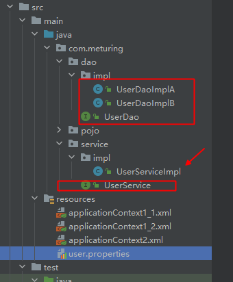
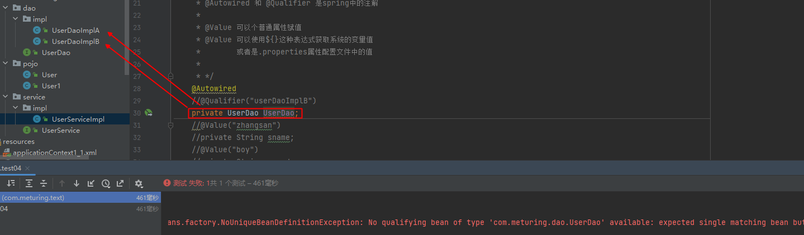
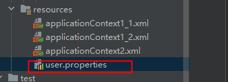
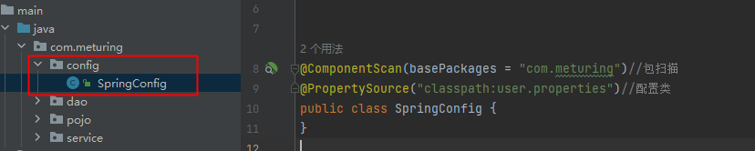

## 基于注解的IOC

### 相关注解

`@Component`   放在类上,用于标记,告诉spring当前类需要由容器实例化bean并放入容器中
该注解有三个子注解:
- `Controller`   用于实例化controller层bean
- `Service`        用于实例化service层bean
- `Repository`  用于实例化持久层bean

 当不确定是哪一层,就用Component,这几个注解互相混用其实也可以,但是不推荐

默认情况下,注册到容器的ID是当前类名的首字母小写.如:`User` -> `user`
当然我们可以直接指定注册的ID: `@Component(value = "userName1")` -> `@Component("userName1")`

### 包扫描

在之前的XML写法中我们手动直接指定对应的实体类:

```XML
<?xml version="1.0" encoding="UTF-8"?>  
<beans xmlns="http://www.springframework.org/schema/beans"  
xmlns:xsi="http://www.w3.org/2001/XMLSchema-instance"  
xmlns:context="http://www.springframework.org/schema/context"  
xsi:schemaLocation="http://www.springframework.org/schema/beans  
http://www.springframework.org/schema/beans/spring-beans.xsd  
http://www.springframework.org/schema/context  
http://www.springframework.org/schema/context/spring-context.xsd">
	<bean id="user" class="com.meturing.pojo.User"></bean>
</beans>
```

这样的话可能会造成手动注册管理及其麻烦,所以我们可以使用包扫秒直接批量注册使用注解的实体类

```XMl
<?xml version="1.0" encoding="UTF-8"?>  
<beans xmlns="http://www.springframework.org/schema/beans"  
xmlns:xsi="http://www.w3.org/2001/XMLSchema-instance"  
xmlns:context="http://www.springframework.org/schema/context"  
xsi:schemaLocation="http://www.springframework.org/schema/beans  
http://www.springframework.org/schema/beans/spring-beans.xsd  
http://www.springframework.org/schema/context  
http://www.springframework.org/schema/context/spring-context.xsd">
	<context:component-scan base-package="com.meturing.pojo" />
</beans>
```

`base-package 后面放要扫描的包`
如果有多个包需要扫描,可以使用逗号隔开 com.meturing.bean,com.meturing.service 或者 可以写上一层包路径 com.meturing

默认情况下,使用包扫描会注入所有的实体类(`Component` / `Controller` / `Service` / `Repository`),我们可以使用标签来选择和排除指定的标签:

- `context:include-filter`  : 只扫描指定的标签注解
```XMl
<?xml version="1.0" encoding="UTF-8"?>  
<beans xmlns="http://www.springframework.org/schema/beans"  
xmlns:xsi="http://www.w3.org/2001/XMLSchema-instance"  
xmlns:context="http://www.springframework.org/schema/context"  
xsi:schemaLocation="http://www.springframework.org/schema/beans  
http://www.springframework.org/schema/beans/spring-beans.xsd  
http://www.springframework.org/schema/context  
http://www.springframework.org/schema/context/spring-context.xsd">
	<!--   只扫描Component     -->
	<context:component-scan base-package="com.meturing.pojo" use-default-filters="false">
		<context:include-filter type="annotation" expression="org.springframework.stereotype.Component"/>
	</context:component-scan>
</beans>
```

- `context:exclude-filter` : 排除指点的标签注解
```XMl
<?xml version="1.0" encoding="UTF-8"?>  
<beans xmlns="http://www.springframework.org/schema/beans"  
xmlns:xsi="http://www.w3.org/2001/XMLSchema-instance"  
xmlns:context="http://www.springframework.org/schema/context"  
xsi:schemaLocation="http://www.springframework.org/schema/beans  
http://www.springframework.org/schema/beans/spring-beans.xsd  
http://www.springframework.org/schema/context  
http://www.springframework.org/schema/context/spring-context.xsd">
	<!--   排除Service     -->
	<context:component-scan base-package="com.meturing.pojo" use-default-filters="true">
		<context:exclude-filter type="annotation" expression="org.springframework.stereotype.Service"/>
	</context:component-scan>
</beans>
```

### 相关代码

#### 测试基本注册

实体类
```Java
@Component  
@Data  
@ToString  
@NoArgsConstructor  
public class User {  
}
```

applicationContext.xml
```XML
<?xml version="1.0" encoding="UTF-8"?>  
<beans xmlns="http://www.springframework.org/schema/beans"  
xmlns:xsi="http://www.w3.org/2001/XMLSchema-instance"  
xmlns:context="http://www.springframework.org/schema/context"  
xsi:schemaLocation="http://www.springframework.org/schema/beans  
http://www.springframework.org/schema/beans/spring-beans.xsd  
http://www.springframework.org/schema/context  
http://www.springframework.org/schema/context/spring-context.xsd">
	<!-- 扫描指定包下面的所有实体类 -->  
	<context:component-scan base-package="com.meturing.pojo" />
</beans>
```

测试类
```Java
@Test
public void test01(){
	ApplicationContext applicationContext = new ClassPathXmlApplicationContext("applicationContext1_1.xml");
	User user = applicationContext.getBean("user", User.class);
	System.out.println(user);
}
```

#### 测试指定名称


实体类
```Java
@Data  
@ToString  
@NoArgsConstructor  
//@Component(value = "user1")  
@Component("user1")  
public class User1 {  
}
```

applicationContext.xml
```XML
<?xml version="1.0" encoding="UTF-8"?>  
<beans xmlns="http://www.springframework.org/schema/beans"  
xmlns:xsi="http://www.w3.org/2001/XMLSchema-instance"  
xmlns:context="http://www.springframework.org/schema/context"  
xsi:schemaLocation="http://www.springframework.org/schema/beans  
http://www.springframework.org/schema/beans/spring-beans.xsd  
http://www.springframework.org/schema/context  
http://www.springframework.org/schema/context/spring-context.xsd">
	<!-- 扫描指定包下面的所有实体类 -->  
	<context:component-scan base-package="com.meturing.pojo" />
</beans>
```

测试类
```Java
@Test  
public void test02(){  
	ApplicationContext applicationContext = new ClassPathXmlApplicationContext("applicationContext1_1.xml");  
	User1 user1 = applicationContext.getBean("user1", User1.class);  
	System.out.println(user1);  
}
```

#### 测试指定注解

实体类
```Java
@Data  
@ToString  
@NoArgsConstructor  
//@Component(value = "user1")  
@Component("user1")  
public class User1 {  
}
```

applicationContext.xml
```XML
<?xml version="1.0" encoding="UTF-8"?>  
<beans xmlns="http://www.springframework.org/schema/beans"  
xmlns:xsi="http://www.w3.org/2001/XMLSchema-instance"  
xmlns:context="http://www.springframework.org/schema/context"  
xsi:schemaLocation="http://www.springframework.org/schema/beans  
http://www.springframework.org/schema/beans/spring-beans.xsd  
http://www.springframework.org/schema/context  
http://www.springframework.org/schema/context/spring-context.xsd">
	<!-- 只扫描Component -->  
	<context:component-scan base-package="com.meturing.pojo" use-default-filters="false">  
		<context:include-filter type="annotation" expression="org.springframework.stereotype.Component"/>  
	</context:component-scan>  
	<!-- 排除Service -->  
	<context:component-scan base-package="com.meturing.pojo" use-default-filters="true">  
		<context:exclude-filter type="annotation" expression="org.springframework.stereotype.Service"/>  
	</context:component-scan>
</beans>
```

测试类
```Java
@Test  
public void test03(){  
	ApplicationContext applicationContext = new ClassPathXmlApplicationContext("applicationContext1_2.xml");  
	User1 user1 = applicationContext.getBean("user1", User1.class);  
	System.out.println(user1);  
}
```

## 基于注解的DI

`@Autowired`   根据属性数据类型自动装配
`@Qualifier`   搭配@Autowired使用,根据属性名称注入依赖,多用于一个接口多个实现类的情况
`@Resources`   是Java的原生注解, 可以根据类型,也可以根据名称注入
`@Value`           注入普通数据类型(8+String)

### 环境准备



applicationContext.xml

```XMl
<?xml version="1.0" encoding="UTF-8"?>  
<beans xmlns="http://www.springframework.org/schema/beans"  
xmlns:xsi="http://www.w3.org/2001/XMLSchema-instance"  
xmlns:context="http://www.springframework.org/schema/context"  
xsi:schemaLocation="http://www.springframework.org/schema/beans  
http://www.springframework.org/schema/beans/spring-beans.xsd  
http://www.springframework.org/schema/context  
http://www.springframework.org/schema/context/spring-context.xsd">  
	<context:component-scan base-package="com.meturing" />  
</beans>
```

创建Dao层

```Java
public interface UserDao {  
	void sayHello();  
}
```

```Java
@Repository("userDaoImplA")  
public class UserDaoImplA implements UserDao {  
	@Override  
	public void sayHello() {  
		System.out.println("UserDaoImplA say :hello");  
	}  
}
```

```Java
@Repository("userDaoImplB")  
public class UserDaoImplB implements UserDao {  
	@Override  
	public void sayHello() {  
		System.out.println("UserDaoImplB say :hello");  
	}  
}
```

创建Service层

```Java
public interface UserService {  
	void sayHello();  
}
```

测试类
```Java
@Test  
public void test04(){  
	ApplicationContext applicationContext = new ClassPathXmlApplicationContext("applicationContext2.xml");  
	UserServiceImpl userServiceImpl = applicationContext.getBean("userServiceImpl", UserServiceImpl.class);  
	userServiceImpl.sayHello();  
}
```

### Autowired的使用

默认情况下,`@Autowired` 注解会根据变量名字查找具体的实例对象,例如:

userDaoImplB 会找到 UserDaoImplB 注入

UserServiceImpl实现类
```Java
@Service  
public class UserServiceImpl implements UserService {    
	@Autowired  
	private UserDao userDaoImplB;   
	@Override  
	public void sayHello() {  
		userDao.sayHello();  
	}  
}
```

输出结果

```Java
UserDaoImplB say :hello
```

### Qualifier的使用

如果变量名字直接为接口,且有多个实现类需要注入的话,则需要使用Qualifier搭配,否则会报错



搭配Qualifier指定注入的实例ID

UserServiceImpl实现类

```Java
@Autowired  
@Qualifier("userDaoImplB")  
private UserDao UserDao;  
@Override  
public void sayHello() {  
	UserDao.sayHello();  
}
```

输出结果

```Java
UserDaoImplB say :hello
```

### Resources的使用

我们可以使用Java的原生注解`@Resources`来指定注入的ID或者注入的类型:

UserServiceImpl实现类

```java
//@Resource(name = "userDaoImplB")  
@Resource(type = UserDaoImplB.class)
private UserDao UserDao;  
@Override  
public void sayHello() {  
	UserDao.sayHello();  
}
```

输出结果

```Java
UserDaoImplB say :hello
```

### Value的使用

我们可以用@Value注解为注入的Bean的属性赋初始值

UserServiceImpl实现类

```java
@Autowired  
@Qualifier("userDaoImplB")  
private UserDao UserDao;  
@Value("zhangsan")  
private String sname;  
@Value("boy")  
private String sgender;  
@Value("16")  
private Integer sage;  
@Override  
public void sayHello() {  
	UserDao.sayHello();  
	System.out.println(sname);  
	System.out.println(sgender);  
	System.out.println(sage);  
}
```

输出结果

```Java
UserDaoImplB say :hello
zhangsan
boy
16
```

### 引入外部资源注入

添加user.properties外部资源文件


```properties
sname=root  
sgender=root
```

修改applicationContext.xml,导入配置文件
```XMl
<?xml version="1.0" encoding="UTF-8"?>  
<beans xmlns="http://www.springframework.org/schema/beans"  
xmlns:xsi="http://www.w3.org/2001/XMLSchema-instance"  
xmlns:context="http://www.springframework.org/schema/context"  
xsi:schemaLocation="http://www.springframework.org/schema/beans  
http://www.springframework.org/schema/beans/spring-beans.xsd  
http://www.springframework.org/schema/context  
http://www.springframework.org/schema/context/spring-context.xsd">  
	<context:component-scan base-package="com.meturing" />  
	<!-- 引入外部资源注入 -->
	<context:property-placeholder location="classpath:user.properties" />  
</beans>
```


```java
@Autowired  
@Qualifier("userDaoImplB")  
private UserDao UserDao;  
@Value("${sname}")  
private String sname;  
@Value("boy")  
private String sgender;  
@Value("16")  
private Integer sage;  
@Override  
public void sayHello() {  
	UserDao.sayHello();  
	System.out.println(sname);  
	System.out.println(sgender);  
	System.out.println(sage);  
}
```

输出结果

```Java
UserDaoImplB say :hello
root
boy
16
```

### 完全使用注解(使用配置类)

#### 创建Config类



```Java
@ComponentScan(basePackages = "com.meturing")//包扫描  
@PropertySource("classpath:user.properties")//配置类  
public class SpringConfig {  
}
```

`@ComponentScan` 表示包扫描,用于注册到容器
`@PropertySource` 表示外部引用资源

#### 使用配置类获取容器中的Bean

`AnnotationConfigApplicationContext`

```Java
@Test  
public void test05(){  
	ApplicationContext applicationContext = new AnnotationConfigApplicationContext(SpringConfig.class);  
	UserServiceImpl userServiceImpl = applicationContext.getBean("userServiceImpl", UserServiceImpl.class);  
	userServiceImpl.sayHello();  
}
```
