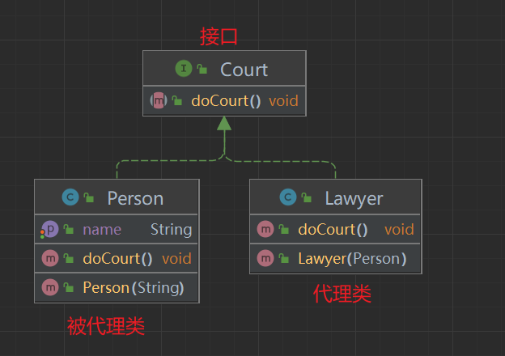
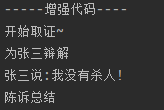
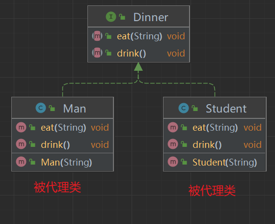
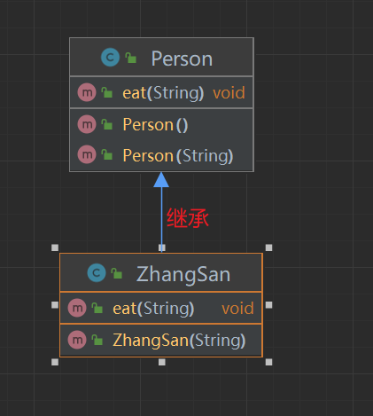
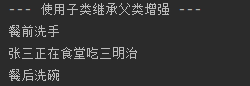
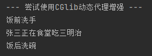

## 静态代理

代理类与被代理类实现共同接口,在代理类中对被代理类进行代码增强




### 代码Demo

简单的一个Demo来模拟以下情景:

用户张三需要打官司,请律师在他讲话之前进行辩护和总结

Court 接口
```Java
public interface Court {
    void doCourt();
}
```

Person 实体类
```Java
public class Person  implements Court {
    private String name;
    public Person(String name) {
        this.name = name;
    }
    public String getName() {
        return name;
    }
    public void setName(String name) {
        this.name = name;
    }
    public void doCourt() {
        System.out.println(name + "说:我没有杀人!");
    }
}
```

正常情况下,我们直接使用`Person类`会出现以下情况
```Java
public class TestDemo {
    public static void main(String[] args) {
        Person person = new Person("张三");
        person.doCourt();
    }
}
```


接下来我们使用静态代理的方式创建一个代理类,来**增强Person类**
```Java
public class Lawyer implements Court {
    private Person person;//被代理的类
    public Lawyer(Person person) {
        this.person = person;
    }
    public void doCourt() {
        //增强代码
        System.out.println("开始取证~");
        System.out.println("为"+person.getName()+"辩解");
        //执行代码
        person.doCourt();
        //增强代码
        System.out.println("陈诉总结");
    }
}
```

增强后的效果
```java
public class TestDemo {
    public static void main(String[] args) {
        Lawyer lawyer = new Lawyer(person);
        lawyer.doCourt();
    }
}
```




### 总结

**静态代理中代理类与被代理类都需要实现同一个接口**，这就说明我们的一个静态代理类只能代理一个类，并且还要事先知道我们要代理哪个类才能写代理类，如果我们有其他类还想使用代理那就必须再写一个代理类。

然而在实际开发中我们是可能是有非常多的类是需要被代理的，并且事先我们可能并不知道我们要代理哪个类。**所以如果继续使用静态代理反而会增加许多的工作量，并且效率低下，代码复用率也不好。**

## 动态代理

动态代理可以针对于一些不特定的类或者一些不特定的方法进行代理,我们可以在程序运行时动态的变化代理的规则，代理类在程序运行时才创建的代理模式成为动态代理。这种情况下，代理类并不是在Java代码中定义好的，而是在程序运行时根据我们的在Java代码中的“指示”动态生成的

| 类型               | 归属      | 特征   |
|:-----------------|:--------|:-----|
| Proxy&nbsp; 动态代理 | JDK动态代理 | 面向接口 |
| CGlib&nbsp; 动态代理 | 第三方动态代理 | 面向父类 |  

### Proxy动态代理

通过Porxy动态代理获得一个代理对象,在代理对象中,对某个方法进行增强

`Proxy.newProxyInstance` 方法需要三个参数:
-  `ClassLoader loader`  -> 被代理类的类加载器,可通过反射获取
-  `Class<?>[] interfaces`  -> 被代理类的接口Class对象,可通过反射获取
-  `InvocationHandler h`  -> 方法调度接口,可以直接New接口对象或者新建类实现改接口




#### 代码Demo

接口
```Java
public interface Dinner {
    void eat(String foodName);
    void drink();
}
```

被代理类
```Java
public class Man implements Dinner {
    private String name;
    public Man(String name) {
        this.name = name;
    }
    @Override
    public void eat(String foodName) {
        System.out.println(name+"正在吃"+foodName);
    }
    @Override
    public void drink() {
        System.out.println(name+"正在喝茶");
    }
}
```

```Java
public class Student implements Dinner {
    private String name;
    public Student(String name) {
        this.name = name;
    }
    @Override
    public void eat(String foodName) {
        System.out.println(name+"正在食堂吃"+foodName);
    }
    @Override
    public void drink() {
        System.out.println(name+"正在喝可乐");
    }
}
```

使用Proxy动态代理
```Java
public class Test1 {
    public static void main(String[] args) {
        Dinner dinner = new Man("张三");
        //ClassLoader loader,
        ClassLoader classLoader = dinner.getClass().getClassLoader();
        //Class<?>[] interfaces,
        Class<?>[] interfaces = dinner.getClass().getInterfaces();
        //InvocationHandler h
        InvocationHandler invocationHandler = new InvocationHandler() {
            @Override
            public Object invoke(Object proxy, Method method, Object[] args) throws Throwable {
                Object results = null;
                if (method.getName().equals("eat")) {
                    System.out.println("餐前洗手~");
                    //Object obj, Object... args   obj被代理的对象  args表示参数
                    results = method.invoke(dinner,args);
                    System.out.println("餐后洗碗~");
                }else {
                    results = method.invoke(dinner,args);
                }
                return results;
            }
        };
        Dinner dinnerProxy = (Dinner) Proxy.newProxyInstance(classLoader, interfaces, invocationHandler);
        dinnerProxy.eat("三明治");
        dinnerProxy.drink();
    }
}
```

#### 总结

在不修改原有代码的 或者没有办法修改原有代码的情况下增强对象功能 ,使用代理对象代替原来的对象去完成功能进而达到拓展功能的目的

JDK Proxy 动态代理面向接口的动态代理,**一定要有接口和实现类的存在.代理对象增强的是实现类**
生成的代理对象**只能转换成接口的对象** 不能转换成被代理类的对象
代理对象**只能增强接口中定义的方法**  实现类中其他和接口无关的方法是无法增强的
代理对象**只能读取到接口中方法上的注解** 不能读取到实现类方法上的注解

### CGlib动态代理

CGlib动态代理是面向父类的,利用的子类继承父类的特新实现代码增强

#### 底层原理

使用继承实现增强



实体类
```Java
public class Person  {
    private String name;
    public Person(String name) {
        this.name = name;
    }
    public Person() {
    }
    public void eat(String foodName) {
        System.out.println(name+"正在食堂吃"+foodName);
    }
}
```

增强子类
```Java
public class ZhangSan extends Person {
    public ZhangSan(String name) {
        super(name);
    }
    @Override
    public void eat(String foodName) {
        System.out.println("餐前洗手");
        super.eat(foodName);
        System.out.println("餐后洗碗");
    }
}
```

测试效果
```Java
public class Test01 {
    public static void main(String[] args) {
        System.out.println("--- 使用子类继承父类增强 ---");
        ZhangSan zhangSan = new ZhangSan("张三");
        zhangSan.eat("三明治");
    }
}
```


#### 使用CGlib动态代理

##### 环境准备

CGlib动态代理需要依赖`org.springframework.cglib`包,所以在使用前需要导包.
我们可以直接导入`spring-context` 将会自动关联依赖
```XML
<dependencies>
	<dependency>
		<groupId>org.springframework</groupId>
		<artifactId>spring-context</artifactId>
		<version>5.2.12.RELEASE</version>
	</dependency>
</dependencies>
```

##### 代码

1. 创建一个Enhancer对象
2. 为Enhancer对象设置父类字节码
3. 获取MethodInterceptor对象 用于定义增强规则
4. 为Enhancer对象设置methodInterceptor
5. 通过Enhancer对象获得代理对象

```Java
public class Test01 {
    public static void main(String[] args) {
        System.out.println("--- 尝试使用CGlib动态代理增强 ---");
        // 1 获得一个Enhancer对象
        Enhancer enhancer = new Enhancer();
        // 2 设置父类字节码
        enhancer.setSuperclass(Person.class);
        // 3 获取MethodInterceptor对象 用于定义增强规则
        MethodInterceptor interceptor = new MethodInterceptor() {
            /**
             * 拦截
             *
             * @param o           生成之后的代理对象 personProxy
             * @param method      父类中原本要执行的方法  Person>>> eat()
             * @param objects     方法在调用时传入的实参数组
             * @param methodProxy 子类中重写父类的方法 personProxy >>> eat()
             * @return {@link Object }
             * @author sqTan
             * @date 2023/05/05
             */
            @Override
            public Object intercept(Object o, Method method, Object[] objects, MethodProxy methodProxy) throws Throwable {
                Object result = null;
                if (method.getName().equals("eat")) {
                    System.out.println("饭前洗手");
                    methodProxy.invokeSuper(o,objects);
                    System.out.println("饭后洗碗");
                }else {
                    methodProxy.invokeSuper(o, objects);
                }
                return result;
            }
        };
        // 4 设置methodInterceptor
        enhancer.setCallback(interceptor);
        // 5 获得代理对象 Class[] argumentTypes, Object[] arguments
        //Person person = (Person) enhancer.create(); //使用无参构造
        Person person = (Person) enhancer.create(new Class[]{String.class},new Object[]{"张三"});//使用带参构造
        // 6 使用代理对象完成功能
        person.eat("三明治");
    }
}
```




#### 总结

1. 面向父类和接口没有关系
2. 不仅仅可以增强接口中定义的方法还可以增强一个类的其他方法
3. 可以读取父类中方法上的所有注解
