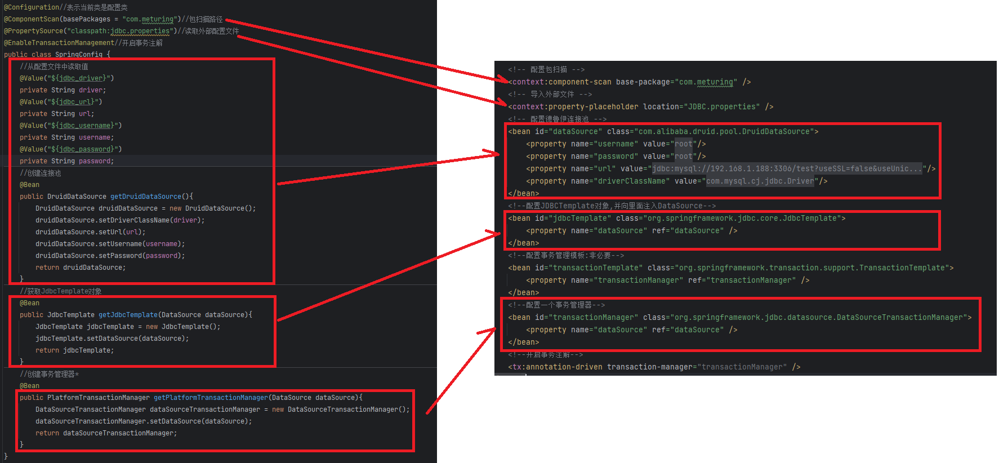
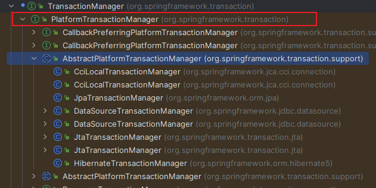

## 代码实例

创建配置类 : com.meturing.config.SpringConfig.java
```java
@Configuration//表示当前类是配置类
@ComponentScan(basePackages = "com.meturing")//包扫描路径
@PropertySource("classpath:jdbc.properties")//读取外部配置文件
@EnableTransactionManagement//开启事务注解
public class SpringConfig {
    //从配置文件中读取值
    @Value("${jdbc_driver}")
    private String driver;
    @Value("${jdbc_url}")
    private String url;
    @Value("${jdbc_username}")
    private String username;
    @Value("${jdbc_password}")
    private String password;
    //创建连接池
    @Bean
    public DruidDataSource getDruidDataSource(){
        DruidDataSource druidDataSource = new DruidDataSource();
        druidDataSource.setDriverClassName(driver);
        druidDataSource.setUrl(url);
        druidDataSource.setUsername(username);
        druidDataSource.setPassword(password);
        return druidDataSource;
    }
    //获取JdbcTemplate对象
    @Bean
    public JdbcTemplate getJdbcTemplate(DataSource dataSource){
        JdbcTemplate jdbcTemplate = new JdbcTemplate();
        jdbcTemplate.setDataSource(dataSource);
        return jdbcTemplate;
    }
    //创建事务管理器*
    @Bean
    public PlatformTransactionManager getPlatformTransactionManager(DataSource dataSource){
        DataSourceTransactionManager dataSourceTransactionManager = new DataSourceTransactionManager();
        dataSourceTransactionManager.setDataSource(dataSource);
        return dataSourceTransactionManager;
    }
}
```

测试事务:
```Java
@Test()
public void testTransaction3(){
	ApplicationContext context =new AnnotationConfigApplicationContext(SpringConfig.class);
	AccountService accountService = context.getBean(AccountService.class);
	int rows = accountService.transMoney(1, 2, 100);
	System.out.println(rows);
}
```

## 代码解析

其实使用配置类配置事务,与xml的结构基本相似,都是对一些必须的类进行Bean的注入



比较特殊的是,使用XML时我们直接注入DataSourceTransactionManager类即可,Spring底层会自动通过类名注入到PlatformTransactionManager接口.在我们手动配置类时,需要直接注入到PlatformTransactionManager接口


