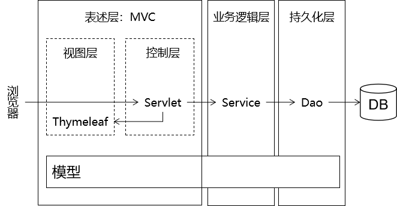

## 前言

### MVC的概念


Spring MVC属于SpringFrameWork的后续产品，已经融合在Spring Web Flow里面。Spring 框架提供了构建 Web 应用程序的全功能 MVC 模块。使用 Spring 可插入的 MVC 架构，从而在使用Spring进行WEB开发时，可以选择使用Spring的SpringMVC框架或集成其他MVC开发框架，如Struts1(现在一般不用)，Struts 2(一般老项目使用)等等。



- M (model)    ->    模型层    ->    DAO封装    ->    Mybatis
- V (view)    ->    视图层    ->    html css  js  jsp 
- C(controller)    ->    控制层    ->    Servlet封装    ->    springMVC 

### 优点

1. SpringMVC是spring为展现层提供的基于MVC设计理念的优秀WEB框架,是目前最主流的MVC框架之一
2. SpringMVC通过一套注解,可以让普通的JAVA类成为contrllor控制器,无需继承Servlet,实现了控制层和Servlet之间的解耦
3. SpringMVC支持Rest风格的URL写法
4. SpringMVC采用了松耦合,可热插的主键结构,比其他的框架更具扩展性和灵活性

## 环境准备

### 检查项目配置

检查Maven的相关配置与仓库地址 : 


检查是启动注解处理


### 创建MavenWeb模块

创建Maven骨架 : 注意选择骨架为 `maven-archetype-webapp`


此时我们的项目中初始化了一些配置


### 检查目录标记

创建目录:


检查目录是否正常标记


### 修改Web.xml

可以创建一个javaEE项目,然后复制web.xml文件中的内容即可


```XML
<?xml version="1.0" encoding="UTF-8"?>
<web-app xmlns="http://xmlns.jcp.org/xml/ns/javaee"
         xmlns:xsi="http://www.w3.org/2001/XMLSchema-instance"
         xsi:schemaLocation="http://xmlns.jcp.org/xml/ns/javaee http://xmlns.jcp.org/xml/ns/javaee/web-app_4_0.xsd"
         version="4.0">
</web-app>
```

### 测试Demo

#### 调整POM依赖

```xml
<project xmlns="http://maven.apache.org/POM/4.0.0" xmlns:xsi="http://www.w3.org/2001/XMLSchema-instance"
  xsi:schemaLocation="http://maven.apache.org/POM/4.0.0 http://maven.apache.org/maven-v4_0_0.xsd">
  <modelVersion>4.0.0</modelVersion>
  <groupId>com.meturing</groupId>
  <artifactId>SpringMVC_01</artifactId>
  <packaging>war</packaging>
  <version>1.0-SNAPSHOT</version>
  <dependencies>
    <!--servlet jsp 依赖-->
    <dependency>
      <groupId>javax.servlet</groupId>
      <artifactId>javax.servlet-api</artifactId>
      <version>4.0.1</version>
      <scope>provided</scope>
    </dependency>
    <dependency>
      <groupId>javax.servlet.jsp</groupId>
      <artifactId>javax.servlet.jsp-api</artifactId>
      <version>2.3.3</version>
      <scope>provided</scope>
    </dependency>
  </dependencies>
</project>
```

注意:这两个依赖仅限于编译的时候使用,在打包到TomCat中时,lib目录下已经有这两依赖了.

#### 创建servlet


```Java
package com.meturing.controller;
@WebServlet("/myServlet.do")
public class MyServlet extends HttpServlet {
    @Override
    protected void service(HttpServletRequest req, HttpServletResponse resp) throws ServletException, IOException {
	    //请求转发
        req.getRequestDispatcher("first.jsp").forward(req,resp);
    }
}
```

#### 创建JSP

first.jsp


```JSP
<%@ page contentType="text/html;charset=UTF-8" language="java" %>
<html>
<head>
    <title>Hello World</title>
</head>
<body>
    <h1>My first JSP</h1>
</body>
</html>

```

### 检查并运行项目

#### 检查项目

创建TomCat配置


导入模块


修改路径


检查配置
]


应用

#### 运行项目


默认打开的是: index.jsp


输入地址: `http://localhost:8080/SpringMVC_01/myServlet.do` 打开我们的first.jsp

