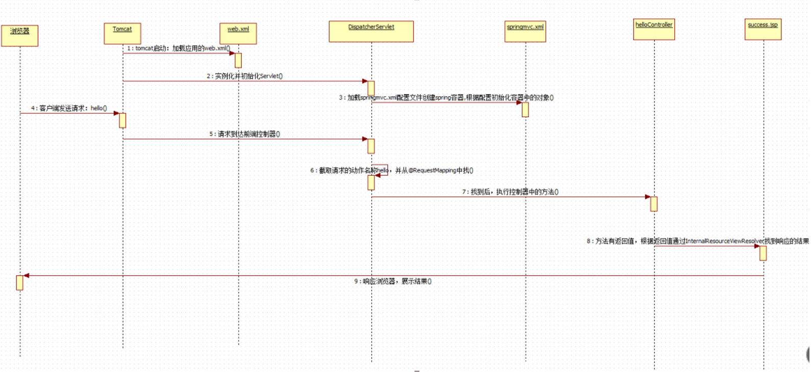

## 执行时序图




## SpringMVC的执行流程


1. 用法发出请求,并被**DispatcherServlet**拦截
2. **DispatcherServlet**查询**HandlerMapping处理器映射器**中当前请求的位置
4.  **DispatcherServlet**根据**HandlerMapping处理器映射器**反馈的位置,请求**HandlerAdapter处理器适配器**执行对应的Controller处理单元
5. **HandlerAdapter处理器适配器**执行**Handler处理器**,并接收到**ModelAndView对象**返回给**DispatcherServlet**
6. **DispatcherServlet**再次携带ModelAndView对象请求**ViewResolver视图解析器**解析
7. **ViewResolver视图解析器**返回解析后的View对象
8. **DispatcherServlet**将View对象渲染View对象为视图层,并响应给前端用户

## SpringMVC的组件

### DispatcherServlet 前端控制器

用户请求到达前端控制器，它就相当于 mvc 模式中的 c，
**dispatcherServlet 是整个流程控制的中心**，由它调用其它组件处理用户的请求，

dispatcherServlet 的存在降低了组件之间的耦合性。

### HandlerMapping 处理器映射器

**HandlerMapping 负责根据用户请求找到 Handler 即处理器**

SpringMVC 提供了不同的映射器实现不同的 映射方式，例如：配置文件方式，实现接口方式，注解方式等。

### HandlAdapter 处理器适配器

通过 HandlerAdapter 对处理器进行执行，这是适配器模式的应用，通过扩展适配器可以对更多类型的处理器进行执行


因为请求中的参数以及Controller处理单元返回的参数有多种格式,所以需要处理器适配器对此进行适配处理

### Handler 处理器 

**自己定义的Controller处理单元**

它就是我们开发中要编写的具体业务控制器。由 **HandlAdapter 处理器适配器** 把用户请求转发到 Handler。由 Handler 对具体的用户请求进行处理。

### View Resolver 视图解析器

**View Resolver 负责将处理结果生成 View 视图**

1. View Resolver 首先根据逻辑视图名解析成物理视图名 即具体的页面地址
2. 再生成 View 视图对象
3. 最后对 View 进行渲染将处理结果通过页面展示给用户

### View 视图

SpringMVC 框架提供了很多的 View 视图类型的支持，包括：jstlView、freemarkerView、pdfView等。

我们最常用的视图就是 jsp。

一般情况下需要通过页面标签或页面模版技术将模型数据通过页面展示给用户，需要由程序员根据业务需求开 发具体的页面。

## HandlerMapping与HandlAdapter

### 为什么建议配置

在之前的springmvc.xml的配置中,我们并没有配置HandlerMapping与HandlAdapter,但是也是在正常使用的.但是这样子我们并不推荐,会导致性能的降低:

>  如果没有在springMvc.xml中配置处理器映射器和处理器适配器, 默认**每次请求都会去找DispatcherServlet.properties 配置文件**, 去里面的处理器映射器列表和处理器适配器列表中, 逐个匹配, 找到对应类型的执行


>  如果在springMvc.xml 中显示的配置了处理器映射器和处理器适配器就**会直接执行**不会去找DispatcherServlet.properties配置文件, 就会增强系统的运行速度.
   

### 配置方式

#### 手动配置

在springmvc.xml文件中新增RequestMappingHandlerMapping与RequestMappingHandlerAdapter的bean注入
```XML
<!--配置处理器映射器-->
<bean class="org.springframework.web.servlet.mvc.method.annotation.RequestMappingHandlerMapping" />
<!--配置处理器适配器-->
<bean class="org.springframework.web.servlet.mvc.method.annotation.RequestMappingHandlerAdapter" />
```

如下: 
```XML
<?xml version="1.0" encoding="UTF-8"?>
<beans xmlns="http://www.springframework.org/schema/beans"
       xmlns:xsi="http://www.w3.org/2001/XMLSchema-instance"
       xmlns:p="http://www.springframework.org/schema/p"
       xmlns:c="http://www.springframework.org/schema/c"
       xmlns:util="http://www.springframework.org/schema/util"
       xmlns:context="http://www.springframework.org/schema/context"
       xmlns:aop="http://www.springframework.org/schema/aop"
       xmlns:tx="http://www.springframework.org/schema/tx"
       xsi:schemaLocation="
       http://www.springframework.org/schema/beans
       http://www.springframework.org/schema/beans/spring-beans.xsd
       http://www.springframework.org/schema/p
       http://www.springframework.org/schema/p/spring-p.xsd
       http://www.springframework.org/schema/c
       http://www.springframework.org/schema/c/spring-c.xsd
       http://www.springframework.org/schema/util
       http://www.springframework.org/schema/util/spring-util.xsd
       http://www.springframework.org/schema/context
       http://www.springframework.org/schema/context/spring-context.xsd
       http://www.springframework.org/schema/aop
       http://www.springframework.org/schema/aop/spring-aop.xsd
       http://www.springframework.org/schema/tx
       http://www.springframework.org/schema/tx/spring-tx.xsd
    ">
    <!-- 包扫描 -->
    <context:component-scan base-package="com.meturing" />

    <!--配置视图解析器-->
    <bean class="org.springframework.web.servlet.view.InternalResourceViewResolver">
        <property name="prefix" value="/view/"  ></property>
        <property name="suffix" value=".jsp"  ></property>
    </bean>
    <!--配置处理器映射器-->
    <bean class="org.springframework.web.servlet.mvc.method.annotation.RequestMappingHandlerMapping" />
    <!--配置处理器适配器-->
    <bean class="org.springframework.web.servlet.mvc.method.annotation.RequestMappingHandlerAdapter" />
</beans>
```

#### 自动配置

使 用 `<mvc:annotation-driven> `自动加载 **RequestMappingHandlerMapping** （处理映射器） 和 **RequestMappingHandlerAdapter** （ 处 理 适 配 器 ） ， 可 用 在 SpringMVC.xml 配 置 文 件 中 使 用 `<mvc:annotation-driven>`替代注解处理器和适配器的配置。

> 注意 :   需要先 新增mvc的声明空间

```XMl
<?xml version="1.0" encoding="UTF-8"?>
<beans xmlns="http://www.springframework.org/schema/beans"
       xmlns:xsi="http://www.w3.org/2001/XMLSchema-instance"
       xmlns:p="http://www.springframework.org/schema/p"
       xmlns:c="http://www.springframework.org/schema/c"
       xmlns:util="http://www.springframework.org/schema/util"
       xmlns:context="http://www.springframework.org/schema/context"
       xmlns:aop="http://www.springframework.org/schema/aop"
       xmlns:tx="http://www.springframework.org/schema/tx"
       xmlns:mvc="http://www.springframework.org/schema/mvc"
       xsi:schemaLocation="
       http://www.springframework.org/schema/beans
       http://www.springframework.org/schema/beans/spring-beans.xsd
       http://www.springframework.org/schema/p
       http://www.springframework.org/schema/p/spring-p.xsd
       http://www.springframework.org/schema/c
       http://www.springframework.org/schema/c/spring-c.xsd
       http://www.springframework.org/schema/util
       http://www.springframework.org/schema/util/spring-util.xsd
       http://www.springframework.org/schema/context
       http://www.springframework.org/schema/context/spring-context.xsd
       http://www.springframework.org/schema/aop
       http://www.springframework.org/schema/aop/spring-aop.xsd
       http://www.springframework.org/schema/tx
       http://www.springframework.org/schema/tx/spring-tx.xsd
       http://www.springframework.org/schema/mvc
       http://www.springframework.org/schema/mvc/spring-mvc.xsd
    ">
    <!-- 包扫描 -->
    <context:component-scan base-package="com.meturing" />
    <!--配置视图解析器-->
    <bean class="org.springframework.web.servlet.view.InternalResourceViewResolver">
        <property name="prefix" value="/view/"  ></property>
        <property name="suffix" value=".jsp"  ></property>
    </bean>
    <!--自动加载处理映射器和处理器适配器-->
    <mvc:annotation-driven />
</beans>
```
    
当配置了`<mvc:annotation-driven> ` 后，Spring就知道了我们启用注解驱动。然后Spring通过`<mvc:annotation-driven> ` 标签的配置，会自动为我们将扫描到的`@Component`，`@Controller`，`@Service`，`@Repository`等注解标记的组件注册到工厂中，来处理我们的请求,这个时候接收返回json数据、参数验证、统一异常等功能。

### 作用

> HandlerMapping的实现类的作用 : 
> 实现类RequestMappingHandlerMapping，它会处理@RequestMapping 注解，并将其注册到请求映射表中。


> HandlerAdapter的实现类的作用 : 
> 实现类RequestMappingHandlerAdapter，则是处理请求的适配器，确定调用哪个类的哪个方法，并且构造方法参数，返回值。
