## 前言

随着我们互联网的发展，我们的用户从直接访问网站获取信息。变为希望将自己本地的资源发送给服务器，让服务器提供给其他人使用或者查看。还有部分的用户希望可以将本地的资源上传服务器存储起来，然后再其他的电脑中可以通过访问网站来获取上传的资源，这样用户就可以打破空间的局限性，再任何时候只要有网有电脑就可以对自己的资源进行操作，比如:云存储，云编辑

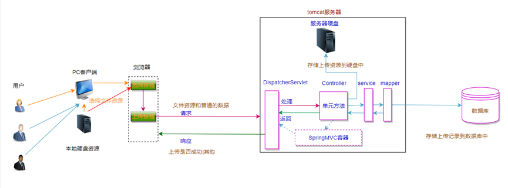

## 思路

实现一个简单的文件上传的Demo我们需要知道哪些新的知识呢？

### 前端展示上传按钮

用户可以点击该按钮后选择本地要上传的文件在页面中使用input标签，type值设置为”file”即可

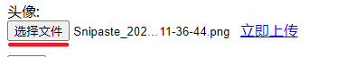

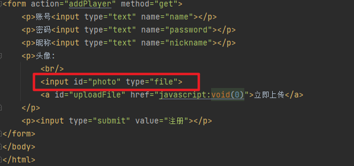

### 上传请求的发送方式

上传成功后的响应结果在当前页面显示，使用ajax请求来完成资源的发送

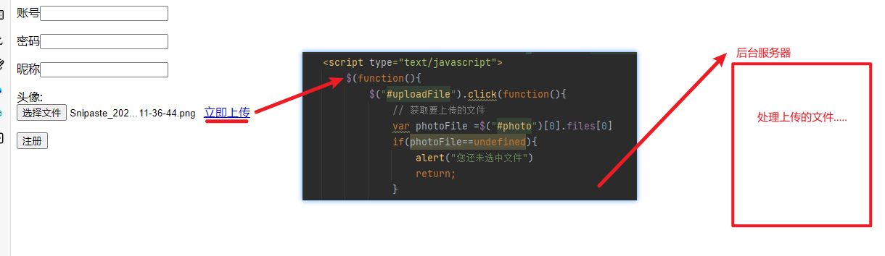

### 上传请求的请求数据及其数据格式

#### 请求数据

建议上传功能中不携带除上传资源以外的数据，可以根据项目结构记录上传的记录，但是不要携带用户的密码，个人详情等

#### 数据格式

传统的请求中，请求数据是以键值对的格式来发送给后台服务器的，但是在上传请求中，没有任何一个键可以描述上次的数据，因为数据本身是非常大的键就相当于一个变量，我们使用一个变量存储一个10g的电影显然是不可能的。

在上传请求中，将请求数据以二进制流的方式发送给服务器。

### 在ajax中如何发送二进制流数据给服务器

1. 创建FormData的对象，将请求数据存储到该对象中发送
2. 将processData属性的值设置为false，告诉浏览器发送对象请求数据
3. 将contentType属性的值设置为false，设置请求数据的类型为二进制类型。
4. 正常发送ajax即可

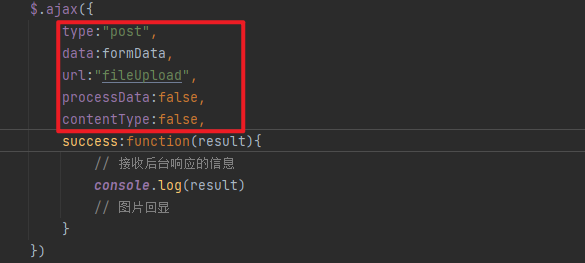

> ProcessData:
> 1. 类型 ： Boolean
> 2. 默认值：true 。 默认情况下，通过data选项传递进来的数据，如果是一个对象（技术上讲只要不是字符串），都会转换成一个查询字符串，以配合默认内容类型“application/x-www-form-urlencoded”。如果要发送的DOM树信息或者其他不希望转换的信息，请设置为false。


### 上传成功后后台服务器应该响应什么结果给浏览器

并且浏览器如何处理后台服务器处理完成后，响应一个json对象给浏览器，示例格式如下:

```Json
{state:true,msg:“服务器繁忙”,url:”上传成功的资源的请求地址”}
```

### 文件上传依赖的jar

在SpringMVC的基础上，我们需要新增对文件上传支持的依赖

```XMl
<!--文件上传依赖-->
<dependency>
  <groupId>commons-fileupload</groupId>
  <artifactId>commons-fileupload</artifactId>
  <version>1.4</version>
</dependency>
<dependency>
  <groupId>commons-io</groupId>
  <artifactId>commons-io</artifactId>
  <version>2.8.0</version>
</dependency>
```

### 配置文件上传组件

同时我们需要在SpringMVC中配置文件上传解析支持的组件

```XMl
 <!--文件上传解析组件
    id必须为multipartResolver
    springmvc默认使用该id找该组件
    -->
    <bean 
    id="multipartResolver"                                            
    class="org.springframework.web.multipart.commons.CommonsMultipartResolver"></bean>
```

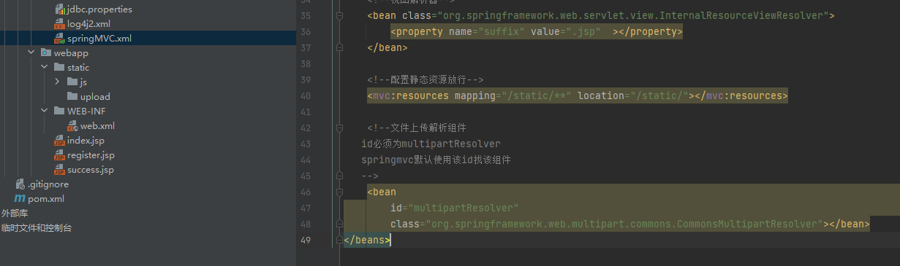

## 准备环境

### 准备数据表

创建用户上传记录表

```SQL
CREATE TABLE `uploadinfo` (
  `serialNo` int NOT NULL AUTO_INCREMENT COMMENT '流水号',
  `uploadIp` varchar(100) CHARACTER SET utf8mb4 COLLATE utf8mb4_0900_ai_ci NOT NULL,
  `uploadPath` varchar(1000) CHARACTER SET utf8mb4 COLLATE utf8mb4_0900_ai_ci NOT NULL,
  `uploadType` varchar(100) CHARACTER SET utf8mb4 COLLATE utf8mb4_0900_ai_ci NOT NULL,
  `uploadTime` datetime NOT NULL,
  PRIMARY KEY (`serialNo`)
) ENGINE=InnoDB AUTO_INCREMENT=4 DEFAULT CHARSET=utf8mb4 COLLATE=utf8mb4_0900_ai_ci COMMENT='上传详情记录表';
```

### 构建项目


1. 按照前面的学习中构建SpringMVC的项目结构，可以参考 [整合SpringMVC](../09_整合SpringMVC/整合SpringMVC.md)
2. 注意工程中需要导入对上传支持的依赖包 ： [文件上传依赖的jar](#文件上传依赖的jar)
3. 注意在SpringMVC的组件中添加文件解析组件 ： [配置文件上传组件](#配置文件上传组件)

## 实现功能

### 存储文件

#### 前端代码

##### 简单的前端代码

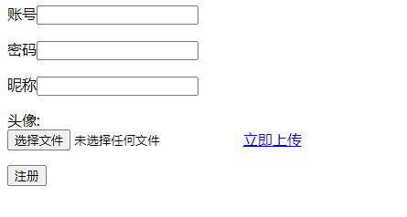

```HTML
<%@ page contentType="text/html;charset=UTF-8" language="java" %>
<html>
<head>
    <title>Title</title>
    <script type="text/javascript" src="static/js/jquery-3.5.1.min.js"></script>
</head>
<body>
<form action="addPlayer" method="get">
    <p>账号<input type="text" name="name"></p>
    <p>密码<input type="text" name="password"></p>
    <p>昵称<input type="text" name="nickname"></p>
    <p>头像:
        <br/>
        <input id="photo" type="file">
        <a id="uploadFile" href="javascript:void(0)">立即上传</a>
    </p>
    <p><input type="submit" value="注册"></p>
</form>
</body>
<script type="text/javascript">
  
</script>
</html>
```

##### 获取用户的真实IP信息

由于我们的上传详情中需要记录用户的上传IP信息，所以我们借助太平洋电脑网的API操作

我们访问： `https://whois.pconline.com.cn/ipJson.jsp?callback=ipJson`

返回当前访问客户端的详情JSON信息：

```JSON
if(window.ipJson) {ipJson({"ip":"61.152.201.160","pro":"上海市","proCode":"310000","city":"上海市","cityCode":"310000","region":"","regionCode":"0","addr":"上海市 电信","regionNames":"","err":""});}
```

所以我们可以使用以下方法：

Register.jsp
```HTML
<%@ page contentType="text/html;charset=UTF-8" language="java" %>
<html>
<head>
    <title>Title</title>
    <script type="text/javascript" src="static/js/jquery-3.5.1.min.js"></script>
</head>
<body>
<form action="addPlayer" method="get">
    <p>账号<input type="text" name="name"></p>
    <p>密码<input type="text" name="password"></p>
    <p>昵称<input type="text" name="nickname"></p>
    <p>头像:
        <br/>
        <input id="photo" type="file">
        <a id="uploadFile" href="javascript:void(0)">立即上传</a>
    </p>
    <p><input type="submit" value="注册"></p>
</form>
</body>
<script type="text/javascript">
    // 获取上传文件的标签元素
    var uploadFileLink = document.getElementById("uploadFile");
    // 添加点击事件监听器
    uploadFileLink.addEventListener("click", function() {
        alert(window.ipJson.ip);//获取IP信息
    });
    function ipJson(ipJson) {
        console.log('获取到的网络IP',ipJson);
        //可以把结果存在window上，方便调用
        window.ipJson=ipJson;
    }
</script>
<script src="https://whois.pconline.com.cn/ipJson.jsp?callback=ipJson" type="text/javascript"></script>
</html>
```

此时点击上传时，我们可以在`window.ipJson`中获取用户访问的详情信息

##### 前端上传代码

我们通过Ajax将文件上传至指定的接口：
1. 上传文件，参考 [[#在ajax中如何发送二进制流数据给服务器]]
2. 在上传时我们可以通过Url中传递当前用户的IP信息

Register.jsp
```HTMl
<%@ page contentType="text/html;charset=UTF-8" language="java" %>
<html>
<head>
    <title>Title</title>
    <script type="text/javascript" src="static/js/jquery-3.5.1.min.js"></script>
</head>
<body>
<form action="addPlayer" method="get">
    <p>账号<input type="text" name="name"></p>
    <p>密码<input type="text" name="password"></p>
    <p>昵称<input type="text" name="nickname"></p>
    <p>头像:
        <br/>
        <input id="photo" type="file">
        <a id="uploadFile" href="javascript:void(0)">立即上传</a>
    </p>
    <p><input type="submit" value="注册"></p>
</form>
</body>
<script type="text/javascript">
    // 获取上传文件的标签元素
    var uploadFileLink = document.getElementById("uploadFile");
    // 添加点击事件监听器
    uploadFileLink.addEventListener("click", function() {
        // 获取要上传的文件
        var photoFile =$("#photo")[0].files[0]
        if(photoFile==undefined){alert("您还未选中文件");return;}
        // 将文件装入FormData对象
        var formData =new FormData();
        formData.append("headPhoto",photoFile);
        // ajax向后台发送文件
        $.ajax({
            type:"post",
            data:formData,
            url:"fileUpload?ipAddress=" + window.ipJson.ip,
            processData:false,
            contentType:false,
            success:function(result){
                // 接收后台响应的信息
                console.log(result)
                //图片回显
            }
        })
    });
    function ipJson(ipJson) {
        console.log('获取到的网络IP',ipJson);
        //可以把结果存在window上，方便调用
        window.ipJson=ipJson;
    }
</script>
<script src="https://whois.pconline.com.cn/ipJson.jsp?callback=ipJson" type="text/javascript"></script>
</html>
```

#### 后端代码

我们需要将刚刚用户上传的信息保存至DB

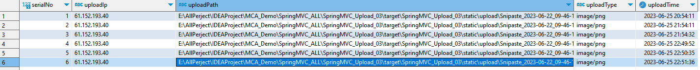

将用户上传的文件保存到指定目录

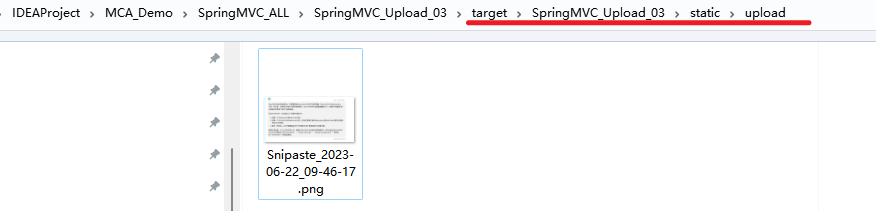

##### 接收上传的文件

com.meturing.pojo.UploadInfo
```Java
@Data
@AllArgsConstructor
@NoArgsConstructor
@ToString
public class UploadInfo implements Serializable {
    private Integer serialNo;
    private String uploadIp;
    private String uploadPath;
    private String uploadType;
    private Date uploadTime;
}
```


com.meturing.controller.RegisterController.java
```Java
@Controller
public class RegisterController {
    @Autowired
    private UserRegister userRegisterImpl;
    @RequestMapping("/fileUpload")
    @ResponseBody
    public String register(MultipartFile headPhoto, @RequestParam String ipAddress, HttpServletRequest request) throws IOException {
        //获取当前static/update目录地址
        String realPath = request.getServletContext().getRealPath("static/upload");
        File dir = new File(realPath);
        //如果文件夹不存在则创建
        if (!dir.exists()) dir.mkdirs();
        //获取上传文件的名字
        String filename = headPhoto.getOriginalFilename();
        //根据保存路径和保存文件名称获取对应的File对象
        File file = new File(dir, filename);
        //将收到的文件传输到给定的目标文件
        headPhoto.transferTo(file);
        //获取当前上传的类型
        String contentType = headPhoto.getContentType();
        //当前的时间
        Date date = Date.from(Instant.now());
        UploadInfo uploadInfo = new UploadInfo(null, ipAddress, realPath+File.separatorChar+filename, contentType, date);
        userRegisterImpl.saveInfo(uploadInfo);
        return "success";
    }
}
```

com.meturing.service.UserRegister.java
```Java
public interface UserRegister {
    void saveInfo(UploadInfo uploadInfo);
}
```


com.meturing.service.impl.UserRegisterImpl.java
```Java
@Service
@Transactional
public class UserRegisterImpl implements UserRegister {
    @Autowired
    private UserRegisterMapper userRegisterMapper ;
    @Override
    public void saveInfo(UploadInfo uploadInfo) {
        userRegisterMapper.saveInfo(uploadInfo);
    }
}
```

com.meturing.mapper.UserRegisterMapper.java
```Java
@Mapper
public interface UserRegisterMapper {
    void saveInfo(UploadInfo uploadInfo);
}
```

resources/com/meturing/mapper/UserRegisterMapper.xml
```XML
<?xml version="1.0" encoding="UTF-8" ?>
<!DOCTYPE mapper
        PUBLIC "-//mybatis.org//DTDMapper3.0//EN"
        "http://mybatis.org/dtd/mybatis-3-mapper.dtd">
<mapper namespace="com.meturing.mapper.UserRegisterMapper">
    <insert id="saveInfo" parameterType="uploadInfo">
        INSERT into uploadinfo values (DEFAULT,#{uploadIp},#{uploadPath},#{uploadType},#{uploadTime})
    </insert>
</mapper>
```

##### 使用UUID避免文件重名

**UUID是通用唯一识别码（Universally Unique Identifier）** 的缩写，是一种软件建构的标准，亦为开放软件基金会组织在分布式计算环境领域的一部分。

**其目的，是让分布式系统中的所有元素，都能有唯一的辨识信息，而不需要通过中央控制端来做辨识信息的指定**。

如此一来，每个人都可以创建不与其它人冲突的UUID。在这样的情况下，就不需考虑数据库创建时的名称重复问题。目前最广泛应用的UUID，是微软公司的全局唯一标识符（GUID），而其他重要的应用，则有Linux ext2/ext3文件系统、 LUKS加密分区、GNOME、KDE、Mac OS X等等。另外我们也可以在e2fs progs包中的UUID库找到实现。

UUID伪代码：
```Java
String filename = "Snipaste_2023-06-22_09-46-17.png"//用户上传的文件名 : Snipaste_2023-06-22_09-46-17.png
String substring = filename.substring(filename.lastIndexOf("."));//获取文件的后缀 .png
String uuidStr = UUID.randomUUID().toString();//获取UUID : 53f1cf07-5205-4dfe-9c97-b5e38766aaed
filename = uuidStr.concat(substring);//拼接新的名字 : 53f1cf07-5205-4dfe-9c97-b5e38766aaed.png
```

修改 com.meturing.controller.RegisterController.java
```Java
@Controller
public class RegisterController {
    @Autowired
    private UserRegister userRegisterImpl;
    @RequestMapping("/fileUpload")
    @ResponseBody
    public String register(MultipartFile headPhoto, @RequestParam String ipAddress, HttpServletRequest request) throws IOException {
        String realPath = request.getServletContext().getRealPath("static/upload");
        File dir = new File(realPath);
        if (!dir.exists()) dir.mkdirs();
        
        //获取上传文件的名字 并 使用UUID处理文件名字避免重复
        String filename = headPhoto.getOriginalFilename();
        String substring = filename.substring(filename.lastIndexOf("."));
        String uuidStr = UUID.randomUUID().toString();
        filename = uuidStr.concat(substring);
        
        File file = new File(dir, filename);
        headPhoto.transferTo(file);
        String contentType = headPhoto.getContentType();
        Date date = Date.from(Instant.now());
        UploadInfo uploadInfo = new UploadInfo(null, ipAddress, realPath+File.separatorChar+filename, contentType, date);
        userRegisterImpl.saveInfo(uploadInfo);
        return "success";
    }
}
```

效果如下：

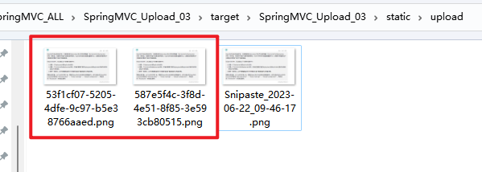

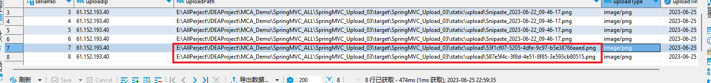

##### 控制上传文件

对于文件的控制我们通常在后端也需要管理： 限制用户上传的文件类型/文件大小
1. `MultipartFile对象.getSize()` 可以获取当前上传的文件的大小
2. `MultipartFile对象.getOriginalFilename()` 获取上传文件的名字，通过截取后缀判断当前的文件类型

修改 com.meturing.controller.RegisterController.java
```Java
@Controller
public class RegisterController {
    @Autowired
    private UserRegister userRegisterImpl;
    @RequestMapping("/fileUpload")
    @ResponseBody
    public HashMap<String, String> register(MultipartFile headPhoto, @RequestParam String ipAddress, HttpServletRequest request) throws IOException {
        HashMap<String, String> responseMap = new HashMap<>();
        
        //获取文件的大小
        if (headPhoto.getSize()>=1024*1024*5){
            responseMap.put("message", "文件大小不能超过5M");
            return responseMap;
        }
        
        String realPath = request.getServletContext().getRealPath("static/upload");
        File dir = new File(realPath);
        if (!dir.exists()) dir.mkdirs();
        String filename = headPhoto.getOriginalFilename();
        String substring = filename.substring(filename.lastIndexOf("."));
        
        //校验文件是否是.jpg类型
        if (substring.equals(".jpg")){
            responseMap.put("message", "文件类型必须是.jpg");
            return responseMap;
        }
        
        String uuidStr = UUID.randomUUID().toString();
        filename = uuidStr.concat(substring);
        File file = new File(dir, filename);
        headPhoto.transferTo(file);
        String contentType = headPhoto.getContentType();
        Date date = Date.from(Instant.now());
        UploadInfo uploadInfo = new UploadInfo(null, ipAddress, realPath+File.separatorChar+filename, contentType, date);
        userRegisterImpl.saveInfo(uploadInfo);
        return null;
    }
}
```

#### 回显上传文件

我们此时可以将前端文件上传保存到DB后返回给前端并在页面中展示出来
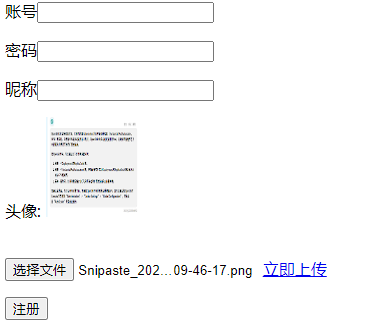

```Java
@Controller
public class RegisterController {
    @Autowired
    private UserRegister userRegisterImpl;
    @RequestMapping("/fileUpload")
    @ResponseBody
    public HashMap<String, String> register(MultipartFile headPhoto, @RequestParam String ipAddress, HttpServletRequest request) throws IOException {
        HashMap<String, String> responseMap = new HashMap<>();
        if (headPhoto.getSize()>=1024*1024*5){
            responseMap.put("message", "文件大小不能超过5M");
            return responseMap;
        }
        String realPath = request.getServletContext().getRealPath("static/upload");
        File dir = new File(realPath);
        if (!dir.exists()) dir.mkdirs();
        String filename = headPhoto.getOriginalFilename();
        String substring = filename.substring(filename.lastIndexOf("."));
        if (substring.equals(".jpg")){
            responseMap.put("message", "文件类型必须是.jpg");
            return responseMap;
        }
        String uuidStr = UUID.randomUUID().toString();
        filename = uuidStr.concat(substring);
        File file = new File(dir, filename);
        headPhoto.transferTo(file);
        String contentType = headPhoto.getContentType();
        Date date = Date.from(Instant.now());
        UploadInfo uploadInfo = new UploadInfo(null, ipAddress, realPath+File.separatorChar+filename, contentType, date);
        userRegisterImpl.saveInfo(uploadInfo);
        
        //返回前端文件详情
        responseMap.put("message","上传成功！");
        responseMap.put("fileName",filename);
        responseMap.put("fileType",contentType);
        return responseMap;
        
    }
}
```

Register.jsp
1. 新增一个img标签
2. 将Ajax返回的结果使用JQ添加src的属性
```Html
<%@ page contentType="text/html;charset=UTF-8" language="java" %>
<html>
<head>
    <title>Title</title>
    <script type="text/javascript" src="static/js/jquery-3.5.1.min.js"></script>
</head>
<body>
<form action="addPlayer" method="get">
    <p>账号<input type="text" name="name"></p>
    <p>密码<input type="text" name="password"></p>
    <p>昵称<input type="text" name="nickname"></p>
    <p>头像:
        
        <br/>
        <input id="photo" type="file">
        <a id="uploadFile" href="javascript:void(0)">立即上传</a>
    </p>
    <p><input type="submit" value="注册"></p>
</form>
</body>
<script type="text/javascript">
    // 获取上传文件的标签元素
    var uploadFileLink = document.getElementById("uploadFile");
    // 添加点击事件监听器
    uploadFileLink.addEventListener("click", function() {
        // 获取要上传的文件
        var photoFile =$("#photo")[0].files[0]
        if(photoFile==undefined){alert("您还未选中文件");return;}
        // 将文件装入FormData对象
        var formData =new FormData();
        formData.append("headPhoto",photoFile);
        // ajax向后台发送文件
        $.ajax({
            type:"post",
            data:formData,
            url:"fileUpload?ipAddress=" + window.ipJson.ip,
            processData:false,
            contentType:false,
            success:function(result){
                //向img标签中追加src属性，展示图片
                $("#avatarImg").attr("src","static/upload/"+result.fileName);
            }
        })
    });
    function ipJson(ipJson) {
        console.log('获取到的网络IP',ipJson);
        //可以把结果存在window上，方便调用
        window.ipJson=ipJson;
    }
</script>
<script src="https://whois.pconline.com.cn/ipJson.jsp?callback=ipJson" type="text/javascript"></script>
</html>
```

#### 添加上传进度条

我们接下来尝试在上传图片时展示上传的进度
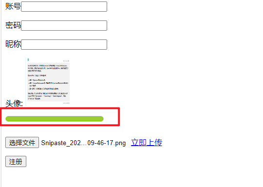

伪代码
```HTML
//样式
<style>
	.progress {
		width: 200px;
		height: 10px;
		border: 1px solid #ccc;
		border-radius: 10px;
		margin: 10px 0px;
		overflow: hidden;
	}
	/* 初始状态设置进度条宽度为0px */
	.progress > div {
		width: 0px;
		height: 100%;
		background-color: yellowgreen;
		transition: all .3s ease;
	}
</style>
.....
<%--进度条--%>
<div class="progress">
	<div></div>
</div>
.....
//JS事件
<script type="text/javascript">
        $.ajax({
            type:"post",
            data:formData,
            url:"fileUpload?ipAddress=" + window.ipJson.ip,
            processData:false,
            contentType:false,
            success:function(result){
	         //回显处理
	         ......
            },
            //显示进度条
            xhr: function() {
                var xhr = new XMLHttpRequest();
                //使用XMLHttpRequest.upload监听上传过程，注册progress事件，打印回调函数中的event事件
                xhr.upload.addEventListener('progress', function (e) {
                    //loaded代表上传了多少
                    //total代表总数为多少
                    var progressRate = (e.loaded / e.total) * 100 + '%';
                    //通过设置进度条的宽度达到效果
                    $('.progress > div').css('width', progressRate);
                })
                return xhr;
            }
        })
    });
</script>
```

完整代码：
```html
<%@ page contentType="text/html;charset=UTF-8" language="java" %>
<html>
<head>
    <title>Title</title>
    <script type="text/javascript" src="static/js/jquery-3.5.1.min.js"></script>
    <style>
        .progress {
            width: 200px;
            height: 10px;
            border: 1px solid #ccc;
            border-radius: 10px;
            margin: 10px 0px;
            overflow: hidden;
        }
        /* 初始状态设置进度条宽度为0px */
        .progress > div {
            width: 0px;
            height: 100%;
            background-color: yellowgreen;
            transition: all .3s ease;
        }
    </style>
</head>
<body>
<form action="addPlayer" method="get">
    <p>账号<input type="text" name="name"></p>
    <p>密码<input type="text" name="password"></p>
    <p>昵称<input type="text" name="nickname"></p>
    <p>头像:
        
        <%--进度条--%>
        <div class="progress">
            <div></div>
        </div>
        <br/>
        <input id="photo" type="file">
        <a id="uploadFile" href="javascript:void(0)">立即上传</a>
    </p>
    <p><input type="submit" value="注册"></p>
</form>
</body>
<script type="text/javascript">
    // 获取上传文件的标签元素
    var uploadFileLink = document.getElementById("uploadFile");
    // 添加点击事件监听器
    uploadFileLink.addEventListener("click", function() {
        // 获取要上传的文件
        var photoFile =$("#photo")[0].files[0]
        if(photoFile==undefined){alert("您还未选中文件");return;}
        // 将文件装入FormData对象
        var formData =new FormData();
        formData.append("headPhoto",photoFile);
        // ajax向后台发送文件
        $.ajax({
            type:"post",
            data:formData,
            url:"fileUpload?ipAddress=" + window.ipJson.ip,
            processData:false,
            contentType:false,
            success:function(result){
                //向img标签中追加src属性，展示图片
                $("#avatarImg").attr("src","static/upload/"+result.fileName);
            },
            xhr: function() {
                var xhr = new XMLHttpRequest();
                //使用XMLHttpRequest.upload监听上传过程，注册progress事件，打印回调函数中的event事件
                xhr.upload.addEventListener('progress', function (e) {
                    //loaded代表上传了多少
                    //total代表总数为多少
                    var progressRate = (e.loaded / e.total) * 100 + '%';
                    //通过设置进度条的宽度达到效果
                    $('.progress > div').css('width', progressRate);
                })
                return xhr;
            }
        })
    });
    function ipJson(ipJson) {
        console.log('获取到的网络IP',ipJson);
        //可以把结果存在window上，方便调用
        window.ipJson=ipJson;
    }
</script>
<script src="https://whois.pconline.com.cn/ipJson.jsp?callback=ipJson" type="text/javascript"></script>
</html>
```

### 使用独立文件存储服务器

分服务器上传作用:
- 数据库服务器：运行我们的数据库
- 缓存和消息服务器：负责处理大并发访问的缓存和消息
- 文件服务器：负责存储用户上传文件的服务器。
- 应用服务器：负责部署我们的应用


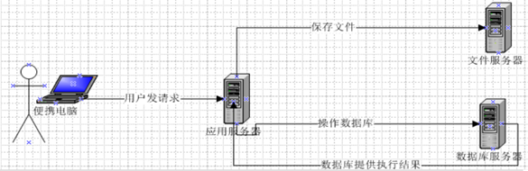

在实际开发中，我们会有很多处理不同功能的服务器。(注意：此处说的不是服务器集群）
总结：**分服务器处理的目的是让服务器各司其职，从而提高我们项目的运行效率。**

#### 配置文件存储服务器

##### 单独解压一个Tomcat文件

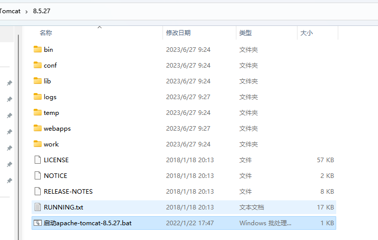

##### 配置Servlet.xml

修改启动/关闭的监听端口
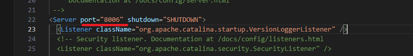

修改服务器主端口
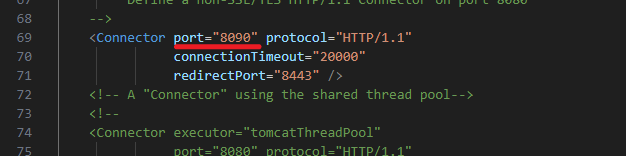

##### 配置Web.xml

修改服务器非只读

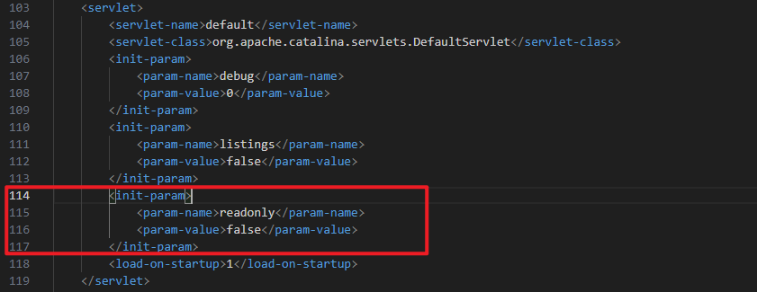

##### 启动服务器

方式一: 直接运行对应的bat文件
- shutdown.bat / shutdown.sh 停止
- startup.bat / startup.sh 启动
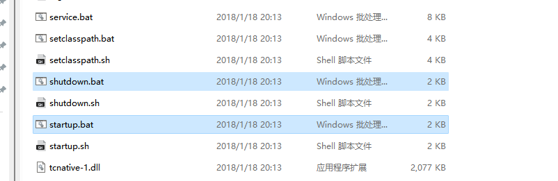

方式二: 编写一个启动的批量脚本
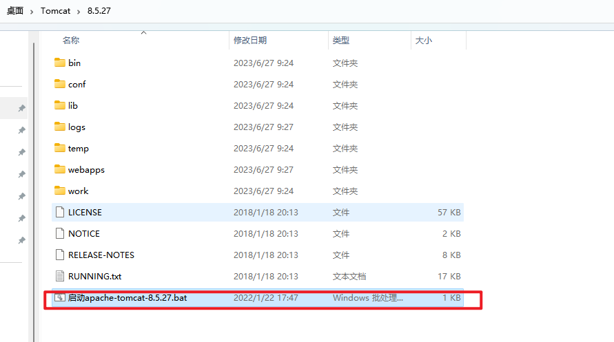

代码:
```shell
@echo off
echo 正在启动apache-tomcat-8.5.27......
echo 请不要关闭本窗口
echo ..............
cd %~dp0bin\ 
call startup.bat
echo over
```


测试运行状态:

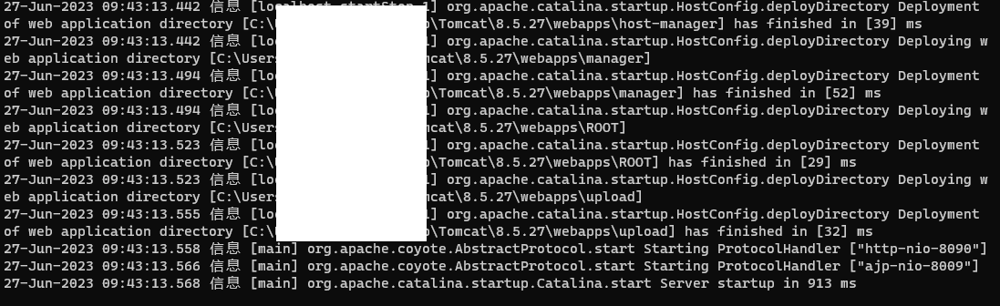

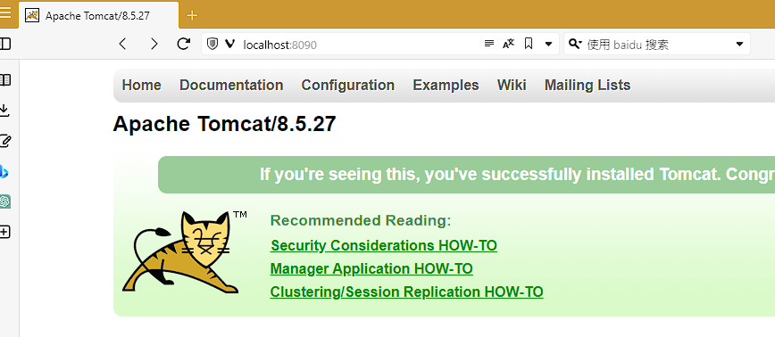

#### 修改上传服务器

##### 添加依赖

```XML
<!--Jersey服务-->
<dependency>
  <groupId>com.sun.jersey</groupId>
  <artifactId>jersey-client</artifactId>
  <version>1.19</version>
</dependency>
```

##### 修改后端代码

伪代码:
```Java
// 文件存储位置  
private final static String FILESERVER="http://127.0.0.1:8090/upload/";

 @RequestMapping("/fileUpload")
    @ResponseBody
    public HashMap<String, String> register(MultipartFile headPhoto, @RequestParam String ipAddress, HttpServletRequest request) throws IOException {
		......
		
        String filename = headPhoto.getOriginalFilename();//获取上传文件的名字
        
        ......
        
        //创建 sun公司提供的jersey包中的client对象
        Client client = Client.create();
        WebResource resource = client.resource(FILESERVER + filename);
        //将文件提交到指定路径上
        resource.put(String.class,headPhoto.getBytes());
        
		......
    }
```

完整代码:
com.meturing.controller.RegisterController.java
```Java
@Controller
public class RegisterController {
    @Autowired
    private UserRegister userRegisterImpl;
    // 文件存储位置
    private final static String FILESERVER="http://127.0.0.1:8090/upload/";

    @RequestMapping("/fileUpload")
    @ResponseBody
    public HashMap<String, String> register(MultipartFile headPhoto, @RequestParam String ipAddress, HttpServletRequest request) throws IOException {
        HashMap<String, String> responseMap = new HashMap<>();
        //获取文件的大小
        if (headPhoto.getSize()>=1024*1024*5){
            responseMap.put("message", "文件大小不能超过5M");
            return responseMap;
        }
        String realPath = request.getServletContext().getRealPath("static/upload");//获取当前static/update目录地址
        File dir = new File(realPath);
        if (!dir.exists()) dir.mkdirs();//如果文件夹不存在则创建
        String filename = headPhoto.getOriginalFilename();//获取上传文件的名字
        //使用UUID处理文件名字避免重复
        String substring = filename.substring(filename.lastIndexOf("."));
        //校验文件是否是.jpg类型
        if (substring.equals(".jpg")){
            responseMap.put("message", "文件类型必须是.jpg");
            return responseMap;
        }
        String uuidStr = UUID.randomUUID().toString();
        filename = uuidStr.concat(substring);
        //File file = new File(dir, filename);//根据保存路径和保存文件名称获取对应的File对象
        //headPhoto.transferTo(file);//将收到的文件传输到给定的目标文件
		
        //创建 sun公司提供的jersey包中的client对象
        Client client = Client.create();
        WebResource resource = client.resource(FILESERVER + filename);
        //将文件提交到指定路径上
        resource.put(String.class,headPhoto.getBytes());
		
        String contentType = headPhoto.getContentType();//获取当前上传的类型
        Date date = Date.from(Instant.now());//当前的时间
        UploadInfo uploadInfo = new UploadInfo(null, ipAddress, realPath+File.separatorChar+filename, contentType, date);
        userRegisterImpl.saveInfo(uploadInfo);
        responseMap.put("message","上传成功！");
        responseMap.put("fileName",filename);
        responseMap.put("fileType",contentType);
        return responseMap;
    }
}
```

##### 修改前端代码

注意此时需要修改回显时的地址

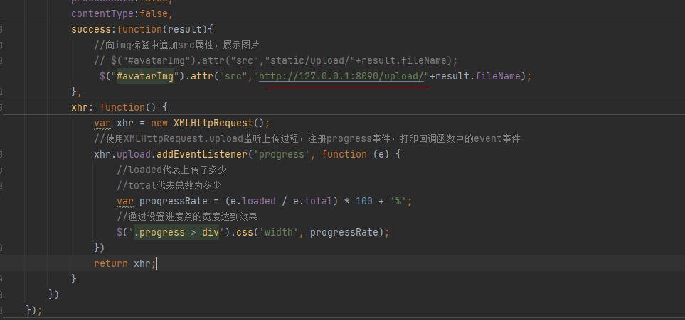

#### 测试结果

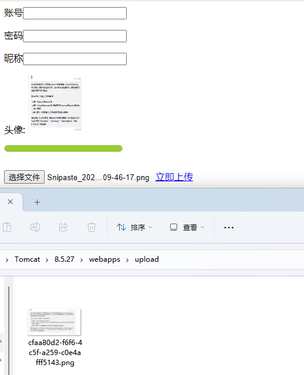
