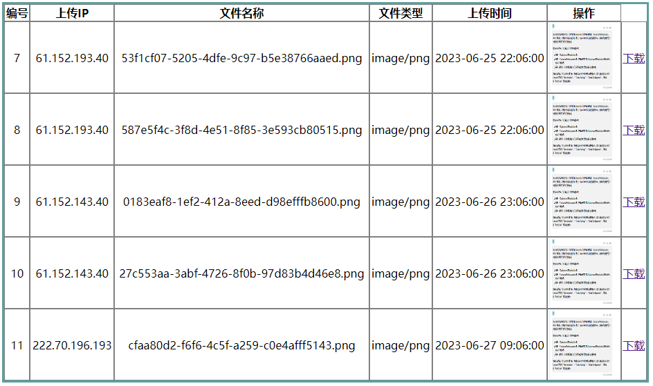
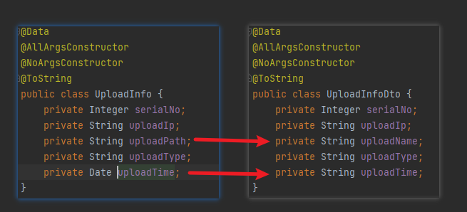
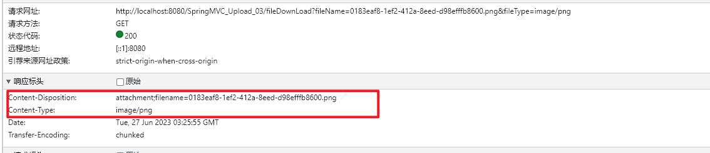
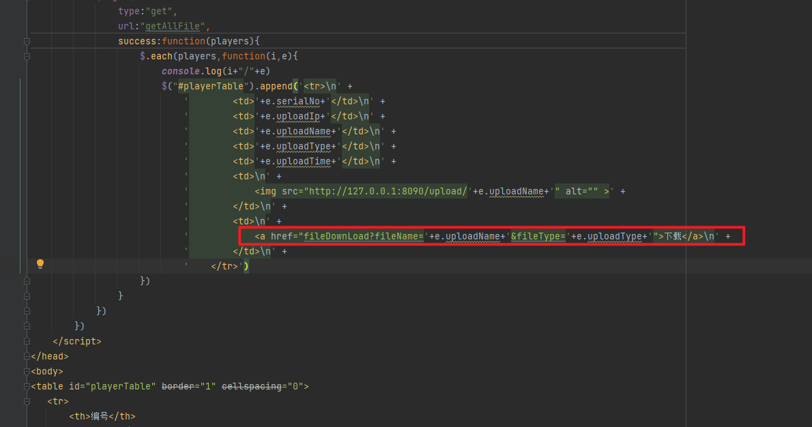

注意:在开始文件的下载操作之前,请先完成文件的上传相关环境搭建
## 展示全部的文件

在完成文件下载之前,我们需要先将之前上传的文件展示出来:



### 后端代码开发

#### DTO的思考

DTO，全称为Data Transfer Object，即数据传输对象。它是一个简单的POJO类，其中包含一些属性，并提供getter和setter方法。DTO通常用于在不同层之间传输数据，例如，在业务逻辑层和持久层之间传输数据。


DTO本身不是业务对象，他是根据UI需求进行设计的。简单来说Model面向业务，我们是通过业务来定义Model的。而DTO是面向UI，通过UI的需求来定义的，通过DTO我们实现了表现层与Model层之间的解耦，表现层不引用Model。如果开发过程中我们的模型变了，而界面没变，我们只需改Model而不需要去改动表现层.

例如:在这个开发案例中,我们db里面实际存储的是`uploadPath`,而我们前端需要展示的是`uploadName`,同时对于时间的格式化也不同.我们直接传送给前端这样是不合适的.所以我们可以添加一个DTO层处理前端需要的数据,并返回



使用DTO的好处: 

DTO主要用于将数据封装后进行传递，提供给外部的接口作为参数。它可以避免直接传输实体对象，从而提高系统的安全性和性能。DTO还能够解决对象序列化和反序列化的问题，并保证数据的完整性和正确性。

DTO最常用于N层应用程序结构中服务层和UI层之间的数据传输。通过使用DTO，可以减少需要传输的数据量，从而提高应用程序的性能和吞吐量。

综上所述，**DTO的作用是封装数据，将其从一层传输到另一层，并且可以提高应用程序的性能和系统的安全性。**

#### 相关代码

com.meturing.pojo.dto.UploadInfoDto.java
```Java
@Data
@AllArgsConstructor
@NoArgsConstructor
@ToString
public class UploadInfoDto implements Serializable {
    private Integer serialNo;
    private String uploadIp;
    private String uploadName;
    private String uploadType;
    private String uploadTime;
}
```

com.meturing.controller.RegisterController.java
```Java
@Controller
public class RegisterController {
    @Autowired
    private UserRegister userRegisterImpl;
    @RequestMapping("/getAllFile")
    @ResponseBody
    public List<UploadInfoDto> getAllFile() throws IOException {
        List<UploadInfoDto> allFile = userRegisterImpl.getAllFile();
        return allFile;
    }
}
```

com.meturing.service.UserRegister.java
```Java
public interface UserRegister {  
	List<UploadInfoDto> getAllFile();  
}

```

com.meturing.service.impl.UserRegister.java
**注意:此时要将DB查出来的VO类转换为DTO类传送给前端**
```Java
@Service
@Transactional
public class UserRegisterImpl implements UserRegister {
    @Autowired
    private UserRegisterMapper userRegisterMapper ;
    @Override
    public List<UploadInfoDto> getAllFile() {
        List<UploadInfo> uploadInfoList = userRegisterMapper.getAllFile();
        List<UploadInfoDto> uploadInfoDtoList = new ArrayList<>();
        for (UploadInfo uploadInfo : uploadInfoList) {
            UploadInfoDto uploadInfoDto = new UploadInfoDto();
            uploadInfoDto.setSerialNo(uploadInfo.getSerialNo());
            uploadInfoDto.setUploadIp(uploadInfo.getUploadIp());
            uploadInfoDto.setUploadName(uploadInfo.getUploadPath().substring(uploadInfo.getUploadPath().lastIndexOf(File.separatorChar)+1));
            uploadInfoDto.setUploadType(uploadInfo.getUploadType());
            DateFormat dateFormat = new SimpleDateFormat("yyyy-MM-dd HH:MM:SS");
            uploadInfoDto.setUploadTime(dateFormat.format(uploadInfo.getUploadTime()));
            uploadInfoDtoList.add(uploadInfoDto);
        }
        return uploadInfoDtoList;
    }
}
```

com.meturing.mapper.UserRegisterMapper.java
```Java
@Mapper
public interface UserRegisterMapper {
    List<UploadInfo> getAllFile();
}
```

resources/com/meturing/mapper/UserRegisterMapper.xml
```XML
<?xml version="1.0" encoding="UTF-8" ?>
<!DOCTYPE mapper
        PUBLIC "-//mybatis.org//DTDMapper3.0//EN"
        "http://mybatis.org/dtd/mybatis-3-mapper.dtd">
<mapper namespace="com.meturing.mapper.UserRegisterMapper">
    <select id="getAllFile" resultType="com.meturing.pojo.UploadInfo">
        select * from uploadinfo
    </select>
</mapper>
```

### 前端代码开发

思路: 
1. 初始化打开页面发送请求
2. 使用JQ技术将请求的数据展示出来

showPlayer.jsp
```JSP
<%@ page contentType="text/html;charset=UTF-8" language="java" %>
<html>
<head>
    <title>Title</title>
    <style>
        #playerTable{
            width: 50%;
            border: 3px solid cadetblue;
            margin: 0px auto;
            text-align: center;
        }
        #playerTable th,td{
            border: 1px solid gray;
        }
        #playerTable img{
            width: 100px;
            height: 100px;
        }
    </style>
    <script type="text/javascript" src="static/js/jquery-3.5.1.min.js"></script>
    <script>
        $(function (){
            $.ajax({
                type:"get",
                url:"getAllFile",
                success:function(players){
                    $.each(players,function(i,e){
                        console.log(i+"/"+e)
                        $("#playerTable").append('<tr>\n' +
                            '        <td>'+e.serialNo+'</td>\n' +
                            '        <td>'+e.uploadIp+'</td>\n' +
                            '        <td>'+e.uploadName+'</td>\n' +
                            '        <td>'+e.uploadType+'</td>\n' +
                            '        <td>'+e.uploadTime+'</td>\n' +
                            '        <td>\n' +
                            '            ' +
                            '        </td>\n' +
                            '        <td>\n' +
                            '            <a href="">下载</a>\n' +
                            '        </td>\n' +
                            '    </tr>')
                    })
                }
            })
        })
    </script>
</head>
<body>
<table id="playerTable" border="1" cellspacing="0">
   <tr>
       <th>编号</th>
       <th>上传IP</th>
       <th>文件名称</th>
       <th>文件类型</th>
       <th>上传时间</th>
       <th>操作</th>
   </tr>
</table>
</body>
</html>
```

关于JQ的遍历,请查看:  [迭代遍历方式](../../../03_前端技术/04_JQuery/03_JQuery中的DOM编程/JQuery中的DOM编程.md#迭代遍历方式)

## 添加下载功能

### 思路

我们通常文件下载时,是将文件的字节流输出给浏览器,并设置响应头



我们可以通过以下API完成核心操作:
1. ` response.setHeader` 设置响应头
2. `response.setContentType` 设置响应类型
3. `new URL(文件地址).openStream()` 获取文件输入流
4. `response.getOutputStream()` 获取输出流
5. `IOUtils.copy(输入流, 输出流)`  先浏览器响应

### 实现代码

com.meturing.controller.RegisterController.java
```Java
@Controller
public class RegisterController {
    @Autowired
    private UserRegister userRegisterImpl;
    // 文件存储位置
    private final static String FILESERVER="http://127.0.0.1:8090/upload/";
    @RequestMapping("/fileDownLoad")
    public void fileDownLoad(String fileName, String fileType, HttpServletResponse response) throws IOException {
        // 设置响应头
        // 告诉浏览器要将数据保存到磁盘上,不在浏览器上直接解析
        response.setHeader("Content-Disposition", "attachment;filename="+fileName);
        // 告诉浏览下载的文件类型
        response.setContentType(fileType);
        // 获取一个服务器上文件的输入流
        InputStream inputStream = new URL(FILESERVER + fileName).openStream();
        // 获取一个指向浏览器的输出流
        ServletOutputStream outputStream = response.getOutputStream();
        // 向浏览器响应文件即可
        IOUtils.copy(inputStream, outputStream);
    }
}
```

showPlayer.jsp
我们需要发送: `localhost:8080/SpringMVC_Upload_03/fileDownLoad?fileName=0183eaf8-1ef2-412a-8eed-d98efffb8600.png&fileType=image/png`就可以下载图片,所以我们需要修改下载的链接


关于Tomcat响应可以参考 : [设置文件下载](../../../04_JavaEE技术/03_Servlet/02_HttpServletRequest和HttpServlet/HttpServletRequest和HttpServletResponse.md#设置文件下载)
