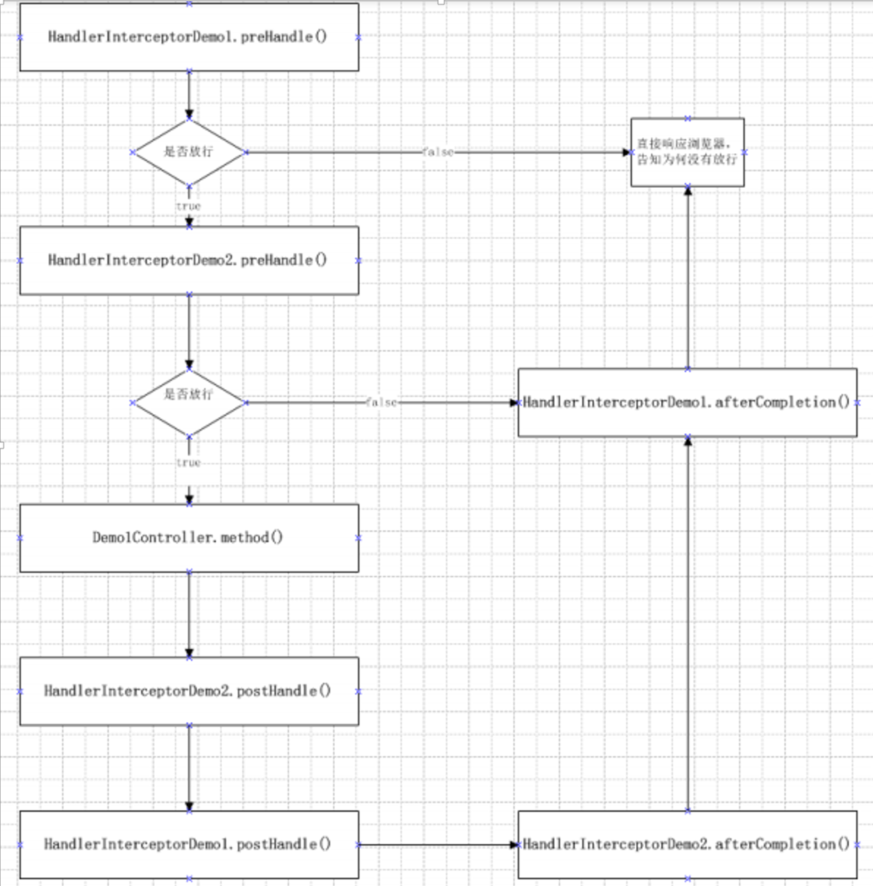

## 初始化环境

为了接下来的学习,我们简单创建一个登录的实例


### 项目配置

按照前面的学习中构建SpringMVC的项目结构，可以参考 [整合SpringMVC](../09_整合SpringMVC/整合SpringMVC.md)

需要注意的是,SpringMVC.xml中试图解析器对于页面请求转发与重定向的路径影响


其他不在赘述配置方案

### 代码

#### 前端页面

index.jsp
```Jsp
<%@ page contentType="text/html;charset=UTF-8" language="java" %>
<html>
<head>
    <title>Title</title>
</head>
<body>
<form action="login" method="post">
   userName :  <input type="text" name="userName"><br/>
    passWord :  <input type="text" name="passWord"><br/>
    <input type="submit" value="提交">
</form>
</body>
</html>
```

success.jsp
```Jsp
<%@ page contentType="text/html;charset=UTF-8" language="java" %>
<html>
<head>
    <title>Title</title>
</head>
<body>
<h1>Welcome to login ~</h1>
</body>
</html>
```

fail.jsp
```Jsp
<%@ page contentType="text/html;charset=UTF-8" language="java" %>
<html>
<head>
    <title>Title</title>
</head>
<body>
<h1>Login failed!!!</h1>
</body>
</html>
```

#### 后端代码

UserInfo.java
```java
@NoArgsConstructor
@AllArgsConstructor
@ToString
@Data
public class UserInfo implements Serializable {
    private Integer id;
    private String name;
    private String password;
}
```

LoginController.java
```Java
@Controller
public class LoginController {
    @Autowired
    private LoginService loginServiceImpl;
    @RequestMapping("/login")
    public String login(String userName, String passWord){
        UserInfo userInfo = loginServiceImpl.login(userName, passWord);
        Optional<UserInfo> optionalUserInfo = Optional.ofNullable(userInfo);
        if (optionalUserInfo.isPresent()){
            return "success";
        }
        return "fail";
    }
}
```

LoginService.java
```Java
public interface LoginService {
    UserInfo login(String userName, String passWord);
}
```


LoginServiceImpl.java
```Java
@Service
public class LoginServiceImpl implements LoginService {
    @Autowired
    private LoginMapper loginMapper;
    @Override
    public UserInfo login(String userName, String passWord) {
        return loginMapper.login(userName,passWord);
    }
}
```

LoginMapper.java
```Java
@Mapper
public interface LoginMapper {
    UserInfo login(String userName, String passWord);
}
```

LoginMapper.xml
```Xml
<?xml version="1.0" encoding="UTF-8" ?>
<!DOCTYPE mapper
        PUBLIC "-//mybatis.org//DTDMapper3.0//EN"
        "http://mybatis.org/dtd/mybatis-3-mapper.dtd">
<mapper namespace="com.meturing.mapper.LoginMapper">
    <select id="login" resultType="com.meturing.pojo.UserInfo">
        select * from userInfo where name = #{param1} and password = #{param2}
    </select>
</mapper>
```

### 测试效果


## 拦截器


### 拦截器与过滤器

#### 为什么使用拦截器

在之前学习JAVAWEB 的时候，我们学习了过滤器的知识。过滤器的作用是保护请求的服务器资源，在请求资源被执行之前，如果请求地址符合拦截范围，则会先执行过滤器。

**过滤器的执行时机，是在Servlet之前执行的**。但是在使用了SpringMVC后，Servlet只有一个了，也就是DisptcherServlet。那么，如果我们仍然使用过滤器来完成请求的拦截，因为过滤器是在Servlet之前执行的，就会造成，过滤器会拦截DispatcherServlet所有的请求。

所以, 过滤器通常用来对请求资源的管控/编码继续处理,是全局性的. 如果需要细致到请求中精细的处理则需要使用拦截器.


因为 **拦截器位于SpringMVC前端控制器DispatcherServlet之后进行处理操作:**
1. 请求执行Handler之前
2. 获取ModelAndView之前
3. 返回渲染视图之前

#### 拦截器与过滤器的区别

1. 拦截器SpringMVC的，而过滤器是servlet的。
2. 拦截器不依赖与servlet容器,由spring容器初始化，过滤器依赖与servlet容器,由servlet容器初始化。
3. 拦截器只能对action请求起作用，而过滤器则可以对几乎所有的请求起作用。
4. 拦截器可以访问action上下文、值栈里的对象，而过滤器不能访问。
5. 在action的生命周期中，拦截器可以多次被调用，而过滤器只能在容器初始化时被调用一次。
6. 拦截器可以获取IOC容器中的各个bean，而过滤器就不太方便，这点很重要，在拦截器里注入一个service，可以调用业务逻辑。

> action请求是指,实际业务中需要逻辑性处理的请求,而非静态资源请求

### 拦截器的使用


Spring MVC中的拦截器（Interceptor）类似于Servlet中的过滤器（Filter），它主要用于拦截用户请求并作相应的处理。例如通过拦截器可以进行权限验证、记录请求信息的日志、判断用户是否登录等。

#### 定义方式

 要使用Spring MVC中的拦截器，就需要对拦截器类进行定义和配置。通常拦截器类可以通过两种方式来定义:
  1. 通过**实现HandlerInterceptor接口**，或继承HandlerInterceptor接口的实现类（如HandlerInterceptorAdapter）来定义。
  2. 通过**实现WebRequestInterceptor接口**，或继承WebRequestInterceptor接口的实现类来定义。

#### 实现代码

新增`com.meturing.interceptor.LoginInterceptor.java`实现`HandlerInterceptor接口`,重写`preHandle` / ` postHandle` /  `afterCompletion` 方法
```Java
public class LoginInterceptor implements HandlerInterceptor {
    @Override
    public boolean preHandle(HttpServletRequest request, HttpServletResponse response, Object handler) throws Exception {
        /*在请求到达我们定义的handler之前工作的*/
        System.out.println("preHandle run~");
        return true;
    }

    @Override
    public void postHandle(HttpServletRequest request, HttpServletResponse response, Object handler, ModelAndView modelAndView) throws Exception {
        /*handler 处理单元返回ModelAndView 时候进行 拦截*/
        System.out.println("postHandle run~");
    }

    @Override
    public void afterCompletion(HttpServletRequest request, HttpServletResponse response, Object handler, Exception ex) throws Exception {
         /*页面渲染完毕,但是还没有给浏览器响应数据的时候*/
        System.out.println("afterCompletion run~");
    }
}
```

修改SpringMVC.xml,添加注册拦截器
```XML
    <!--注册拦截器-->
    <mvc:interceptors>
        <mvc:interceptor>
            <mvc:mapping path="/success"/>
            <bean id="loginInterceptor" class="com.meturing.interceptor.LoginInterceptor"></bean>
        </mvc:interceptor>
    </mvc:interceptors>
```

LoginController.java 新增转发
```Java
@RequestMapping("/success")
public String success(){
	return "success";
}
```

修改success.jsp,新增Java代码打开时输出
```JSP
<%@ page contentType="text/html;charset=UTF-8" language="java" %>
<html>
<head>
    <title>Title</title>
</head>
<body>
<h1>Welcome to login ~</h1>
<% System.out.println("Welcome to login ~"); %>
</body>
</html>
```

#### 测试

访问 `http://localhost:8080/SpringMVC_04/success`


当我们正常登录后,发现拦截器中的语句正常输出了.

### 方法详解

#### preHandle

执行时间 : 进入控制单元方法之前执行

如何调用 : 按拦截器定义顺序调用

实际应用: 如果程序员决定该拦截器对请求进行拦截处理后还要调用其他的拦截器，或者是业务处理器去 进行处理，则返回 true。 如果程序员决定不需要再调用其他的组件去处理请求，则返回 false。

参数详解 :
- `HttpServletRequest arg0`  拦截的请求的request对象
- `HttpServletResponse arg1` 拦截的请求的response对象
- `Object arg2`    封存了单元方法对象的HandleMethod对象 

##### 使用案例

我们可以通过上述案例来使用preHandle方法对登录校验,实现如下功能:
1. 如果用户访问index.jsp页面,成功登录,则本次会话可以直接访问success页面
2. 如果用户未登录直接访问success页面则直接跳转至index页面等待登录

如下所示:


实现步骤:

- 修改登录代码,登录成功将用户信息存放至session域中
```Java
@RequestMapping("/login")
public String login(String userName, String passWord, HttpSession session){
	UserInfo userInfo = loginServiceImpl.login(userName, passWord);
	Optional<UserInfo> optionalUserInfo = Optional.ofNullable(userInfo);
	if (optionalUserInfo.isPresent()){
		session.setAttribute("userInfo",userInfo);
		return "success";
	}
	return "fail";
}
```
- 修改拦截器,访问success时,判断session域中是否存在用户信息,否则拦截并重定向登录页
```Java
@Override
public boolean preHandle(HttpServletRequest request, HttpServletResponse response, Object handler) throws Exception {
	/*在请求到达我们定义的handler之前工作的*/
	System.out.println("preHandle run~");
	UserInfo userInfo = (UserInfo) request.getSession().getAttribute("userInfo");
	Optional<UserInfo> optionalUserInfo = Optional.ofNullable(userInfo);
	if (optionalUserInfo.isPresent()){
		return true;
	}else{
		response.sendRedirect(request.getContextPath());
		return false;
	}
}
```

> 我们也可以在拦截器中对请求和响应中的参数进行编码限制

#### preHandle

执行时间 : 在进行数据处理和做出响应之间进行这个方法的调用

如何调用 : 在拦截器链内所有拦截器返成功调用

实际应用: 在业务处理器处理完请求后，但是 DispatcherServlet 向客户端返回响应前被调用，在该方法中对用户请求 request域数据进行处理。

参数详解 :
 - `HttpServletRequest arg0`  拦截的请求的request对象
- `HttpServletResponse arg1` 拦截的请求的response对象
- `Object arg2` 封存了单元方法对象的HandleMethod对象
- `ModelAndView arg3` 封存了单元方法的返回值资源路径和请求转到的Map数据 

##### 使用案例

接下来我们简单通过preHandle方法对ModelAndView中进行处理,实现对于关键词的屏蔽:


修改success.jsp
```jsp
<%@ page contentType="text/html;charset=UTF-8" language="java" %>
<html>
<head>
    <title>Title</title>
</head>
<body>
<h1>Welcome to login ~</h1>
${message}
<% System.out.println("Welcome to login ~"); %>
</body>
</html>
```

修改LoginController.java
```Java
@RequestMapping("/success")
public ModelAndView success(){
	ModelAndView modelAndView = new ModelAndView();
	modelAndView.setViewName("success");
	ModelMap modelMap = modelAndView.getModelMap();
	modelMap.put("message","你是智障!");
	return modelAndView;
}
```

修改LoginInterceptor.java
```java
@Override
public void postHandle(HttpServletRequest request, HttpServletResponse response, Object handler, ModelAndView modelAndView) throws Exception {
	/*handler 处理单元返回ModelAndView 时候进行 拦截*/
	System.out.println("postHandle run~");
	Optional<ModelAndView> optionalModelAndView = Optional.ofNullable(modelAndView);
	optionalModelAndView.ifPresent(andView -> {
		ModelMap modelMap = andView.getModelMap();
		String message = modelMap.get("message").toString().replaceAll("智障", "**");
		modelMap.put("message",message);
	});
}
```

#### afterCompletion

执行时间 :  在进行页面渲染的时候执行

如何调用 : 按拦截器定义逆序调用  

实际应用: 在DispatcherServlet 完全处理完请求后被调用,可以在该方法中进行一些资源清理的操作。

参数详解 :
- `HttpServletRequest arg0`  拦截的请求的request对象
- `HttpServletResponse arg1` 拦截的请求的response对象
- `Object arg2`    封存了单元方法对象的HandleMethod对象 
- `Exception arg3` 存储了责任链的异常信息

##### 使用案例

我们可以简单模拟当请求出现错误时,通过afterCompletion方法后台记录当前用户错误信息

实现效果:

后台记录:


修改LoginController.java
```Java
@RequestMapping("/success")
public ModelAndView success(){
	ModelAndView modelAndView = new ModelAndView();
	modelAndView.setViewName("success");
	ModelMap modelMap = modelAndView.getModelMap();
	int i = 1/0;//手动制造异常
	modelMap.put("message","你是智障!");
	return modelAndView;
}
```

修改LoginInterceptor.java
```Java
@Override
public void afterCompletion(HttpServletRequest request, HttpServletResponse response, Object handler, Exception ex) throws Exception {
	 /*页面渲染完毕,但是还没有给浏览器响应数据的时候*/
	System.out.println("afterCompletion run~");
	Optional<Exception> optionalException = Optional.ofNullable(ex);
	UserInfo userInfo = (UserInfo) request.getSession().getAttribute("userInfo");
	if (optionalException.isPresent()){
		//输出日志
		System.out.println(userInfo.getName()+"用户操作发生异常:"+ex);
	}
}
```


### 多个拦截器的执行顺序

多个拦截器同时存在时,执行的顺序由配置顺序决定. 先配置谁, 谁就先执行.多个拦截器可以理解为拦截器栈, 先进后出(后进先出), 如图所示:



```xml
<!--注册拦截器-->
<mvc:interceptors>
	<mvc:interceptor>
		<mvc:mapping path="/success"/>
		<bean id="myInterceptor1" class="com.meturing.interceptor.LoginInterceptor"></bean>
	</mvc:interceptor>
	<mvc:interceptor>
		<mvc:mapping path="/success"/>
		<bean id="myInterceptor2" class="com.meturing.interceptor.LoginInterceptor2"></bean>
	</mvc:interceptor>
</mvc:interceptors>
```

执行顺序如下:
```txt
preHandle run~
preHandle2 run~
Controller run~
postHandle2 run~
postHandle run~
Welcome to login ~
afterCompletion2 run~
afterCompletion run~
```

