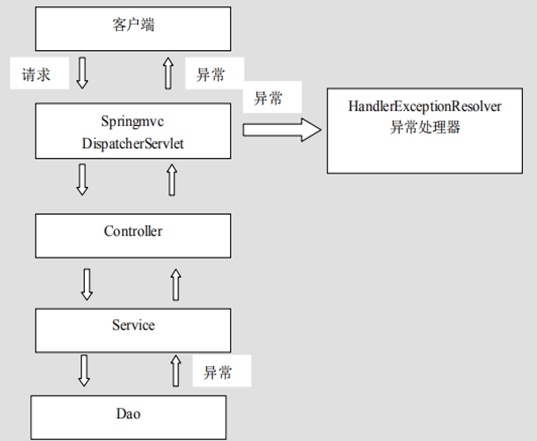
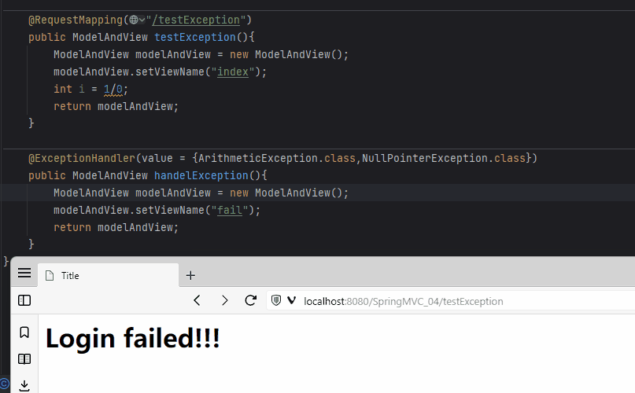
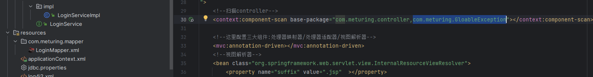

## SpringMVC异常简介

系统中异常包括两类：预期异常(检查型异常) 和 运行时异常 RuntimeException，前者通过捕获异常从而获取异常信息， 后者主要通过规范代码开发、测试通过手段减少运行时异常的发生。详见:[异常处理](../../../../../01_JavaSE阶段/B_进阶/01_异常处理/异常处理.md)

在SpringMVC中我们可以将系统的异常信息从 dao、service、controller中逐层向上抛出,最后由 springmvc 前端控制器交由异常处理器进行异常处理,如下:



## 异常处理的实现

### 处理局部异常

使用`@ExceptionHandler注解`可以对当前Controller中异常进行捕捉
语法:  `@ExceptionHandler(value ={异常类型1字节,异常类型2字节,....} )`

```Java
@Controller
public class LoginController {
    @RequestMapping("/testException")
    public ModelAndView testException(){
        ModelAndView modelAndView = new ModelAndView();
        modelAndView.setViewName("index");
        int i = 1/0;//模拟异常
        return modelAndView;
    }
    @ExceptionHandler(value = {ArithmeticException.class,NullPointerException.class})
    public ModelAndView handelException(){
        ModelAndView modelAndView = new ModelAndView();
        modelAndView.setViewName("fail");
        return modelAndView;
    }
}
```

实现效果:


###  全局异常捕捉

在SpringMVC中我们也可以对于全局的异常进行捕捉,通常可以采用以下方式:
1. 使用@ControllerAdvice+@ExceptionHandler注解
2. 继承HandlerExceptionResolver接口
3. 定义SimpleMappingExceptionResolver转换器

对于全局异常的捕捉,通常权限低于局部异常的处理.遵循就近原则


#### 继承HandlerExceptionResolver接口

创建com.meturing.GloableException.GloableException1.java类
```Java
@Bean
public class GloableException1 implements HandlerExceptionResolver {
    @Override
    public ModelAndView resolveException(HttpServletRequest request, HttpServletResponse response, Object handler, Exception ex) {
        ModelAndView modelAndView = new ModelAndView();
        if (ex instanceof NullPointerException||ex instanceof ArithmeticException){
            modelAndView.setViewName("404");
        }
        return modelAndView;
    }
}
```

注意: 新增的包一定要注意包扫描是否可以被扫描到



#### 使用@ControllerAdvice+@ExceptionHandler注解

创建com.meturing.GloableException.GloableException2.java类
```Java
@ControllerAdvice
public class GloableException2{
    @ExceptionHandler(value ={ArithmeticException.class,NullPointerException.class} )
    public ModelAndView handelException(){
        ModelAndView mv =new ModelAndView();
        mv.setViewName("404");
        return mv;
    }
}
```

注意: 新增的包一定要注意包扫描是否可以被扫描到


#### 定义SimpleMappingExceptionResolver转换器

SpringMVC已经定义好了该类型转换器，这个类继承了HandlerExceptionResolver接口，我们只需要在springmvc配置文件配置即可使用，在使用时可以根据项目情况进行相应异常与视图的映射配置


##### 方式一 : 使用XML配置

修改SpringMVC.xml中的代码,手动注册SimpleMappingExceptionResolver类
```XML
<!--定义全局异常处理器-->
<bean class="org.springframework.web.servlet.handler.SimpleMappingExceptionResolver">
	<!--默认跳转至404页面-->
	<property name="defaultErrorView" value="404"/>
	<property name="exceptionMappings">
		<map>
			<!--如果出现NullPointerException和ArithmeticException异常跳转至404页面-->
			<entry key="java.lang.NullPointerException" value="404" />
			<entry key="java.lang.ArithmeticException" value="404" />
		</map>
	</property>
</bean>
```

##### 方式二 : 使用配置类配置

我们也可以直接配置配置类进行注册Bean

com.meturing.Configuration.GloableExceptionConfiguration.java
```Java
@Configuration
public class GloableExceptionConfiguration {
    @Bean
    public SimpleMappingExceptionResolver SimpleMappingExceptionResolver(){
        SimpleMappingExceptionResolver simpleMappingExceptionResolver = new SimpleMappingExceptionResolver();
        simpleMappingExceptionResolver.setDefaultErrorView("404");//设置默认的视图
        Properties properties = new Properties();
        properties.put("java.lang.NullPointerException","404.jsp");
        properties.put("java.lang.ArithmeticException","404.jsp");
        simpleMappingExceptionResolver.setExceptionMappings(properties);
        return simpleMappingExceptionResolver;
    }
}
```