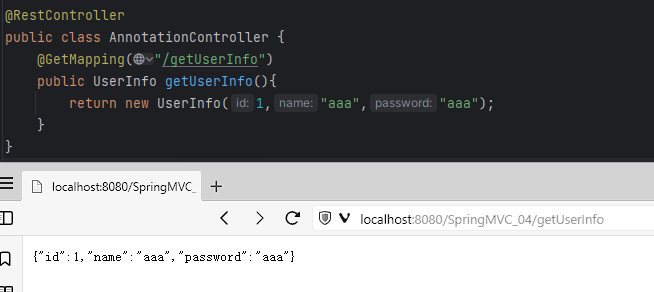

## 请求方式控制

在之前的学习中,我们知道使用@RequestMapping可以将当前对应的控制单元与请求的URL进行Mapping响应.详见[@RequestMapping注解的使用](../05_路径映射与RESTful风格/路径映射与RESTful风格.md#@RequestMapping注解的使用)

在SpringMVC中我们也可以使用以下方式进行Mapping简写代码:
- `@GetMapping('/error')`  ->  `@RequestMapping(value='/error',method = RequestMethod.GET)`
- `@PostMapping('/error')`  ->  `@RequestMapping(value='/error',method = RequestMethod.POST)`
- `@PutMapping('/error')`  ->  `@RequestMapping(value='/error',method = RequestMethod.PUT)`
.... 

对于每一种请求方法,都可以由`@RequestMapping(value='/aabbcc',method = RequestMethod.XXX)` 转换为  `@XxxMapping('/aabbcc')` 其他参数与@RequestMapping 中一致

属性 : 和@RequestMapping中属性一致

例如: 

```Java
@Controller
public class AnnotationController {
    @PostMapping("/error")
    public String testMappingType(){
        return "success";
    }
}
```

等于

```Java
@Controller
public class AnnotationController {
    @RequestMapping(value = "/error",method = RequestMethod.POST)
    public String testMappingType(){
        return "success";
    }
}
```


## 响应控制

### @ResponseBody 返回JSON数据

在前面的学习中,我们了解到了使用@ResponseBody返回JSON,详见:[使用@ResponseBody返回JSON](../08_响应处理/响应处理.md#使用@ResponseBody返回JSON)

我们也可以将 **@ResponseBody注解与@Controller注解结合,直接使用@RestController 注解**

其中的属性和@Controller中一样

```Java
@Controller
public class AnnotationController {
    @PostMapping("/getUserInfo")
    @ResponseBody
    public UserInfo getUserInfo(){
        return new UserInfo(1,"aaa","aaa");
    }
}
```

同等

```Java
@RestController
public class AnnotationController {
    @PostMapping("/getUserInfo")
    public UserInfo getUserInfo(){
        return new UserInfo(1,"aaa","aaa");
    }
}
```

效果如下:


> 但是需要注意,如果在类上使用@ResponseBody注解,则该类中所有的Controller控制单元都直接返回JSON格式,并不会跳转资源

### @JsonFormat 日期格式化请求

在SpringMVC返回前端数据时,对于Date类型的数据通常是直接执行了Date.toString()方法直接输出的:

修改UserInfo.java
```Java
@NoArgsConstructor
@AllArgsConstructor
@ToString
@Data
public class UserInfo implements Serializable {
    private Integer id;
    private String name;
    private String password;
    private Date dateTime;
}
```

控制单元直接返回含有Date的数据
```Java
@GetMapping("/getDateTime")
public UserInfo getDateTime(){
	UserInfo userInfo = new UserInfo(1, "aaa", "aaa", new Date());
	System.out.println(userInfo);
	return userInfo;
}
```

前端展示如下:


对此,我们可以使用@JsonFormat注解对返回的JSON数据中日期参数进行格式化:

属性：
pattern ：指定响应时间日期的格式
Timezone：指定响应的时区，否则会有8个小时的时间差

修改UserInfo.java
```Java
@NoArgsConstructor
@AllArgsConstructor
@ToString
@Data
public class UserInfo implements Serializable {
    private Integer id;
    private String name;
    private String password;
    @DateTimeFormat(pattern = "yyyy-MM-dd")
    @JsonFormat(pattern = "yyyy-MM-dd hh:MM:ss",timezone = "GMT+8")
    private Date dateTime;
}
```

其中: @DateTimeFormat 注解用于存储参数时对于Date数据的格式化

效果如下: 


## @RequestBody 解析JSON字符串

我们在使用SpringMVC时,对于前端发送来的有时候会是JSON格式的字符串(通常是其他接口直接获取并发送给后端接口),对于JSON格式的字符串如果直接使用对象存储是无法直接解析的,手动处理又过于麻烦.比如下面的案例:

jsonSend.JSP
```JSP
<%@ page contentType="text/html;charset=UTF-8" language="java" %>
<html>
<head>
    <title>Title</title>
    <script src="static/js/jquery-3.5.1.min.js"></script>
</head>
<body>
    <input type="submit"  onclick="send()">
</body>
<script>
    function send(){
        var userInfo = {name:"root",password:123456};
        var str =JSON.stringify(userInfo);/*将JSON数据格式化为字符串*/
        $.ajax({
            type:"post",
            url:"jsonSend",
            data:str,
            contentType:"application/json",
        });
    }
</script>
</html>
```

AnnotationController.java
```Java
@PostMapping("/jsonSend")
public UserInfo jsonSend(UserInfo userInfo){
	System.out.println(userInfo);
	return userInfo;
}
```

我们请求到后端后,后端的HandlerMapping 处理器映射器无法处理返回NULL


此时我们可以使用@RequestBody注解来解析收到的JSON格式字符串.

- @RequestBody注解用于获取请求体json格式的字符串内容。直接使用得到是 key=value&key=value...结构的数据，get 请求方式不适用。
- 属性: required：是否必须有请求体。默认值是:true。当取值为 true 时,get 请求方式会报错。如果取值 为 false，get 请求得到是null。

修改 : AnnotationController.java
```Java
@PostMapping("/jsonSend")
public UserInfo jsonSend(UserInfo userInfo){
	System.out.println(userInfo);
	return userInfo;
}
```

效果:


## @CrossOrigin 跨域

在之前的学习中,我们已经了解到了前端使用Ajax请求时会出现跨域问题,详见 : [跨域处理](../../../04_JavaEE技术/06_Ajax/04_跨域处理/跨域处理.md)

我们已经系统学习了三种跨域的方式:
1. jsonp实现跨域请求
2. 通过getJson方实现跨域请求
3. 通过过滤器跨域

在SpringMVC中,我们也可以使用@CrossOrigin注解进行跨域处理


属性:
origins  ： 允许可访问的域列表IP
maxAge：准备响应前的缓存持续的最大时间（以秒为单位）。

```Java
@CrossOrigin(origins = "http://domain2.com", maxAge = 3600)
@RestController
@RequestMapping("/account")
public class AccountController {
    @GetMapping("/{id}")
    public Account receive(@PathVariable Long id) { }
}
```

