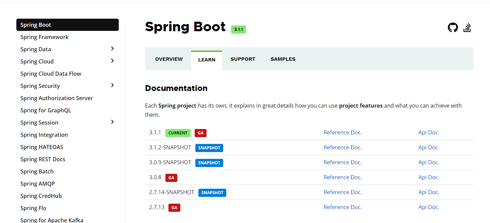

## Spring的痛点分析

Spring是Java企业版（Java Enterprise Edition，JEE，也称J2EE）的轻量级代替品。无需开发重量级的Enterprise JavaBean（EJB），Spring为企业级Java开发提供了一种相对简单的方法，通过依赖注入和面向切面编程，用简单 的Java对象（Plain Old Java Object，POJO）实现了EJB的功能。

 **虽然Spring的组件代码是轻量级的，但它的配置却是重量级的**。一开始，Spring用XML配置，而且是很多XML配 置。Spring 2.5引入了基于注解的组件扫描，这消除了大量针对应用程序自身组件的显式XML配置。Spring 3.0引入 了基于Java的配置，这是一种类型安全的可重构配置方式，可以代替XML。 所有这些配置都代表了开发时的损耗。因为在思考Spring特性配置和解决业务问题之间需要进行思维切换，所以编写配置挤占了编写应用程序逻辑的时间。和所有框架一样，Spring实用，但与此同时它要求的回报也不少。 除此之外，项目的依赖管理也是一件耗时耗力的事情。在环境搭建时，需要分析要导入哪些库的坐标，而且还需要 分析导入与之有依赖关系的其他库的坐标，一旦选错了依赖的版本，随之而来的不兼容问题就会严重阻碍项目的开发进度。
 
> 总的来说,在之前使用Spring框架的开发过程中,我们发现对于第三方依赖的引用,以及对于XML配置文件或者配置类的管理一直是我们的痛点.

## SpringBoot

Spring Boot是Spring公司的一个顶级项目，和Spring Framework是一个级别的。 

Spring Boot实际上是利用Spring Framework 4 自动配置特性完成。**编写项目时不需要编写xml文件**。发展到现在，Spring Boot已经具有很很大的生态圈，**各种主流技术已经都提供了Spring Boot的启动器**。

### SpringBoot启动器

Spring框架在项目中作用是Spring整合各种其他技术，让其他技术使用更加方便。**SpringBoot的启动器实际上就是一个依赖。** 这个依赖中包含了整个这个技术的相关jar包，还包含了这个技术的自动配置，以前绝大多数XML配置都不需要配置了。

当然了，启动器中自动配置无法实现所有内容的自动配置，在使用Spring Boot时还需要进行少量的配置（这个配置不是在xml中了，而是在properties或yml中即可）。

如果是Spring自己封装的启动器的artifact id名字满足：spring-boot-starter-xxxx，如果是第三方公司提供的启动满足：xxxx-spring-boot-starter。

> 以后每次使用Spring Boot整合其他技术时首先需要考虑导入启动器。

### SpringBoot的优点

1. 使用SpringBoot可以创建独立的Spring应用程序
2. 在Spring Boot中直接嵌入了Tomcat、Jetty、Undertow等Web  容器，在使用SpringBoot做Web开发时不需要部署WAR文件
3. 通过提供自己的启动器(Starter)依赖，简化项目构建配置
4. 尽量的自动配置Spring和第三方库
5. 绝对没有代码生成，也不需要XML配置文件

> 约定大于配置,配置大于编码

### SpringBoot版本介绍

- SNAPSHOT：快照版，即开发版
- CURRENT：最新版，但是不一定是稳定版
- GA：General Availability，正式发布的版本

### SpringBoot的核心

**起步依赖**  :  起步依赖本质上是一个Maven项目对象模型（Project Object Model，POM），定义了对其他库的传递依赖，这些东西加在一起即支持某项功能。简单的说，起步依赖就是将具备某种功能的坐标打包到一起，并提供一些默认的功能。

**自动配置** : Spring Boot的自动配置是一个运行时（更准确地说，是应用程序启动时）的过程，考虑了众多因素，才决定 Spring配置应该用哪个，不该用哪个。该过程是Spring自动完成的。
