## 部署方式

### 手动部署

创建Maven项目
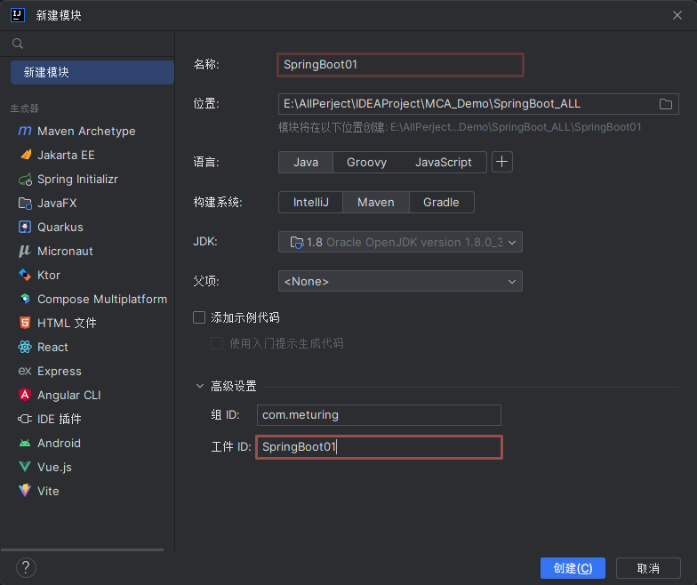

#### 方式一 : 继承方式

修改POM文件
```XML
    <!--继承父项目方式-->
    <parent>
        <groupId>org.springframework.boot</groupId>
        <artifactId>spring-boot-starter-parent</artifactId>
        <version>2.3.0.RELEASE</version>
    </parent>
	    
    <groupId>com.meturing</groupId>
    <artifactId>SpringBoot01</artifactId>
    <version>1.0-SNAPSHOT</version>
	    
	<!--导入SpringBoot-web启动器-->
    <dependencies>
        <dependency>
            <groupId>org.springframework.boot</groupId>
            <artifactId>spring-boot-starter-web</artifactId>
            <version>2.3.0.RELEASE</version>
        </dependency>
    </dependencies>
```

依赖引用情况
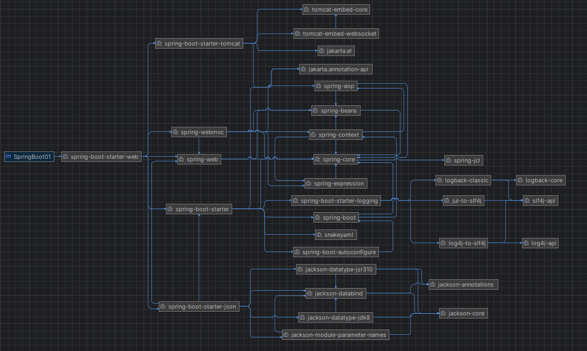

#### 方式二 : 依赖方式

在公司中可能会出现必须继承某个项目，如果Sprin Boot用了继承就不能继承别的项目了。所以Spring Boot还提供了依赖的方式。

修改POM文件
```XML
    <groupId>com.meturing</groupId>
    <artifactId>SpringBoot01</artifactId>
    <version>1.0-SNAPSHOT</version>
    <!--继承父项目方式-->
    <dependencyManagement>
        <dependencies>
            <dependency>
                <groupId>org.springframework.boot</groupId>
                <artifactId>spring-boot-starter-parent</artifactId>
                <version>2.3.0.RELEASE</version>
                <type>pom</type>
                <scope>import</scope>
            </dependency>
        </dependencies>
    </dependencyManagement>
    <!--导入SpringBoot-web启动器-->
    <dependencies>
        <dependency>
            <groupId>org.springframework.boot</groupId>
            <artifactId>spring-boot-starter-web</artifactId>
            <version>2.3.0.RELEASE</version>
        </dependency>
    </dependencies>
```

依赖引用情况
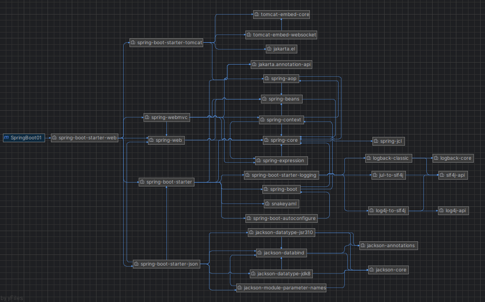

### 自动部署

切换Spring Initializr国内源 : `https://start.springboot.io`
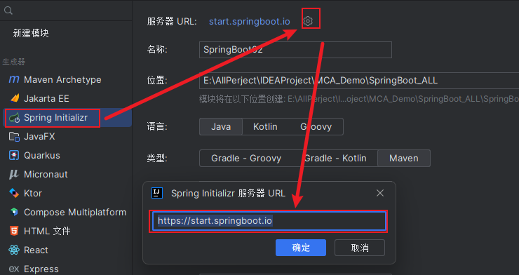

填写SpringBoot工程信息
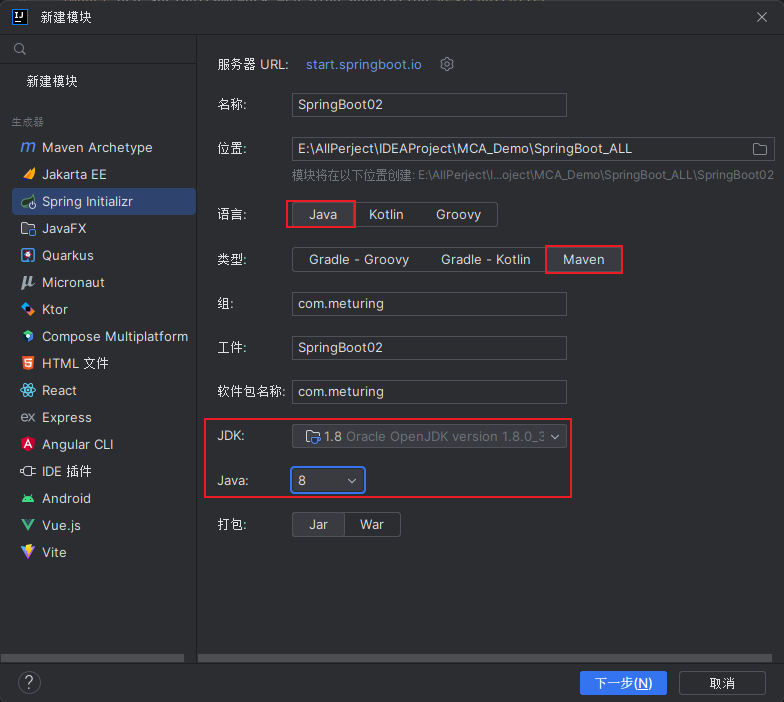
注意: 此时打包类型就可以随意选择了,因为我们是SpringBoot项目,内置了运行环境

选择需要初始化的SpringBoot的版本,勾选SpringWeb项目
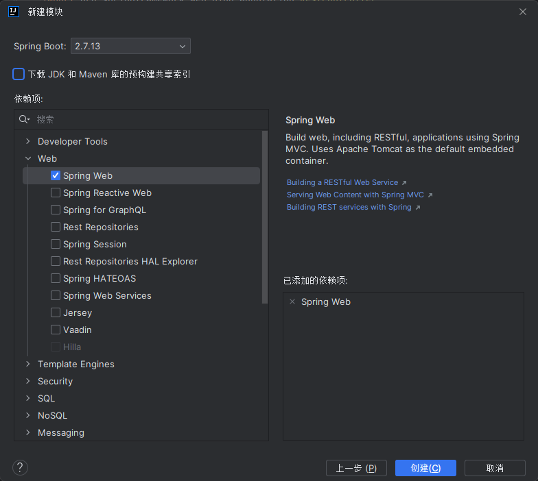

由于新版IDEA中没有低版本的初始化,新版本的Spring不在对于低版本的JDK支持会出现报错的情况,如果我们需要使用低版本的如1.8,需要更改pom.xml中的版本为`2.3.0.RELEASE`
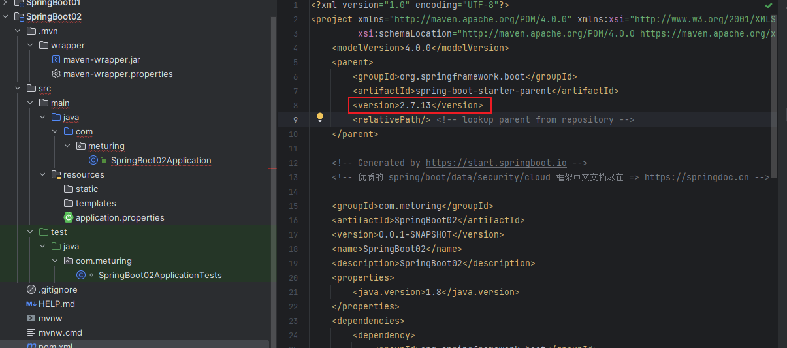
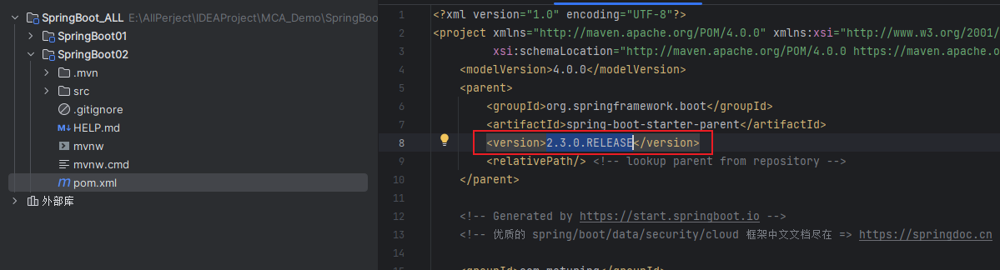

检查模块的文件映射
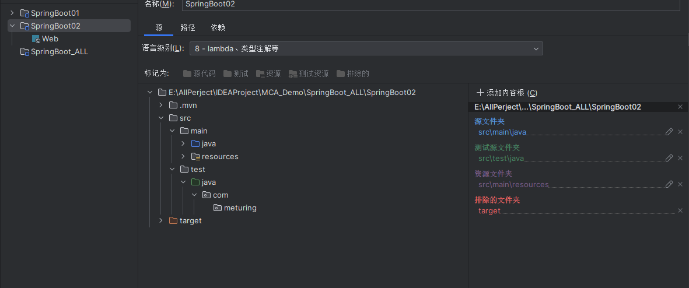
>注意此处有坑 : 如果在一个空的目录下创建模块工程,需要检查顶级目录文件夹中是否自动映射了模块的路径,如果有的话请删除映射,否则会出现被占用的情况

检查项目的工程语言
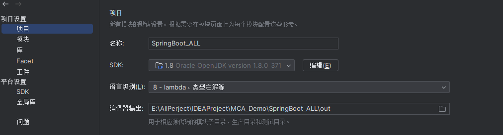

编译pom文件和工程
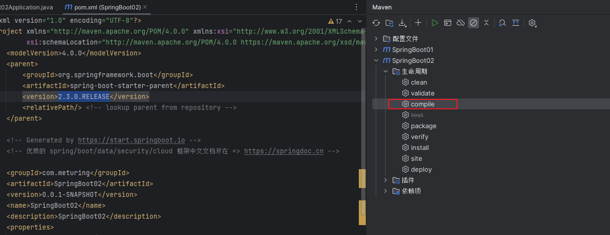
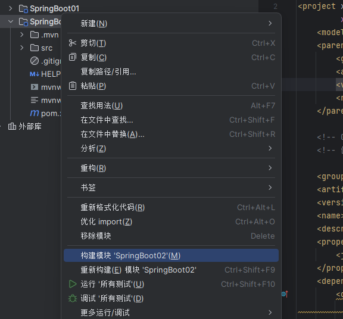

此时我们看到项目工程已经成功初始化了
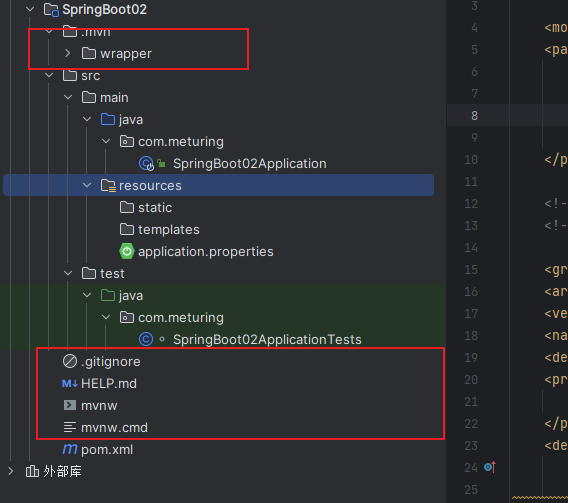

> 自动化部署时,IDEA会帮我们创建很多其他的文件,这些文件可以删除也可以保留.在后面的学习中我们将慢慢了解这些文件的作用


## 启动类和启动器

### 启动类

我们发现在Spring Initializr自动化部署时,为我们创建了`SpringBoot02Application.java`文件,该文件为SpringBoot的**启动类**
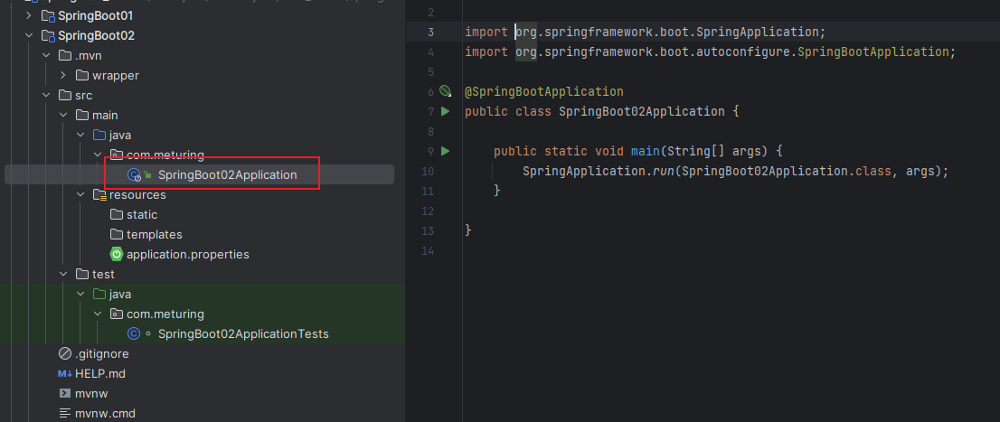

Spring Boot的启动类的作用是启动Spring Boot项目，是基于Main方法来运行的。

> 注意：启动类在启动时会做注解扫描(@Controller、@Service、@Repository......)，扫描位置为同包或者子包下的注解，所以启动类的位置应放于包的根下。

### 启动器

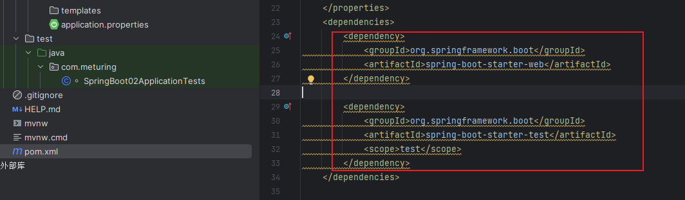

Spring Boot将所有的功能场景都抽取出来，做成一个个的starter(启动器),只需要在项目里面引入这些starter相关场景的的所有依赖都会导入进来. 要用什么功能就导入什么场景在jar包的管理上非常方便，最终实现一站式开发

### 二者区别

启动类表示项目的启动入口,启动器表示jar的坐标

## 快速使用SpringBoot

接下来我们根据刚刚的搭建快速创建一个可以访问的接口

### 步骤一 : 创建启动类

> 自动部署会自动创建启动类,跳过此步骤

SpringBoot01Application.java
```Java
@SpringBootApplication
public class SpringBoot01Application {
    public static void main(String[] args) {
        SpringApplication.run(SpringBoot01Application.class,args);
    }
}
```

注意事项 : 
1. 启动类在执行时,会自动扫描同包或同包下的子包,所以注意启动类的位置.通常为二级包内
2. 启动类的命名规则通常为 `项目名+Application`
3. 启动类中使用@SpringBootApplication注解
4. Main方法中使用`SpringApplication.run(启动类字节码文件,参数)`

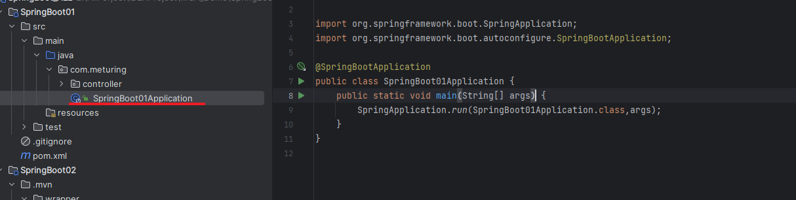

### 步骤二 : 创建Controller

创建com.meturing.controller.MyController.java
```java
@RestController
public class MyController {
    @RequestMapping("/geMyFirstController")
    public String geMyFirstController(){
        return "geMyFirstController";
    }
}
```

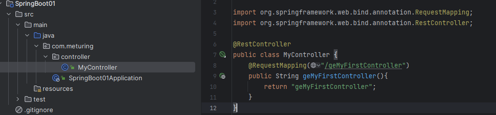

### 步骤三 : 启动访问

直接启动运行启动类

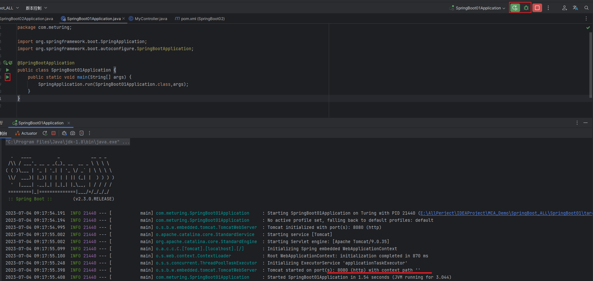

由于由于我们没有配置项目参数,所以默认路径为 : `localhost:8080`

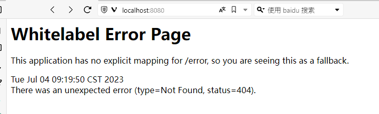

访问: `localhost:8080/geMyFirstController`

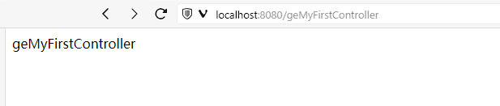

## 项目结构

可以参考[SpringBoot项目结构](../04_SpringBoot项目配置与结构/SpringBoot项目配置与结构.md#SpringBoot项目结构)