## 依赖导入原理

### SpringBoot依赖的继承

在我们初始化SpingBoot项目时,默认继承了`spring-boot-starter-parent`的Maven工程

```XML
<parent>
	<groupId>org.springframework.boot</groupId>
	<artifactId>spring-boot-starter-parent</artifactId>
	<version>2.3.0.RELEASE</version>
	<relativePath/> <!-- lookup parent from repository -->
</parent>
```

在`spring-boot-starter-parent`工程中又继承了`spring-boot-dependencies`工程
```XML
<parent>
	<groupId>org.springframework.boot</groupId>
	<artifactId>spring-boot-dependencies</artifactId>
	<version>2.3.0.RELEASE</version>
</parent>
```

#### spring-boot-starter-parent

该工程中主要针对于一些主要的配置文件进行了初始化定义,如下: 

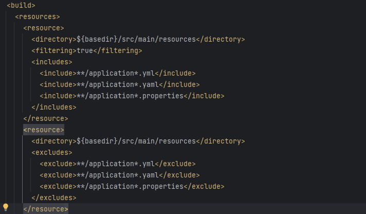

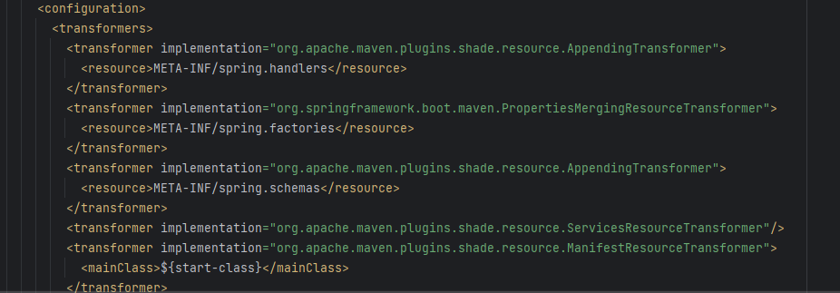

#### spring-boot-dependencies

该Pom文件中导入了大量我们可能使用到的核心Spring依赖,以及对所有依赖默认版本控制

- 依赖的初始化默认版本
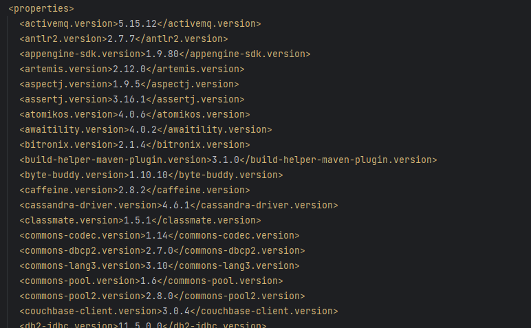

- 依赖引用
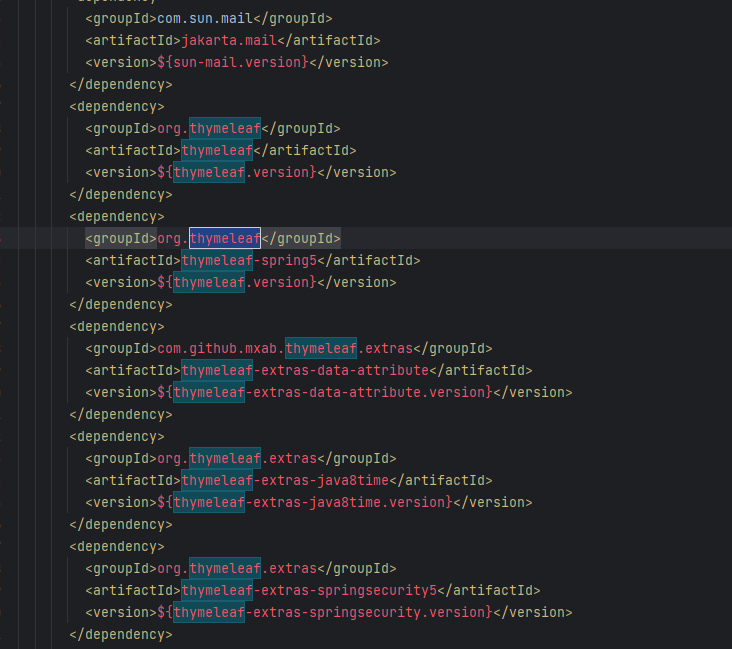

### SpringBoot启动器依赖

我们在快速构建工程时也导入了启动器依赖: `spring-boot-starter-web`

```XML
<dependency>
	<groupId>org.springframework.boot</groupId>
	<artifactId>spring-boot-starter-web</artifactId>
</dependency>
```

该依赖中我们可以看到传递了SpringMVC所需的核心依赖

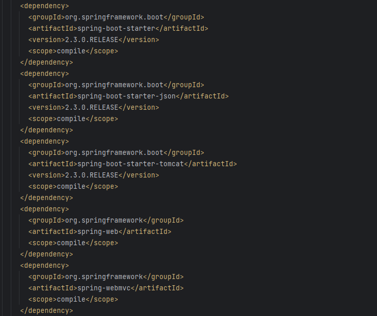

## 包扫描原理

我们看到在SpringBoot的启动类上使用了`@SpringBootApplication`注解

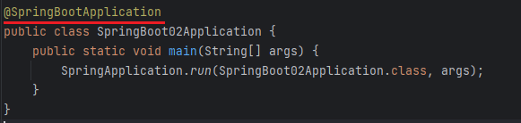

进入该注解我们发现两个比较重要的注解: `@SpringBootConfiguration` 和 `@EnableAutoConfiguration`
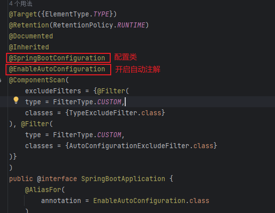

### @SpringBootConfiguration

该注解表示当前类是SpringBoot的配置类,我们进入可发现

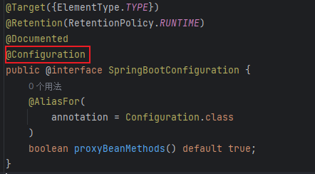

当前类可以作为容器被扫描

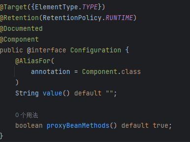

### @EnableAutoConfiguration

打开之后我们看到一个`@AutoConfigurationPackage`注解
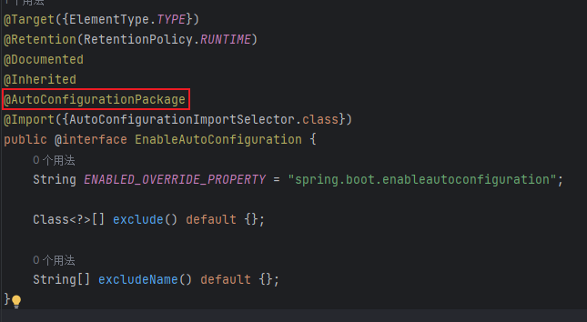

继续跟进`AutoConfigurationPackages.Registrar.class`
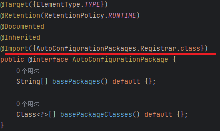

我们发现这个内部类中存在**registerBeanDefinitions方法,在Springboot初始化时获取了启动类所在的包**
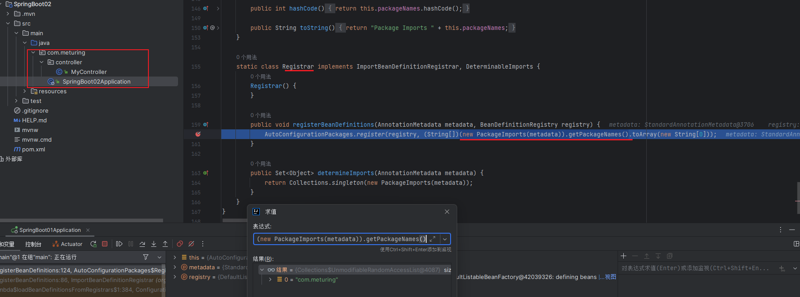

> 所以启动类会将所在包及下面所有子包里的所有组件扫描到spring容器

## 自动配置原理

在启动类的`@SpringBootApplication`注解中存在`@EnableAutoConfiguration`注解

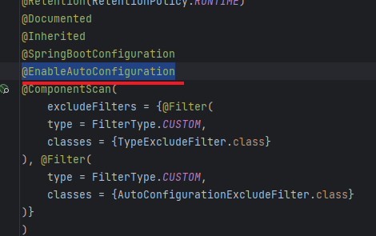

在`@EnableAutoConfiguration`注解中存在`@Import({AutoConfigurationImportSelector.class})`
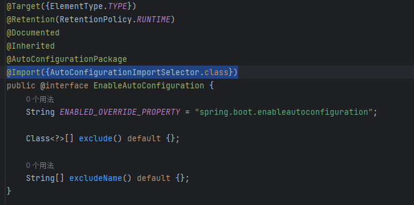

AutoConfigurationImportSelector类中存在`getCandidateConfigurations方法`
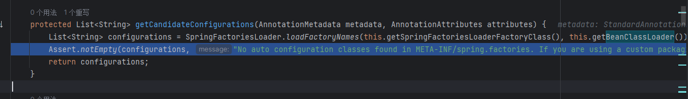

`getCandidateConfigurations方法`主要是对于`org.springframework.boot.autoconfigure`包下的spring.factories文件进行读取,根据该文件中的配置扫描
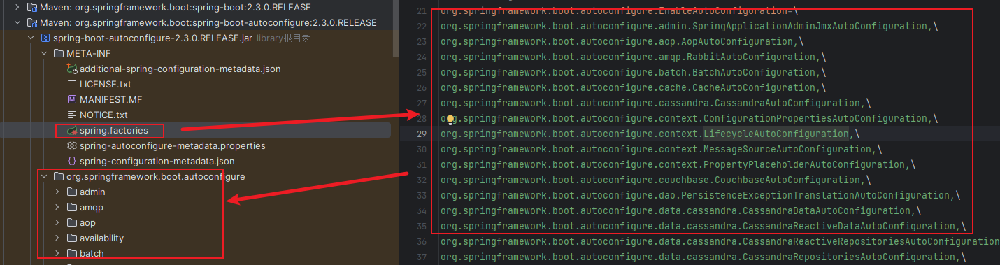

我们随意打开一个配置类,发现基本上与之前在Spring中使用配置类配置事务的写法差不多.详见 : [零XML配置事务](../../03_Spring基础/11_零XML配置事务/零XML配置事务.md)
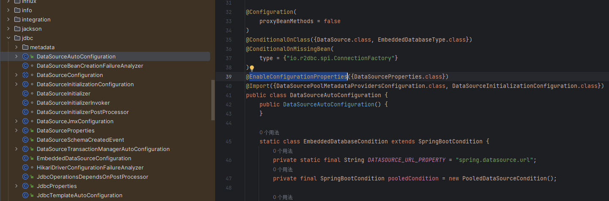

同时`spring-configuration-metadata.json`文件对于常用的一些参数进行了默认配置
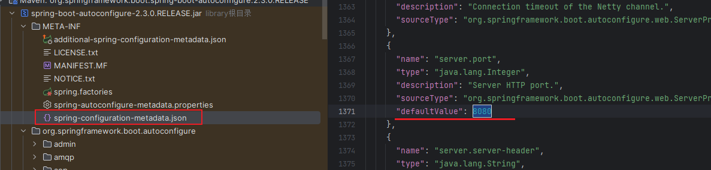

## 总结

SpringBoot的基本特性:

依赖的自动导入
1. 在SpringBoot中,我们可以使用`spring-boot-starter-parent`依赖快速导入Spring框架中核心依赖文件,并对依赖进行默认的版本限制.
2. 通过启动器依赖`spring-boot-starter-web`快速对所需的环境依赖如SpringMVC等进行导入

包扫描:
1. 在启动类中使用的`@SpringBootApplication`注解,将当前启动类标识为一个配置类
2. 其中内置`@EnableAutoConfiguration`注解会在Spring工程启动时,获取到当前启动类所在的包,并对当前包及其子包进行扫描加载

自动装配:
1. `@EnableAutoConfiguration`注解中存在`@Import({AutoConfigurationImportSelector.class})`,该类会加载`org.springframework.boot.autoconfigure`包下的`spring.factories`文件进行读取,根据该文件中的配置扫描
2. `spring.factories`文件记录了当前Spring中可能需要的核心配置类文件
3. `spring-configuration-metadata.json`文件记录了一些初始化的参数配置