在前面的学习中,我们知道`spring-boot-starter-parent`依赖中对于SpringBoot工程的一些配置文件进行了初始化的设定:

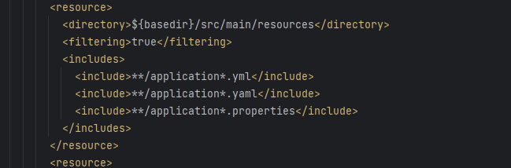

我们看到SpringBoot会默认读取项目下名字为 `application开头` 的  `yml` / `yaml` / `properties` 配置文件

所以我们可以通过这些配置文件对SpringBoot默认初始化的一些参数进行自定义的设定,如 `端口号`/ `项目路径` / `数据源` 等

## SpringBoot可配置参数

spring官方为我们提供了可配置参数的API文档 :  [Spring官方配置文档](https://docs.spring.io/spring-boot/docs/current/reference/html/application-properties.html#appendix.application-properties)

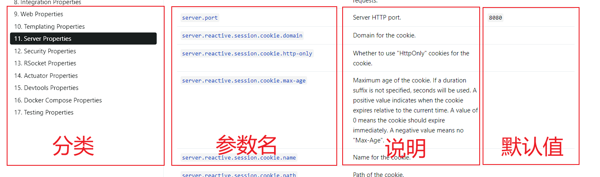

## application配置文件

例如,在Spring官方配置中提供了对接口以及项目上下文的配置参考如下: 


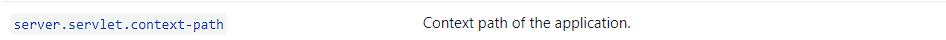

我们接下来将通过不同的配置文件类型来演示该选项的配置

### 两种类型的配置文件

#### properties配置文件


创建 application.properties 文件

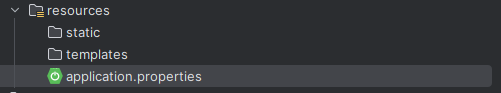

`.properties文件`为`key=value`的形式,Spring官方列举的参数均为properties文件的key,我们直接配置他的value值即可

代码如下:

```properties
server.port=8081
server.servlet.context-path=/springboot02
```

> 注意: 在配置上下文路径时,我们需要以`/`开头但是不能以`/`结尾

#### yml配置文件

创建application.yml文件

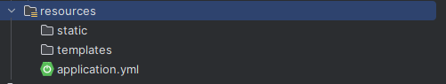

需要注意的是,`.yml`文件的语法与`.properties`文件有所不同:
1. 在`.properties`文件中,一个`.`表示层级,而在`.yml`中层级结束需要用`:`,且下一个层级需要与上一个层级多两个空格
2. 在`.properties`文件中我们是直接`key=value`的形式,在`.yml`中需要是`最低级: value`的形式(注意冒号后应该有空格)
3. `.yml`对大小写敏感 且 相同的部分只出现一次 

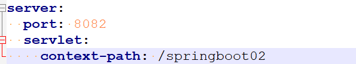

语法如下:
```yml
server:
  port: 8082
  servlet:
    context-path: /springboot02
```

##### 存储自定义数据

普通数据类型
```yml
server:
  port: 8082
```

配置对象类型数据
```yml
person:  
  name: zs  
  age: 18  
  sex: 男

#或者写成json格式
person2: {name: ls,age: 12,sex: 男}
```

配置数组类型
```yml
number1:
  - 1
  - 2
  - 3
  - 4

#或者
number2: [1,2,3,4]
```

### application配置文件的优先级

#### 同级目录下

1. 如果在同级目录下同时存在`.yml`文件与`.properties`文件,则优先读取`.properties`文件,然后再读取`.yml`文件
2. 如果同一个属性两个文件都存在,则默认以优先级最高的为准,优先级低的属性不会对前面的属性进行覆盖

#### 不同目录下

##### 允许存放的位置

配置文件允许存放在以下位置:

1   当前项目根目录中:
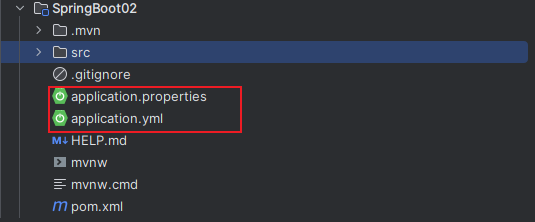

2  当前项目根目录中的`/config`目录下
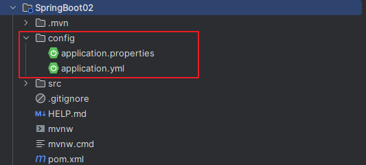

3  当前项目的resources目录下


4  当前项目的`resources/config`目录下
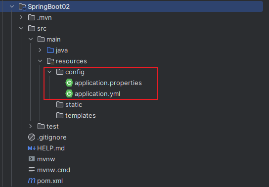

##### 优先级

`项目根目录/config`  >  `项目根目录`  >  `resources/config` > `resources`

即 : SpringBoot在启动时会优先按照上述的路径优先级进行配置文件的扫描,优先级高的配置优先加载,且相同的参数配置无法被优先级低的配置顶替

##### 应用场景

> application 配置文件主要用于 Spring Boot 项目的自动化配置。

## bootstrap配置文件

bootstrap 是应用程序的父上下文，也就是说 **bootstrap 加载优先于 applicaton**。
bootstrap 主要用于从额外的资源来加载配置信息，还可以在本地外部配置文件中解密属性。

bootstrap与application这两个上下文共用一个环境，它是任何Spring应用程序的外部属性的来源。bootstrap 里面的属性会优先加载，它们默认也不能被本地相同配置覆盖。

### bootstrap配置文件特征

1. boostrap 由父 ApplicationContext 加载，比 applicaton 优先加载。
2. boostrap 里面的属性不能被覆盖。

### 应用场景

1. 使用 SpringCloudConfig 配置中心时，这时需要在 bootstrap 配置文件中添加连接到配置中心的配置属性来加载外部配置中心的配置信息。
2. 一些固定的不能被覆盖的属性。
3. 一些加密/解密的场景。

## SpringBoot项目结构

基本上SpringBoot的目录结构如下:

```txt
- 项目名
  |- src
     |- main
        |- java
        |  |- [Java代码]
        |- resources
        |  |- public (公共资源，对外公开的内容)
        |  |- static (静态资源，图片、js、css)
        |  |     |- js
        |  |     |  |- jquery.js (访问地址: http://ip:port/js/jquery.js)
        |  |- templates (FreeMarker和Thymeleaf页面所在目录)
        |- webapp (仅在使用JSP时存在)
           |- WEB-INF
```

其中需要注意的是: 

public目录与static目录,在访问时,无需再次说明目录名(可以省略)
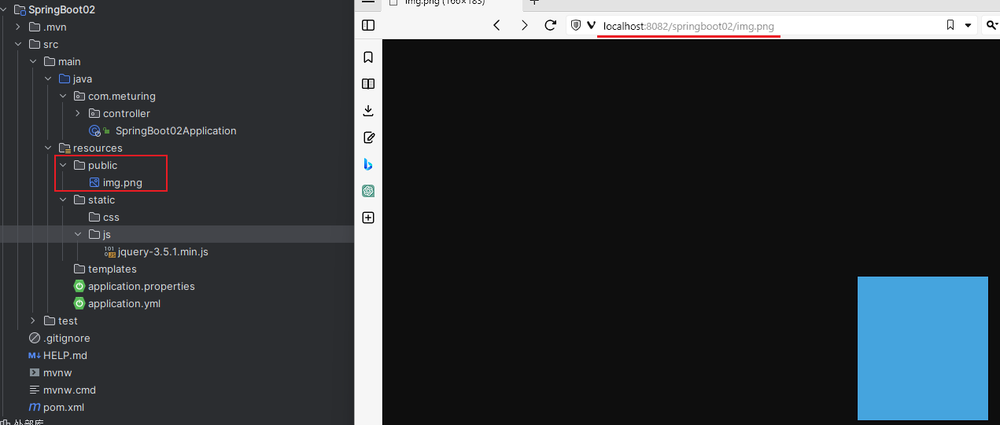
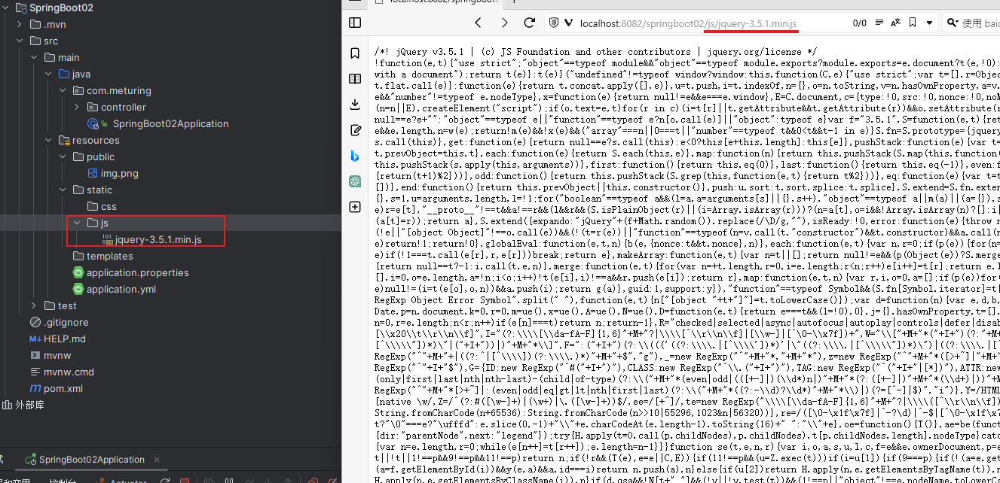

webapp目录默认情况下在新版的SpringBoot初始化时时没有的,只有在使用JSP文件时需要创建使用可以参考如下配置:

在项目设置中,设置当前模块的web资源目录为webapp目录就行
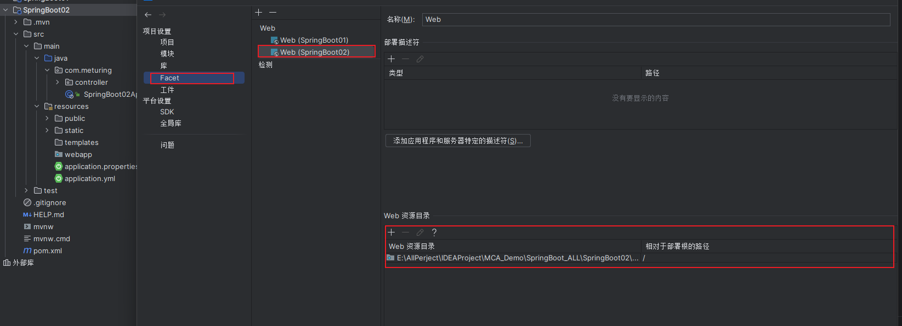

设置成功后,webapp目录上将又小蓝点标记
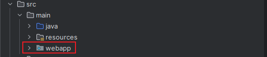
